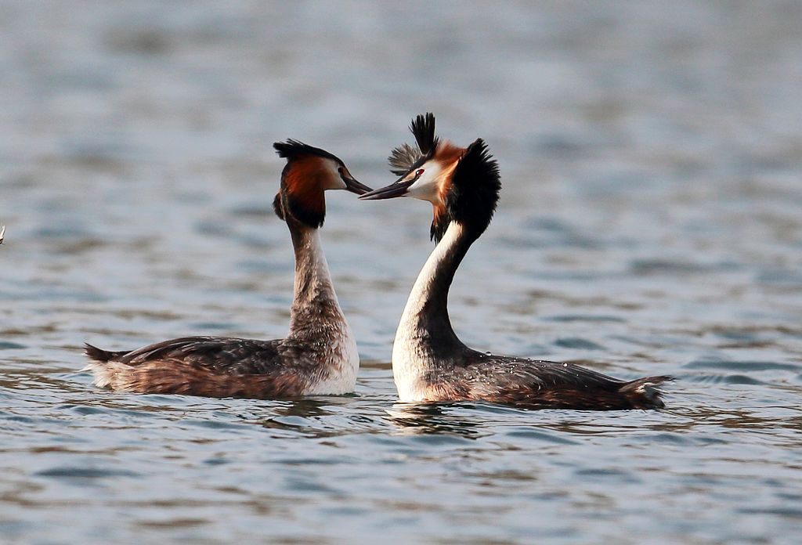

---

title: 2021-08-12 诗经翻译

author: 许渊冲

date: 2021-8-4 12:06:43 +0800

categories: [英文], 诗经]

tags: [诗经]
---

# 诗经
@(资治通鉴)[诗经]

[toc]

《诗经》，是中国古代诗歌开端，最早的一部诗歌总集，收集了西周初年至春秋中叶（前11世纪至前6世纪）的诗歌，共311篇，其中6篇为笙诗，即只有标题，没有内容，称为笙诗六篇
- 《南陔》
- 《白华》
- 《华黍》
- 《由庚》
- 《崇丘》
- 《由仪》

反映了周初至周晚期约五百年间的社会面貌。

## 诗经篇章翻译

### 1. 采薇

**昔我往矣，**
**杨柳依依。**
**今我来思，**
**雨雪霏霏**

| **理译：**|     **许译：**|   
| :-------- | :--------| 
| And no one knows our sadness.  At first, when we set out,  The willows were fresh and green;  Now, when we shall be returning,  the snow will be falling in clouds. |   When I left there,   Willow shed tea.  I come back now,  Snow bends the bough.|  

##### 许渊冲 v.s  理雅各 

《诗经》是中国最早的诗集，英译本版本众多，且各具特色。本文将比较其中影响力较大的[理雅各](https://baike.baidu.com/item/%E7%90%86%E9%9B%85%E5%90%84/6012269?fr=aladdin)译本和[许渊冲](https://baike.baidu.com/item/%E8%AE%B8%E6%B8%8A%E5%86%B2/10940148?fr=aladdin)译本。两位译者都是顶尖的翻译大家，但因两位译者所处的时代、背景、身份、经历等都不尽相同，且由于各自不同的翻译目的，两个译本之间存在较大的差异。

理雅各是完整翻译《诗经》的第一人，强调忠实原文，翻译更偏向直译。其译本通常不仅包括原诗及其翻译，还增加了详尽的解释和评注，因此译本较长。

而许渊冲的译本践行了自己提出的“三美”论（意美、音美、形美）。许渊冲认为翻译最重要的是要尽可能保持原作的美，为了不损害《诗经》的简洁之美，译文没有过多的注释

**解析：**

两种译本通过不同的诗歌形式，都保留了原诗的意义。

理雅各的译本提供了大量详细注释和评论，读起来更像散文，具有很高的学术价值。而许渊冲的译本通过运用韵律，在保留原诗美学的同时，韵脚工整，格律严格。

原诗结构一致，讲究押韵。理雅各严格遵守原诗的句子结构和顺序，但没有押韵，读起来更像是富有乐感散文。许渊冲煞费苦心来保留原诗音韵美，译文韵律格式采用：AABBCC,每行四个音节，双行押韵，且语言力求简短。

## 南有乔木

Tall tress grow on the far south mountain

### 周南.[关雎](https://baike.baidu.com/item/%E9%9B%8E%E9%B8%A0/10144218?fr=aladdin) Cooing and Wooing

 

> 用荇菜或左或右漂浮不定比喻求爱的不易，也以物候交代出男女热恋的时令；同时，作者以赞颂的口吻勉励求取荇菜，隐喻“君子”的努力追求“淑女”。

| 从左往右读                                                   |                                                              |                                                              |
| ------------------------------------------------------------ | ------------------------------------------------------------ | ------------------------------------------------------------ |
| By riverside a pair Of turtledoves are cooing;  There is a maiden fair Whom a young man is wooing. | Water flows left and right Of cresses[^1] here and there;  The youth yearns day and night For the maiden so fair. | His yearning grows so strong He cannot fall asleep,  But tosses all night long So deep in love, so deep! |
| Now gather left and right Cress long or short and tender!  O lute, play music light For the fiancee so slender! | Feast friends at left and right On cresses cooked tender!  O bells and drums, delight The bride so sweet and slender. |                                                              |

[^1]: 这里Cress翻译过来是水芹，和中文的荇菜有比较大区别，不知道作者这样翻译，是不是为了意义让西方读者更容易理解诗经。

**生词：**

| 单词                              | 解释                                                         | 例句                                                         |
| --------------------------------- | ------------------------------------------------------------ | ------------------------------------------------------------ |
| cooing  [**ˈkuːɪŋ**]         | v. (鸽子)咕咕地叫; (尤指对所爱的人)轻柔低语，柔情地说   | - She paused to coo at the baby - The pigeon was eating and cooing at the same time. |
| wooing                            | vt.争取…的支持;寻求…的赞同;追求(异性);求爱                   | If man woos a woman, he spends time with her and tries to persuade her to marry him. - The penniless author successfully wooed and married Fanny. -They wooed customers by offering low interest rates.. |
| turtledoves [**ˈtɜːrtldʌv**] | n. 斑鸠；情人                                                | 这里用斑鸠而不是 凤头鹏鹛 应该是有一语双关的意思，因为turtledove不仅表示斑鸠，还有情人的意思。 |
| turtle  [**ˈtɜːrtl**]        | n.(任何种类的)龟;陆龟;水龟 vi.捕海龟;捕鳖;（船等）翻没;倾覆 | The sea turtle is an endangered species.                     |
| maiden  [**ˈmeɪdn**]         | n.少女;处女;未婚女子;未得分的一轮投球 adj.首次的;初次的  | - ...stories of noble princes and their brave deeds on behalf of beautiful maidens. - In 1912, the Titanic sank on her maiden voyage. |
| cress [**kres**]             | n. 水芹(常放在色拉和三明治中食用)                            | [水芹](https://baike.baidu.com/item/%E6%B0%B4%E8%8A%B9/2003662?fr=aladdin)和[荇菜](https://baike.baidu.com/item/%E8%8D%87%E8%8F%9C/577048?fr=aladdin)感觉差别还是挺大的；不知道作者这样翻译，是不是为了意义让西方读者更容易理解诗经。 |
| yearn [**jɜːrn**]            | (to want sth. very much, especially when it is very difficult to get) vi. 渴望;渴求 | The people yearned **for** peace.                            |
| slender [**ˈslendər**]       | adj.苗条的;纤细的;微薄的;                                    | - her slender figure -to win by a slender margin/majority |
| lute [**luːt**]              | an early type of musical instrument with strings, played like a guitar 琉特琴，诗琴(拨弦乐器) | He knows how to play the **Chinese lute**（琵琶）.           |
| feast  [**fiːst**]           | n.盛宴;宴会;(宗教的)节日，节期;使人欢快的事物(或活动) vi.尽情享用(美味佳肴) | - a weeding feast - the feast of Christmas - the evening was a real feast for music lovers. |
| delight [**dɪˈlaɪt**]        | n.高兴;愉快;快乐;令人高兴的事;乐事;乐趣 vt.使高兴;使愉快;使快乐 | The children squealed with delight when they saw the puppy.  He takes delight in proving others wrong. |
| fiancee  [**fiˈænsi**]       | the woman that a man is engaged to                           | The whole incident had upset me and my fiancee terribly. He was also a writer of beautiful stories, some of which are collaborations with his fiancee. |
|                                   |                                                              |                                                              |

## 燕燕于飞

## 有匪君子

## 山有扶苏

## 呦呦鹿鸣

## 七月流火

