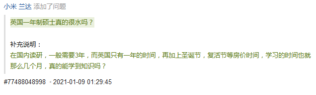
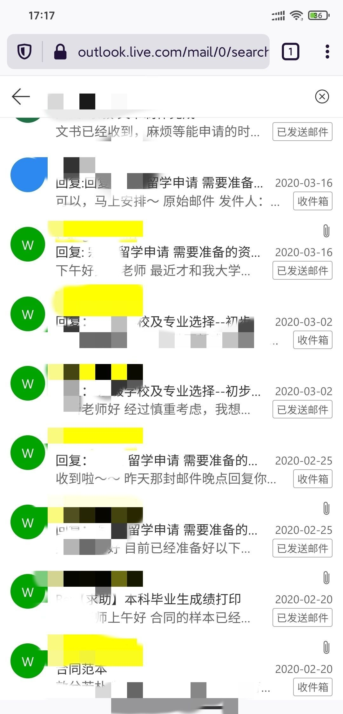
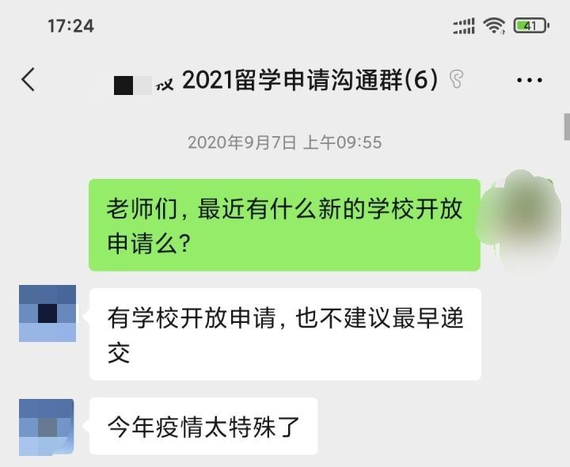
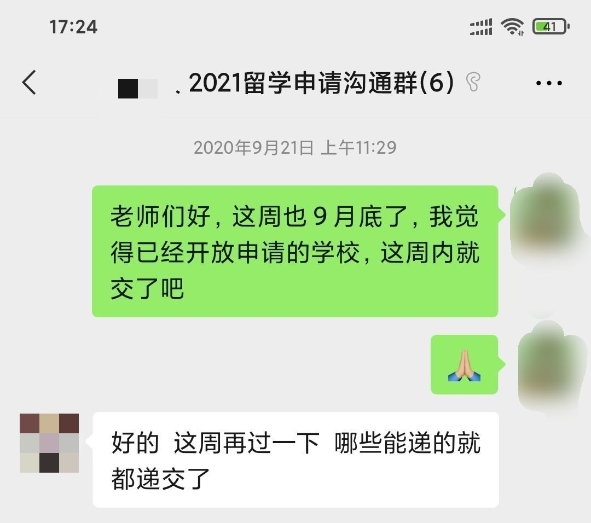
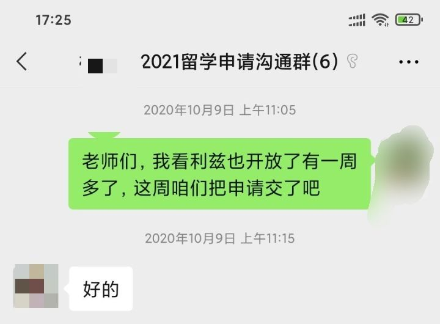
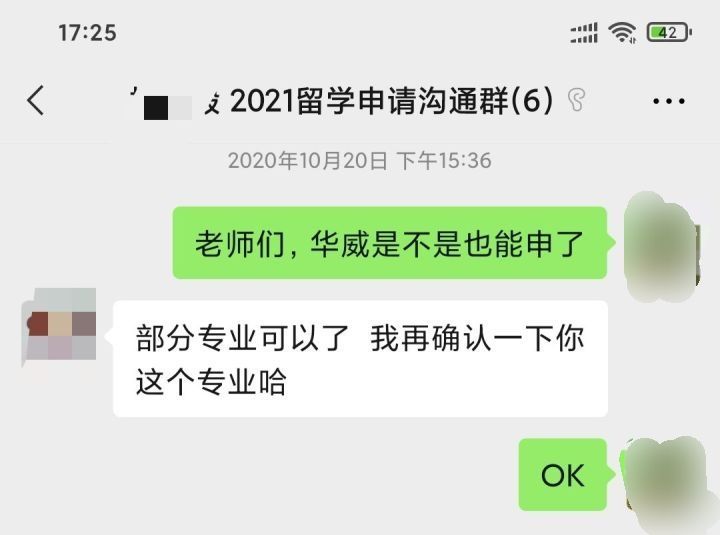
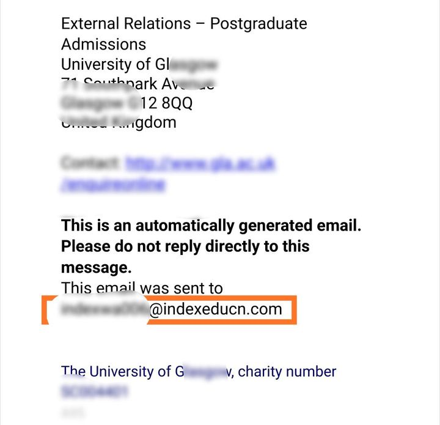

# 【留学中介】扒一扒辣鸡中介的坑爹套路

[toc]

前几天在知乎看到一个留学中介提的炸鱼问题，没想到随便吐槽了一下留学中介，就拿了8000多个赞，最近也加了新生群，群里除了代写以外，挨骂最多的就属中介，看来有不少人被留学中介坑的不轻。

[沃里克老实人：英国一年制硕士真的很水吗？9376 赞同 · 226 评论回答](https://www.zhihu.com/answer/1758534867)

评论里有不少人问我怎么鉴别中介靠不靠谱，我只能说，留学这件事最好是自己DIY，如果你真想不开，非要找中介的话，可以防范一下以下这些套路，一旦发现端倪立刻叫停，尽早止损，该换中介换中介，该退钱就商量着退钱。被辣鸡中介给坑了，损失钱事小，耽误申请时机，起个大早赶个晚集事大。

***以下这些套路均来自于我和我认识的人的亲身经历，可能会有一些修辞手法上的夸张，但全都是真人真事，若有半句假话，以后买的基金全绿。**

## **套路一 故意报低**

我高中同学的女朋友，高中时候不熟，大四时一起去了趟杭州旅游，才熟悉起来。她本科是北京北五环外某985的天坑专业，考研凉凉，2月才开始准备申英国的硕，找到了一家规模不小的中介V。

V表示你这申的时间太晚了，专业也比较冷门，巴拉巴拉说了一堆，意思就是申不了什么好学校，签约的时候给她定了一堆排名50～100的学校，在她的强烈要求下才勉为其难地给加了个爱丁堡大学，加的时候还不情不愿，说你这太晚了，爱丁堡肯定没戏什么的。

结果就是，她被爱丁堡大学录取，现在已经留在爱大本校读博了，若是她当初不坚持，只听中介的，恐怕也不可能成钟南山的师妹…其实按照她的水平和均分，再加上申的也不是热门专业，爱丁堡大学完全是够得着的，根本没必要报好几所50~100名的学校。

套路解析：一般和中介签约时会选择5所左右的学校，只要其中有一所学校发了conditional offer，那么就不符合退款条件了。哪怕是学生雅思没过换不了uncon，家里突然破产去不了，或者是觉得学校太烂不想去，按合同的说法统统是学生自己的原因，中介没有责任。

于是某些辣鸡中介为了保证不退款，上来先给学生PUA，让学生觉得自己没什么优势，然后故意给学生报一些排名低好录的学校，如果洗脑成功，学生甚至会对中介感激涕零，上个排名三四百的学校，还夸中介靠谱。

## **套路二 故意报“高”**

我大学同班同学，均分跟我也差不多，我这边中介定的范围大体就是：王曼爱华[[1\]](https://zhuanlan.zhihu.com/p/358758265#ref_1)的非热门专业冲一把，上格拉斯哥和利兹的商学院算正常发挥，保底就是纽卡斯尔和卡迪夫这种150名左右的学校，总的来说，一个双非一本均分80多的人，差不多都是这个水平。

我同学的中介倒好，直接整了一套美英港混申，英国定的是华威、利兹、谢菲尔德，香港定的是港城市，他的保底学校，在我这已经属于中等水平。

结果，12月我被华威和格拉斯哥捞了，他美国的学校全聚德；1月我收到利兹offer，他收着利兹拒信；2月我交了华威的押金，他香港那边也没消息…

我只好跟他说：没事，大不了就找中介退钱呗。他才告诉我：中介给他报的谢菲尔德某社科类项目被录，按照合同，已经退不了钱了。谢菲尔德这个项目，专业名是东亚开头，属于一听名字就知道毕业既失业的专业，况且一个中国人在英国研究东亚，怎么听怎么别扭，还不如我另一个在韩国学英语的同学呢。可这会儿都到了三四月份，其他多数专业已经招满，只能补申其他人挑剩下的专业，或者等港城市能不能捞他了。

套路解析：和套路一一样，同样利用只要申上一所学校就不退钱这个条款。先把学生一顿猛吹，给学生选的也都是名校，然后在名校中插一两个相对好录的学校和专业。只要相对好录的专业录了，就不用担心学生退费，至于剩下的名校，能不能录上就无所谓了，万一撞大运录上，下一年的吹牛素材不就有了吗？对于中介来说，可能不会血赚，但永远不亏。

## **套路三 签约前后，判若两人**

可能有些人看了套路二，会觉得我找的那家中介还挺靠谱，不过这些人马上就要失望了。我那个中介选校方面还算可以，签约前是有问必答，晚上问他们点什么事，直接一个电话打过来，巴拉巴拉说上半个多小时，最开始通过邮件联系，回复还是挺快的

选校和签约以后，就不通过邮件联系了，他们把我拉进了一个群。结果真到申请开始了，反而是我催着他们干活：

好家伙，我花钱找中介，最后反而是我在群里一直催催催，那我花钱找中介意义何在？这是花钱找了个爹么？那我干嘛不自己DIY？

套路解析：一般大中介的留学顾问，同时给几十个学生申都是正常操作，自然是没法顾及所有学生。这个也没办法，要么多摧，要么商量着退费，一般申请流程还没开始的话，多多少少能退一点。

## **套路四 模板式文书**

说回套路二里面我同学，大学同一个班，成绩也差不了一两分，当时在利兹报的是商学院差不多的专业，为什么录我拒他呢？他把他的文书发给我品鉴，前两行我粗略一看，就看出好几个语法错误，我上初三的堂弟，在百度翻译的帮助下，写的比这文书都好。

不光文书写的拉跨，还只写一份，申请不同学校不同专业，也只是把学校名、专业名和内容略微修改。也就是说申请BA、AF、Management等完全不同的专业，用的是同样的文书，通过率可想而知。

套路解析：相比每个专业都写一份文书，自然是写一份模板再改省事，有些排名靠后学校，其实也不看文书，学校背景和均分差不多的也能录，但有些学校，比如爱丁堡和华威，却格外看重文书，拿着中介这种模板式文书去投，基本就是贡献申请费。假如真撞大运录上了，中介就大张旗鼓宣传，说自己的文书多么好，如果没录，中介那边也会说学校会考虑多重因素，再顺便PUA一波学生，决口不提自己的坑爹文书。

## **套路五 虚假宣传**

我雅思首考7.5，成绩出来以后，就把成绩单给中介发过去，让他们留着申请的时候用。没成想当天下午就在中介的朋友圈看到了某考生雅思首考7.5的文案，尽管名字打了码，但生日、考场编号、考试日期和分数都是我的，我妈同事的孩子和我找的同家中介，还特意发微信问我咋给培训班代言了？因为我找的这家中介还同时办着雅思培训班，中介在朋友圈里的文案暗示性很强，不明真相的人很容易觉得我在他家的培训班上过课（然而并没有）。因为没有实锤，再加上当时正在申请过程中，怕中介瞎搞，只好默许。

几个月后申请季结束，我通过中介申的这几所里，拿了3所前100学校的offer，顾问就问我能不能宣传一下，我想毕竟人家也不是一点忙都没帮，就同意了。

结果一看中介在朋友圈里发的文案，差点没给我气晕过去：**双非二本院校，GPA 3.3，非相关专业，拿到了W大学、G大学、L大学3所前一百学校的offer。**

我本科是提前批院校，尽管校名以学院结尾，我们也经常自黑是专科院校，但学校的高考分数线常年在一本线上三四十分，进之前还要面试刷人。因为历史和规模原因，没评上985、211，双一流也失之交臂，说我们是双非确实是一点毛病都没有，可是再怎么算，也不至于是二本吧？

关于这个GPA 3.3，是按照北大4.0算法，85分换算完了才3.3，按我女朋友他们学校正常的算法则是3.6，3.3在他们学校也就80分。虽说本科不是相关专业，但我在外贸公司工作过，申的是相关的international trade类和management类专业，都算是有相关的全职工作经验。

结果到了中介这，一本变二本，光说GPA不说百分制，有工作经验的事提都没提。这朋友圈要是被一个二本生看见，说不定觉得自己也行，真能让中介给忽悠着签约了。

套路解析：不是我瞧不起二本三本，事实就是，排名前100的英国学校，除爱丁堡和UCL等个别院校，都或多或少对二本三本有所限制[[2\]](https://zhuanlan.zhihu.com/p/358758265#ref_2)，本科学校如果不在申请学校的list上，那基本也就是去捐申请费。如果中介在朋友圈大肆宣传双非上名校，先看是不是教育这类相对好申的专业，再看人家的百分制均分和实习、工作经历，如果可能，最好向中介确认下这个所谓的双非到底是哪个学校，北京语言大学和广轻工都是双非，中间可差着将近300分呢。

## **套路六 加价不加量**

我女朋友和我一起出去留学，她申请的是语言学方向，因为她毕业于某全国知名的外语院校，二笔三口也有，雅思8分，再加上专业相对不那么热门，选校自然不低，王爱曼华保底，UCL和巴斯的口译算正常发挥，上面还冲一把牛剑。要签约的时候傻了眼，签约非G5[[3\]](https://zhuanlan.zhihu.com/p/358758265#ref_3)学校是一个基础价格，申请牛剑每所学校另加3000，IC和LSE每所加2000，UCL加1000，几个学校选下来，中介费就已经两万多块。

既然交了钱，那总得有相应的服务吧？不好意思，你想多了。

> 剑桥让写Writing Sample，辅导辅导呗？——不好意思，这个不在套餐内，不过可以有偿找名师帮你balabala……
> 牛津要面试，有没有面经呢？——不好意思，这个不在套餐内，不过我们这可以帮你找一个牛津的在校生，至于费用嘛，需要你自己承担一下……
> 巴斯的口译留了在线翻译的任务，有指导么？——不好意思，这个不在套餐内，不过我们这边可以给你介绍一个有经验的辅导老师……

结果就是，钱也多交了，没有单独的文书，没有WS的辅导，也没有所谓的名校老师的指导，加这几千块钱的意义何在？是我们看不懂学校的官网？还是这些学校只和你们中介合作不接受个人申请？那我们干嘛不拿着文书自己投，省下几千块钱都够买多少大腰子吃了？

套路解析：不少中介申请G5院校的时候都会单独加价，单独加价可以理解，但加钱以后多了哪些服务，也必须要在合同上写明白，否则就真成空手套白狼了。

## **套路七 学校和学生两头吃**

这条写出来可能会同时得罪中介和学校，所以我只用缩写表示学校，懂的人应该懂都懂。

英国各大学和中介的关系，大致分为以下四种：

1. 有些学校，例如排名20多的M大，会和中介合作，让中介帮忙筛选下生源，减少他们的审理工作量。据不可靠传说，在学生入学后，会给中介返佣，也就是给回扣。
2. 有些学校，例如G5院校、伦敦的K学院和考文垂郊区的W大，不和中介合作，自然也不给中介返佣。
3. 有些学校，一般排名不怎么靠前，名字就不写了，在学生入学后，会给中介返佣。
4. 少部分学校，例如去年伦敦那个闹腾着要改名，最后改名为BYS商学院的那个，因为种种原因（综排不高、国内知名度低等等），对中国学生吸引力比较小，但因为本身实力强，不缺这几个学生，自然也不给中介返佣。

一般情况下，1类学校只要学生本身符合学校的要求，中介不会阻止学生报；2类学校尽管不给中介返佣，但因为学校排名好，如果学生申上了，中介可以借此宣传一波，中介一般不阻止；3类学校则会被中介强烈推荐，当作保底校或者重点考虑的学校；而4类学校，如果学生不要求报的话，中介一般也不主动提。

我申请的时候，想用威尔士的C大或者英格兰西南部的E大作为保底学校，可中介一直推荐我去上赛季英超冠军所在城市的L大，劝说的过程可谓是苦口婆心，什么L大在大城市、马上商学院要有三重认证了、L大的学生满意度高等等，热情程度不由得让我怀疑中介和L大之间是不是有什么不可告人的交易。

另外，不同学校的重点合作中介不同，返佣也不一样，于是中介们就有了一种骚操作。比方说，A大学（别猜了，我瞎编的名字）和中介1深度合作，学生入学后给中介1返佣1000元，和中介2一般合作，学生入学后给中介2返佣200元。B大学和中介1一般合作，返佣200元，和中介2深度合作，返佣1000元。

为了获得最大利益，中介1会把他家申请B学校的学生资料打包发给中介2，让中介2用自己的渠道去申，中介2在开学后收到学校1000元的返佣，就会给中介1返500，自己能直接挣500，而中介1那边也挣到了500，比起用自己的渠道，多挣了300。同理，中介2也会把他家申请A校的学生资料打包，让中介1用自己的渠道去申。至于这个过程中，学生姓名、出生日期、护照号等个人信息会不会泄露，就不得而知了。

我是怎么知道这个套路的呢，那就要说到我申请位于苏格兰的G大时，拿到的offer邮件里的邮箱和中介信息与我找的中介不一致这件事了。后来我百度了一下，才知道中介之间，还有这种骚操作。G大的著名校友亚当斯密提出的劳动分工理论，竟被中国的中介如此印证，不知他若泉下有知，会作何感想。

这个邮箱后缀是index edu，上百度一搜发现是另一家中介

当然，我不否认，如果申请人本身英语水平不高、提取信息的能力不强，或者家里有钱不在乎这一两万，那找中介确实对申请者也是一个不错的选择，因为让他们自己来反而会出事。有些骚操作，比如卡语言bug退押金、网推换私人邮箱、成绩不够强换uncon等等，也都是跟中介了解的，反正我自己是绝对想不出来。

**但对于大多数人，我还是推荐DIY的，学校的官网上可以找到课程信息和录取要求，在网上申请时自己填资料也更放心，也不用担心资料泄露，更重要的是，省下一两万块的中介费，男生能留着以后娶媳妇买钻戒，女生留着去国外买个包不香吗？**

写了一堆，权当抛砖引玉，欢迎在评论区友善交流。

## 参考

1. [^](https://zhuanlan.zhihu.com/p/358758265#ref_1_0)国内中介发明的概念，指伦敦大学国王学院、爱丁堡大学、曼彻斯特大学和华威大学，大致属于英国学校的第二梯队
2. [^](https://zhuanlan.zhihu.com/p/358758265#ref_2_0)既所谓的划定名单（list），不在名单的院校基本上不予考虑
3. [^](https://zhuanlan.zhihu.com/p/358758265#ref_3_0)英国人发明的概念，但被国内中介发扬光大，指牛津大学、剑桥大学、帝国理工学院（IC）、伦敦政治经济学院（LSE）和伦敦大学学院（UCL）这5所英国顶尖大学

## Reference

1.[【留学中介】扒一扒辣鸡中介的坑爹套路](https://zhuanlan.zhihu.com/p/358758265)