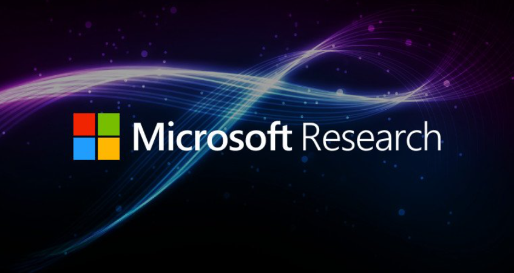
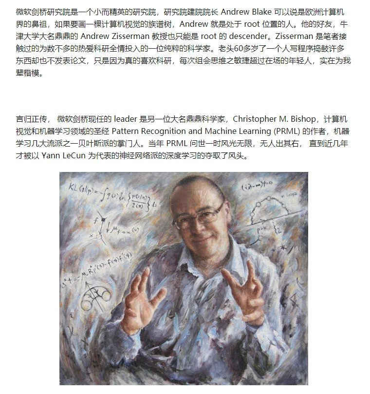
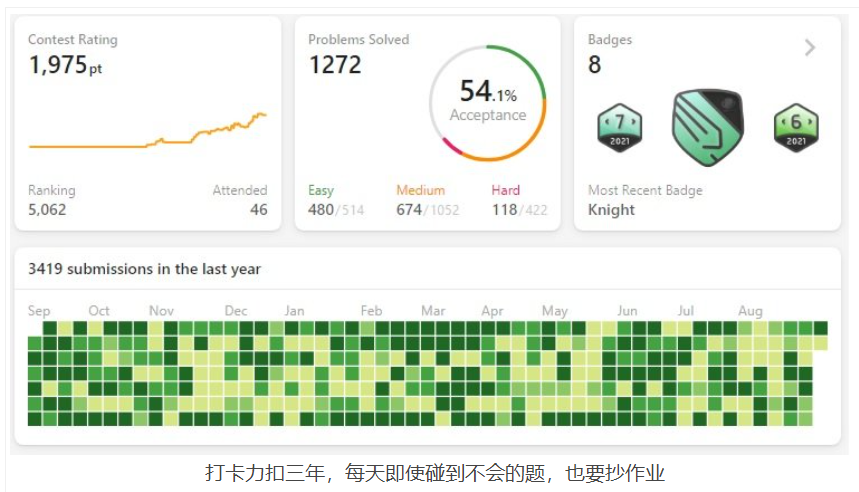
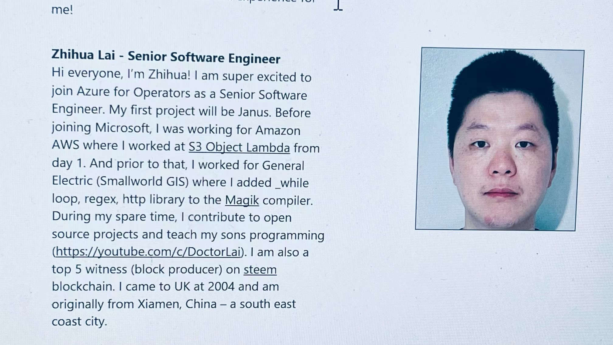

# 我是怎么加入微软剑桥研究院成为一名高级软件工程师的

[toc]

现在想起来，有一点难于置信，我竟然加入了 [剑桥微软研究院](https://www.microsoft.com/en-us/research/people/zhihualai/) (Microsoft Research Cambridge) 的 [AFO研究小组](https://www.microsoft.com/en-us/research/group/azure-for-operators-afo-research/#!people)

在研究院里写代码是个不错的选择，没有oncall的压力, 没有产品上线的deadline和运维的压力, 写写代码, 做做研究, Work Life Balance 极好。

 为啥微软剑桥研究院 (MSRC: MICROSOFT RESEARCH CAMBRIDGE)这么难进？

一般大厂的研究院都相对难进的许多(比如 美国[通用电气](https://justyy.com/archives/31796) General Electric 的 [GE Research Lab](https://www.ge.com/research/))，研究院里的 Researcher 都是有名的大牛。我们组99% 都有PHD学位。很多研究员和工程师都有超牛的背景：哈佛MIT牛津剑桥啥的。研究院里的软件工程师SDE都是Senior职位不招Junior.

微软剑桥研究院成立于1997年，地址在英国剑桥 J J Thomson 大街7号。剑桥研究院目前的科研工作主要集中在机器学习、信息安全、信息修复、操作系统、编程技术和网络。微软剑桥研究院与剑桥大学和剑桥大学计算机实验室保持非常密切的联系。

> 虽然剑桥研究院这几年并不是最热最火的，但它依然可以说是世界上最难进研究院之一。据笔者了解，Junior Reseacher 几乎是没机会直接进去的。整个研究院加上 research engineer 才不过几十人。就连 engineer 的招聘都要求极高，如果做一个类比的话，它基本可以算是微软的 All Souls College（注：牛津的 All Souls 学院每年只从其他所有学院招收两人直接给予 fellow 职位并全额资助其研究，至今没有中国人进去过）。所以，诸君多努力。

> 多说两句，Andrew Blake 和 Bishop 过去都是从爱丁堡大学出来的。爱丁堡大学是欧洲人工智能的发源地，近些年有些式微，但是相对 Oxford，ETH，申请也相对容易，计算机专业的同学可以考虑。另外，剑桥还有一些相对小规模的研究院，例如东芝欧洲研究院，不过这个研究院像是剑桥大学计算机系的一个附属，里面的 leader 也是 Roberto Cipolla 的学生，基本是一个自给自足的小规模研究院。

## 面试微软的过程

我在AWS一年的时候就想跳槽了， [AWS](https://justyy.com/archives/6611)很累，压力很大，WLB不怎么好，因为每5周左右就得 oncall 轮班，有点崩溃，特别是大半夜的被叫起来很不好受。而且我在AWS的时候感觉我从L5到L6基本得四年+的时间，并且在AWS升职感觉需要 Lead through others, 比较看性格，我只是想好好写代码，感觉这样下去升职无望。最好的升职方式就是跳槽，我这次跳到微软MSRC是下一个等级63。

去年秋天开始就投简历了，主要目标就是FANG(或FANNG, FAMNG)大厂，其它厂看不太上(毕竟已经在AMAZON了)，面试就是练兵，即使拿了OFFER也大概率不会去。我的策略就是拿其它不那么大的厂，比如Twitter, CloudFlare来练手，然后拿到OFFER就可以之后 Compete Offer了。

去年面了微软的另一组，很可惜在第三轮等了2周Feedback后就被通知挂了，不过邮件里说的意思是有更合适的人选。面微软就是有点看运气，一个组通常会面完所有的人才做决定，也许你面试发挥得很好，但是如果有另一个人更合适也没办法。

年初的时候刚好 三年前面试的MSRC的一个做硬件的组职位又放出来了，三年前面 Principal 级别第一轮就挂了(三年前的第一轮[微软面试](https://justyy.com/archives/18670))，这一次很轻松就到了终面（五轮），自己感觉面得还行，不过后来还是收到了拒信。但是，还好有个但是，这个组的工程师认为挺可惜的，因为我没有做硬件的经验，而且这个职位是招的 Senior Lead 的职位，所以就 pass 了， 不过他们觉得我过了 hiring bar, 于是给我推荐给了现在的组 AFO: 做无线 5G + 云 Azure 的一个组。

因为我博士做的就是通信方面的，而且又在AWS做过云，然后又有在[美国通用电气](https://justyy.com/archives/18686)做底层编译器的经验，所以可以想像被认为很适合这个组。

Recruiter很快就给我约了又五轮的面试，这样一共得到这份工作，**我今年微软面了10轮**，加上去年秋天三轮 一共13轮。今年面试大概持续了5个月左右。这里说明一个问题就是微软招聘不同组是不需要等冷冻期的（因为隔着去年申请的那一次不到半年）。

最后五轮很顺利，和Hiring Manager还有他的经理 Senior Principal聊得很顺利。意料中拿到了OFFER。

面试过去这么久，不太记得所有的面试细节了：

- MSRC没有Leetcode的题目，这一点和[Facebook](https://justyy.com/archives/19030)大概率出原题，Google出很难的算法题不太一样。微软研究院的题不注重算法，但注重coding, 也就是代码实现是否正确精简，风格等。不过去年面的微软考了Leetcode的[旋转矩阵](https://helloacm.com/how-to-rotate-a-matrix-clockwise-and-anti-clockwise-in-place/)。
- 有一题面了 State Machine 算法，这一个是算法面试冷门的题目。
- 系统设计面了和组做相关接近的框架，所以不怎么相关服务器，API调用等。
- 问了LINUX 系统进程间通信的一些知识(管道, TCP/IP socket, 文件映射等)，还有就是 ebpf 的一些知识。
- 还问了一些无线通信的基本知识。
- 还问了一些类似亚麻 Behavior 的问题：微软的价值观 和一些软技巧 Soft Skills, 是否是 Team Player
- 我用的是C++做coding, MSRC很看重对 STL 的使用程度，比如 accumulate, lower_bound, lambda function 甚至是 for_loop 等

对了，拿到OFFER千万别立马答应，我之前拿到AWS的OFFER不懂，直接接了，这次有经验了，和Recruiter谈了两周，拿到了一个更好的Offer, 因为我当时手上有牌，就是我还在AMAZON，并不一定要走。谈的原因可以基于你在现有公司的职业发展前景，可以[参见这篇文章 Counter Offer Template](https://helloacm.com/an-example-email-to-negotiate-your-package/)。

## 加入微软研究院

决定加入微软后等到了差不多离入职1个月的时候给AWS提了离职，当时经理还要 Counter Offer 甚至要给我升到L6, 不过我拒绝了，我说我在AMAZON不是L6的料。

微软研究院的职位感觉是一个萝卜一个坑，并不是像其它大厂有 General Hire, 只要会刷题会 系统设计就可以进去当螺丝钉。

我在AWS的很大一部分时间就是改改BUG，调调警报敏感度，加几个Metrics, 确实没啥挑战，也没啥技术含量。

我在微软研究院已经快2个月了，做的东西很有意思，很有挑战，主要是LINUX C编程，需要懂一些专业的知识 (Domain of Expertise), 比如ebpf, 云和无线。

值得一提的是，微软研究院MSRC新人入职的大礼包很让我感动: [微软剑桥研究院的SWAG大礼包](https://justyy.com/archives/45543)

## 怎么样保持竞争力？

软件工程师最基本的能力就是算法+coding, 经常刷题可以让自己保持手感，我已经坚持3年[打卡 leetcode](https://justyy.com/archives/44858), 一天未拉下，同时今年开始也在 [BinarySearch](https://binarysearch.com/@/justyy) 上打卡，每天解决一道新题。

当然如果你只会刷题，你的竞争力就最多只是做一个合格的螺丝钉。越高级的软件工程师需要在 垂直一个领域有所擅长，比如系统设计。有了 Domain of Expertise, 才能更好的升职。

软件工程师需要有一些能拿得出手的作品，可以是之前公司所贡献或领导的产品，也可以是业余弄的 side project。比如可以是开源，或者是一些[挣钱](https://justyy.com/archives/31554)的项目。

我就说了[我每天教娃编程](https://space.bilibili.com/1826201500)，还有在[STEEM区块链](https://steemyy.com/steemit-tools/)上有所建树等。这些并不是说能保证你获得工作，只是说相比来说锦上添花更容易拿到面试机会。

加油，想要内推巨硬的，可以简历扔给我: zhihualai@microsoft.com 并附上你想投的职位URL。

## References 

1. [我是怎么加入微软剑桥研究院成为一名高级软件工程师的](https://justyy.com/archives/45631)

