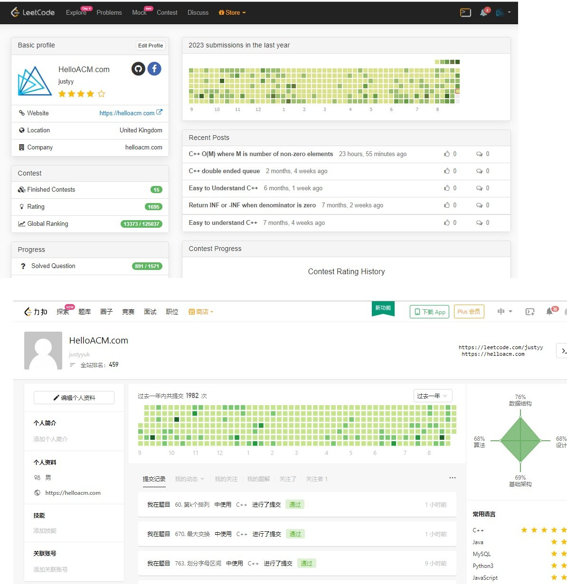

# 熟能生巧 – 刷题的一些技巧的经验之谈

[toc]

每天习惯了打卡, 早上起来喝杯咖啡刷个题, 特别是这几个月疫情在家, leetcode有那种每月Challenge, 刷一题得10积分, 还有就是会员题35分一题, 是快速拿积分的好方法(平时每天登陆才得1分, 一件T-shirt 得6000分换, 按照一天10分, 大概不到2年就能换衣服了)

坚持在 [leetcode](https://justyy.com/archives/32015) 刷题已经有近两年了, 刷着刷着就成习惯了, 就像每天刷牙吃饭一样, 不刷会很不自然. 刷题的收获还是有挺多的, 特别是对数据结构和算法有了进一步的了解. 还有一些设计题, OOP面向对象, 甚至是数据库SQL和BASH编程还有就是[多线程](https://justyy.com/archives/2257)类型的题都能得到温故而知新.

## 为啥要刷题?

对于搞计算机的码农, 刷题是找到一份好的搬砖工作最廉价最有效的方法了. 很多屌丝能通过刷题进入Big4, 改变命运, 迎娶白富美. 亚麻就有很多年轻的小姑娘(听说狗家的也是), 美丽年轻, 平时在电梯里碰到都是很时尚的打扮, 拎个名牌包包. 你细品, 进入了BIG4, 是不是离又美丽又智慧的小姑娘又进了一步呢.

面试造原子弹, 工作的时候就煮茶叶蛋. 没有办法, 这对于大公司来说, 是[筛选人才](https://justyy.com/archives/18804)最有效成本低的方式, 除非你在业界真的牛到不需要刷题, 否则有机会发牢骚还不如多刷几题.

我每天刷题, 状态就是保持+慢慢的进步. 每天[进步](https://justyy.com/archives/19030)一点, 积累坚持的力量是很可怕的. 刷过的题可以换种语言换种思路多看看别人的题解, 总是会有新的收获. 坚持刷题, 让你随时都处在最好的状态, 即使要换工作, 再投简历再面试也不需要再额外多做准备了.

## 模拟面试

Leetcode 会员有一个特别有用的功能就是 Mocking, 它可以让模拟公司(Big4)的第一轮电话面试或者是上机筛选, 或者是终面Onsite. 题目都会从相应公司的题库中出, 很多时候真的能碰到原题.

这个模拟面试还能根据你的训练情况, 对你的各项技能进行打分, 比如我动态规化算法得分较少, 就可以多花一些时间练习.

根据用户给的数据, 给出了Big4的中位数员工的分数, 可以看出 Google 狗家最难, [亚麻](https://justyy.com/archives/6611)最容易, 这次给我的评分竟然比Google的中位数员工分数还高(很多人进了Big4 就不怎么刷题了), 看来维持这个状态之后去申请 Google有戏(至少能过第一轮吧)

## 按类型刷题

如果你的时间有限, 比如下个月就[面试](https://justyy.com/archives/18736)了, 你可以按照该公司出题频率来刷, 不过这个是只有会员有的功能, 据说出原题的概率还是挺大的, 即使不是原题, 换汤不换药, 输入输出变一下, 字符串变数组之类的

如果时间有点充裕, 可以按题目算法类型刷, 比如重点刷一下[动态规化](https://justyy.com/archives/32222), 单调堆栈之类的(对你不熟悉的题重点多刷, 很多题都很类似, 刷多了就有感觉了).

## 周赛

参加周赛也是能力提升的很好的方式, 因为我在欧洲, 周赛是周日的早上3-4点, 所以我没法参加, 但是有双周赛, 每两周练习一次, 比赛1个半小时, 4道题, 第一题是简单难度, 2题中等, 最后一题是难. 不用担心和别人比太差, 实际上每次比赛前十名都是大佬-眼快手快, 没法比. 和自己比就可以了, 每次比赛有收获就行. 你可以安慰自己, 每次有做不出来的题才有进步的空间, 哈哈.

比赛是训练你在规定的时间内专注 Problem Solving的能力. 当然比赛还是要有技巧, 比如调试的技巧, 我上周才发现在 leetcode 代码调试里可以用 [print 来调试](https://justyy.com/archives/44806)变量……一直以来都是直接在网页里输代码, 通过返回值不同来试, 调试效率很低. leetcode 可能为了公平期间, 比赛的时候在线 [debugger](https://justyy.com/archives/31427) 是不能用的(这是个会员功能). 我本地也没有装C++的IDE(有时候甚至是在 iPad 平板上刷题), 所以目前所参赛的15次基本上都是0调试 – 比赛成绩不堪入目.

不过我还是对自己有信心的, 毕竟每次比赛刷不出来的题赛后都认真研究了, 的确也学到了, 有几次甚至是恍然大悟, 捶胸顿足, 为啥比赛的时候就没想出来呢?

当然, 刷题不是全部, 刷题只是敲门砖, 对于毕业生或实习生来说, 面试只有刷题, 但是对于工作几年后的软件工程师来说, 更为重要的是系统设计框架能力的提升, 而相反刷题对于刚毕业的小白和工作几年的大拿来说要求都是差不多一致的. 所以有时候不要纠结于一道非常Tricky的算法题, 它对于你的帮助甚至没有你去了解一下[分布式](https://justyy.com/archives/44793)计算框架的来得重要.

相关: [程序员能刷题的网站和资源(我的刷题经验之谈)](https://justyy.com/archives/31192)

## Reference

1. [熟能生巧 – 刷题的一些技巧的经验之谈](https://justyy.com/archives/44858)