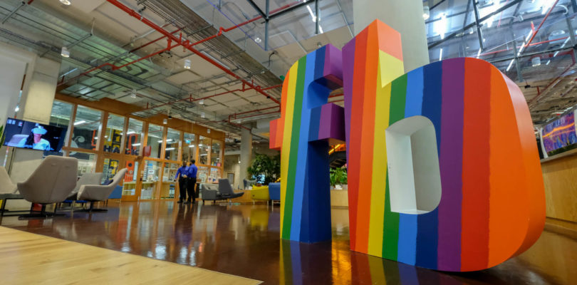
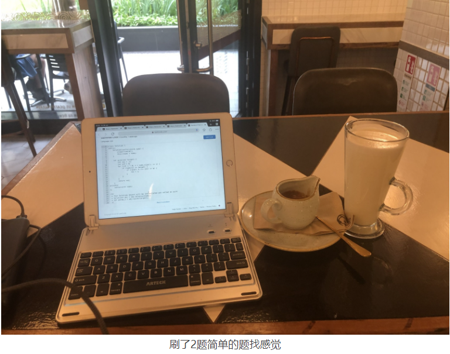
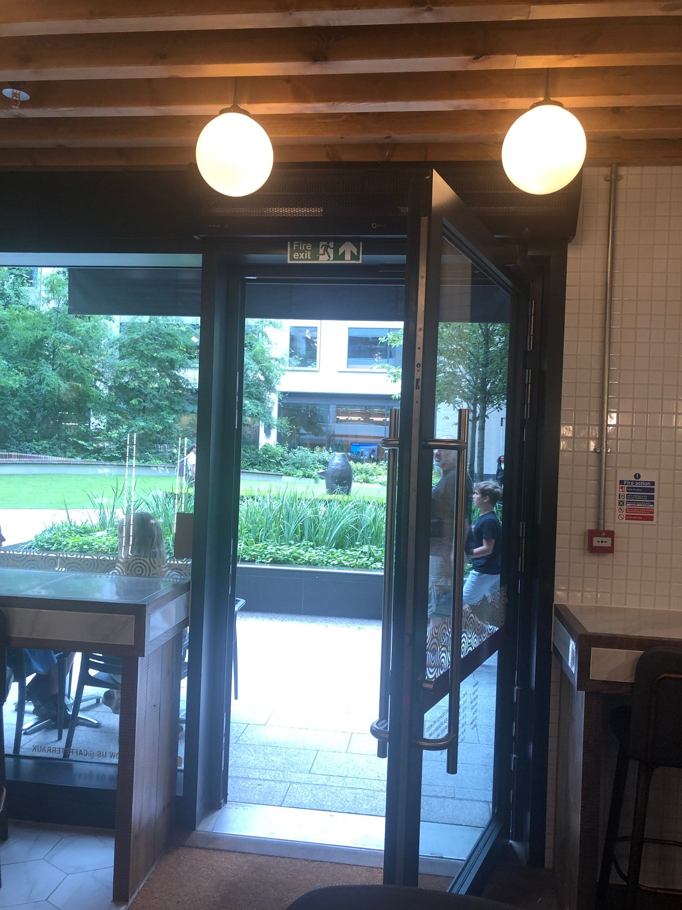
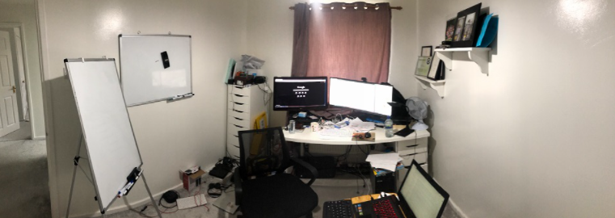

# 离伦敦脸书最近的一次 – 记FACEBOOK伦敦终面经历

2019年8月9日

每次面试没通过就会有一个面试经历分享, 哎. 不过这次FACEBOOK伦敦终面的收获还是挺多的.

### FB简历筛选

记得是五月份左右的时候在LINKEDIN上看到FACEBOOK伦敦的招聘广告, 于是就投了, 当时不抱希望的, 因为我听说像FACEBOOK, GOOGLE这种顶级互联网IT公司每周收到的简历有数千封, 所以很有可能就直接被过滤掉了. FB的人才库(talent)世界大公司排名能前5.

大公司都有自己的猎头, 也就是 Technical Recruiter, TR的水平是相当高的, 很多猎头都有计算机背景, 并且读了心理学等, 所以看简历和HR是不一样的. 很多HR看简历就是过滤关键字……

投了简历很快就接到FB猎头的联系了, 第一轮有一个电话, 只是互相聊了了解一下. 这里说一下FB很大, 猎头负责的阶段也不一样, 比如这个联系我的猎头了解情况后就把我介绍给另一个FB的猎头负责安排第一轮技术面试, 然后通过后又介绍给另一个FB猎头, 有点类似接力棒.

### FACEBOOK第一轮技术面

第一轮是远程视频电脑做题, 在浏览器里做 (coderpad.io), [详细在这里介绍](https://justyy.com/archives/18736).

### FACEBOOK终面 ONSITE INTERVIEW

第一轮技术面后一般会安排在一个月后的终面. 我是安排在了五周后的星期五. 早上11: 45. 我大概8点多就到了Huntingdon火车站, 结果那班火车还因为天热取消了, 在火车站等消息, 还好坐上了9点多的那火车, 大概10点出头到了伦敦 Kings Cross 火车站, 转 St Pancras International, Picadilly 蓝线换到 Horborn 坐 Centra Line 红线一站地到 Tottingham Court Road. 步行5分钟就到了 FB的大楼.

不得不说, FACEBOOK 伦敦还是挺牛逼的, 从FB的邮编就能了解. FB伦敦有三个办公地址, 其中一个邮编(也就是我面试的地方是): W1T **1FB**. 邮编带FB, 真牛逼, 这很用心啊.

10点30的时候我在FB大楼对面的咖啡店点了一杯 Latte, 拿出了IPAD还刷了一两题LEETCODE简单的题(以前做过的), 找找自信. 可以刷些[二叉树](https://justyy.com/archives/6465) 递归的题, 很能找到感觉.

我问吧台工作人员, FB在哪里, 他们指着对面说, 你看, 那个大屏幕的地方就是FACEBOOK. 我这才看到, 远处FB上蓝色屏幕.

#### FACEBOOK终面第一轮

11: 10分的时候我就去前台报道了, 需要在IPAD上 Check in, 然后需要到前台验证一下ID(护照或签证卡). 然后就坐着等了, 这时候FB的大厅美女还给我拿来了水. 11: 40分的时候 FB指定的另一个猎头才接过进去, 然后花了大概5分钟给我讲了一些临场的技巧. 还说到, 没有 Trick Question. 然后又大概给我讲了一下当天面试的安排. 对了这个猎头也是个美女, 手指甲和脚指甲都涂白色的, 很显眼.

很快, 很准时, 第一轮面试就开始了. 首先是 Behavior/Motivation 问题, 大概就是: 你最大的成就是什么? 你最大的失败是什么(Technical/Non-techincally) 你收到的正面和负面评价是什么 之类的问题. 面试官说, 如果时间允许, 这些问题后就会有一道较简单的 coding, 用于热身. 这题很简单, 你一定得答对, 答完美. 答对了并不能作为参考, 但是答错了一定不行.

这些问题主要考察你的价值观是否和FACEBOOK一致, 老实回答就可以, 别太装B了. 比如别说你最大的缺点是太认真之类的.

第一轮的面试官在笔记本上记录你的回答, 然后最后面有时间就问了我一道编程题, 语言随便, 直接在墙上写代码, 这里就不得不提到FB面试的会议室上的一面墙是完全可以写的白板, 在上面写代码写算法很爽.

第一轮的问题是 **LEETCODE**的一题简单题: 取两数组的交集. 我很快就答出了, **并回答了时间空间复杂度. 面试官问我是否有提速的方法, 我说了可以判断两数组的最大最小, 先判断是否有交集. 没交集直接就退出. 有交集比较复杂, 比如可以用 C++的 upper_bound, O(logN) 来缩小范围等等. 面试官还问了测试用例, 我就把几个边边角角的情况给罗列了**, 面试官很满意.

这里需要说一下, **刷题是很有帮助的, 我这一年大概断断续续刷了300道, LEETCODE累计500多道题,** 刷完之后的确学习成长了不少. 比如这题, 我3年前在LEETCODE上刷过, 但是完全不记得了. 不过面试的时候很从容的很自然的就给出了 O(NlogN) 的解法(需要排序), 3年前给的解法是用哈希表空间换时间 O(n)的解法.

CODING的面试后, 面试官都会拍照存档. 一点建议**就是你一定不要一句话不说, 在思考的过程中也要把你的想法表达出来. 在墙上写代码一定要没有明显的BUG, 分号要记得写** 🙂 不习惯白板上写代码的一定得提前练练. 我觉得在白板上写代码并不难, 不像AMAZON伦敦在纸上写代码, 的确有点崩溃.

#### FACEBOOK终面第二轮

第二轮的第一题有点难度. 但我知道在LEETCODE上有, 就是那个 Next Permutation. LEETCODE上的解法很复杂, 说实话之前没看懂, 也没有花时间去搞懂. 当时第二轮第一题就这么难度(LEETCODE中等), 我的确有点慌. 不过慢慢的调整, 给出了一个解法, 虽然有错误, 但是在面试官的帮助下最终搞懂了正确的算法. 花的时间比较多, 所以就没有时间在墙上写出完整的算法.

这里得提一下LEETCODE, 上面很多题都能重现, 如果加入premium帐号(一年160多美元很值)还可以看题目/公司 频率排序. 这个题出现的频率就挺大的.

第二题相对容易很多, 很快就写出来了, 时间空间复杂度完全不是问题. 在墙上写代码也行云流水. 这题好像是给出最长子串, 要求子串中字母不超过K的数量. 用一个sliding window + 静态数组26或者哈希就可以完美解决了.

写出代码后建议可以把测试用例带进行单步执行看看你的算法是否有问题.

#### FACEBOOK餐厅用餐

第二轮后, 很准时, 有一个FB的员工来接我去用餐. 我称这是 “Best part of the day”. 这个员工来自于上海, 在英国已经三年了, 不过我们用英语交流. 我们聊了很多, 不用担心, 这一轮不会被收集反馈的.

FB员工餐厅真是叹为观止, 全部都免费! 而且还可以带老婆孩子来吃. 刚好是暑假, 我看到餐厅里很多孩子, 就问了这个FB员工, 他说很正常的. 吃的很多种, 有PIZZA, 有中餐, 有烤肉, 糕点, 甚至有奶茶. FB一日三餐免费提供, 早餐8点到10点. 根据FB这员工说, 他比较喜欢早餐, 晚餐并不是特别喜欢, 因为种类较少.

我们还聊了生活上的一些事情, 伦敦的房价, 剑桥的田园带娃生活等等. 我了解到, FB伦敦是没有员工停车厂的, 毕竟寸土寸金. FB楼下的停车一小时15英镑, 而在剑桥1英镑1小时已经很贵了.

他说, FB的面试没有问[动态规划](https://justyy.com/archives/6804), 但是他觉得也没有那么难, 毕竟动态规划大部分都是由[递归](https://justyy.com/archives/6836)+记忆而来. 他说GOOGLE的面试会难一些, 刁钻一些.

#### FACEBOOK终面第三轮

吃完饭 我从餐厅带了杯咖啡上来提提神, 这一轮第一题很简单, 好像是给定一个单词列表, 还有一个字符串源, 看哪些单词可以由源字母串里的字符构成, 这题真的很简单啊, O(NM) 加上哈希或者就是一个静态数字用于统计字符的个数即可搞定.

第二题较难, 给定一个数组, 求其中 Min(S)+Max(S)小于等于K的子串个数. 我最开始给出了DFS深度优先的解法(复杂度是 N!), 但是面试官不是特别满意, 最后面在他的帮助下给出了一个 O(N^2)的解法, 其中最关键的那步很难想到, 数学要好, [排列组合](https://justyy.com/archives/5001)要好.

#### FACEBOOK终面第四轮

最后一轮是设计, 两个面试官, 其中一个是学徒(就是学习如何面试别人的FB工程师). 面试题目是如何设计一个Instagram, 用户可以上传照片, 朋友可以看他的照片等等. 在墙上画结构图, 纯设计, 没有代码.

#### FACEBOOK费用报销

FB的费用报销通过网上一个系统, 自己创建, 上传收据, 很快就审核通过了. 这点很方便, 我记得AMAZON还是纯人工填表. 我这次把去FB前喝的咖啡也报了.

#### FACEBOOK面试反馈及下次再申请的时间间隔

周五面试, 10天后(也就是一周零三天)得到了结果: 没通过. 约两周后, FB的猎头收集了所有面试官的回馈给我讲了一些我需要改进的地方. 下一次可以申请是12个月之后. **FB比AMAZON好的是你面试完能得到反馈,** 这些建议很宝贵, 能让你不断的改进自己, 而AMAZON怕法律因素(纠纷, 可能怕面试者因为歧视等原因告公司)就一点反馈都不给.

FB猎头说: **第一轮和第三轮的反馈是很不错的, 面试官给出的决定是 Hire, 并且 Confidence Score (自信分)也挺高.** 这里要说一下, 如果四个面试官给的建议都是一致的, 比如都是 Hire, 或者都是 No Hire, 一般你在2个工作日内就能得到猎头的消息. 而比较常见的情况是有不一致的意见, 这时候周会上就会被讨论直到得到一致的结果. 如果还是不能得到一致的结果, 那么会有加一轮在线面试(类似第一轮技术筛选). 内部意见反馈收集工具在提交面试官自己的反馈前是看不到其他人的意见的, 提交了反馈后就不能修改了, 但是这时候能看到别的面试官的反馈.

有一种情况就是只有一人给出反对, 不过他提出了一个其他面试官没有发现的问题, 这样也可能一票否决. 或者也有可能反过来, 有一人很强烈的给出 Hire, 成功说服了其他人. 还有一种情况就是大家都是 **weakly hire**, 那么在讨论会上发现这个面试者并没有什么特点, 没有强烈的hire的signal不是好事.

第二轮面试官给出的是 No Hire, 不过他的自信分是 Low, FB猎头说他认为, 如果我在其它轮都不错(也就是另三个都是 Hire), 那么他也觉得 Hire 没问题. 需要说的是, 第二轮面试官给的 Feedback 也是很 positive 的, 只不过 decision 是 No Hire… 哎, 老实说, 他的第一题真的很难, 要在短时间有压力的情况下独自想出来真的很难啊, 当然想出来的要么是真的天才能力真强, 要么就是提前做过这题的.

我这次是躺在了最后一轮设计上, 虽然我觉得这一轮我已经发挥出自己的最好水平了, **包括懂得使用 Load Balancer, Zoo Keeper 等先进技术, 可能是在设计消息队列的时候有一些细节没考虑好, 在提醒/提示下才补救**. 不过这一轮 positive 的 feedback 就是我能较好的 **lead the conversation, 演讲的水平还挺不错**.

这一轮的 feedback 是个 blocker, 因为FB觉得我的设计水平没达到他们的标准 bar level, 所以就一票否决了. 老实说, 去年[面试AMAZON](https://justyy.com/archives/6611)的时候最后一轮也是设计, 当时完全不在线上, 还写 coding, 就好比高考作文离题了, 关键是当时也没觉得很有问题, 还自我感觉良好, 这才是最可怕的. 猎头说, 我的coding总体来说是 less concern, 主要是设计不达标.

如果是应届毕业生是没有设计这一轮面试的, 因为我是应聘 senior 的职位 (可能是 E4 或者 E5, 根据设计这一轮的面试情况来确定OFFER的等级, ***FB期待所有的工程师代码都没有问题, 拉开差距则是通过设计***), 所以对这一轮的要求就较高. 而且往往也是设计这一轮的反馈参考来对于职位OFFER分级别. 我觉得设计好主观啊, 我自我感觉这轮挺好的, 结果还是短板.

就如这次一样, 我感觉设计这一轮发挥很不错了, 鬼知道这才是 game changer. 可惜了, 我媳妇说, 哎, 你这只肥鱼还是没能翻身. 没办法, 能力不足, 只能后天多努力努力. 你要知道, 要是我真的成功了, 媳妇会很崇拜我, 然后我的好日子好福利才会多多啊 – 现在只能继续YY了.

这次感觉离FB伦敦很近了, 有点小可惜. 不过也不是很伤心, 毕竟我在GE的工作也很不错, 我和朋友说我这是骑驴找马, 他说, 是啊, 你现在的这头驴就非常不错的呢.

**面试的另一目的就是发现自己的不足(扬长补短), 时刻让自己保持在最佳状态([刷题](https://justyy.com/archives/6471))**. 当然人往高处走, 能到TOP IT公司也许是大部分码农一辈子的梦想吧. 老实说, [GE](https://justyy.com/archives/18686)的技术也是非常好的(我到GE还不到一年, 就接触了各种框架容器[编译器](https://justyy.com/archives/535)前端后端各种技术), 只不过美国通用GE并不能算是互联网公司, 但GE是工业软件的巨头霸主.

通过这次FB面试, 我深深的感觉到了和牛人还是有相当一段差距, 还是得继续努力和学习, 不断的进步才行.

#### FB反馈更新

由于FB不给 written feedback, 而第一次反馈的电话又没讲清楚, 所以我发邮件并得到了一次宝贵的反馈机会. 在我休假回来和FB的猎头再一次通了话(由此看来FB的猎头真的很良心了, 之前申请有一家公司, 被拒后没有任何消息, 因为公司不要你就不想在你身上花一分钟的时间).

这次反馈说了一下设计的问题, 主要是我并没有**从大框架说起, 得 top-down 分析每个模块, 然后需要给出多种设计方案, 分析出优缺点.**

第二轮代码的问题也再次说了一下, 主要就是卡住了.

感觉FB猎头是真心希望你成的, 毕竟大公司让你去参加终面是有成本的: 人力成本+面试所有费用报销也不少钱呢.

## 2020年FACEBOOK再一次面试

2020年8月, FB的Recruiter再一次联系我, 因为已经一年了, 于是我抱着试看看的态度, 又一次参加了FB的面试.

第一轮Phone Screening 面试还是一样, 45分钟一题, 忘记啥题了, 反正很简单, 也就是LC中等的题. 面完不到一周, 就得到了 Feedback, 进入了终面 (onsite).

由于[疫情](https://justyy.com/archives/44823), Onsite 也只能在网上进行, 我约了11月5号进行FB的终面(有大概2个月准备时间), 我这段时间也没有特别的准备, 也就是偶尔有空看看YOUTUBE上的一些系统设计的视频, 在这一方面加强, 毕竟去年在这一方面有所欠缺.

FB当天面试安排: 

- 第一轮是 Behavior Questions,
- 第二第三轮 coding,
- 第四轮 系统设计. 

每轮大概是50分钟, 后面5分钟留了问问题, 每轮面试间隔10分钟(中午有一个小时左右的时间休息)

我感觉面试发挥得不错, 基本上没啥问题, 特别是 coding 两轮每轮两题都很简单, 没有意外, 有两题还是LC上的原题, 其它两题都是变种, 不过不难.

等了两周, 才得到了被据的消息:

> Hope you’re keeping well and safe.
>
> Thanks for your patience whilst the team review your feedback from your onsite recently. I’m afraid it’s not positive news and we won’t be proceeding to offer this time. Whilst there were many positives, unfortunately the team felt the overall performance didn’t quite meet the bar that we have for an offer. I understand you have dedicated significant time to the process and keen to ensure you have some valuable feedback from us. If you’d like to discuss please let me know some time you have this week for a call to catch up and discuss.
>
> Thank you again for the time taken to talk to us and regardless of the decision I hope you had a positive experience.
> Thanks

我约了FB猎头给回馈, 电话里说:

1. 2 coding rounds were solid and strong: [编程](https://justyy.com/archives/31796)很没有问题 – 意料之中
2. bq was ok. 这个也没啥意外的, 之前还怕踩红线了, 中规中矩, 反正我不是那种 和团队不合的 team player.
3. 系统设计 到了 E4的级别 但是在 E5 的 borderline 也就是说很接近E5 但是还没到. System Design is ok for E4 but not strong enough for E5.

这里说一下, FB的E4级别对应AMAZON的L5(SDE2)对应GOOGLE的(L4). FB的E4并不是Terminal Level 也就是说进去E4有3年升E5的职业压力.

猎头说: 我这次的水平很接近了, 但是就是在那条bar线稍微下面一点, 所以他们开了几次会拖了两周才给反馈. 他还说不要觉得失望, 这次面试不算失败. 明年他还会再一次联系我的(过了冷冻期).

如果在面试里表现很差, 你可能两三天就会接到拒信-因为只需要猎头写几句话就能拒了你, 相反如果成功了, 则需要更久的等待时间(更多的步骤和程序要走). 不管如何, 相比去年还是有进步的, 因为去年一轮CODING表现不好, 系统设计没达到E4级别, 今年则是系统设计没达到E5级别(今年疫情, FB只招E5, 可能是发现远程onboard E4工程师比较吃力吧)

我疫情在家请一天假面试FB的地方(我的办公室): 特别说一下: FB很良心, 给报销40美元的白板钱(white board)

## Reference

1. [离伦敦脸书最近的一次 – 记FACEBOOK伦敦终面经历](https://justyy.com/archives/19030#comments)