# Github入门笔记
@(读书笔记组)[GitHub, GitHub 101, GitHub 漫游指南, Git工作流程, Github入门笔记]

[toc]


--------------------------------

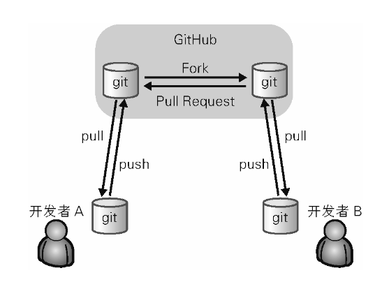 


> 图中只显示了一般的使用流程。实际上，所有仓库之间都可以进行 push 和 pull。即便不通过 GitHub，开发者 A 也可以直接向开发者 B 的仓库进行 push 或 pull。因此在使用前如果不事先制定规范，初学者往往会搞不清最新的源代码保存在哪里，导致开发失去控制。不过不用担心，只要各位随着本书的讲解亲自动手尝试，想掌握要领并不是一件难事。

## 1. 为什么Github受欢迎
在Github之前，developer一直都没有一个用来辅助多人协同编程的关键性软件。因此软件开发者们往往要将
- 版本管理系统
- BUG 跟踪系统
- 代码审查工具
- 邮件列表
- IRC 等

众多工具组合在一起，以实现多人协作。

## 2. [流程描述](https://www.ruanyifeng.com/blog/2015/08/git-use-process.html)

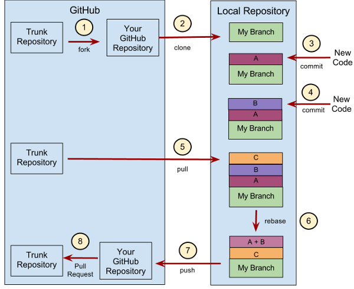 


1. 在A的仓库中**`fork`**项目B （此时我们自己的github就有一个一模一样的仓库B，但是URL不同）
2. 将我们修改的代码**`push`**到自己github中的仓库B中
3. **`pull request`** ，主人(A)就会收到请求，并决定要不要接受你的代码。

要点：

**`fork`仅仅只是fork到你的github帐号上，你还需要用【`pull`】命令把代码拉回到你【本机的电脑】上。**

### 2.1 `fork` vs. `clone`

**`fork`**：在***github***页面，点击`fork`按钮。将别人的仓库复制一份到自己的仓库。

**`clone`**：将***github***中的仓库克隆到自己本地电脑中


通常来说 `clone` 来的仓库实际上与原仓库并没有任何关系。所以我们需要将原仓库设置为远程仓库，从该仓库获取（`fetch`）数据与本地仓库进行合并（`merge`），让本地仓库的源代码保持最新状态:

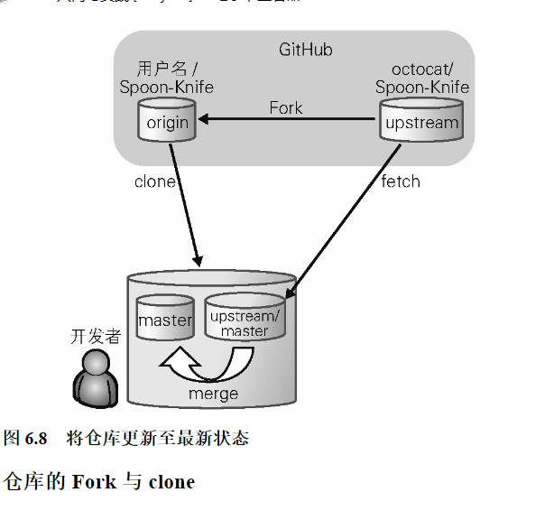


> 摘自： 《***Github入门与实战***》  `6.5　仓库的维护`章节（作者：大塚弘记）。

### 2.2 小青的解释

- **PR流程**：
1. 在`Jira`创建**Story**类型事务，得到`AT-XXXX`
2. 拉取***master***最新代码

```gas
git clone https://github.com/edmodo/automodo.git
git checkout master #切换到master
git pull  #拉取master最新代码
```

3. 创建新的分支

```gas
git checkout -b AT-2903 #新建分支
```

4. 修改代码
5. 提交修改到暂存区

```gas
git status
git add<filename>
```

6. 提交代码到远程库

```gas
git diff #查看版本改动情况
git config --global user.name "xiaoqing"
git config --global user.emal zoe@example.com
git commit #将暂存区的改动提交到本地版本库
git push origin AT-29031 #提交本地库的修改到远程库
```

7. 登录github提交`branch AT-2903`的`Merge`请求

clone是把master复制到本地来 后面好基于`master`在本地`fork`分支。`push`是把本地修改好的分支 推送到远程去 相当于远程也有这个`fork` 分支 并包含你的修改。

- **fork**:

```gas
git checkout -b <branch_name>
```

###  2.3 工作区/暂存区/仓库/远程仓库/快照
 


- `git clone`是把远程上整个仓库都拷贝到本地仓库上

- 因此远程仓库有多少个分支都会一起被拷贝下来

- 本地再使用`git checkout`命令把某个分支切到**工作区**；

- 而`git pull`可以直接从远程仓库拉去到**工作区**某个分支上；

  > 2021-4-7 21:06:33

**[名词解释](http://www.ruanyifeng.com/blog/2015/12/git-cheat-sheet.html)：**

| 名词      |     翻译 |   备注   |
| :-------- | --------:| :------: |
| Workspace |   工作区| |
|  Index / Stage|暂存区|| 
|**Repository**|仓库区（或本地仓库）| |
|**Remote**|远程仓库||
|**commit**|快照||

1. 需要通知 Git 哪些文件发生了变动。所有变动的文件，Git 都记录在一个区域，叫做"暂存区"（英文叫做 **`index`** 或者 **`stage`**）。通过`git add --all`来实现。

2. 暂存区保留本次变动的文件信息，等到修改了差不多了，就要把这些信息写入历史，这就相当于生成了当前项目的一个快照（**snapshot**）。

   > 项目的历史就是由不同时点的快照构成。Git 可以将项目恢复到任意一个快照。快照在 Git 里面有一个专门名词，叫做 **`commit`**，生成快照又称为完成一次提交。
3. Git 提供了git commit命令，简化提交操作。保存进暂存区以后，只要git commit一个命令，就同时提交目录结构和说明，生成快照。

   ```gas
   $ git commit -m "first commit"
   ```
4. `git checkout`命令用于切换到某个快照。
5. `index/stage`的[作用是允许roll-back](https://www.bilibili.com/video/BV1tf4y1e7yt?p=6&spm_id_from=pageDriver)一个提交。

 


 

> # [Commits are snapshots, not diffs](https://github.blog/2020-12-17-commits-are-snapshots-not-diffs/)


## 3. Developers化学反应- Pull Request

> 保留本段落主要解释了Git和传统的CVS，SVN的差别在哪里

在 GitHub 这个聚集了世界各地软件开发者的地方，有个在过去绝对是无法想象的事正在飞速地进行着——素未谋面的开发者们隔着半个地球的距离共同开发软件。我们不妨称之为开发者之间的化学反应吧。这种事成为可能，都要归功于一个名为 Pull Request 的功能:

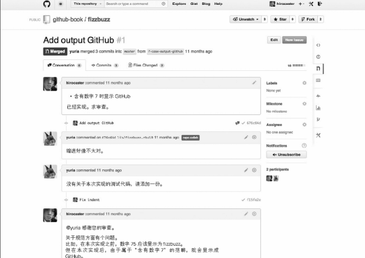 

Pull Request 是指开发者在本地对源代码进行更改后，向 GitHub 中托管的 Git 仓库请求合并的功能。开发者可以在 Pull Request 上通过评论交流，例如
- “修正了 BUG，可以合并一下吗？”
- “我试着做了这样一个新功能，可以合并一下吗？”等。

通过这个功能，开发者可以轻松更改源代码，并公开更改的细节，然后向仓库提交合并请求。而且，如果请求的更改与项目的初衷相违，也可以选择拒绝合并。

GitHub 的 Pull Request 不但能轻松查看源代码的前后差别，还可以对指定的一行代码进行评论（图 1.4）。通过这一功能，开发者们可以针对具体的代码进行讨论，使代码审查的工作变得前所未有地惬意

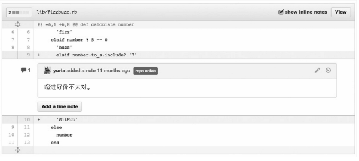 

### 3.1 Social Coding

随着 GitHub 的出现，软件开发者们才真正意义上拥有了源代码。世界上任何人都可以比从前更加容易地获得源代码，将其自由更改并加以公开。如今，世界众多程序员都在通过 GitHub 公开源代码，同时利用 GitHub 支持着自己日常的软件开发。

在 GitHub 出现之前，软件开发中只有一小部分人拥有更改源代码的权利，**这个特权阶级掌握着开发的主导权**。开发者在改写、发布源代码之外，往往需要花更多时间和精力去说服这个特权阶级。这导致了许多起初效率很高的流行软件越发保守化，最终被时代所抛弃。

但是，GitHub 的出现为软件开发者的世界带来了真正意义上的“民主”，让所有人都平等地拥有了更改源代码的权利。这在软件开发领域是一场巨大的革命。而革命领导者 GitHub 的口号便是“社会化编程”。

### 3.2 GitHub 最大的特征是“面向人”

GitHub 与以往的仓库托管服务最大的不同点，就在于它以人为中心。

以往的仓库托管服务都是以项目为中心，每个项目就是一个信息封闭的世界。虽然能够知道一个仓库的管理者是谁，但这个管理者还在做哪些事，我们就不得而知了。

GitHub 除项目之外，还可以把注意力集中到人身上。我们不但**能阅览一个人公开的所有源代码**，只要查看其控制面板中的 **News Feed**，还能知道他**对哪些仓库感兴趣**，什么时候做过提交等。一个人在 GitHub 进行的开发是一目了然的 。

您可以将注意力聚焦到感兴趣的人身上。他既可以是您崇拜已久的超级黑客，也可以是同校同学或公司的同事。

能同时关注人与代码，是 GitHub 为我们带来的一个新的世界。

## 4. 全局初始配置

### 4.1 Git 安装

#### 4.1.1  Mac

Mac 中都预装了 Git。而各版本的 Linux 中也都以软件包（Package）的形式提供给用户了，所以各位可以直接使用。

#### 4.1.2 Windows

下载[Git for Windows](https://gitforwindows.org/)
> 原地址： http://msysgit.github.io/

- 选择 Use Git Bash only 
- **换行符的转换**: 选择 **Checkout Windows-style, commit Unix-style line endings**
> GitHub 中公开的代码大部分都是以 Mac 或 Linux 中的 **`LF`**（`Line Feed`）换行。然而，由于 Windows 中是以 **`CRLF`**（`Carriage Return ＋ Line Feed`）换行的，所以在非对应的编辑器中将不能正常显示。
> 
>  Git 可以通过设置自动转换这些换行符。使用 Windows 环境的各位，请选择推荐的“Checkout Windows-style, commit Unix-style line endings”选项。换行符在签出时会自动转换为 CRLF，在提交时则会自动转换为 LF。
>   
>  (摘自《Github入门与实践 -2.3 安装》)

### 4.2 设置姓名和邮箱地址

```vim
$ git config --global user.name "Firstname Lastname"
$ git coffig --global user.email "your_emal@example.com"
```

这个命令，会在“`~/.gitconfig`”中以如下形式输出设置文件。

```vim
[core]
	editor = \"D:\\program files\\Microsoft VS Code\\Code.exe\" --wait
[user]
	name = VarianWrynn
	emal = yuna1111@163.com
```

备注：
“`~/.gitconfig`”这个文件是存在`C:\Users\UserName`目录下

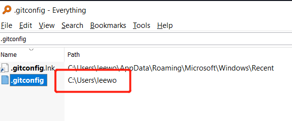 

### 4.3 提高命令输出的可读性

顺便一提，将 color.ui 设置为 auto 可以让命令的输出拥有更高的可读性。	

```vim
$ git config --global color.ui auto
```

“~/.gitconfig”中会增加下面一行:

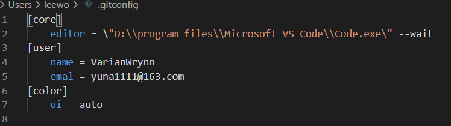 


### 4.4 通过命令行查看config全局配置

```gas
git config --global --list
```


## 5. 设置 SSH Key
> 参考 [Generating a new SSH key and adding it to the ssh-agent](https://help.github.com/en/github/authenticating-to-github/generating-a-new-ssh-key-and-adding-it-to-the-ssh-agent)

GitHub 上连接已有仓库时的认证，是通过使用了 SSH 的公开密钥认证方式进行的。现在让我们来创建公开密钥认证所需的 SSH Key，并将其添加至 GitHub。已经创建过的读者，请用现有的密钥进行设置。

运行下面的命令创建 SSH Key。

```gas
$ ssh-keygen -t rsa -C "your_email@example.com"
Generating public/private rsa key pair.
Enter file in which to save the key
(/Users/your_user_directory/.ssh/id_rsa): 按回车键
Enter passphrase (empty for no passphrase): 输入密码
Enter same passphrase again: 再次输入密码
```

输入密码后会出现以下结果。

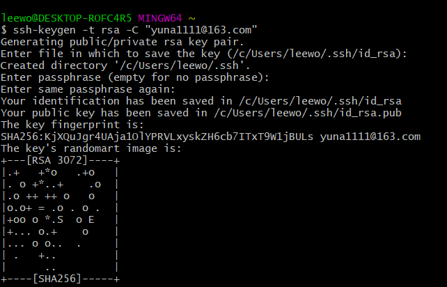 

**`id_rsa`** 文件是私有密钥，**`id_rsa.pub`** 是公开密钥。


### 5.1 添加公开密钥

**在 GitHub 中添加公开密钥，今后就可以用私有密钥进行认证了**。首先需要查找到Github你账号下面设置的公钥，这个公钥存储在`id_rsa.pub`中。

**id_rsa.pub 的内容可以用如下方法查看**。

```vim
$ cat ~/.ssh/id_rsa.pub
```

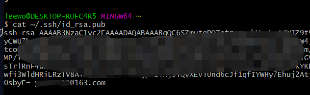 


点击右上角的账户设定按钮（[Settings](https://github.com/settings/keys)），选择 SSH Keys 菜单之后，就会出现如图3.2的界面。

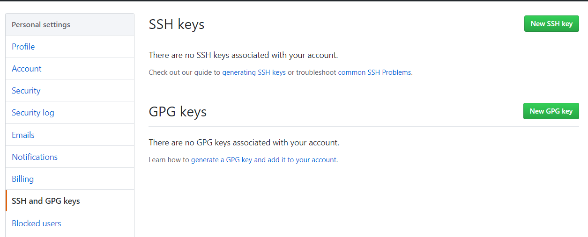 


点击Add SSH Key，会出现Title和Key两个输入框。在 Title 中输入适当的密钥名称。Key 部分请粘贴 id_rsa.pub 文件里的内容。

添加完出现如下的报错，原因是因为**没有**把开头的`ssh-rsa`一起复制上。
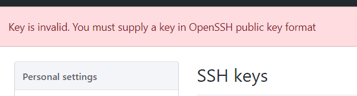 


一起复制上之后添加就通过了：
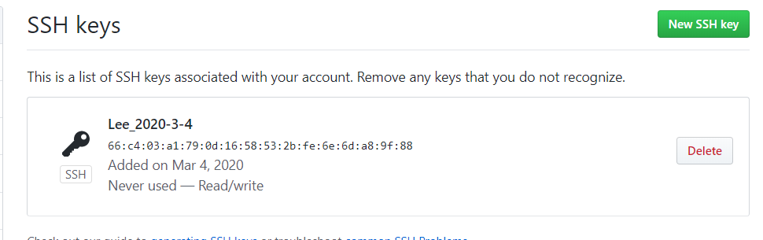 


### 5.2 SSH通讯验证
添加成功之后，创建账户时所用的邮箱会接到一封提示“公共密钥添加完成”的邮件。

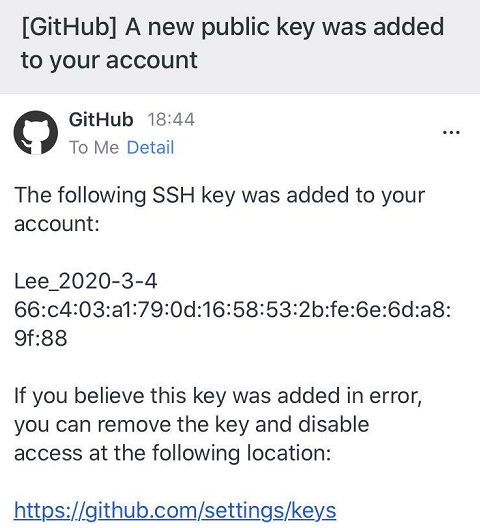  


完成以上设置后，就可以用手中的私人密钥与 GitHub 进行认证和通信了。让我们来实际试一试。

```gas
$ ssh -T git@github.com
The authenticity of host 'github.com (207.97.227.239)' can't be established.
RSA key fingerprint is fingerprint值 .
Are you sure you want to continue connecting (yes/no)? 输入yes
```

出现如下结果即为成功。

```gas
Hi VarianWryy! You've successfully authenticated, but GitHub does not provide shell access.
```
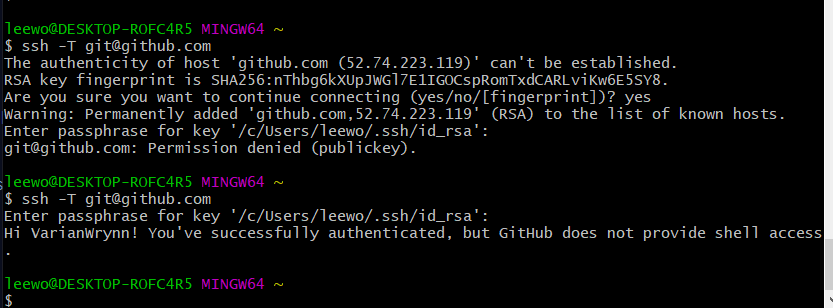 

> 这里出现 **Enter passphrase for key '/c/Users/lee.wang/.ssh/id_rsa':** 需要注意输入密码。
> 2020-12-14

### 5.3 SSH可能并不校验邮箱

这个小结是我在操作完 `6-牛刀小试`之后观察到的。在执行 `git push`命令之后，我调用`git log`查看，发现Author这个栏位是这样的：
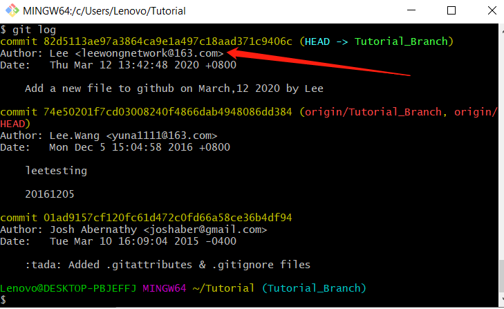

但是这个邮箱是不存在的，或者即便存在，也不可能是我的。应该是当初配置的时候不小心写错了。

我一开始刚到很奇怪，为什么写错的邮箱也能校验通过，我特意到存储公钥的文件里面查询（`$ cat ~/.ssh/id_rsa.pub`）：

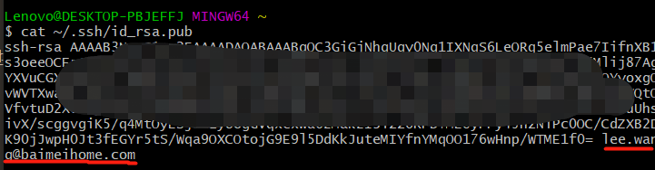 

这个邮箱是公司的邮箱，我用的也是公司的电脑。但是我用这个 `ssh-rsa` 公钥到github上注册添加了。

由此可见，**Github校验只校验你的SSH是否注册了，并不会校验邮箱等信息，也不在乎这个邮箱是否曾经在Github上注册过**。

那么最后一个问题，如果用一个不存在的邮箱`push`了代码，github上会怎么显示呢？

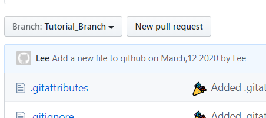 

可以看到，就是一个default的头像和提交的时候的名字，这个头像无法点击查看。

最后，我在git的配置文件中找到了那个不存在的邮箱：
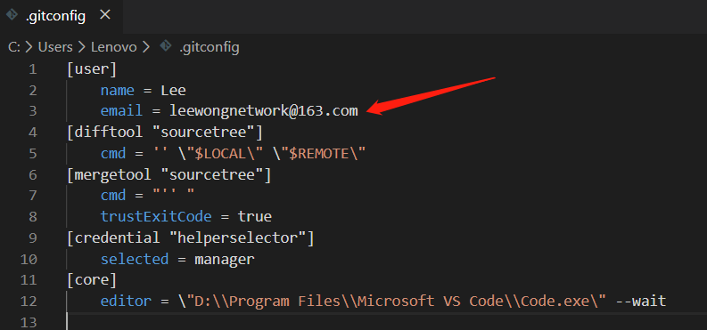 

该文件夹默认是在 `C:\Users\{你的电脑名称}`目录下：
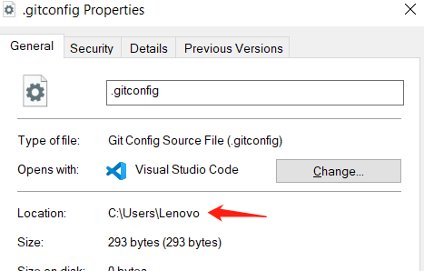 


## 6. 牛刀小试

### 6.1 Clone

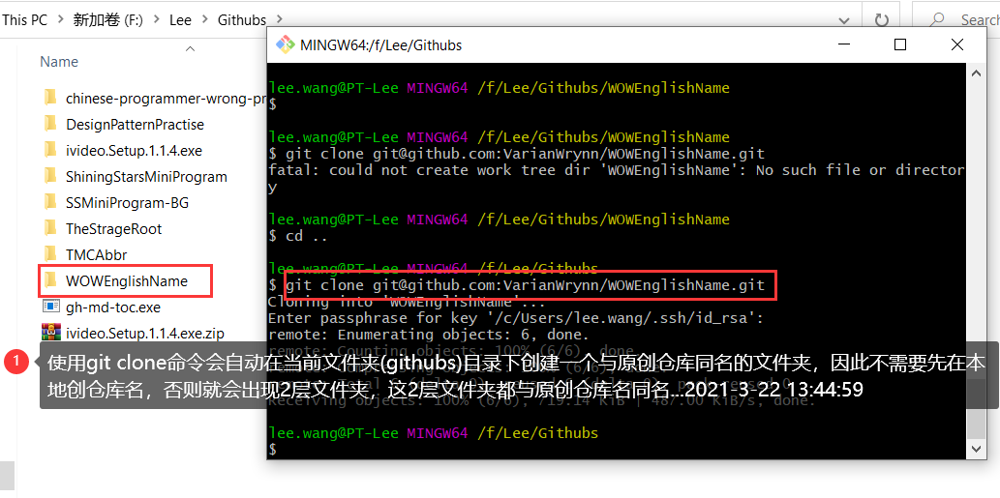 


clone 已有仓库。  

**S1： 打开目标仓库，然后点击【Clone or download】按钮，复制如下的地址。**

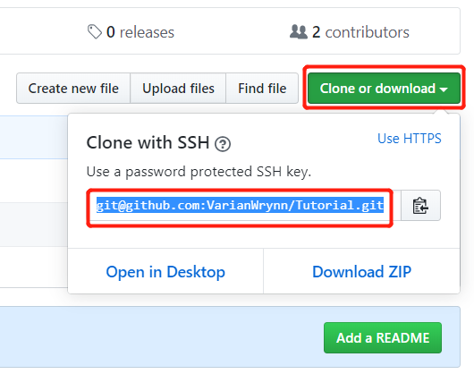 


**S2： 打开本地git客户端，执行`git clone`命令：**

```
$ git clone git@github.com:VarianWrynn/Tutorial.git
```

执行结果：成功讲项目从github上克隆到本地：
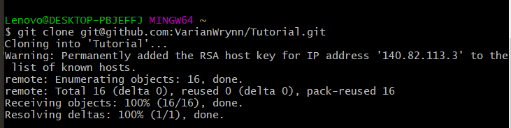 

**S3： 切换到该项目**

看到该项目已经成功clone到了本地:

......................
```vb
$ cd Tutorial/
```

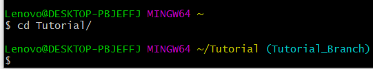 

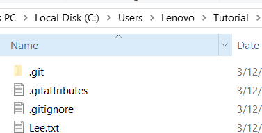 


**S4： 在该项下面手工新增一个text文本，然后使用 `git status`命令查看**

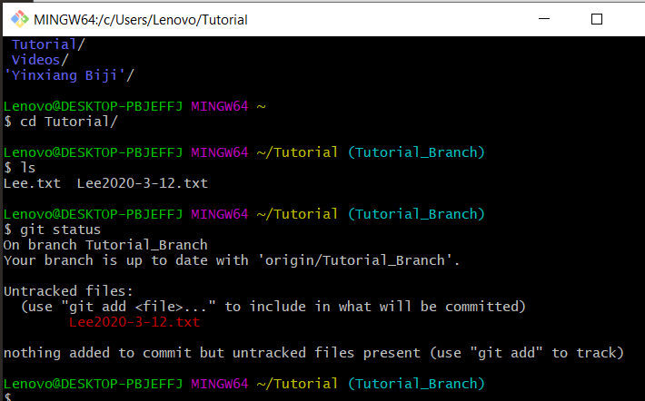 

由于 **Lee2020-3-12.txt** 还没有添加至 Git 仓库，所以显示为 **Untracked files**。


### 6.2 Submit

将  **Lee2020-3-12.txt**  提交至仓库。这样一来，这个文件就进入了版本管理系统的管理之下。今后的更改管理都交由 Git 进行。

**S1：通过 git add命令将文件加入暂存区** 

在 **Index 数据结构**中记录文件提交之前的状态。

**S2: 再通过 git commit命令提交。**

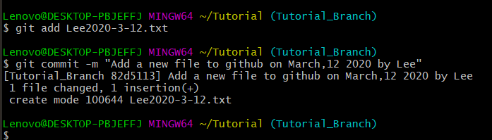 

 **S3: git log命令查看提交日志。**

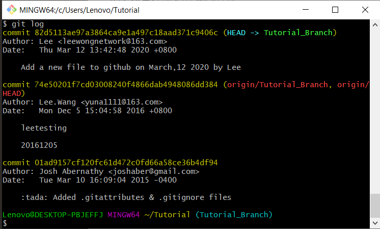 

### 6.3 push

> 注意: 如果是本地创建的仓库，尚未链接到远程端，则需要参考 [7. 推送至远程仓库](#7. 推送至远程仓库)

完成`git add`、`git commit`之后，打开github页面依然看不到新增的文件。

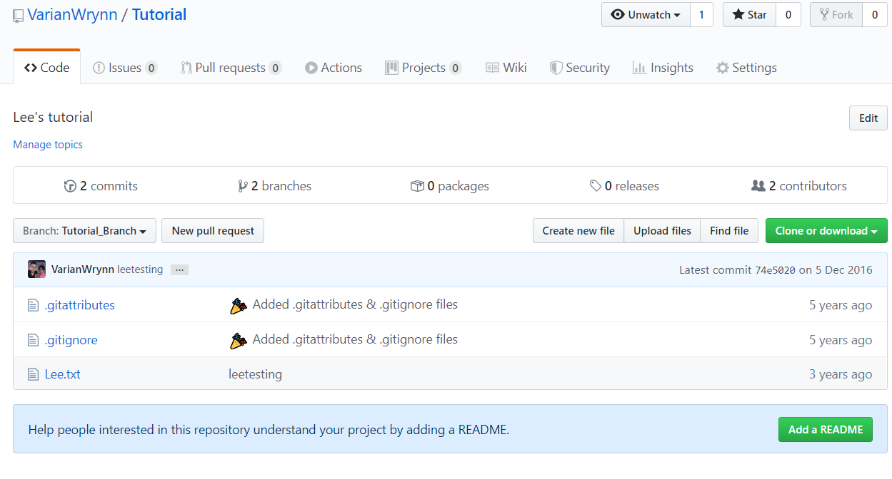 

这时候需要执行 `push` 命令，GitHub 上的仓库就会被更新。

```gas
Lenovo@DESKTOP-PBJEFFJ MINGW64 ~/Tutorial (Tutorial_Branch)
$ git push
Warning: Permanently added the RSA host key for IP address '140.82.113.4' to the list of known hosts.
Enumerating objects: 4, done.
Counting objects: 100% (4/4), done.
Delta compression using up to 8 threads
Compressing objects: 100% (2/2), done.
Writing objects: 100% (3/3), 335 bytes | 335.00 KiB/s, done.
Total 3 (delta 1), reused 0 (delta 0)
remote: Resolving deltas: 100% (1/1), completed with 1 local object.
To github.com:VarianWrynn/Tutorial.git
   74e5020..82d5113  Tutorial_Branch -> Tutorial_Branch
```

这时候再刷新github就出现了：
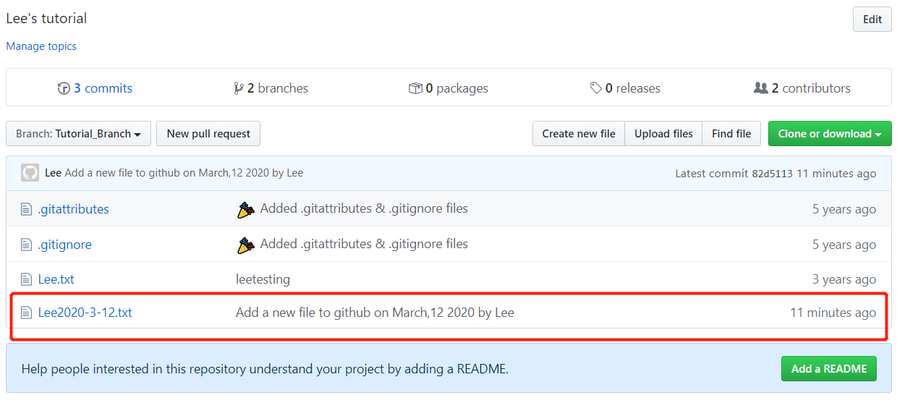 


这样一来代码就在 GitHub 上公开了。


## 7. 推送至远程仓库

在 GitHub 上新建一个仓库。为防止与其他仓库混淆，仓库名请与本地仓库保持一致。

创建时请不要勾选 **`Initialize this repository with a README`** 选项。因为一旦勾选该选项，GitHub 一侧的仓库就会自动生成 README 文件，从创建之初便与本地仓库失去了整合性。

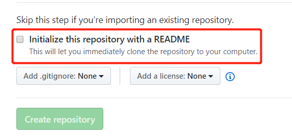 


虽然到时也可以强制覆盖，但为防止这一情况发生还是建议不要勾选该选项，直接点击 Create repository 创建仓库。

### 7.1 git remote add——添加远程仓库

在 GitHub 上创建的仓库路径为“**git@github.com:用户名/DesignPatternPractise.git**”。现在我们用 **`git remote add`**命令将它设置成本地仓库的远程仓库 

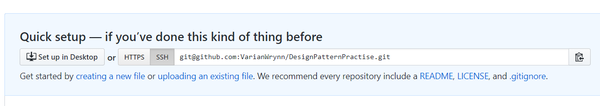 

> 注意 :warning: 这里的协议需要选对，基本都是选择SSH协议。HTTPS从2021年8月起，需要做Token设置才允许访问仓库，无法直接通过帐号密码提交([Git password authentication is shutting down](https://github.blog/changelog/2021-08-12-git-password-authentication-is-shutting-down/))


```gas
$ git remote add origin git@github.com:VarianWrynn/DesignPatternPractise.git
```

按照上述格式执行 `git remote add` 命令之后，Git 会自动将 `git@github.com:VarianWrynn/DesignPatternPractise.git`远程仓库的名称设置为 origin（标识符）。

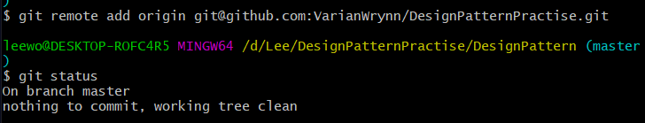 


> [参考：git remote 使用总结（简书）](https://www.jianshu.com/p/83c7ffc9b259)

### 7.2 git push——推送至远程仓库

如果想将当前分支下本地仓库中的内容推送给远程仓库，需要用到 git push命令。现在假定我们在 master 分支下进行操作。

```gas
$ git push -u origin master

Enter passphrase for key '/c/Users/leewo/.ssh/id_rsa':
Enumerating objects: 41, done.
Counting objects: 100% (41/41), done.
Delta compression using up to 8 threads
Compressing objects: 100% (33/33), done.
Writing objects: 100% (41/41), 248.15 KiB | 1.18 MiB/s, done.
Total 41 (delta 2), reused 0 (delta 0)
remote: Resolving deltas: 100% (2/2), done.
To github.com:VarianWrynn/DesignPatternPractise.git
 * [new branch]      master -> master
Branch 'master' set up to track remote branch 'master' from 'origin'.

```
像这样执行 `git push`命令，当前分支的内容就会被推送给远程仓库 `origin` 的 `master` 分支。

**`-u`** 参数可以在推送的同时，将 origin 仓库的 master 分支设置为本地仓库当前分支的 **upstream（上游）**。

添加了这个参数，将来运行 `git pull`命令从远程仓库获取内容时，本地仓库的这个分支就可以直接从 origin 的 master 分支获取内容，省去了另外添加参数的麻烦。

执行该操作后，当前本地仓库 master 分支的内容将会被推送到 GitHub 的远程仓库中。在 GitHub 上也可以确认远程 master 分支的内容和本地 master 分支相同。

现在就可以在**https://github.com/VarianWrynn/DesignPatternPractise**上看到被推送上来的项目了。


### 7.3 推送至 master 以外的分支
除了 **master** 分支之外，远程仓库也可以创建其他分支。举个例子，我们在本地仓库中创建 **feature-D** 分支，并将它以同名形式 push 至远程仓库。

```gas
$ git checkout -b feature-D
Switched to a new branch 'feature-D'
```

我们在本地仓库中创建了 feature-D 分支，现在将它 push 给远程仓库并保持分支名称不变。

```gas
$ git push -u origin feature-D

Total 0 (delta 0), reused 0 (delta 0)
To git@github.com:github-book/git-tutorial.git
 * [new branch]      feature-D -> feature-D
Branch feature-D set up to track remote branch feature-D from origin.
```

现在，在远程仓库的 GitHub 页面就可以查看到 feature-D 分支了。

## 完整命令参考

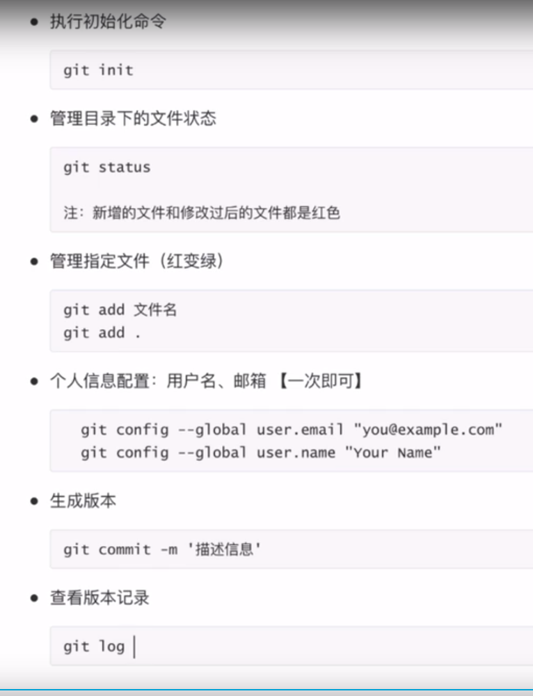 

每一次创建一个新仓库都要翻阅手册好久，有点浪费时间，说明对整个流程还不熟悉，特此记录下来：

1. 在github原创仓库创建一个仓库比如叫`SSMiniProgram-BG`

2. 首先在`D:/Lee/`目录下创建 `SSMiniProgram-BG` 文件夹（与远程仓库同名），执行初始化命令：

```gas
cd SSMiniProgram-BG/
$ git init
Initialized empty Git repository in D:/Lee/SSMiniProgram-BG/.git/
```

3. 使用branch和status命令查看状态：

```gas
$ git branch
$ git status
On branch master
No commits yet
nothing to commit (create/copy files and use "git add" to track)
```

4.  使用`git remote add orgin`命令讲本地的仓库与原创的仓库链接起来：

```gas
$ git remote add origin git@github.com:VarianWrynn/SSMiniProgram-BG.git
```

5.  在本地仓库添加一些文件，然后使用`add`, `commite`命令提交到本地缓存区

```gas
$ git add .
$ git commote -m "Lee"
$ git commit -m "Lee"
[master (root-commit) 62a9ee9] Lee
 1 file changed, 65 insertions(+)
 create mode 100644 README.md
```

7. 使用`git push -u origin master`推送到远程

```gas
$ git push -u origin master
Enter passphrase for key '/c/Users/leewo/.ssh/id_rsa':
```


### Pull request on Github

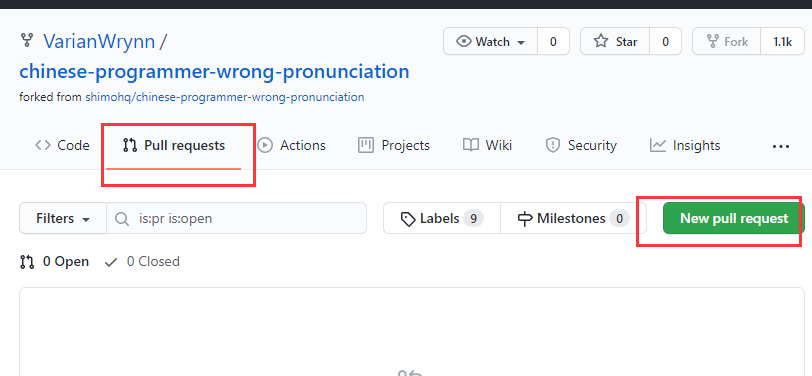 


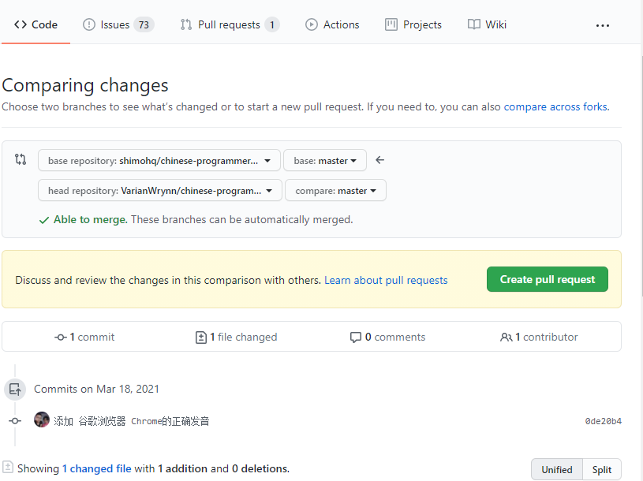 


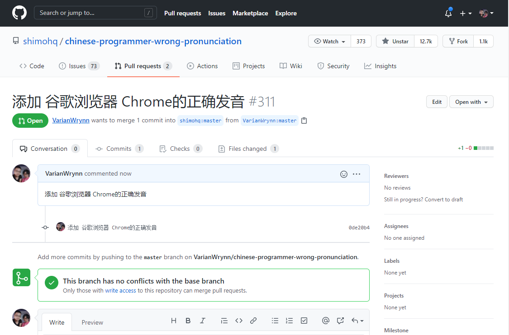  


## 8. 从远程仓库获取

### 8.1 git clone——获取远程仓库

在本地新建一个文件夹，用于存储即将从远程克隆下来的数据，然后打开`git bash`切到该目录下，使用如下命令：

```gas
$ git clone git@github.com:VarianWrynn/Tutorial.git
```

- **Git clone 项目到[本地指定目录](http://www.xiaoshu168.com/linux/294.html)**

```gas
git -c diff.mnemonicprefix=false -c core.quotepath=false clone --recursive https://git.coding.net/gamedaybyday/HelloGit.git D:\Git\HelloGit
```

简单写法：

```gas
git clone https://git.coding.net/gamedaybyday/HelloGit.git D:\Git\HelloGit
```

以上这种写法我在2020-12-14测试无效（可能Mac机器下有效），在Windows下必须先切换到指定的folder下再使用`git clone`命令拉取：

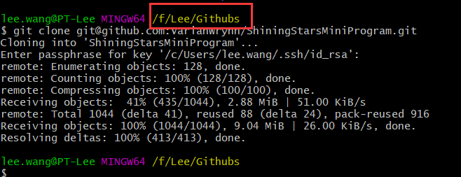 


### 8.2 git pull -- 获取最新的远程仓库分支

```gas
Lenovo@DESKTOP-PBJEFFJ MINGW64 /f/Lee/Githubs/ShiningStarsMiniProgram (master)
$ git pull origin master

---------------------
remote: Enumerating objects: 18, done.
remote: Counting objects: 100% (14/14), done.
remote: Compressing objects: 100% (4/4), done.
remote: Total 8 (delta 5), reused 6 (delta 4), pack-reused 0
Unpacking objects: 100% (8/8), 1.47 KiB | 4.00 KiB/s, done.
From github.com:VarianWrynn/ShiningStarsMiniProgram
 * branch            master     -> FETCH_HEAD
   f689f45..f2bdd53  master     -> origin/master
Updating f689f45..f2bdd53
Fast-forward
 components/classic/music/index.js | 12 ++++++++++++
 1 file changed, 12 insertions(+)

```

如果没有加上后面的`orgin master`参数，似乎会报错：

```gas
Lenovo@DESKTOP-PBJEFFJ MINGW64 /f/Github/ShiningStarsMiniProgram (master)
$ git pull
Connection reset by 140.82.112.4 port 22
fatal: Could not read from remote repository.

Please make sure you have the correct access rightsl
and the repository exists.
```


## 9. Github日常操作遇到问题记录


### 9.1  What is the difference between 'git pull' and 'git fetch'?

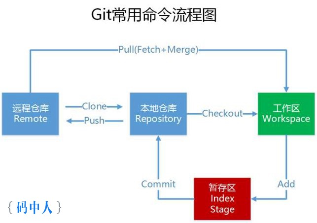 


**Ine simplest terms, `git pull` does a `git fetch` followed by a `git merge`.**

You can do a `git fetch` at any time to update your remote-tracking branches under `refs/remotes/<remote>/`.

This operation never changes any of your own local branches under `refs/heads`, and is safe to do without changing your working copy. I have even heard of people running `git fetch` periodically in a cron job in the background (although I wouldn't recommend doing this).

A `git pull` is what you would do to bring a local branch up-to-date with its remote version, while also updating your other remote-tracking branches.

From the Git documentation for [**git pull**](http://git-scm.com/docs/git-pull):

> In its default mode, `git pull` is shorthand for `git fetch` followed by `git merge FETCH_HEAD`.

1. [What is the difference between 'git pull' and 'git fetch'? --Stackoverflow](https://stackoverflow.com/questions/292357/what-is-the-difference-between-git-pull-and-git-fetch?rq=1)
2. [从程序员枪杀案谈git push -f](http://www.mzh.ren/git-push-force.html)

### 9.2 fatal: The current branch xxx has no upstream branch.

```
$ git push
fatal: The current branch Branch-20210221 has no upstream branch.
To push the current branch and set the remote as upstream, use

    git push --set-upstream origin Branch-20210221
```

原因： 当前分支主服务器（Github）没有上游分支，推送当前分支并将远程服务器设置为上游。

解决：

```
$ git push -set-upstream origin Branch-20210221
error: did you mean `--set-upstream` (with two dashes)?
```

可以看到Gituhub越来越智能，还会提醒我是不是少了一个dashe.

```
$ git push --set-upstream origin Branch-20210221
Enter passphrase for key '/c/Users/leewo/.ssh/id_rsa':
```

**以上命令也可以支持Tab自动补全**（比如我输入 git push --s + tab, 则客户端自动帮我补全--set-upstream）

### 9.3 Permission to xxx .git denied to VarianWrynn.

```vim
$ git push
Enter passphrase for key '/c/Users/lee.wang/.ssh/id_rsa':
ERROR: Permission to shimohq/chinese-programmer-wrong-pronunciation.git denied o VarianWrynn.
fatal: Could not read from remote repository.

Please make sure you have the correct access rights
and the repository exists.
```

背景： 我本地直接从Github上Clone一个别人的项目修改完直接push上去提示报错。

[In this case what](https://stackoverflow.com/questions/39147285/git-push-permission-denied-to-user-could-not-read-from-remote-repository) you can do is

1. Fork this project to your account;
2. Make your commits;
3. Push to your repository;
4. Submit a merge request to the original project;

This way you can continue your work on your forked repository or contribute to the original project (always good to return something good to the community).


###  9.4 remote origin already exists. （[git remote set-url](https://www.datree.io/resources/git-error-fatal-remote-origin-already-exists) 解决）

```
$ git remote add origin git@github.com:VarianWrynn/chinese-programmer-wrong-pronunciation.git
fatal: remote origin already exists.
```

通过阅读这篇《[Git error - Fatal: remote origin already exists and how to fix it](https://www.datree.io/resources/git-error-fatal-remote-origin-already-exists)》问题得到解决：

```
$ git remote set-url origin git@github.com:VarianWrynn/chinese-programmer-wrong-pronunciation.git
```

可以看到本地比远程的代码更新，Gitbash客户端提示需要Push

```
$ git status
On branch master
Your branch is ahead of 'origin/master' by 1 commit.
  (use "git push" to publish your local commits)

nothing to commit, working tree clean
```


```
$ git push
Enter passphrase for key '/c/Users/lee.wang/.ssh/id_rsa':
Enumerating objects: 5, done.
Counting objects: 100% (5/5), done.
Delta compression using up to 8 threads
Compressing objects: 100% (3/3), done.
Writing objects: 100% (3/3), 462 bytes | 231.00 KiB/s, done.
Total 3 (delta 1), reused 0 (delta 0), pack-reused 0
remote: Resolving deltas: 100% (1/1), completed with 1 local object.
To github.com:VarianWrynn/chinese-programmer-wrong-pronunciation.git
   4619dd7..0de20b4  master -> master
```


### 9.5 Github上图床不能显示的问题

在新建了一个WOW[中文对照](https://github.com/VarianWrynn/WOWEnglishName)的Markdown项目的时候，遇到图床一直展示不出来，不论怎么尝试重新上传都不行。 

在Google上检索了很久都没有结果（后来才知道国外基本不会遇到这种问题）。最后在中文世界找到了解决方法。


1. **C:\Windows\System32\drivers\etc\hosts 进入hosts**文件
2. 在hosts文件文件最后面加入如下代码：

```vbscript
# GitHub Start 
192.30.253.112    github.com 
192.30.253.119    gist.github.com
151.101.184.133    assets-cdn.github.com
151.101.184.133    raw.githubusercontent.com
151.101.184.133    gist.githubusercontent.com
151.101.184.133    cloud.githubusercontent.com
151.101.184.133    camo.githubusercontent.com
151.101.184.133    avatars0.githubusercontent.com
151.101.184.133    avatars1.githubusercontent.com
151.101.184.133    avatars2.githubusercontent.com
151.101.184.133    avatars3.githubusercontent.com
151.101.184.133    avatars4.githubusercontent.com
151.101.184.133    avatars5.githubusercontent.com
151.101.184.133    avatars6.githubusercontent.com
151.101.184.133    avatars7.githubusercontent.com
151.101.184.133    avatars8.githubusercontent.com
 
 # GitHub End
```


#### 为什么命名为etc？

早期UNIX中，贝尔实验室的解释是：`etcetra directory` 。 etc. 就是Et cetra。表示其他、等等什么的，英语里能常常看都这个缩写的。是用来放其他不能归类到其他目录中的内容。

后来FHS规定用来放配置文件，就解释为："**`Editable Text Configuration`**" 或者 "**`Extended Tool Chest`**"。


### 9.6 [How do I make a Git commit in the past?](https://stackoverflow.com/questions/3895453/how-do-i-make-a-git-commit-in-the-past)

```vbscript
git commit --date="10 day ago" -m "Your commit message" 
```

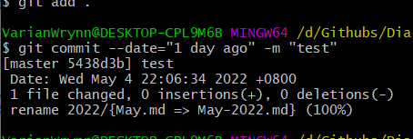 


```asciiarmor
git commit --date=1649504560 -m 'xxx'
```


甚至还提供了一个专门的工具地址：https://github.com/OBKoro1/autoCommit


## 10. 参考链接

1. [Github入门笔记-PartA](https://www.evernote.com/l/ALrece8X4B9MzIkmhiQfbxOcBBD3Zt-sM7U/)
2. [Github入门笔记-PartB](https://www.evernote.com/l/ALo59sgLmrdD_JgeV8NsMqJpISPYL_u72cY/)
3. 《Github入门与实践》
4. . [阮一峰：Git 使用规范流程](https://www.techug.com/post/git-use-process.html)
5. . [阮一峰：Git 使用规范流程](https://www.ruanyifeng.com/blog/2015/08/git-use-process.html)
6. . [如何撤销 Git 操作？- 阮一峰的博客](http://www.ruanyifeng.com/blog/2019/12/git-undo.html)
7. [Git 工作流程-阮一峰的博客](http://www.ruanyifeng.com/blog/2015/12/git-workflow.html)
8. [GitHub Actions 入门教程-阮一峰的博客](http://www.ruanyifeng.com/blog/2019/09/getting-started-with-github-actions.html)
9. [3.6 Git 分支 - 变基(rebase)](https://git-scm.com/book/zh/v2/Git-%E5%88%86%E6%94%AF-%E5%8F%98%E5%9F%BA)
10. [Git Basics - Recording Changes to the Repository -- git-scm](https://git-scm.com/book/en/v2/Git-Basics-Recording-Changes-to-the-Repository)
11. [Git 原理入门 -- 阮一峰的博客](http://www.ruanyifeng.com/blog/2018/10/git-internals.html)
12. [Understanding the GitHub flow -- Github Guides](https://guides.github.com/introduction/flow/)
13. [Getting Started with GitHub Pages -- Github Guides](https://guides.github.com/features/pages/)
14. [Things About Git and Github You Need to Know as Developer --Medium](https://medium.com/swlh/things-about-git-and-github-you-need-to-know-as-developer-907baa0bed79)
15. [改变世界的一次代码提交（Git 第一次提交的源代码分析及带来的启示）](https://hutusi.com/articles/the-greatest-git-commit)
16. [【精华】git remote set-url](https://www.datree.io/resources/git-error-fatal-remote-origin-already-exists)
17. [github中加入图片方法、以及解决图片不能正常显示的问题 --csdn](https://blog.csdn.net/qq_45700583/article/details/108814562)
18. [【最新】解决Github网页上图片显示失败的问题](https://blog.csdn.net/qq_38232598/article/details/91346392)


## 11. 文档修订记录

| 版本号 | 变化状态 | 简要说明                                                     | 日期       | 参与者        |
| :----- | :------- | :----------------------------------------------------------- | :--------- | :------------ |
| v0.1   | 建立     | 文档初建                                                     | 2020-3-1   | Lee           |
| v0.2   | 增加     | 新增`全局初始配置`章节                                       | 2020-3-3   | Lee           |
| v0.3   | 增加     | 增加`SSH Key设置`章节                                        | 2020-3-4   | Lee<br>邹小青 |
| v0.4   | 增加     | 增加`牛刀小试`章节                                           | 2020-3-12  | Lee           |
| v0.5   | 增加     | 增加`5.3 SSH可能并不校验邮箱`                                | 2020-3-12  | Lee           |
| v0.6   | 增加     | 新增描述`将本地仓库推送到远程仓库`的章节描述                 | 2020-3-15  | Lee           |
| v0.7   | 增加     | 添加参考链接                                                 | 2020-3-23  | Lee           |
| v0.8   | 修改     | 为了同步方便讲一篇文章拆分为两个部分                         | 2020-3-26  | Lee           |
| v0.9   | 增加     | 增加了`git clone`之后没有仓库的报错记录                      | 2020-3-30  | Lee           |
| v0.10  | 增加     | 添加了一些有趣有用的文章链接                                 | 2020-10-10 | Lee           |
| v1.0   | 增加     | 根据3月份记录的操作文档，重新操作了一次流程;<br>添加记录如何Clone git到指定目录 | 2020-12-14 | Lee           |
| v1.0   | 增加     | 新增描述如何尽可能多点亮页面的contributions                  | 2021-2-19  | Lee           |
| v1.1   | 增加     | 新增fatal: The current branch xxx has no upstream branch.    | 2021-2-21  | Lee           |
| v1.2   | 增加     | 调整文章结构，新增最近操作过程中遇到的问题记录               | 2021-3-21  | Lee           |
| v1.3   | 合并     | 把原先拆分的两篇文章合并成一篇，删除掉一些简单的问题         | 2022-7-6   | Lee           |

*变化状态：建立，修改，增加，删除