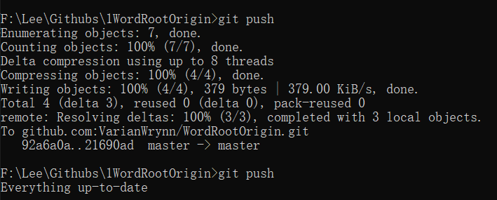
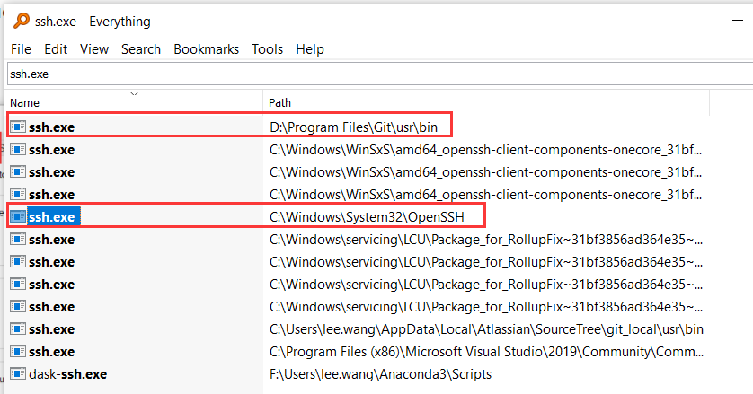
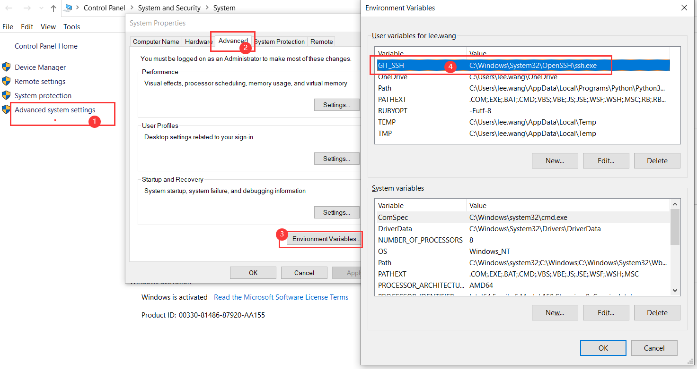
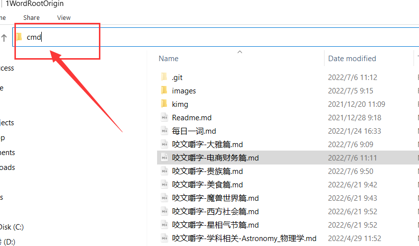
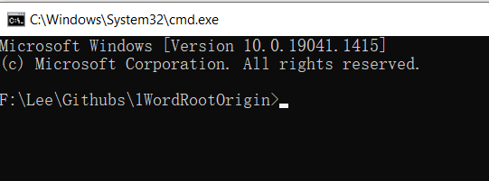

# Github在Win下提示Push

[toc]


## 1. Win下免密登录设置 


小结：

- 定时Push的前提需要Git能免密Push，否则需要每次都输入密码才能提交
- 如果想要免密可以一开始就不要设置passphrase口令
- 如果设置了需要免密在Windows下需要重新设置一系列配置
- 需要在**`cmd`**命令框里面操作，使用**git bash**无效


### 1.1 本地Git公私钥配置

根据[这篇](https://stackoverflow.com/questions/18683092/how-to-run-ssh-add-on-windows)文章描述，在Windows(10)下设置免密，需要提前安装好：

- git公私钥配置：Make sure your **`id_rsa`** file is in the folder `c:\users\yourusername\.ssh`


### 1.2 OpenSSH设置

免密Push背后的工作原理是通过**ssh-agent**代理来帮开发者记住密码，并且在每次提交Push的时候把密码提交给Github做验证。 

**ssh-agent** 是通过ssh.exe程序来加载运行的。Windows 10之前的操作系统需要额外安装软件来运行ssh.agent，如安装Git 软件。

2019年之后的Windows10，自带了OpenSSH。需要为此单独做一些配置，否则会和Git自带的SSH起[冲突](#1. Windows和Git的SSH冲突)。

> OpenSSH is available as part of Windows 10 which makes using SSH from cmd/powershell much easier in my opinion. It also doesn't rely on having git installed, unlike my previous solution.

1. Open **`Manage optional features`** from the start menu and make sure you have Open SSH Client in the list. If not, you should be able to add it.

2. Open **`Services`** from the start Menu

3. Scroll down to **`OpenSSH Authentication Agent`** > right click > properties

4. Change the Startup type from Disabled to any of the other 3 options. I have mine set to **`Automatic (Delayed Start)`**

5. Open cmd and type **`where ssh`** to confirm that the top listed path is in System32. Mine is installed at `C:\Windows\System32\OpenSSH\ssh.exe`. If it's not in the list you may need to close and reopen cmd.

   Once you've followed these steps, ssh-agent, ssh-add and all other ssh commands should now work from cmd. To start the agent you can simply type ssh-agent.

6. **Optional step/troubleshooting**: If you use git, you should set the **`GIT_SSH`** environment variable to the output of **`where ssh`** which you ran before (e.g `C:\Windows\System32\OpenSSH\ssh.exe`). 

   This is to stop inconsistencies between the version of ssh you're using (and your keys are added/generated with) and the version that git uses internally. This should prevent issues that are similar to this

**Some nice things about this solution:**

- You won't need to start the ssh-agent every time you restart your computer
- Identities that you've added (using ssh-add) will get automatically added after restarts. (It works for me, but you might possibly need a config file in your c:\Users\User\.ssh folder)
- You don't need git!
- You can register any rsa private key to the agent. The other solution will only pick up a key named `id_rsa`


### 1.3 ssh-add 添加

对**`SSH.exe`**设置完毕之后，就可以通过`ssh-add`命令添加秘钥信息。

[据说](https://superuser.com/questions/1010542/how-to-make-git-not-prompt-for-passphrase-for-ssh-key/1655228#1655228)在Windows下不能使用相对路径添加:

TDLR: For windows users,

- run `ssh-add "C:\\Users\\<your user>/.ssh/id_rsa"`
- not `ssh-add ~/.ssh/id_rsa`

```gas
C:\Windows\system32>ssh-add "c:\Users\lee.wang\.ssh\id_rsa"
Enter passphrase for c:\Users\lee.wang\.ssh\id_rsa:
Identity added: c:\Users\lee.wang\.ssh\id_rsa (youremail@domain.com)
```

 


### 1.4 常见问题


#### 1.4 1 Windows和Git的SSH冲突

 

**Optional step/troubleshooting**: If you use git, you should set the **`GIT_SSH`** environment variable to the output of **`where ssh`** which you ran before (e.g `C:\Windows\System32\OpenSSH\ssh.exe`). 

This is to stop inconsistencies between the version of ssh you're using (and your keys are added/generated with) and the version that git uses internally. This should prevent issues that are similar to this

**To set `GIT_SSH` permanently**



1. Open File Explorer. Start-> type 'File Explorer' and click on it in the list.
2. Right-click 'This PC' and click on 'Properties'.
3. Click on 'Advanced system settings'.
4. Click the 'Environment Variables...' button.
5. Under 'User variables for your_user_name' click New...
6. Set `Variable name:` field to GIT_SSH
7. Set the `Variable value:` field to path-to-ssh.exe (typically `C:\Windows\System32\OpenSSH\ssh.exe`).
8. Click OK to dismiss the New User Variable dialog.
9. Click OK to dismiss the Environment Variables dialog.
10. Retry the steps in **Try Git + SSH** above.


-------------

如果在git bash 内遇到：

> git ssh authentication fails with ssh_askpass: posix_spawn: Unknown error

说明就是遇到了ssh冲突，这时候要切回cmd做git操作

#### 1.4.2 cmd快捷切换到文件夹目录内

如果需要快捷切换到某个目录内，只要在当前目录栏直接输入**`cmd`**就可以直接打开一个命令栏，然后开始git相关操作

 


## 2. Win下定时提交

不像在Linux和Mac下的,[有很多插件可以做到自动监控Git目录下的文件变化](https://darencard.net/blog/2017-05-02-auto-git-file/)，当发现变化的时候可以自动 commit 和 push 到远程服务器, Google了很多文章，发现Windwos下似乎没有这样的插件，最多只能做到针对某个目录下所有的Git仓库做**定时**提交（通过Win自带的Task Scheduler)。

本章主要参(chao)考(xi)了 [Automate Git commands across repos using batch scripts and Windows Scheduler](https://bitbucket.org/blog/automate-git-commands-across-repos-using-batch-scripts-and-windows-scheduler)。


### 2.1 编写Batch脚本文件

在本机任意目录下新建一个txt文本框，输入如下内如，然后另存为.bat格式。

```gas
@echo off

for /f "tokens=2 delims==" %%a in ('wmic OS Get localdatetime /value') do set "dt=%%a"
set "YY=%dt:~2,2%" & set "YYYY=%dt:~0,4%" & set "MM=%dt:~4,2%" & set "DD=%dt:~6,2%"
set "HH=%dt:~8,2%" & set "Min=%dt:~10,2%" & set "Sec=%dt:~12,2%"

set "datestamp=%YYYY%%MM%%DD%" & set "timestamp=%HH%%Min%%Sec%"
set "fullstamp=%YYYY%-%MM%-%DD%_%HH%-%Min%-%Sec%"
echo datestamp: "%datestamp%"
echo timestamp: "%timestamp%"
echo fullstamp: "%fullstamp%"

echo "%fullstamp%" > F:\Lee\Githubs\logs.txt

echo %~dp0

for /d %%i in (%~dp0*) do (
    echo *************************************************************************
    
    echo "%%i"
    cd /D "%%i"
    
    echo ----------------------------------------- >> F:\Lee\Githubs\logs.txt
    echo %cd% >> F:\Lee\Githubs\logs.txt
    echo -----------------------------------------
    echo status
    git status
    git pull
    git add .
    git commit -m "autoCommit at %fullstamp%"
    git push 
    echo -----------------------------------------
    echo "%%i" >> F:\Lee\Githubs\logs.txt
    echo *************************************************************************
)

cd ..
```


### 如何在Batch下输出log

参考 [《How can I use a batch file to write to a text file?》](https://stackoverflow.com/questions/19878136/how-can-i-use-a-batch-file-to-write-to-a-text-file)

You can use [`echo`](http://technet.microsoft.com/en-us/library/cc772462(v=ws.10).aspx), and redirect the output to a text file (see notes below):

```gas
rem Saved in D:\Temp\WriteText.bat
@echo off
echo This is a test> test.txt
echo 123>> test.txt
echo 245.67>> test.txt
```

Output:

```gas
D:\Temp>WriteText

D:\Temp>type test.txt
This is a test
123
245.67

D:\Temp>
```

Notes:

- `@echo off` turns off printing of each command to the console
- Unless you give it a specific path name, redirection with `>` or `>>` will write to the current directory (the directory the code is being run in).
- The `echo This is a test > test.txt` uses one `>` to overwrite any file that already exists with new content.
- The remaining `echo` statements use two `>>` characters to append to the text file (add to), instead of overwriting it.
- The `type test.txt` simply types the file output to the command window.


## 3. Reference

1. [How to run ssh-add on windows?](https://stackoverflow.com/questions/18683092/how-to-run-ssh-add-on-windows)
1. [Why git can't remember my passphrase under Windows](https://stackoverflow.com/questions/370030/why-git-cant-remember-my-passphrase-under-windows)
1. [Automate Git commands across repos using batch scripts and Windows Scheduler](https://bitbucket.org/blog/automate-git-commands-across-repos-using-batch-scripts-and-windows-scheduler)
1. [How to make git not prompt for passphrase for ssh key?](https://superuser.com/questions/1010542/how-to-make-git-not-prompt-for-passphrase-for-ssh-key/1655228#1655228)
1. [SSH Key - Still asking for password and passphrase](https://stackoverflow.com/questions/21095054/ssh-key-still-asking-for-password-and-passphrase?page=1&tab=scoredesc#tab-top)
1. [Setting-up automatic Git pushing upon file change](https://darencard.net/blog/2017-05-02-auto-git-file/)