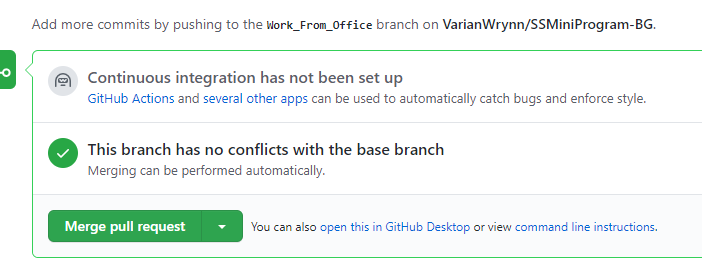

# Github入门笔记-PartE  Continuous integration
@(读书笔记组)[GitHub, GitHub 101, GitHub 漫游指南, Git工作流程, Github入门笔记]

[toc]

#### Continuous integration has not been set up

[GitHub Actions](https://github.com/features/actions) and [several other apps](https://github.com/marketplace/category/mobile-ci) can be used to automatically catch bugs and enforce style.

## 5. References & Connection
1. [聊聊 GitLab 的CI / CD 功能发展历程 --苏洋 ](https://soulteary.com/2021/02/23/talk-about-the-development-history-of-gitlab-cicd-function.html)

## 6. 文档修订记录

| 版本号|     变化状态|   简要说明|  日期	|   变更人/参与者   |
| :-------- | :--------| :------ |:------ |:------ |
| V1.0|   建立| 文档初建 |2021-3-8 | Lee|

*变化状态：建立，修改，增加，删除
