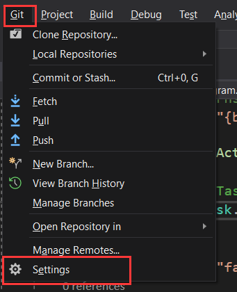
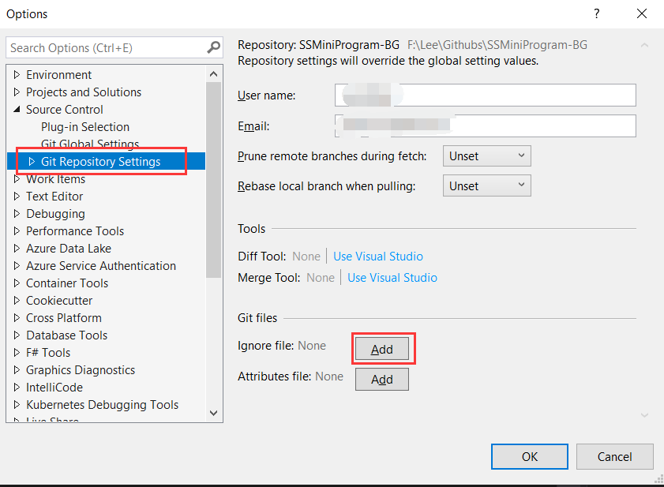
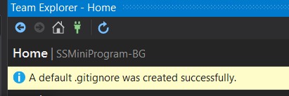
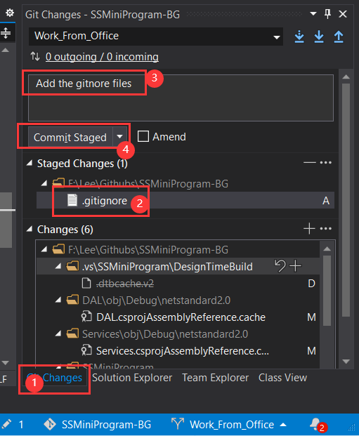

# Github入门笔记-PartF  Git Ignore的添加
@(读书笔记组)[GitHub, GitHub 101, GitHub 漫游指南, Git工作流程, Git Ig, Github入门笔记]


[toc]


* [Github入门笔记\-PartF  Git Ignore的添加](#github入门笔记-partf--git-ignore的添加)
  * [Git\-ignore in VS2019](#git-ignore-in-vs2019)
    * [Using Visual Studio to add a \.gitignore](#using-visual-studio-to-add-a-gitignore)
    * [Stop tracking files that should be ignored](#stop-tracking-files-that-should-be-ignored)
    * [Wrapping Up](#wrapping-up)
  * [\. References &amp; Connection](#-references--connection)
  * [\. 文档修订记录](#-文档修订记录)


## Git-ignore in VS2019

### Using Visual Studio to add a .gitignore

Open Visual Studio and the solution needing an ignore file. From the top menu select **Git > Settings.**




The above will open Visual Studio’s Options with Source Control > Git Global Settings selected. From the list on the left select **Git Repository Settings** and then click the **Add** button for **Ignore file**.




The above will add a .gitignore file with all the proper files ignored for a typical Visual Studio setup. 



Switch to the **Git Changes** window and enter a **commit message** and then click the **Commit Staged** button to commit the change to your current working branch.




### Stop tracking files that should be ignored

To stop tracking the files in the ignore file open a command prompt and navigate to the directory that contains **your solution file (.sln)** and run the following commands.


```vim
git rm -r --cached . 
git add .
git commit -am "Remove ignored files"
```

The Git commands above were pulled from [here](https://stackoverflow.com/a/19095988). There are other answers in that thread if the above doesn't work on your project for some reason.

### Wrapping Up

It is always simpler if you can **start a project with a Git ignore file in place**, but if for whatever reason that couldn't happen hopefully this post will get you going. 

If you aren't using the new Visual Studio Git experience then the [original version of this post](https://elanderson.net/2016/09/add-git-ignore-to-existing-visual-studio-project/) will be more helpful. Check out the Microsoft post for more details on the [new Git experience](https://devblogs.microsoft.com/visualstudio/exciting-new-updates-to-the-git-experience-in-visual-studio/).

## . References & Connection
1.  [Add Git Ignore to an existing Visual Studio Solution (New Git Experience)](https://elanderson.net/2020/10/add-git-ignore-to-an-existing-visual-studio-solution-new-git-experience/)
2.  [How to make Git “forget” about a file that was tracked but is now in .gitignore? --Stackoverflow](https://stackoverflow.com/questions/1274057/how-to-make-git-forget-about-a-file-that-was-tracked-but-is-now-in-gitignore/19095988#19095988)


## . 文档修订记录

| 版本号|     变化状态|   简要说明|  日期	|   变更人/参与者   |
| :-------- | :--------| :------ |:------ |:------ |
| V1.0|   建立| 文档初建 |2021-3-10 | Lee|

*变化状态：建立，修改，增加，删除
