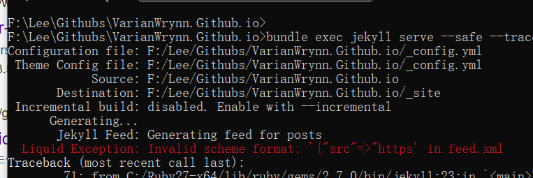

# Jekyll 安装经验教训


[toc]


于2021-8-3耗费了一个早上，在Windows上安装Jekyll无果，现在把整个过程记录下来，免得以后又瞎一次


## Ruby版本之坑

官方[这篇博客](https://jekyllrb.com/docs/installation/windows/)guide如何在Windows上安装Jekyll，里面提到了这么一句：

> We only cover RubyInstaller-2.4 and newer here.


然后按照其指示一步步安装，最后发现Ruby高于3.0版本的不支持（只支持>2.5,<3.0的版本)，又去[官网](https://rubyinstaller.org/downloads/)上面拉去了一个2.7版本的。


## 本地无法预览？


```ruby
bundle exec jekyll serve
```


## _[config.yml](https://www.jekyll.com.cn/docs/step-by-step/10-deployment/) 配置

To use these first you need to add them to your `Gemfile`. If you put them in a `jekyll_plugins` group they’ll automatically be required into Jekyll:

```ruby
source 'https://rubygems.org'

gem 'jekyll'

group :jekyll_plugins do
  gem 'jekyll-sitemap'
  gem 'jekyll-feed'
  gem 'jekyll-seo-tag'
end
```

Then add these lines to your `_config.yml`:

```ruby
plugins:
  - jekyll-feed
  - jekyll-sitemap
  - jekyll-seo-tag
```

Now install them by running a `bundle update`.


## jekyll-theme-chirpy-master

自从下载了这插件，引发了下面一大堆的问题，悲剧


##  Unknown tag 'seo' in


打开**Gemfile** 文件：

```ruby
source "https://rubygems.org"

gem 'jekyll'

group :jekyll_plugins do
 gem 'jekyll-sitemap'
 gem 'jekyll-feed'
 gem 'jekyll-seo-tag'
end
```


然后再打开Ruby命令行输入：

```ruby
bundle update

bundle exec jekyll serve --safe --trace
```


> 因为Github Pages上是以saft mode运行的，所以在这里调试也应该加上 -- safe参数。否则会出现本地运行bundle exec命令没有问题，但是在Githubs上无法运行。


## Invalid scheme format in feed.xml(没找到解决办法)



## References & Connection

1. [如何在 GitHub 上写博客？--知乎](https://www.zhihu.com/question/20962496)
2. [Jekyll on Windows](https://jekyllrb.com/docs/installation/windows/)
3. [Ruby官方下载地址](https://rubyinstaller.org/downloads/)
4. [Step by Step Tutorial--10. Deployment](https://www.jekyll.com.cn/docs/step-by-step/10-deployment/)

