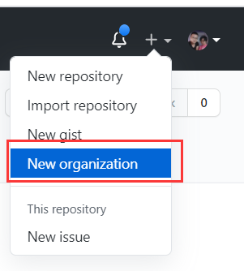

# Github入门笔记-PartX-III Gitflow工作流思想
@(读书笔记组)[GitHub, GitHub 101, GitHub 漫游指南, Git工作流程, Github入门笔记]

[toc]


## 1. Overview

阅读了阮一峰这篇[博客](http://www.ruanyifeng.com/blog/2015/12/git-workflow.html)，才知道工作流有分为三种，每种都有其适用场景：

- Git flow
- Github flow
- Gitlab flow

本文重点描述的是第一种 Git flow;

> 从描述上看，百美采用的是Gitlab flow。

**Gitlab flow**:

对于"持续发布"的项目，它建议在`master`分支以外，再建立不同的环境分支。比如，"开发环境"的分支是`master`，"预发环境"的分支是`pre-production`，"生产环境"的分支是`production`。

开发分支是预发分支的"上游"，预发分支又是生产分支的"上游"。代码的变化，必须由"上游"向"下游"发展。比如，生产环境出现了bug，这时就要新建一个功能分支，先把它合并到`master`，确认没有问题，再`cherry-pick`到`pre-production`，这一步也没有问题，才进入`production`。

只有紧急情况，才允许跳过上游，直接合并到下游分支。

## 2. master分支


- master分支存放的公司生产环境正在运行的代码；
- dev分支存放的是开发的代码；
- 每一个人都有自己的分支，在自己的分支上做代码开发，该分支从dev上拉取


## 3. Dev分支

### 3.1 Code Review

- 当个人的在自己的分支上开发完毕，就可以申请合并到Dev分支
- 合并前需要进行代码Review,通常是由开发组长来做
- 开发组长检查通过则合并到Dev，不通过则继续让成员在分支上开发直至通过；

## 4. 预发布分支


- dev过后，还需要提交的预发布环境，交给测试团队/用户进行测试
- 预发布测测试通过之后，才可以合并到master
- 如果测试出现bug，这在预发布上直接拉分支进行测试修复
- 修复之后记得必须再往dev上合并，否则其他人拉去分支还是会有bug；
> 这2点跟我目前做法不一样，目前做法是如果遇到Bug,则在原来开发分支上修复，然后再次合并到dev和预发布；

- 上线之后可以删除本地的开发分支了；

## 5. 最终的Gitflow图


- B功能开发完毕，也跟A功能一样，经过Code Review,然后并入dev、release最后合到master;
- 有些公司可能不做**Code Review**
- 也有些公司可能是在dev上直接做测试、修复，然后推到master，没有测试分支；


## 6. Bug紧急修复


- 线上出现Bug且很紧急，这直接在master上拉出一个分支(hotfix);
- 修复之后合并到master
- 之后再把master合并回dev;
- 其他成员还是从dev拉取分支照常开发；


## 7. 在Github上邀请其他开发者


- 在push完第一个版本作为master分支之后，你必须在Github上

## 8. 【精】在公司（组织）内的协同开发

前面说的那种协同开发，适合个人邀请开发者。但是在公司内部通常不是这样直接简单邀请。通常在公司是以**组织的形式**去协同开发的。

- 一个[组织](https://github.com/organizations/plan)可以创建N个项目（仓库）
- 每个项目可以拥有N个成员
- 每个成员也可以归属在（一个组织下的）N个项目
- 可以对每个仓库赋予每个成员不同（比如读、写）的权限

### 8.1 如何创建组织




组织按照公司的发展阶段进行不同的收费，这里选择Free:


这个验证码....


验证过后，就成功创建了组织**FzuhouShiningSatrs**:

这里如果一开始尚未有成员，这可以不填写，直接点击**Complete setup**


然后Github会做一些问卷调查，可以选择忽略直接跳过


到现在组织创建完毕，可以在该组织下面点击【Create a new repository】创建仓库了


成功对组织下创建一个新的仓库


- 最大的不同是，个人的创建的项目是直接创建
- 而[现在](https://github.com/FuzhouShiningStars/WechatMiniProgram)创建项目是在这个组织下面创建的项目
- 公司会有很多不同的项目，这些项目都可以放在这个组织下
- 这样子就可以非常方便的对项目-成员-权限 进行管理

## 9. 使用Tag对版本进行管理

在组织下创建新的仓库之后，则可以在本地创建一个项目推送到远程作为main主干了：

```
cd D:
cd Lee/Lee/Githubs/Org/
git init
git remote add origin git@github.com:FuzhouShiningStars/WechatMiniProgram.git
$ git push -u origin main
```

然后新增readme.txt再

```
git add .
git commit -m 
git push -u origin master
```

注意，这一步一定要做，否则直接空文件夹进行`git push -u origin master`会[报错](https://stackoverflow.com/questions/21264738/error-src-refspec-master-does-not-match-any)：

```
$ git push -u origin master
error: src refspec master does not match any
error: failed to push some refs to 'github.com:FuzhouShiningStars/WechatMiniProgram.git'
```

### 9.1 git add 
完成以前步骤之后，就需要引入Tag进行版本管理。

由于git commit提交的版本号都是hash值的，因此不好管理，而市面上一般看到的版本还是v1、v2这样的形式进行版本管理。这就是使用Tag进行的版本管理。

git tag -a v1 -m "第一版"
 - 参数a是添加版本意思
 - m对当前添加的版本进行描述
 - tag是当前最后提交的commit上（默认）

所以这时候使用`git log`命令可以看到当前的commit带有一个v1的tag


### 9.2 把tag提交到远程分支

```
git push origin --tags
```


这时候再到Github上可以看到已经添加了一个Tag标签页，并且版本是v1,且点击可以进入查看代码详情：


## 11.  References & Connection

1. [Git 工作流程](http://www.ruanyifeng.com/blog/2015/12/git-workflow.html)
2. [Introduction to GitLab Flow](https://docs.gitlab.com/ee/topics/gitlab_flow.html)
3. [7小时学会Git 基础全套完整教程（从入门到精通）---Bilibili --第22、23讲](https://www.bilibili.com/video/BV1tf4y1e7yt?p=23&spm_id_from=pageDriver)


