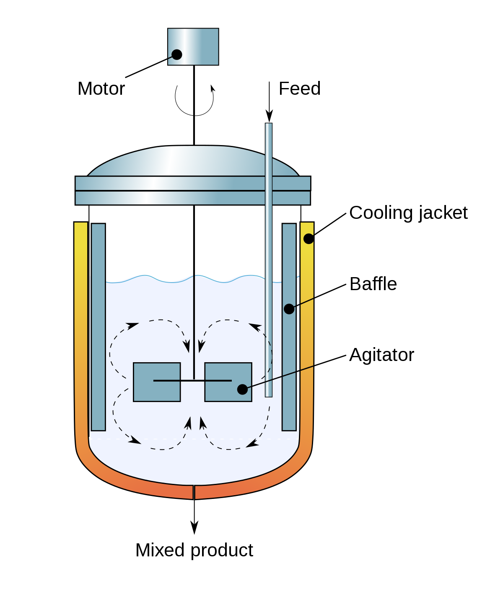

# Why (Enterprise) Software Is Bloated

[toc]

by [Alex Meyer](mailto:admin@mailbox.my)

Jan 21, 2022 · 9 min read

 

企业内部软件通常非常臃肿，原因是团队之间很难共享代码。企业是自上而下管理的，每个团队的经理管不到其他团队，这造成团队之间的沟通非常难。

如果你将某个功能委托给内部的另一个团队，会带来大量的沟通和计划成本，并使你的开发计划依赖于别人，所以还不如自己动手，这导致了代码臃肿。

-- [《为什么企业软件如此臃肿》](https://www.mailbox.my/blog/posts/why-enterprise-software-is-bloated/)

## Background

People are often baffled why enterprise software is slow, uses lots of memory, and is generally a pain to work with. Before starting [mailbox.my](https://www.mailbox.my/), I did work at a large enterprise software company, so I hope to offer some insights with this post. Most of this actually applies to software in general.

## What is Software Bloat?

Bloated software uses much more resources than necessary to do its job, the most important resources being CPU time, memory, I/O, and disk space. Furthermore, software with lots of features can also be called bloated since it is harder to learn and use, and naturally requires more resources than software with only the desired features would.

## Why is Software Bloat an Issue?

Bloated software often is the reason you become frustrated with your computer. It slows down your daily work, drains the battery of your laptop, or even forces you to buy a more powerful machine. High CPU usage directly leads to increased energy consumption: Normally the processor in your computer is able [to go to sleep when idle](https://en.wikipedia.org/wiki/Advanced_Configuration_and_Power_Interface#Processor_states), saving energy. An inefficient algorithm that runs twice as long will consume nearly twice as much power. The same is true for other hardware in your computer. Besides, the obsolescence of hardware caused by resource-hungry software leads to electronic waste.

## Reasons for Software Bloat

### Organizational Reasons

#### Easier to Build Your Own Than to Share

Software development in the industry often happens in teams working on distinct functionality. While the developers of one team often share an office, or at least a time zone, each team may reside on a different continent. Therefore communication between teams is much harder then within the team. Software organizations are also mostly top-down: Each team has a manager that controls what the team is working on. All these traits hinder software reuse or sharing of code. In many cases it is easier to develop functionality that could be shared among teams on your own. Delegating it to another team would come with significant communication/planning overhead, and would make your development schedule dependent on that team. So you roll your own. But this way the code base grows more than necessary, and in most cases so do the resource requirements (since more code is written, this also leads to more bugs, although integration bugs when sharing functionality would have to be accounted for).

### Business Reasons

#### Go to Market

For most products it is critical to release them quickly in order to capture market share or be seen as an innovator. Often this trumps most other concerns, even features or quality. This can lead to inefficient software since developers and architects will take all kinds of shortcuts, like gluing together existing systems, using simple algorithms or suboptimal representations of data in memory, and not optimizing bottlenecks.

An example of this: Many applications nowadays have to be multi-platform - they have to run on desktop operating systems like macOS and Windows, as an app on iOS/iPadOS and Android, and on the Internet. Only large companies can afford to have one dedicated team per platform. So the popular alternative are frameworks targeting multiple platforms with one code base, like [Electron](https://en.wikipedia.org/wiki/Electron_(software_framework)) (used by [VS Code](https://www.git-tower.com/blog/developing-for-the-desktop-vscode/)) or [Progressive Web Apps](https://en.wikipedia.org/wiki/Progressive_web_application) (used by [Pinterest](https://medium.com/dev-channel/a-pinterest-progressive-web-app-performance-case-study-3bd6ed2e6154) and [Twitter](https://blog.twitter.com/engineering/en_us/topics/open-source/2017/how-we-built-twitter-lite)). These frameworks are heavy-weight and need a full browser and JavaScript engine to run, which already take up a considerable amount of resources.

#### Acquisitions

As businesses get acquired, software gets integrated and bundled. Usually only the minimal amount of work will be done to get an integration to work, skipping the refactoring or code changes to internal data structures or algorithms, so the “new” product will be the sum of its parts also from a resource consumption point of view. Apart from the refactoring costs themselves and go-to-market time pressure, there may be users of the individual pieces of software that would be affected negatively by the refactoring. But with a glued-together system, everyone suffers from high resource consumption due to things like data format conversion, duplication or reprocessing of data, and higher latency.

#### Maintenance Contracts

Often there are customers still depending on old functionality that could otherwise be removed. That dependence is often set in stone in the form of contracts, which in most companies is a definite no-no for any changes.

#### Diverse Customer Base

A product serving a lot of customers, or a market where only a subset of users need each of the features, will often accrue many features over its lifetime. These have an effect at least on disk space, which is not that critical, but also lead to overhead when working with the software. As the code base gets large, bugs will creep in and become harder to fix. Developers become more reluctant to do refactoring since the cost/benefit gets worse, or the cost is so prohibitive that management will not allot time. Features will also require more general data structures and abstractions, increasing resource consumption.

#### Partner Integrations

Integrating your software with other companies' software can be a great thing: You gain more features, and both sides will probably benefit by gaining users and sales. Unfortunately this also leads to more code, more abstractions, data conversions and so on, furthering bloat. From a technical point of view this is comparable to “Acquisitions” above.

### Software Development Reasons

#### Higher-Level Languages

Programming languages and frameworks for a project are mostly chosen based on these factors:

- Availability of engineers
- Possible development velocity
- Ease of integration with other systems
- Ease of writing extensions

For many kinds of software, the runtime efficiency of the code produced seldom factors into that decision. Languages which score high on the above criteria are:

- **JavaScript/Web Stack** Being the only language that allowed portable client-side coding on the Internet has made JavaScript extremely popular, even taking over the server. Although it is an interpreted language, extensive optimizations and [research on JITs](https://hacks.mozilla.org/2017/02/a-crash-course-in-just-in-time-jit-compilers/) have made it acceptably fast. But memory requirements are [still quite high](https://benchmarksgame-team.pages.debian.net/benchmarksgame/fastest/node-gpp.html).
- **Python** It’s a great language to Quickly Get Things Done, but is [quite slow and relatively memory hungry](https://benchmarksgame-team.pages.debian.net/benchmarksgame/fastest/gpp-python3.html).

In contrast, languages like Rust or C++ often produce pretty efficient software, but at a markedly slower development velocity, and fewer engineers available that can produce quality software.

Of course the language is just one factor, and it is possible to write bloated software in any language.

#### Complexity and Abstractions

[Donald Knuth](https://en.wikipedia.org/wiki/Donald_Knuth) famously said:

> “Premature optimization is the root of all evil.”

I prefer considering *complexity* as the root of all evil: Premature optimization introduces more complexity, so that is covered. But complexity also touches other issues:

- All the technical standards the software has to adhere to ([web browsers being the prime example](https://en.wikipedia.org/wiki/Comparison_of_web_browsers#HTML5_support))
- The amount of features available
- Over-engineered software built to flexibly support possible future enhancements

Complexity often, but not always, leads to software bloat. For example, adding a second algorithm so that a special case can run an order of magnitude faster will increase complexity and disk footprint, but lower CPU consumption and the memory integral, and likely be a net bloat reduction..

#### No Time for Better Code

In a lot of companies, feature development trumps optimizing, refactoring or removal of legacy code. In many cases this makes business sense, as customers do not care as much about hardware requirements as they do about features. However, with many workloads shifting to the cloud, this does not apply as much anymore, since the cloud provider offering a database solution bears the costs of operating it, having a vested interest in running non-bloated software.

#### Logging

Enterprise software in particular needs to be easily supportable. It might run on a customers' locked-down server and you can only get log files for analyzing bugs. As a result, such software tends to have lots of logging code that can be activated to gain insight into the system. In the best case, the bloat will only affect the size of the binary and not memory consumption and runtime performance.

#### Error Handling

Enterprise software must be much more robust in the face of errors. Imagine a database server that keeps running for months and must not crash or leak memory: It must be able to handle all kinds of out-of-memory situations or malfunctions properly. Such resilient software can be extremely bloated due to the amount of code needed to handle all corner cases. Similar to logging, good coding practices can reduce the impact this has on runtime and memory consumption.

#### Accessibility and Legal Requirements

Enterprise software has to fulfill all kinds of legal requirements, the most important with regards to this discussion being [accessibility](https://en.wikipedia.org/wiki/Web_accessibility#Web_accessibility_legislation). This is a must-have feature and leads to more code, and usually higher resource consumption. Open-source projects often avoid dealing with these requirements.

## What Now?

Don’t like using bloated software? Luckily, there are often [great alternatives available](https://alternativeto.net/).

Don’t like developing bloated software? There are certain pockets in the industry that do not either:

- **Cloud Service Backends** The profit of the service provider is directly tied to the footprint of the service, so there is a vested interest to keep it low. Since many people worldwide are using a given service, even small optimizations can increase profits considerably. In addition, in a cloud scenario it is easy to profile and analyze workloads, making it straightforward to pick the most rewarding optimizations.
- **Mobile Devices** For these, battery life is paramount, so CPU usage needs to be minimized.
- **Embedded Systems** These are either so small that the hardware can’t be very powerful, or they are manufactured at such a large volume that it makes economic sense to build optimized software, and less powerful hardware, increasing profits.

## Conclusion

In the end, many causes for software bloat boil down to business reasons. In a perfect world where software development is free and does not need any time, everyone would ship optimal software. Since that is obviously not the case, companies have to make trade-offs. Actually it is very hard to make the correct trade-off, and one that is correct in the short term can be detrimental in the long run. For example, quickly shipping bloated software may allow to capture relevant market share, but lead to lots of quality issues as customers start using the product. However, shipping late may have impeded any adoption. So most companies will prioritize shipping early, and shipping new features, over fixing bloat. Open-source projects by enthusiasts who are not bound by such constraints often provide great alternatives to enterprise offerings.

## Reference

1. [科技爱好者周刊（第 206 期）：如何走出失望和怀疑](https://www.ruanyifeng.com/blog/2022/05/weekly-issue-206.html)
2. [Why (Enterprise) Software Is Bloated--Alex Meyer](https://www.mailbox.my/blog/posts/why-enterprise-software-is-bloated/)

## 单词

| 单词                      | 解释                                                         |
| ------------------------- | ------------------------------------------------------------ |
| **bloat** 【bloʊt】  | vt. 膨胀, 肿起, 鼓起; 腌熏（鲱鱼） n. （牛羊）胃气胀 1 - 词源同 ball,球，鼓起来的。  n. 1 . an excessive amount , or an excessive increase in something  2 . a disease affecting cattle and sheep , characterized by excessive gas in the main stomach compartment  v. 1 . to become swollen or inflated , or make something do this  2 . to increase excessively , or make something do this  3 . to become or cause to become unpleasantly proud or conceited |
| **baffle** 【ˈbæfl】 | vt. 困惑, 为难, 使挫折 vi. 徒作挣扎 n. 迷惑, 挡板  推荐：谐音"拜佛" . &nbsp;助记法:(受挫)和(困惑)的时候就去拜佛 , 让佛来开导你、启导你、帮助你。  词源说明(童理民)   1 - 拟声词。 |
| top-down                  | In a **top-down** organization, all the important [decisions](https://www.collinsdictionary.com/zh/dictionary/english/decision) are made by the most [senior](https://www.collinsdictionary.com/zh/dictionary/english/senior) people in the organization. |

