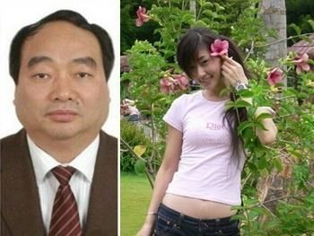
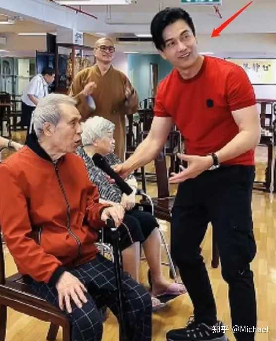
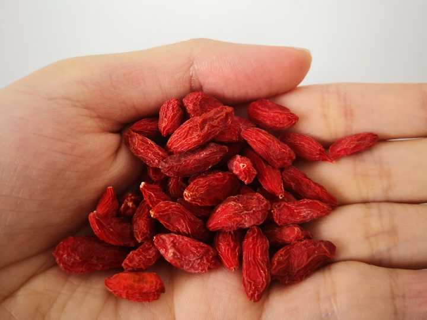

# 你们坚持了五年以上的习惯是什么？

[toc]

> 作者：Michael
> 链接：https://www.zhihu.com/question/439042496/answer/2222218455
> 来源：知乎
> 著作权归作者所有。商业转载请联系作者获得授权，非商业转载请注明出处。

## 1. 运动

这玩意短期看不出效果，年轻的时候也看不出效果，年轻的肉体谁都好看，拉不开差距。

当你老的时候，长期运动和不运动才拉开差距，明显不一样，非常明显，视觉上看可以差10-20岁。

毕业10年的时候，有些人的外貌和大学时大变样，有的人还是10年前的样子。毕业20年再聚会，一些人看起来像另一些人的爹妈。各位应该都有体会吧？

一个小姑娘天天宅的话，20岁的时候可能还会有软妹子的甜美感，但一旦过了30岁就坏了，胶原蛋白丢失，出现各种松弛和下垂，脸皮下垂，眼角下垂，嘴角下垂，下巴下垂，乳房松弛下垂，屁股下垂，头发开始花白，眼神颓废。阴道松弛，下垂。我判断女人的岁数就是看眼皮下垂程度。

40岁以后，月经逐步减少，最后完全停止。头发全白。

据说现在有种护脸霜，可以让皮肤紧致不下垂。但应该没效果，女星还是靠动刀子，把下垂的皮肤割掉。

男人30岁以后，身体就开始**不行**，勃起变差，头发开始谢顶。到40岁，一半以上的男人完全阳痿。胶原蛋白丢失，这时候的男人要么有脂肪肥胖，要么干瘦，弓着背。眼神涣散颓废。

中年男嫖娼，**心理快感>生理快感，**其实早硬不起来了。当年重庆那领导被录像，只坚持了12秒，网友都觉得他亏了。

**运动不能阻止衰老，但可以延缓衰老**。当你运动的时候，肌肉加强-皮肤不会松弛，心脏加强-心肺功能更好，荷尔蒙在分泌-更年轻，心态也不一样-更积极。精力充沛，皮肤紧绷，神采奕奕。

 

68岁的[吕良伟](https://www.zhihu.com/search?q=吕良伟&search_source=Entity&hybrid_search_source=Entity&hybrid_search_extra={"sourceType"%3A"answer"%2C"sourceId"%3A2222218455})在敬老院看望63岁的老人。

有人不服，那我就再发一个。

 

钟南山是1936年的，今年86岁。

[吴孟达](https://www.zhihu.com/search?q=吴孟达&search_source=Entity&hybrid_search_source=Entity&hybrid_search_extra={"sourceType"%3A"answer"%2C"sourceId"%3A2222218455})1952年的，69岁。

我希望我86岁的时候也有钟南山这个劲头。

很多人抱怨，没有时间。假如真的因为工作因为家庭没时间，倒也没什么。但**假如您是窝家里打游戏呢？**

 

## 2. 学习外语

**外语是终生学习**，和运动一样，短期看不出效果。我见过很多做外贸的，做10-20年，天天跟外国人打交道，外语水平仍然不高，还是吃大学留下的吃老本，连句整话都说不清楚。假如你坚持10年的学习，有目的的学习，会远超同龄人。

绝大部分人不会再学了，一直在吃老本。没有动力。

## 3. 戒烟

很多年轻人觉得抽烟很酷，很社会，但这是透支身体，会让你老得更快。长期的烟熏，身体内部的烟熏，不仅看起来颓废，身体还散发着一股臭味。你自己闻不到，你已经习惯了，旁人可以闻到，真的很臭。不要迷信[玛丽苏](https://www.zhihu.com/search?q=玛丽苏&search_source=Entity&hybrid_search_source=Entity&hybrid_search_extra={"sourceType"%3A"answer"%2C"sourceId"%3A2222218455})小说里的“淡淡的烟草香”。不仅身体散发臭味，还口臭。

皮肤白里透红的人绝不是抽烟的人。

还是那句话，**年轻的时候拉不开差距，过30，40岁再看。**

## 4. 写东西

不是看书。很多人都建议多读书，但这只是第一步，看书如同看电视，很多人其实看了就看了，当时爽一下而已，跟看抖音没什么区别。

**只有当你开始输出的时候你才开始有变化**。尤其是[系统性](https://www.zhihu.com/search?q=系统性&search_source=Entity&hybrid_search_source=Entity&hybrid_search_extra={"sourceType"%3A"answer"%2C"sourceId"%3A2222218455})的写东西的时候，你就开始主动找东西了。

假如没有输出，漫无目的看，你看书跟看电视看抖音没有区别，都只是消遣。

## 5. 知道自己的目标

这个我也没做到，很多时候是被别人牵着走，拉不下脸来，狠不下心来。

## 如何从底层杀出？

花3-5年苦练一门外语。 口语说到接近 **native speaker** (母语) 水平。前往相应国家工作/生活。

我在北美这些年观察到，即使是很多已经来这边5年甚至10年的留学生/新移民， 英语口语**差到离谱**的也大有人在。 

而之前数据表明， 只有大概一亿中国人有出国的经验，约占总人口8%， 去过欧美等发达国家的不足**2%。**再除去短期旅游的估计有**1%**就不错了。 如果一个底层的人能够做到把任何一门外语口语说到接近完美，那么至少也是所有中国人里的前**0.1%**了。结合中国在世界经济/外贸的头部地位， 在完美掌握中文和另一门语言的情况下海外就业不会是难事。

实在想不出有什么**更便宜/门槛更低**的杀出底层的办法了。 只要花时间/毅力全身心投入， 熟练掌握一门外语口语是不难的。

作者：Leon
链接：https://www.zhihu.com/question/487990120/answer/2329424073
来源：知乎
著作权归作者所有。商业转载请联系作者获得授权，非商业转载请注明出处。