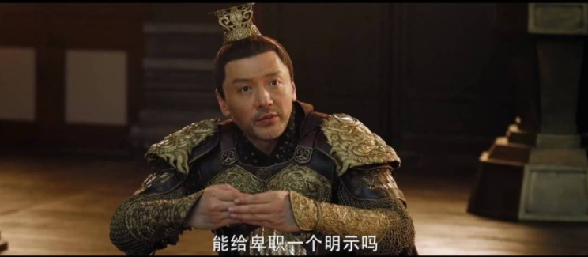
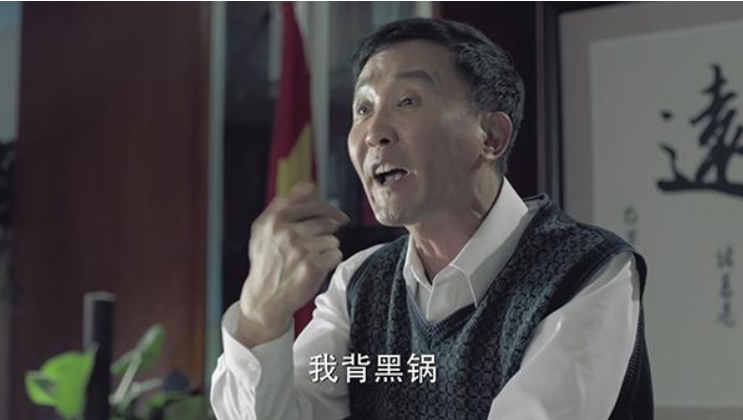
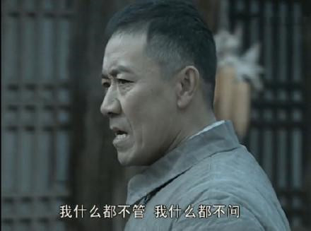
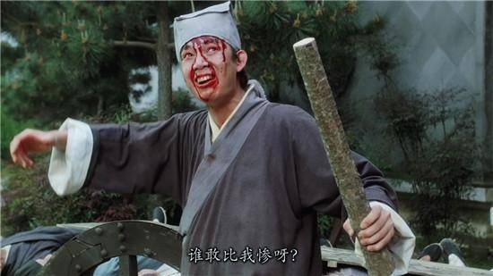
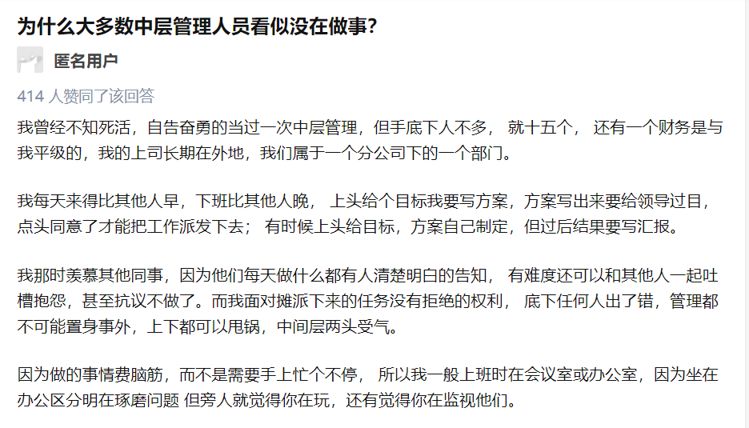
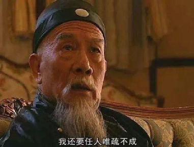
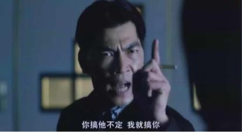
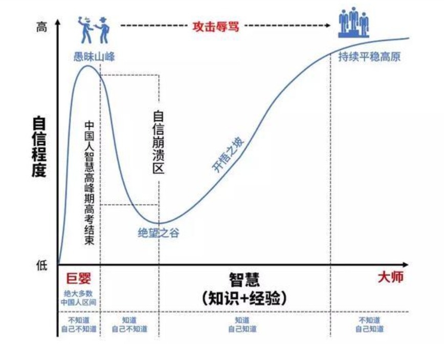
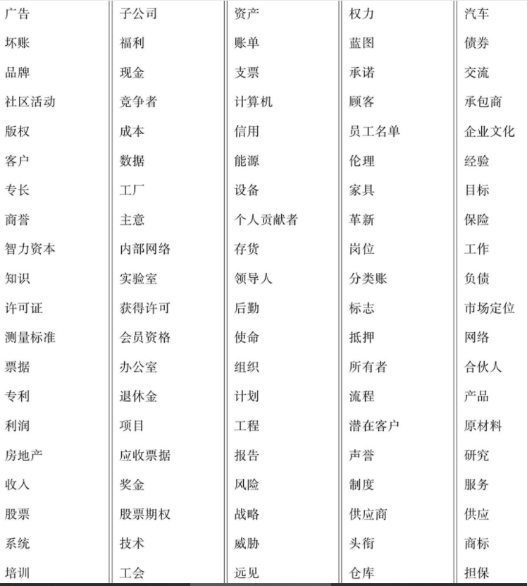

# 王兴以后怎么管10万人？

@(宁向东的清华管理学课程)[硅谷与领导力, 华裔CEO,领导力四境界,领导者思维,王兴,美团,领导梯队]

[toc]

## 1. 王兴与马云

2011年3月，小有名气的青年企业家王兴从“千团大战”的紧张和激烈中抽身，来到了春意渐浓的杭州，前往阿里总部商谈投资事宜。见到马云后，王上来就问了一个问题：“马先生，你觉得你最强的地方是什么？”马云一向以好为人师著称，但这次他反问王兴：“你觉得是什么呢？”“我觉得是战略和忽悠”，马云一听乐了，纠正道“其实我最强的是管理”。王兴愣了愣说，我相信。

后来，从阿里拿到投资的王兴从上千家团购网站中脱颖而出，只不过长成巨头的美团，早已跟阿里反目成仇，投入了腾讯的怀抱。“千团大战”可以看做是王兴的“绝地反杀”，有了美团的今天，而王兴在这场大战中的战略能力也广受推崇，网上写王兴如何提高认知、如何思考问题的文章不胜枚举，隔段时间就会拿出来说一说。

如果把商业大佬普遍会讲故事、擅长感召的能力总结为“忽悠”，那王兴也兼具了“战略”和“忽悠”。然而，大多数人忽略的是，能让战略落地成为攻城略地的强大武器，能让“忽悠”凝聚人心，不致于成为江湖骗子似口号的，恰恰就是管理。

**王兴的最牛之处就在于他对“领导梯队”的极度重视，这是企业管理中的第一性原理。**

这一点让他的竞争对手感叹：“我不认为他的战略非常强，美团网强在每条业务线上各司其职的人非常优秀。”曾投资过美团的对手拉手网的金沙江创投合伙人朱啸虎也表达过类似观点。

前段时间，有消息说，美团要在今年新招6万人，也就是说员工人数将突增到10万人，成为继字节跳动后，员工人数短期内达到这个规模的互联网公司。美团的管理大考即将来临，10万员工的公司怎么管？

恐怕王兴还是会**把建设领导梯队作为管理核心。**本来10万人就像是“满头乱发”，一把下去并不好抓，通过梯队建设培养起足够多领导人才，像是乱发编成了一串串小辫，就好抓了。

而对于每个员工来说，领导梯队是职场菜鸟和老鸟管理能力进阶的路线图。

## 2. 人才培养的“第一性原理”

### 2.1 领导梯队

从一件事可以看出王兴对领导梯队的极力推崇：

他给美团管理层都送了一本拉姆·查兰的《领导梯队》，有时大家开会遇到不知道该怎么处理的问题，王兴可能就说，我们可以用《领导梯队》第三章第二节关于某某问题的解决方法来解决。

此外，在美团内部沟通会上，王兴也多次推荐这本书。美团去年还推出了一个“领导梯队计划”，以此推动人才盘点、轮岗锻炼、继任计划等，并将其视为未来十年培养“雄兵良将”的重要抓手。

在领导梯队的建设方面，作为新兴互联网巨头的美团还算是后来者，阿里、腾讯、华为、通用电气、花旗银行、万豪等早已建设的相对成熟了。

这种被王兴看作是企业人才培养“第一性原理”的领导梯队到底是什么呢？

我们常说，成功的企业要在各个领导阶层都拥有出色的领导者，也常常强调“领导力”，长期以来写领导力的文章也铺天盖地，可怎么才算有领导力，领导力该怎么培养，却很难说得清。

究其原因，“领导力”是个很相当模糊的词，每个人对其理解及感知都不同，而且，每个职位所需的领导力也大相径庭。

比如，如果要求部门主管的领导力跟CEO拉平，那不仅不现实，公司也缺了有力的执行者，反之，CEO如果只有主管的领导力，相当于县长直接治国，也不会有什么宏图伟业。

所以，企业整体领导力的培养是个细致活儿，需要有一份系统性的进阶路线图，让职场管理菜鸟和老鸟都知道在自己的位置该怎么自我要求、怎么要求下属、怎么处理分内之事及怎么培养组内接替者，甚至细致到让每个普通员工知道达到什么标准才能进阶为初级管理者。

领导梯队建设就是这张路线图。

**如果不建领导梯队，在人才提拔上就有点凭感觉了。**

### 2.2 人岗错位与领导梯队的建设

现在很多企业一是喜欢“拔苗助长”，常常“士兵当做排长用，排长当做连长用，连长当做团长用”；二是“临时抱佛脚”，某个管理岗位出现空缺时，草草提拔一个没有相关经验的，甚至从外部空降一个，结果“水土不服”；三是只重视业务能力，而不顾带队伍的能力。有的员工作为“独狼”时业绩突出，但不一定有能力或者有兴趣从事管理岗位，盲目提拔让企业少了一名“明星”员工，多了一名平庸的管理者。

这一系列错误的提拔，导致的后果就是让很多管理者面临新职位时无从下手，对下属的要求也传达不清楚，只会给员工设定目标，让他们尽力而为，熬夜也要做出来，或者指责下属“怎么老是出错”“怎么还搞不清楚”......需要学习什么、什么样的结果才是好的、业务基础知识应该如何了解却很少说。

职场上，被指责的下属吐槽领导不靠谱也成了一种常态，而各层级领导似乎也被吐出了一些固有形象：

高层领导是多疑且抓权的，中层是不承担责任、不得罪人的，基层是要么不执行、要么死执行。

这里面固然有一些员工的个人情绪，但更大的原因其实就是不建领导梯队导致的人岗错配。

吐槽领导最有水平，最有破坏性的要数美国管理学家[劳伦斯.彼得](https://baike.baidu.com/item/%E5%8A%B3%E4%BC%A6%E6%96%AF%C2%B7%E5%BD%BC%E5%BE%97/7986815?fr=aladdin)（Laurence J.Peter），彼得是管理学家中的“段子手”，擅长用别具一格的方式讲课，他曾说：

> “每当两个人相遇时，实际上有六个人存在。那就是各自眼中的自己，各自在对方眼中的自己和各自真实的自我。”

乍一听不明所以，但仔细一想，是不是体会出了一些关于自我认知、认知偏差、本体与理念的哲学味儿？

### 2.3 劳伦斯.彼得的梯子定律

20世纪60年代，彼得在研究了大量企业职员晋升失败的案例后认为，一个职员如果在原岗位表现好，将被提升至更高的岗位，如果表现好则进一步被提升，一直升到不能胜任的位置为止。

这些已经职位升到不能升，在岗位上又无所作为的管理者，被阻滞于系统中，成了企业中的行尸走肉。那企业中有价值的工作都是谁来做呢？彼得认为，是那些还没有完成晋升过程的员工。

彼得刚开始讲述他的新发现时，大多被人认为是笑料，一位年轻的管理者甚至被彼得一本正经讲“段子”逗得乐不可支，彼得在笑声中继续推广他的理论。

渐渐，“管理者只是在努力变得不称职”的话语像魔咒一样困扰着越来越多像通用电气一样规模庞大、层级多的大企业（通用电气也是最早建设领导梯队的企业之一），成了高悬企业头顶的达摩克利斯之剑。

于是，这个定律的“先见之明”也就体现出来了，跟墨菲定律、帕金森定律成了二十世纪管理学中的三大重要发现。

### 2.4 领导力梯队是企业的基础设施

很多人对不称职的管理者可能深有体会，在一些公司里，至少有半数管理人员的表现低于其所在职位层级的要求，他们有潜能，但没被发掘。

**一般来说，企业的发展水平可以总结为战略x组织能力**，战略包括企业定位、赛道选择、商业模式、竞争策略等，即便这些选得再对，也会被企业中大量“德不配位”的管理者拖累，侵蚀企业根基。

领导梯队就是企业的基础设施，所以才被王兴在不同场合讲了又讲，还强力把“领导梯队计划”楔入到美团这艘巨轮上。

事实上，从最初创立校内网（即后来的人人网）、饭否时带领一二十人的团队，到现在领导超过5万名全职员工的美团，王兴的领导力以肉眼可见的速度往上攀爬，他自己就是领导梯队的最直接受益者。

而跟他一起创业的王慧文、穆荣均、赖斌强、陈亮等也成长为独当一面的高管，无论拓荒还是攻城，都能很快进入状态。比如技术出身的穆荣均，负责过美团的人力资源、行政、IT、采购、法务、政府事务等非常“不技术”的活儿。

而同样搞技术、声称“不热爱管理却不得不做管理”的王慧文，也带领美团打赢了决定生死的“外卖大战”，还管理过点评事业部、服务体验等部门。这背后也是充满痛苦的进化，能力得按时提高，大量时间都得砸进去，美团高层的努力程度让被收购的对手感叹：

**牛x都是苦x堆出来的。**

## 2. 职场管理菜鸟

职场管理菜鸟只需要理清三件事。

刚开始，王兴也是个管理小白。

在互联网圈，他个性有点轴，不善言谈。乍一看，不会想到这是一个管理者，更不用说管理5万人了。

据说王兴做校内网时，去找红杉资本投资人，一位穿红衣服的男子推门进来，朝众人打了个招呼，王兴毫无反应。红衣男子是刚拿到红杉投资的360公司创始人周鸿祎，他觉得王兴一脸冷漠，根本就不像来融资的，断定这个团队不接地气，一定会失败。

于是周建议熟人：不要投。

接近弹尽粮绝的王兴又接连见了几个投资人，都以失败告终。

投资圈很认可的一条就是**“投资就是投人”**，校内网在当时也算是个不错的产品，有100多万用户，有些投资人还是主动找上门来的，但最后没人投，说明王兴带领的团队实在是打动不了他们。

王兴那时也不像一个管理者，更像是一个产品经理，他亲自抓产品、抠细节，一个像素的变化也会问很多遍为什么。

美团成立后，加入美团的干嘉伟对王兴这种做法看不下去了，跟他说：

> “你得抓大放小，授权给别人管理。如果每件事都按照这种风格来做，你会累死的。”

事必躬亲，沿用先前的方式来做事，似乎是所有管理菜鸟的通病，因为人都是喜欢待在舒适区。

美团成立几年后，在管理上已颇有一番心得的王兴见到了知乎的创始人周源，看到周源书柜上放着一堆印着他名字、职位却不同的名片，甚表不解，周源说是为了见不同人方便，王兴淡淡地说：你该把合适职位的人都招到。

管理幅度变化之后，首先要做的就是及时升级思维和做事方式。但新官刚上任，要应付新的上级，面对新的下属，还有开不完的会，处理不完的琐事，千头万绪，该怎么理清楚？

按照领导梯队的相关理论，一个领导者的成长经历通常是从主管到总监，再到总经理、CEO，每前进一步，责任场景都有很大的变化，看似有太多事情要忙，一时间应对不过来，但其实产生颠覆性转变的只有三件事：

- **工作理念**：坐到了这个位置，什么事对我来说是最重要的？
- **时间分配**：我应该把时间重点花在哪些方面？
- **领导技能**：如何建设新能力、放下旧能力。

只有下大力气想好、答对这三个问题，管理之路才不会就此终结。

##  3. 基层管理者

先来看基层管理者，也就是刚开始做管理的人，在互联网大厂，一般对应着主管、经理、高级经理这个级别。

比如在阿里，把人才梯队分为技术岗的“P序列”和管理岗的“M序列”，M1相当于技术岗的P6，管理P6以下的员工，经理是M2，高级经理是M3，到M4的总监就算是中层领导了。

基层领导该怎么具体处理这三个问题。在公司中，基层管理者主要负责的是业务实操，工作理念上的巨大转变就是怎么通过别人来拿成果。

这个理念很多人都知道，但并不意味着能做到，典型的表现是，有的基层管理者觉得下属“太笨了，教不会”，有教的功夫还不如自己做了。

基层管理者一定要学会做最重要的事，大致有三件：

### 1.**界定和布置工作**

团队即分工，分工并不像很多人认为的那样，是自然产生的，而需要管理者去界定和设计，避免不饱和以及超量。

尤其是当公司面临一些突发情况时，比如人员裁减、工作层级减少、公司合并，就更需要基层管理者及时和员工就工作内容进行沟通，使团队中的每个人都及时了解自己的工作内容。

工作界定及设计是一门技术活儿，不仅需要合理安排工作内容，还要将工作内容尽量与下属的工作动机相结合。

以往企业的目标和员工的目标十分接近：企业希望争取公司最大利益的愿景；个人希望赚更多钱、出人头地。但是现在，中国职场上同时存在着三代人，80后之前的X世代、80-94年的Y世代和95后的Z世代。

X世代责任感强，务实高效，目标导向；Y世代喜欢社交，世界观开放；Z世代关心自我需求，在乎个人价值胜于金钱价值。

当一个企业里面X世代同时领导Y世代和Z世代，代际之间的冲突会显得格外激烈。只有掌握他们希望通过工作有什么样的成长，才能让他们知道卖力工作对自我发展有什么益处，从而感到在做有价值的事。

无论布置工作还是掌握下属工作动机，需要的能力都是沟通。很多基层管理者习惯将时间用在“做事情”上面，而不愿意花时间与人沟通，这不仅把工作布置的非常草率，也很难留住“90后”只会感叹：90后真难管！

### 2. **提高下属胜任能力**

管理是一项要会监督的工作，管理者需要密切关注工作流程的执行情况。

跟王兴、周源刚开始做管理什么都要自己插一脚不同，刘强东刚做管理时就做了回“甩手掌柜”。

他的第一次创业不是京东，而是人大旁边的一家餐馆。96年，号称“人大首富”的刘强东用做家教、写程序、做推销挣的钱承包了学校附近的一家餐馆。

当了老板的第一天，他就给全体员工每人都发了个卡西欧手表。还规定餐馆员工从此以后不再吃客人的剩饭，剩饭倒掉，员工再做新的吃。听说员工都住在稻香园的地下室，刘强东给他们租了两个大院子，还特意装了空调。

他那时还在读大四，要写论文，一周只能到饭店看一两次。没有老板管，这些员工们要开心死了——

大厨有什么好酒就喝什么，员工吃饭也越来越讲究，不仅如此，大厨还跟收银的妹子谈起了恋爱，合伙串通虚报食材采购价，让刘强东的饭馆不仅倒闭，还背了20万的债。

刘强东回忆起这段往事的时候说，再也不相信人性，相信管理。

员工工作成绩不错时，要给予适时的鼓励，给予积极的反馈意见；而当结果令人失望时，应通过监督获得的信息进行计划调整、方法调整、加强培训，以及要求增加更多资源支持等措施，让工作回到良性发展的轨道。

### 3.**建立人际关系**

基层管理者还要学会一种“纵横捭阖”的能力，在横向和纵向上建立信任、开放的沟通渠道。

对于上司（包括所有层级的上司），换位思考，不能只是单纯的吐槽领导了，要从下级对上级通常所持的对立视角转变为理解管理者的视角，这样才能看清公司是如何运作的。

对于直接下属，要做到正直诚实，一旦被他人看成是欺骗者和操纵者，将永远不能与员工建立信任，工作很难开展。

此外还有对供应商、客户等“外部人”，在关系处理上也要重新调整。

这项转变对基层管理者来说常常比较困难，如果公司文化不开放，建立关系时就有拉帮结派、拍马屁等嫌疑，克服这类障碍也需要上级领导的精心指导。

阿里甚至还设置了M0，将那些有潜力的员工先培养、观察、熏陶一段时间，表现好了再正式晋升M1。

基层管理者处理以上三项事情，就需要占用大部分时间，如果你的岗位只有不到一半的时间花在上面三件事上，其余时间还在做具体的工作，那在梯队上也只能算是一名普通员工。

## 4. 中层管理者

**中层要么“累死”，要么“无用”？**如果说基层管理者是“迷茫”的，那中层管理者就是“尴尬”的。中层的作用是承上启下，是企业中最容易被忽视的层级，只有当企业要向旧层级宣战，准备裁员时，才想起来中层，然后从这个部位下刀。

社会上对中层的讨论也大相径庭，有人觉得应该砍掉中层，意思是没有存在必要，还有人觉得，中层可是企业的“腰”啊，腰不行了，还怎么行？

两种观点，对应着中层的两种命运，但这两种，说不上来哪种更惨一点。

张瑞敏就觉得中层形同虚设，多年前就搞起了“去中介化”，他用了一个非常形象的说法：

> “企业的中间层就像一群烤熟的鹅，他们没有什么神经，也不会把市场的情况反映进来。”

推行“人单合一”后，海尔当即裁掉了一万多名包括中层管理者在内的员工，这样激进的做法是否真的能提高企业的整体创新力还有待观察，但现实是，无论营收还是市值，海尔跟在管理上一声不吭的美的相比，差距越来越大。

字节跳动的中层肯定会强烈抗议“中层就是虚设”这种说法。前段时间，话题“我为什么离开字节跳动”在网上引发热议，有员工说，“字节的扁平化管理，使得夹在中间的人身心俱疲。”

字节有10个职级，3级（3-1和3-2）是中层领导，4级及以上是高层，最顶级的5-2是张一鸣，张一鸣以及其他高层都会直接和3级的中层领导沟通，这种跨级沟通正是中层的压力之源，既要带领团队，又要应对各种领导，白天开会，晚上干活。

此外，部门间“互踩”式的激烈竞争、对中层的360度环评，更像是一记记暴击，导致中层疲惫不堪，感叹“三年过得比六年还长”。

**中层究竟该做什么？**

**很多中小公司的“中层”其实承担着基层领导和中层领导的双重职能，**并没有划分那么清晰，有的主要还是管理普通员工和具体事务。

而在梯队建设上，中层是管理多个基层领导和业务团队的管理者，像阿里、腾讯、美团这种体量的大型互联网公司，中层就是部门总监，管理着几个高级经理、经理、主管。

中层管理者有三种至关重要的技能：

### 1. **选拔和培养有能力的基层管理者**

中层拥有的一项很重要权力就是选拔基层领导，这非常富有挑战性，需要对员工有充分的了解才能知道谁更适合担任，这里面是一次次的观察、一遍遍的考验，投入大量时间的工作。让员工领导团队和领导项目，是两种识别人才的方法。

很多中层为了图省事，直接选拔一个自己熟悉或者私下的朋友担任基层领导，这样的下属一是跟自己的风格太像了，人员结构不够多元化，二是这样选出的下属不喜欢挑战自己的领导，从而阻挡了领导梯队的畅通。

选出来之后就是培养，中层需要艺术性地运用权力，激励和指导下属经理，而不是贬低或者打击他们的积极性。

很多中层对下属犯错的本能反应是，当着他们下属的面进行严厉的批评，让他们觉得自己毫无权力。

谨慎地运用权力，对中层来说非常重要，中层要清楚地知道给予批评的最佳时机是私下而不是公开，以及如何传递这种反馈意见，就事论事，而不是批评一个人的性格或者智力水平。

### 2. **让基层领导对管理工作负责**

大公司的中层能管理十几位直接汇报的基层经理和近百位员工，不可能亲自处理每一件事，授权给基层领导，然后对他们的管理进行监督和及时反馈变得很关键。

中层领导做某项工作的技术水平可以不如下属好，但必须会评估不同类型的工作，知道哪项工作做到什么水平就够好，才能合理地评价基层领导。

这样的评价还要结合下属决策的质量、绩效反馈的频率和质量，以及与其他部门协作的能力和通过团队产生结果的领导能力。如果对下属的评价不够好，就需要及时调整，该纠正纠正，该换人换人，也就是说，中层就已经被要求有“斩马谡”的勇气和自信。

调整一名普通员工的理由往往很清楚，业绩不佳或者他的价值观不符合公司的要求，但调整一位基层领导或者将其解雇，涉及到很多无形因素：不够重视管理，或者没有在管理方面花足够的时间。

这这是必须的一步，如果让业绩不佳的一线领导继续待在原有岗位，势必阻滞领导梯队的源头，流失业绩出色的优秀员工。

### 3. **在各部门配置各种资源**

如果说前两项都是“对人”，在各部门调拨资源就是“对事”。

中层一般管理者几个基层部门或者团队，不能把一个个部门孤立，中层要对所有团队的整体效率负责，学会资金调拨、技术资源配置、人员配置以提升业绩，同时打破各部门之间的藩篱，促进信息、想法的自由流动，这是一项需要通过实践才能掌握的艺术。

中层需要回答下面这些问题，来审视有关资源是否有效利用：

- 每个部门是否能够按时完成任务，并在质量管理和成本控制方面达到要求？如果没有，还需要其他什么资源？
- 我们是否拥有最佳的内外部资源组合？这种组合应该如何进行调整？
- 哪些部门在浪费资源？应该采取什么措施？

- 考虑到整体的产出要求，现有的部门结构是否合理？哪些资源需要重新配置？

- 哪些人不适合在这里工作？如何尽快让合格的人员替换他们？问题还没有结束，考虑到个人和部门的具体资源要求，还需要做出其他判断。
- 哪个部门工作最有效，并应该给予新的挑战性项目（风险最大的项目）？
- 哪些部门应该获得更多的资源（因为它们能够更有效地利用资源）？
- 谁应该得到最大幅度的加薪？
- 谁最需要教练辅导？谁需要我投入更多的时间？

中层需要从以上三方面进行转型，当然，从整个公司来讲，也要对中层、基层管理者的权责进行有效的区分，不能把什么事情都丢给中层，让中层疲于奔命，也不能直接架空中层，让其直接失去作用。

美团成立前五年，业务扩张很快，对人才需求量大，中层基本都是空降，在2015年左右美团的一个总监会上，有人指出，美团2010年成立到现在，在坐的十几个总监，有哪个是培养出来的？全部是空降的！

也就是说，四五年时间都没能自己培养出来一个总监，放在阿里、腾讯，这么长时间内会培养出不少中层。

这其实反映出了美团前些年竞争环境的激烈，一上来就得用熟手，不可能细致地培养中层，短期来看，只要找对了人，空降确实能获得不错的效果，但从长期看，没有自己的人才梯队建设能力，长期发展、基业长青等都是空谈，所以王兴说：“未来十年，我们要追求更大概率、更大面积的内部人才成长。”

如果美团像培养高层那样培养出足够多的中层人才，才能真的跟阿里、腾讯媲美。

## 5. 高层管理者

为什么很多中层再努力也做不到高层？接下来要就是高层了，高层是一家企业的决策中枢，很大程度上决定企业走向。

事业部副总经理、总经理，再往上分管某几大业务的高管以及CEO，都属于高层。

现实中，大部分人通过努力搬砖、在困境中一次次杀出重围，淘汰掉一些竞争者，才做到了中层，但职场天花板也就止于此了，无论怎么爬，都像是被“彼得定律”紧紧捆绑住了，到达不了高层的位置。

这里面存在什么壁垒？美团的王慧文曾经发朋友圈说过这样一句话：

> 有担当的管理者一个重要的责任，就是把下属从愚昧之巅推向绝望之谷，至于能否爬上开悟之坡，看个人造化。

这句话怎么理解？

每个人都生活在各自的认知世界中，我们能看到多少、视角有多广，完全取决于我们的认知力和认知边界，我们的认知力自下而上可以划分为四个类型：

- **不知道自己不知道；**
- **知道自己不知道；**
- **知道自己知道；**
- **不知道自己知道。**

### 1. [达克效应](https://baike.baidu.com/item/%E8%BE%BE%E5%85%8B%E6%95%88%E5%BA%94/5639178?fr=aladdin)

在某些领域能力欠缺的人，总有一种虚幻的自我优越感，认为自己比真实情况更了解并擅长这一领域的事情，这其实就是“不知道自己不知道”，也就是处于愚昧山峰。

作为领导，面对这样的下属怎么办？当然是及时把他“锤醒”，被教育了的下属此时原有的认知世界坍塌了，知道自己在认知上的不足，知道了自己不知道，来到了“绝望之谷”。

能不能来到“开悟之坡”，甚至在这个坡上到达一个高度，就需要个人认知力的持续提升了，这是一个非常艰难的过程，需要保持一种“空杯心态”，对外界足够好奇和敏感，不断从知识和经验中反思，做出越来越接近事实的判断，能够逻辑自洽。

而当所学的知识、技能都会内化成本能反应，不需要刻意地对事物做理性衡量、对比也能做出很好的选择时，就达到“物我两忘”的“不知道自己知道”的境界。

所以，中层能不能冲破壁垒成为高层，关键就在于有更高层次的思维模式，来做出更精准的决断。没有这样的决断力，即便侥幸成为高层，也会重重跌落。

### 2. 100个关键词

看看一个事业部总经理需要考虑100个关键词，每个关键词都在某个时期都会对公司的发展起到相当程度的影响，而层级越往上，思考的问题越核心，越会极度烧脑，极度孤独。

### 3. 全局思维与认知水平

比如2002年，京东方的王东升在决定要不要收购韩国HYDIS时，决策层2/3的人都反对，他泡在浴缸里，给10多个不同角色的朋友打电话征求意见，泡了6个小时。

作出收购的决定后，王东升心里还是发毛，不停的给身在韩国的经手者打电话，在细节上反复斟酌。

2007年前后，刘强东思考要不要自建物流时，除了他自己，公司决策层内部的投资人和管理者几乎全部反对，几十亿几百亿的真金白银投入，很可能把公司拖垮的现实，与“自建物流关乎京东存亡”的判断撕扯着刘强东，让他自己向往又恐惧，连他妈都跑来问，你为了什么？这样累不累啊。

前段时间雷军决定要不要造车时，白天想100个去做的理由，晚上想100个不做的不做，经历了非常痛苦的一段时间。

所以，**做出一个对公司有价值的决定很难，很多时候取决于决策者的认知水平。**企业对高层管理者的要求也随之提高。

进入高层的第一站是管理整个事业部的副职，具备了一定的决策权，所以最大的转变其实是思维模式升格为**“全局思维”**。

通常，新任事业部副总都会被安排管理多个领域，比如以前可能只是管生产部门，现在负责产品事业部之后，可能要负责研发、生产、交付、售后等多个职能部门。很多刚上任的高层对自己没领到过的部门或领域不熟，就没有好的参照，这就很可能会高估自己以前熟悉部门的职责领域的价值，低估不熟悉领域的价值。

所以就需要这个级别的高层理解职能范围内所有领域的最新知识，平衡现有的职能要求和未来业务目标间的关系，搞明白所有其他领域的职责和对公司的贡献度等。

在这个基础上，事业部副总开始参与制定长期战略，一般是事业部总经理制定长期战略，副总经理制定与长期战略相吻合的计划，不再像当部门总监那样，以年为单位思考工作。

如果说事业部副总主要是负责战略执行的，那事业部总经理主要负责的就是战略制定，在某种程度上，这几乎已经算是一个小公司的CEO了，这一个转型，对思维模式的要求更高。

还有个更大的挑战就是，到了这一层，已经基本没有人带了，是真正的“能否爬上开悟之坡，看个人造化”，因为战略的东西也没法指导，即便从别人那抄来，换个时间地点，可能效果截然相反。

### 4. 战略、人员、组织 三角模型

事业部总经理需要在战略方向、人员能力、组织能力这三方的撕扯和纠缠中做出自己的判断。

如果思维模式进化不到这样的水平，就会本能地回到原有的、在前10—20年职业生涯中一直在重复使用的思维模式，还是注重短期目标，在要求有长期目标的这个位置上，就会变得不称职。

### 5. 战略的选择与判断能力

再往上就是集团高管，基本相当于集团副总，分管着某类业务，比如同时管理集团下的几个子公司或者事业部，而几家公司或事业部都有各自的总经理。

在很多大企业，这一职位被简单地当成了联系人，换句话说，集团高管的职责就是协助CEO，减少直接向首席执行官汇报的人数。这也让很多人觉得这个职位乏味无趣，想象一下美国副总统，所以高层里副总裁的离职率很高，互联网公司的很多副总裁都走入了违纪、腐败之路，比如百度的王湛、李明远、曾良、韦方，都做到了副总裁，但都因经济问题离开百度。

集团高管其实最大的转变是对战略的选择和判断，事业部总经理把战略制定出来后，集团高管要有能力区分业务的优先次序，判断哪个战略最佳，哪些业务战略最符合公司的总体战略，从而怎么分配资金、技术、人才等资源。

这是一个搞平衡的活儿，对公司最有利的事情也许对某个业务部门就是打击，集团高管必须有知识、有分析能力、有个人信用，从而与直接下属和公司高层都保持良好的关系。

在这个位置上，只有凭借自己的公正无私和精明的商业头脑，获得各方面尊重的集团高管才有可能顺利完成这项高空表演。

## 6. 领导力要求的制高点：CEO

CEO是领导力要求的制高点，几乎对所有的领导力能力都有着最高的要求，主要有四大挑战：

###  1. 处理好短期和长期利益

对于大公司，尤其是上市公司来说，大多数CEO的决定都被投资人和证券分析师盯着，公司的业绩随时反应在股价上，一部分失败的CEO就是被资本套牢，股票价格、利润成了企业存在的目的，目光就窄了。

这也就不难理解波音的工程师们将领导权让位于华尔街职业经理人，开始追求报表与股价后，波音坠机事件就越来越多了。

CEO必须在短期目标和长期目标之间保持平衡，不受干扰地选择对公司发展最有利的策略。很多CEO都是“强人”，敢于提出和推动让投资者、市场、媒体短期中不欢迎的决策。

奈飞CEO哈斯廷森就是其中的代表。

奈飞以前是做DVD租赁的，当2007年DVD租赁做得风生水起之时，奈飞内部得出了一个令人沮丧的预测：2013年的时候，DVD的业务会到达极限点，这个业务要完蛋了。

于是奈飞的CEO哈斯廷斯砸入巨资来推出一款新的流媒体产品：WatchNow。2007年奈飞利润是6700万美元，砸进去4000万美元，就是这样的魄力。

但媒体、资本市场，甚至公司内部都对这个不看好，当时有记者用一句话形容，说哈斯廷森看起来像是在支持一匹已经要输了的马。

结果奈飞成功转型，而继续租赁DVD的公司就死掉了。后来哈斯廷森又强力推动了第二次转型，奈飞开始做原创剧集，同样是狂砸资金，不被看好，结果现在奈飞的剧集风靡全球，爆款无数。

“与全世界为敌也无妨”的魄力，从另一个角度看就是偏执、一意孤行，让CEO孤独地在无上荣耀和巨大风险两个极端中游走，在冰火两极之中连续做出正确决断的能力，最能考验出CEO是否配得上这个位置。

### 2. 设定公司发展的方向

CEO必须思考一个企业发展的大问题：公司去向何方？行业的变化是什么？商业模式是什么？竞争格局是什么？

仅有愿景规划远远不能应对这项挑战，许多公司制定了规划蓝图，悬挂于墙上，大多内容空泛，没有重点，因此毫无意义。

如果做一个试验，收集50家公司的愿景规划，会发现内容惊人的相似。CEO面临的真正挑战，是为公司发展设定一个明确而具体的定义，这要求CEO展现出他们真正的勇气。

### 3. 培育公司的软实力

每个公司都是一个社会性组织，两三个人一起工作，就会形成积极的或消极的关系。管理好这种社会关系与工作环境，是CEO最重要的职责之一。

此外，软实力最重要的体现就是人才，选拔合适的人并持续不断地提升他们的能力，也是CEO的重要职责，其他人可能只是完成人员选拔和培养的技术层面的工作，首席执行官则必须发起、保持和管理全部流程，他必须不断地问自己这些问题：

- 我们在选拔优秀人才方面做得有多好？ 
- 我们在给予正确意见反馈时有多么坦率？

- 我们在及时消除人岗错配的问题方面，愿望有多么强烈？

- 我们在保留业绩出色人员、快速提升他们、正确奖励他们和给予前所未有的机会考验他们方面，有多么重视和擅长？

### 4. 执行到位

CEO必须确保公司的战略执行到位，与前些年相比，由于各行各业的竞争都更加激烈，执行力对CEO来说更加重要，在其他领导力发展阶段，执行不力或许可以敷衍过去，但在CEO岗位上，任何微小的疏忽对企业而言成本都非常高昂。

曾听人讲过一件事，说在一次金融监管会上，台上领导一边讲，台下马明哲一边拍照。他把每页PPT内容拍下来后,加上具体要求,发给各条线对口的管理者。

会议结束,马明哲对监管要求也完成部署。

有人说，这不就是布置任务么？

接下来，只用几天时间,马明哲就能收到各家子公司的具体方案、时间、节点、检验标准、追踪工具。一周后,你随便抓个业务员问问,他甚至都能告诉你马明哲的要求。

CEO的执行到位不仅是做事快点,还要让全公司几百甚至几万人同进退。

需要注意的是，培养CEO不能越级，各个领导力阶段培养的领导技能、时间管理能力和工作理念，都会产生持续的影响，帮助CEO培养出全面的领导力。

有些公司根据战略能力来选拔CEO，所以一些咨询顾问就成为了集团高管甚至CEO，结果基本比较糟糕。

因为他们跨过了某些领导力阶段，缺乏对中基层员工工作的了解，难以激励一线员工，团结各个部门，教练辅导下属，提出正确问题，以及从支持性部门获得有益的建议。

## 7. 结束语

以上就是领导梯队建设对各层级领导力的要求及转型建议，你在第几层？

其实这些要求主要是个人层面的改变，要真正建成领导梯队，公司内形成一套强有力的机制，系统性的选拔、培训、考核、评估各层级管理者也是必不可少的。美团内部就成立了“中高管发展部”，由现在的“二号人物”穆荣均负责，把领导梯队的建设放在了公司很突出的位置，没有停留在口头上。

另外，领导梯队建设还强调上级培养下级的必要性，公司的人才体系要想健康，必须在每个层级都有合格的教练。

### 教练的重要性

说个事就知道教练的作用有多重要了。

前段时间上市引起一波争议的水滴筹，其创始人沈鹏是美团第10号员工，他刚到美团时，很多同事正在为一个同事的离职感到可惜，那个同事叫张一鸣。那时美团刚创立不久，沈鹏在没多久就做到了天津、山东的大区经理，管理近20人，向他汇报的有城市经理、销售主管，非常杂。

2011年，干嘉伟加入美团，直接把沈鹏降了两级。他认为，管理是个实践性的细致活儿，需要尊重常识，懂了道理但没亲自走过就很难运用到工作中，沈鹏需要被有经验的人管理一遍才能真正懂管理。

干嘉伟自己就经历过这样的历程，从一线工作人员晋升到总监，又很快被降级又慢慢的晋升回去，这才把管理技术给夯实了。

沈鹏心甘情愿接受了降级。后来在美团做到了外卖全国负责人。

所以，**领导梯队建设是整个公司、领导、领导的领导“上下同欲”的事。**

普通打工人也要弄懂，这样才能一针见血看破公司管理中的本质问题，小到用来吐槽，大到谋求升职，都变得仿佛有了策略指引一样。

## References & Connection

1. [王兴以后怎么管10万人？](https://www.huxiu.com/article/436833.html)
2. 本文来自微信公众号：[商隐社（ID：shangyinshecj）](https://mp.weixin.qq.com/s/wA3ANwSpUky19frU6rjCDA)，作者：齐马、灵竹

