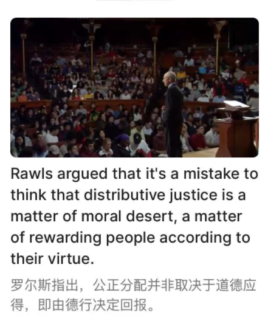

# 哈佛大学公正课-课程大纲与笔记
@(哈佛大学公正课)[哈佛大学公正课, 公正课-课程大纲]

[toc]

## 1. The Moral Side of murder(杀人背后的逻辑)

> [Justice: What's The Right Thing To Do? Episode 01 "THE MORAL SIDE OF MURDER"](https://www.youtube.com/watch?v=kBdfcR-8hEY)

### 1.1 电车难题

### 1.2  食人惨案

## 2. Putting a price tag on life (为生命标价)

> [Justice: What's The Right Thing To Do? Episode 02: "PUTTING A PRICE TAG ON LIFE"](https://www.youtube.com/watch?v=0O2Rq4HJBxw)

### 2.2 如何衡量快乐

## 3. Free To Choose(选择的自由)

> 1. [Justice: What's The Right Thing To Do? Episode 03: "FREE TO CHOOSE"](https://www.youtube.com/watch?v=Qw4l1w0rkjs)
> 1. [自由选择--网易公开课](https://open.163.com/newview/movie/free?pid=M6GOB7TT6&mid=M6GOBUNTF)

### 3.2 我属于谁

## 4. This Land Is My Land (这是我的土地)

> 1. [Justice: What's The Right Thing To Do? Episode 04: "THIS LAND IS MY LAND"](https://www.youtube.com/watch?v=MGyygiXMzRk)
> 2. [这是我的土地--网易公开课](https://open.163.com/newview/movie/free?pid=M6GOB7TT6&mid=M6GOCBCG0)

### 4.2  满合法年龄的成年人

## 5. 雇佣兵

> [是否雇佣顶替自己服役的人--网易公开课](https://open.163.com/newview/movie/free?pid=M6GOB7TT6&mid=M6GOCHTC9)

### 5.2 [代孕母亲](https://www.evernote.com/l/ALr19uUIcflJiKbgvYTAdRdF8MxciTYEz8U/)

本讲通过一个真实的代孕母亲诉讼案例展开讨论，让我们了解即便是订立了契约合同有时候也是无效的，另外在现代文明社会，有些东西不是金钱可以买到的 (in a civilized society that money can’t buy)

## 6. 服从你的动机

> [小心你的动机--网易公开课](https://open.163.com/newview/movie/free?pid=M6GOB7TT6&mid=M6GOCJEOP)

## 7. 谎言的教训

> [谎言的教训--网易公开课](https://open.163.com/newview/movie/free?pid=M6GOB7TT6&mid=M6GOCSFDD)

## 8. 公平的起点

> [公平的起点是什么--网易公开课](https://open.163.com/newview/movie/free?pid=M6GOB7TT6&mid=M6GOD1A53)

### 8.2 应得

 

The distinction that Rawls draws between two different types of claims. 

Claims of **moral desert** on the one hand, and of **entitlement to legitimate expectations** on the other. 

> 讨论了罗尔斯所描述的两种不同权**利**类型之间的区别。一方面是**道德应得**的权利，另一方面则是**合理期望**的权利。

Rawls argued that it's a mistake to think that distributive justice is a matter of moral desert, a matter of rewarding people according to their virtue.

罗尔斯指出，公正分配并非取决于到的应得，即由德性决定回报。

## 9. 平权法案的讨论

> [平权行动的争论--网易公开课](https://open.163.com/newview/movie/free?pid=M6GOB7TT6&mid=M6GOD6P75)

### 9.1 Cheryl Hopwood Case

### 9.2 目的为何

## 10. 良好公民

> [好公民--网易公开课](https://open.163.com/newview/movie/free?pid=M6GOB7TT6&mid=M6GODEHDT)

### 10.2 自由之辩

## 11. 社会责任的要求

> [共同责任的辩论--网易公开课](https://open.163.com/newview/movie/free?pid=M6GOB7TT6&mid=M6GODIQQF)

### 11.2 忠诚所依

## 12.  关于同性婚姻的讨论

> [同性婚姻的争论--网易公开课](https://open.163.com/newview/movie/free?pid=M6GOB7TT6&mid=M6GODNIPB)

### 12.2 美好生活

## Reference

1. [Justice with Michael Sandel --Harvard University --Youtube](https://www.youtube.com/watch?v=kBdfcR-8hEY&list=PL30C13C91CFFEFEA6)
1. [哈佛大学公开课：公正-该如何做是好？（12讲） 网易公开课](https://open.163.com/newview/movie/courseintro?newurl=M6GOB7TT6)
1. [Youtube字幕下载](https://downsub.com/)

## 文档修订记录

| 版本号|     变化状态|   简要说明|  日期	|   变更人/参与者   |
| :-------- | :--------| :------ |:------ |:------ |
| v0.1 |   建立| 文档初建 |2020-1-18  | Lee|
| v1.0 |   增加| 描述第1讲，列车难题及其相关材料 |2020-1-20  | Lee|
| v1.1 |   增加| 描述第10讲，代孕母亲合同有效性问题 |2020-1-23  | Lee|
| v1.2 |   修改| 将课程笔记按照课程全部拆分成独立笔记，在大纲里面做超链接 |2020-1-23  | Lee|
| v1.3 | 修改 | 调整课程目录，根据Youtube和网易公开课，将原来的24目录改成12目录 |2022-6-16 | Lee |
|  |  |  | |  |

*变化状态：建立，修改，增加，删除