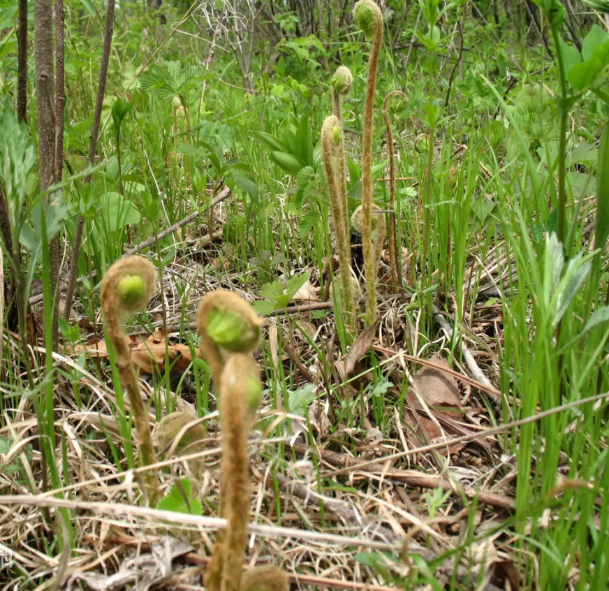
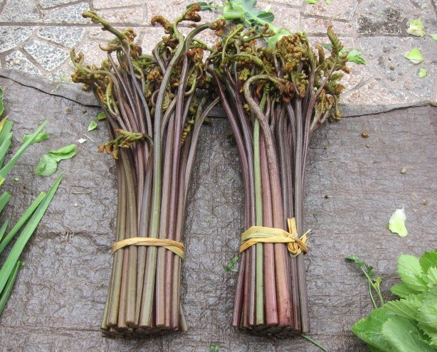

# [小雅·采薇](https://m.shicimingju.com/chaxun/list/8611.html)

[toc]

**[先秦] [诗经](https://m.shicimingju.com/chaxun/zuozhe/13046.html)**

|  诗歌内容                                               | 解析                                                         |
| ------------------------------------------------------------ | ------------------------------------------------------------ |
| 采薇[^1]采薇，薇亦作[^2]止[^3]。 曰[^4]归曰归，岁亦莫[^5]止。 靡室靡家[^6]，猃狁[^7]之故。 不遑启居，猃狁之故。 | 这三章的第一句都是“采薇采薇”，以此来引起下文。诗歌的一开始就给读者展示了一幅凄凉的戍边生活画面，我们仿佛看到戍卒一边在荒野漫坡上采集野菜，一边思念着久别的家乡，屈指计算着返家的日期………  第一章开头两句写道：“采薇采薇，薇亦作止”，这是写春天，薇菜刚刚绽出嫩绿的芽尖； |
| 采薇采薇，薇亦柔止。 曰归曰归，心亦忧止。 忧心烈烈，载饥载渴。 我戍未定，靡使归聘。 | 第二章写道：“采薇采薇，薇亦柔止”，这是写夏天，薇菜的叶片肥嫩； |
| 采薇采薇，薇亦刚止。 曰归曰归，岁亦阳止。 王事靡盬，不遑启处。 忧心孔疚，我行不来。 | 第三章则是：“采薇采薇，薇亦刚止”，这是写秋天，薇菜的叶茎将老而粗硬。 从春到秋，薇菜由嫩而老，时光无情地流逝了；戍卒思归，从春到秋，一年将尽，何时才能归家呢？ 诗人原是把天地四时的瞬息变化，自然生物的生死消长，都看作是生命的见证，人生的比照。因此，兴是自然予人的最朴素也最直接的感悟，其中有着体认生命的深刻之义。 于是在“采薇”这样一个凝固在戍卒记忆里的姿势里，看到的不只是四季的轮回，光阴的流逝，还看到思念的成长，看到生命走向苍老的痕迹。 |
| 彼尔维何，维常之华。 彼路斯何，君子之车。 戎车既驾，四牡业业。 岂敢定居，一月三捷。 |                                                              |
| 驾彼四牡，四牡騤騤。 君子所依，小人所腓。 四牡翼翼，象弭鱼服。 岂不日戒，猃狁孔棘。 |                                                              |
| 昔我往矣，杨柳依依。 今我来思，雨雪霏霏。 行道迟迟，载渴载饥。 我心伤悲，莫知我哀。 | 昔我往矣，杨柳依依。今我来思，雨雪霏霏。”让那一股缠绵的、深邃的、飘忽的情思，从风景画面中自然流出，含蓄深永，味之无尽。这四句诗被后人誉为《诗经》中最好的句子。这是写景记时，更是抒情伤怀。这几句诗句里有着悲欣交集的故事，也仿佛是个人生命的寓言。是谁曾经在那个春光烂漫的春天里，在杨柳依依中送别我？而当我在大雪飘飞的时候经历九死一生返回的时候，还有谁在等我？  别离时的春光，回归时的大雪，季节在变换，时光在流逝，我们离去，我们归来，而在来来去去里，失去了什么又得到了什么呢？没有答案，只有漫天的飞雪中一个被沉重的相思和焦虑烧灼的又饥又渴的征人孤独的身影，步履蹒跚地，战战兢兢地走向他不知道的未来。 |

[^1]: **薇**： 豆科野豌豆属的一种，学名叫荒野豌豆，又叫大巢菜，种子、茎、叶均可食用。《史记·伯夷列传》记载：“武王已平殷乱，天下宗周，而伯夷、叔齐耻之，义不食周粟，隐于首阳山，采薇而食之。”说的是伯夷、叔齐隐居山野，义不仕周的故事。《史记·周本纪第四》记载：懿王之时，王室遂衰，诗人作刺。刺就是指《采薇》。《汉书·匈奴传》记载：至穆王之孙懿王时，王室遂衰，戎狄交侵，暴虐中国。中国被其苦，诗人始作，疾而歌之，曰：“‘靡室靡家，猃狁之故’，‘岂不日戒，猃狁孔棘’。”
[^2]: **作** ：指薇菜冒出地面。
[^3]: **止**：句末助词，无实意。
[^4]: **曰**: 句首、句中助词，无实意。
[^5]: **莫（mù）** 通“暮”，此指年末。
[^6]:**靡（mǐ）室靡家**: 没有正常的家庭生活。靡，无。室，与“家”义同。
[^7]: **猃（xiǎn）狁（yǔn）**中国古代少数民族名。

## 解析

这首诗的主题是严肃的。猃狁的凶悍，周朝军士严阵以待。作者以戍役军士的身份描述了以天子之命命将帅、遣戍役，守卫中国，军旅的严肃威武，生活的紧张艰辛。

作者的爱国情怀是通过对[猃狁](https://baike.baidu.com/item/%E7%8C%83%E7%8B%81/8639294?fr=aladdin)**[xiǎn yǔn]**的仇恨来表现的，更是通过对他们忠于职守的叙述——“不遑启居”、“不遑启处”、“岂敢定居”、“岂不日戒”和他们内心极度思乡的强烈对比来表现的。

全诗再衬以动人的自然景物的描写：薇之生，薇之柔，薇之刚，棠棣花开，依依杨柳，霏霏雨雪，都烘托了军士们“日戒”的生活，心里却是思归的情愫。

这里写的都是将士们真真实实的思想，忧伤的情调并不降低本篇作为爱国诗篇的价值，恰恰相反是表现了人们的纯真朴实，合情合理的思想内容和情感，也正是这种纯正的真实性，赋予了这首诗强盛的生命力和感染力。

## 相似诗篇

这一首诗与《诗经》中的其它篇章如《邶风·击鼓》《豳风·东山》《秦风·无衣》对读，可以读出更完整的故事，更真切的生命感受。如果可以想象，这个戍卒是那位吟出“死生契阔，与子成悦。执子之手，与子偕老”的士兵，也是那唱着昂扬的战歌“岂曰无衣，与子同袍。王于兴师，修我戈矛，与子同行”的士兵，同时还是那位在蒙蒙的细雨里唱着归乡的“我徂东山，滔滔不归。我来自东，零雨其蒙”的士兵。那么，《小雅·采薇》的故事就更丰富了，事实上，这一首诗里的确有着太丰富的色彩，太深沉的情怀。相思之情与报国之志，豪放与苍凉如此和谐地交织在一起，奏响的是真实的生命[乐章](https://m.shicimingju.com/chaxun/zuozhe/6812.html)。在后来的如[陈陶](https://m.shicimingju.com/chaxun/zuozhe/72.html)《陇西行》，如[范仲淹](https://m.shicimingju.com/chaxun/zuozhe/129.html)的《渔家傲》等作品里，也能依稀地听到这首诗在时间和生命的河流里所激起的辽远而空旷的回音。

## 薇菜和蕨菜的区别

蕨菜和薇菜在形态上其实十分的相似，但是它们也是有[区别](http://www.qnong.com.cn/zhidao/wenda/24477.html)的，只要我们认真的去分辨，还是可以认出来的。一般情况下薇菜它的颜色偏黄色，而蕨菜它的颜色偏紫色或者是褐色，所以我们可以通过它们的颜色去进行分辨。其次就是蕨菜上的绒毛也是紫色或者是褐色的，而薇菜上的颜色为黄白色，并且薇菜上的绒毛相对较少。

