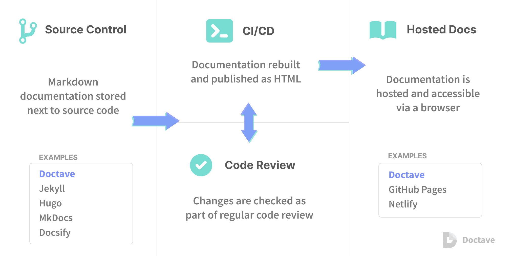

# Why you should consider using docs-as-code

[toc]

A lot of internal technical documentation lives in corporate knowledge bases, wikis, or some sort of collaborative editing system. We built Doctave to serve a different approach: **docs-as-code** (sometimes called docs-like-code). Let’s dive into what this approach is and what the benefits are over other solutions.

## What is docs-as-code?

Docs-as-code is an approach to documentation where the documentation lives in source control, often next to the same code it is describing. This is commonly implemented with e.g. Markdown files in your repository that get generated into a documentation site as part of your CI/CD pipeline. Docs-as-code is in contrast to having a separate knowledge base for your documentation. Instead, you tightly integrate docs and code.

*This is what Doctave.com was built for - we let you keep your documentation in your source code, and provide a centralized place for you to host, view, and search your documentation. All your projects can be viewed under one roof. [Read more here.](https://www.doctave.com/features)*

There are many benefits to this approach:

1. **You can keep your documentation in sync with your code**
2. **Use the same tools to review code and documentation changes**
3. **Writers and developers can work together**
4. **Automated checks**
5. **You get versioning for free**

Let’s go through these benefits one by one.

## Keeping code and docs in sync

Most people have had the experience of carefully reading a seemingly relevant page in their corporate knowledge base, only to discover in the next meeting that the information was wildly out of date. We have previously written a [(mildly provocative) post](https://blog.doctave.com/2020/08/20/confluence-is-where-documentation-goes-to-die.html) about this phenomenon. This causes a lot of headache and lost productivity for new hires, and the pain is amplified for remote employees.

When documentation lives in a separate system, it often gets forgotten about during the software engineering lifecycle. What’s worse, in these cases documentation rarely has a clear home - it might be in the wiki, it might be in a Google doc, or Notion, or on the whiteboard in the office. This type of documentation becomes a form of **technical debt**.

Having the documentation live next to the code can help. When the code changes, the developer can stay in their editor and also update the documentation immediately. Having the documentation available locally has other benefits too: developers can use their favorite tools to search or bulk update sections, instead of relying on a clumsier WYSIWYG editor.

This however does not completely solve the problem. There technically nothing forcing, or at least reminding, the developer to update the documentation. But this brings us conveniently to the next benefit…

## Same tools for reviewing docs and code

Most software engineering organizations use pull request workflow for managing code changes. A developer submits their changes, which are then reviewed by their colleagues before accepted into the code base. The purpose of these code reviews is to maintain a level of code quality and share knowledge among the team.

With docs-as-code, you can use the same system for documentation.

If you change how a feature is implemented and don’t update the documentation to reflect this, it can be caught in code review. You can even have previews of the documentation generated for each pull request (something that Doctave.com supports), so that the reviewer can check it looks correct and reflects the correct state of the world.

## Writers and developers working together

If you have dedicated technical writers on your team, having them use the same tools as developers can help the team work together. Especially with complex technical projects developers have to work closely with technical writers to review documentation. Likewise if developers are contributing to documentation, changes will be reviewed by the technical writers. Being able to do this in the same workflow reduces friction and can help everyone feel like they are on the same team.

## Automated checks

Since you are now publishing your documentation as part of your CI/CD pipeline, you can start adding automated checks to your documentation. This can be anything from detecting broken links, enforcing style guides or fixing formatting. Want to generate PDF versions of your docs? Do it as part of your documentation pipeline.

## Documentation versioning

For projects where there is only one canonical version of the software live at any given time, such as a web service, this may be less important. But if you have a library or product with multiple versions being used in parallel, having a good versioning strategy for your documentation is key.

Most wikis and collaborative documentation editors have some kind of custom versioning system. In practice it takes a lot of manual effort to keep your docs in sync across branches and releases.

Using docs-as-code, you get this all for free. Branched the code? You just branched your docs too.

## Conclusions

If your docs are spread out across multiple different systems and are chronically out of date, you may want to consider using a docs-as-code approach. It’s an developer-friendly way to handle your docs, and has been successfully implemented in high performance teams at companies like [Google](https://www.youtube.com/watch?v=EnB8GtPuauw&t=549s) and [Spotify](https://backstage.io/blog/2020/09/08/announcing-tech-docs).

Wan’t to read more about docs as code? Here’s a couple resources:

- [I’d Rather Be Writing - Docs as code](https://idratherbewriting.com/learnapidoc/pubapis_docs_as_code.html)
- [Docs Like Code book](https://www.docslikecode.com/)

## Reference 

1. [Why you should consider using docs-as-code](https://blog.doctave.com/2021/08/30/why-you-should-consider-docs-as-code.html)