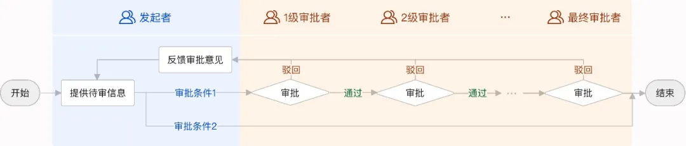
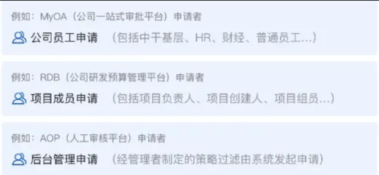
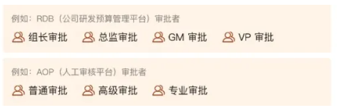
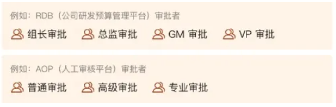
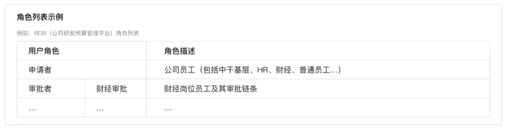
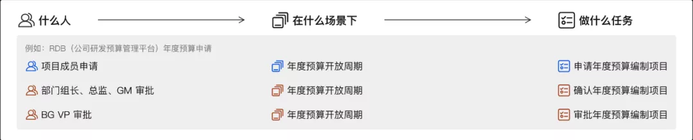
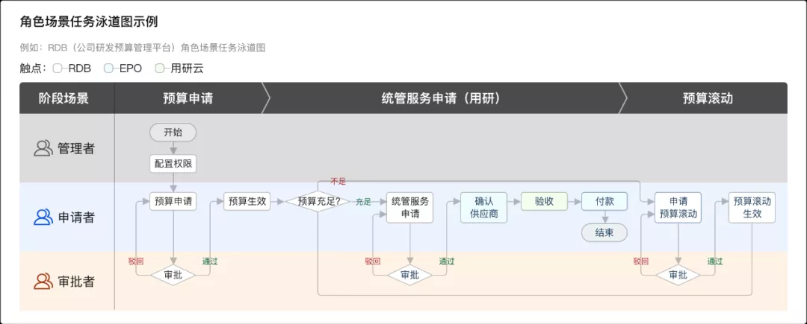

# 审批流设计指南

[toc]

受众：「初阶产品经理」、「产品体验设计师」、「交互设计师」。

目标：帮助文章受众系统化了解「什么是审批流」、「如何盘点审批流」、「如何设计审批页面」，以此，在基于合规化的前提下，制定信息传达准确、流程操作高效、节点可预知、历史可回溯的审批系统。

 

全文共5大章节，阅读全文大概需要10分钟。

## 一、认识审批流

### 1、认识审批流

审批流，是一种工作流，常见于中后台系统，其本质是待审信息的流动方式及决策过程。即申请者（人或系统）提供待审信息，交由相关审批人进行传递及处理，期间，每个审批者会基于自己的岗位职责与权限分工对待审信息进行核对（检查/确认…）、判断（通过/驳回/转交/挂起…）及协商（反馈意见…），直至抵达最高决策层进行取舍。

 

### 2、为什么要创建审批流

- 合规化：帮助管理者规范团队的运转流程、防范决策失误；
- 引导申请者遵循正确的流程规范，避免违规操作。

### 3、审批流的构成要素

​      

- 谁发起审批（**申请者**）：不仅仅指某个用户，也可能是系统或是第三方服务商。
- 谁来审批（**审批者**）：可能是某个审批群组或是特定的审批人，受限于权限与分工。
- 按什么规则审批（**审批规则**）：不同权限与分工的审批者按一个或多个审批条件进行审批。
- 审批什么（**待审信息**）：申请者基于不同的申请事项，按要求提供的信息。
- 各角色可以干嘛（**操作动作**）：可以是审批操作（通过、驳回…），也可以是流程操作（转交、撤回…）。
- 怎么告诉各角色（**通知方式**）：即通知申请者、审批者的渠道（短信、电话、邮件、平台消息提醒…）。

### 4、好的审批流要满足什么条件

 

- **信息传达准确**：能有效并准确传达审批流的相关信息。   
- **流程操作高效**：能提升组织内部的运转效率。
- **节点可预知**：能帮助各角色提前了解审批流程。
- **历史可回溯**：对已结束的审批单据能随时回溯。

## 二、盘点审批流程

设计一个信息传达准确、流程操作高效、节点可预知、历史可回溯的审批流，需要对其构成要素进行全面的盘点。盘点的目的是为了快速理解审批流的业务逻辑，结合用户诉求挖掘产品机会点，明确产品优化方向。盘点的步骤涵盖以下 3 步：

  

 

1. **归纳角色类型**：洞察审批流的用户特性，提取有效的角色分类维度。
2. **理清任务流程**：梳理角色场景任务，明确什么人在什么场景下能做什么事。
3. **挖掘产品机会点、功能点**：穷举每个角色的诉求、痛点，挖掘产品机会点，转化产品机会点为功能点，明确产品优化方向。

### 1、归纳角色类型

在一个闭环的审批流中，每个用户基于自己的岗位职责和权限分工需要完成不同的任务，用户的角色可抽象为两大类：申请者和审批者。

#### 申请者

不仅仅指某个用户，也可能是系统或是第三方服务商，因此需要我们明确申请者的来源及组成方式。

 

​	

#### 审批者

可能是某个审批群组或是特定的审批人，受限于岗位职责和权限分工，因此需要我们明确审批者之间的关系，对审批者做进一步角色的分类。

- 按审批等级进行角色分类

   

- 按岗位职责进行角色分

   

本步骤产出物：角色列表。

### 2、理清任务流程

在完成角色类型的归纳后，为了知道什么人（**Person**）在什么场景下（**Context**）能做什么任务（**Task**），可以采用PCT法来理清审批流的角色场景任务。

 

在实际工作中，我们可以配合泳道图完成角色场景任务的梳理。从角色使用产品完成某一个任务为目标，来梳理用户角色（人）在特定环境（场景）下依赖产品的部分功能（工具）完成目标任务的整个任务周期（任务），包括线下和线上。

本步骤产出物：角色场景任务泳道图。

 

### 3、挖掘产品机会点、功能点

最后，基于用户诉求及痛点，绘制用户旅程地图，挖掘产品机会点；转化产品机会点为功能点，罗列产品功能列表，明确产品优化方向，完成审批流流程的盘点。

\1) 使用用户旅程地图，基于用户诉求及痛点，挖掘产品机会点。

- 记录每个阶段的用户体验
- 穷举每个角色在不同任务目标下的诉求及痛点
- 脑爆解决方案
- 挖掘产品机会点

本阶段产出物：各角色用户旅程地图。

\2) 转化产品机会点为功能点，明确产品优化方向，输出产品功能列表。

- 归纳产品机会点
- 转化为产品功能点
- 基于战略方向及技术实现难度，明确产品优化方向

本阶段产出物：产品功能列表。

## **三、如何「设计」审批流页面**

在盘点完流程后，接下来则进入到审批流页面的具体设计中。设计的目标是为了提升审批流的用户体验，让流程更好用。设计的步骤涵盖以下 3 步：

\1) 搭建信息架构：基于审批流中每个角色的关注点搭建信息架构，理清权限范畴。

\2) 优化审批流程：明确合适的流程颗粒度，精简非必要步骤，优化核心任务流程。

\3) 组装通用页面：定义页面可拼装的元素，按每个角色对不同事项的关注度，组装通用页面。

### **1、搭建信息架构**

基于审批流中每个角色的「关注点」搭建信息架构；采用基于角色的权限模型（RBAC0），理清每个角色的权限范畴。帮助用户快速「找到」自己要进行的审批任务。

\1) 基于每个角色的关注点，搭建信息架构。

- 将审批流中每个角色的关注点进行排列组合（此环节可邀请用户进行卡片分类，用于理解用户习惯及心智模型）

- 决策组合方案，合并功能点（基于用户诉求及产品诉求决策组合方案，按组合纬度合并功能点）

- 搭建信息架构，明确导航层级

  Tips：一般情况，申请者更关注“我的申请”信息；审批者更关注“我的待审”信息

本阶段产出物：信息架构推导脑图。

\2) 控制每个角色操作及数据的维度，理清权限范畴，输出角色权限列表。

- 罗列各信息架构下操作及数据的维度
- 按角色进行权限控制

本阶段产出物：角色权限列表。

### **2、优化审批流程**

随后，结合前期梳理的「用户目标」和「产品机会点」，明确合适的流程颗粒度，精简非必要步骤，优化核心任务流程。帮助用户便捷「操作」自己要进行的审批任务。

\1) 精简非必要步骤，优化核心任务流程

- 明确用户目标和任务周期（已在前期 “如何「盘点」审批流流程”第二步完成）
- 结合产品机会点，明确合适的流程颗粒度，均衡作业顺序（实践发现一个操作动作尽可能对应一个独立页面，流程颗粒度为最佳）
- 精简非必要步骤，重构业务逻辑，优化核心任务流程

\2) 流程优化方式一：通过重组信息层级优化任务流程

tips：一般情况，在上一步搭建信息架构的过程中，基于用户的关注点，会指导我们对任务的前后路径进行“预优化”，而不仅仅是到了这一步才开始着手启动。

\3) 流程优化方式二：通过重组业务逻辑优化任务流程

本步骤产出物：已优化的核心任务流程。

### **3、组装通用页面**

最后，以优化后的核心任务流程为指引，基于原子设计理念，定义页面可拼装的元素，按每个角色对不同事项的关注度排布通用页面，帮助用户准确「获取」审批流的有效信息，完成审批流页面的设计。

通过信息收集、功能区归纳，功能模块规范，按每个角色对不同事项的关注层级，排布通用页面，构建科学规范的设计系统。

tips：在审批页面设计中，除开确保基础审批信息的传达外，还需要关注流程信息的有效传递，帮助各角色提前了解审批环节，清晰知道当前审批进度。

本步骤产出物：审批流通用页面。

## **四、其他关注事项**

### **1、连接消息通知**

另外，在设计审批页面的过程中，为了闭环线上、线下信息之间的有效传达，还需要关注消息通知的传递方式。结合用户已形成的消息获取习惯，连接任务与任务之间的信息，帮助用户及时「接收」审批流的消息通知。

\1) 平台内消息通知：覆盖更全面的消息类型，提供多种消息存储方式。

\2) 平台外消息通知：结合用户习惯，基于已有载体进行消息的扩散。

本步骤产出物：消息通知方式及页面

备注：如何进行消息通知系统设计，可参考文章[《消息通知系统设计》](http://mp.weixin.qq.com/s?__biz=MjM5NjA1NzEwMA==&mid=2651018769&idx=1&sn=f1bf6415b79533651db8dcaebcce7a3f&chksm=bd18ef728a6f6664f1ec95b6ecb59fe4dd4e0aef5cc86b43262a67d405d228369c5850a09485&scene=21#wechat_redirect)。  

## **五、总结**

本文较为系统的从「认识审批流」、「盘点审批流程」以及「设计审批流页面」这三个部分，初步阐述了在基于合规化的前提下，如何制定信息传达准确、流程操作高效、节点可预知、历史可回溯的审批系统及其相关的设计方法。结合具体的案例，希望能帮助到初阶产品经理、产品体验设计师、交互设计师，在基于各自业务场景及用户诉求下，完成审批流的重组及具体页面设计，若实施过程中遇到文中方法无法解决的情况欢迎随时联系小编。

## Reference

1. [审批流设计指南-- 腾讯CDC体验设计](https://mp.weixin.qq.com/s/L395m4WDirA4zhs_tsUzAg)