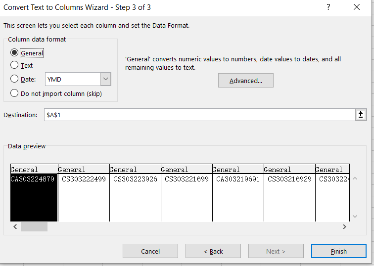

# Excel 奇技淫巧 -- 一天一个提桶小技巧
@(ProductManager)[Excel操作]

[toc]

## 1. 如何标红重复的数据？


S1： 点击 `Home >> Styles >> Conditional Formatting` 


S2：继续点击 `Highlight Cells Rules >> Duplicated Values.....`


S3：在弹出的样式设置框里面，点击【OK】


S4: 可以看到红色的重复数据都被展示出来了


## 2. 如何去除重复数据

S1： 点击 `Data >> Data Tools >> Remove Duplicates`


有时候不知道为什么无法去重数据，所以就需要把重复的数据标红出来，手工删除了。至少我不知道为什么能被标红却无法被remove.


## 3. 把文本数据转化为Column(列)

S1： 复制文本框数据到Excel：

```
CA303224879, CS303222499, CS303223926, CS303221699, CA303219691, CS303216929, CS303224937, 63238428-1, 63238410-1, 63238412-1, 63238411-1, 63238426-2, 63238426-1, 63238427-1, 63238409-1, 63238410-2, 63238425-1, 63238408-1, 63237611-1, 63237589-1, 63237612-1, 63237588-1, 63237587-1, 63237610-1, 63237608-1, 63237586-1, 63237609-1, 63237585-1, 63236864-1, 63237607-1, 63236862-1, 63236860-1, 63236865-1, 63236866-1, 63236859-1, 63236863-1, 63236861-1, 63236858-1, 63236856-1, 63236855-1, 63236857-1, 63236052-1, 63236053-1, 63236075-1, 63236051-1, 63236074-1, 63236073-1, 63238485-1, 62568017, 162915573, 162916496, 15901580, 15900492, 15901375, 92212524, 92212532, 63240010-1, 63240011-1, 63240009-1, 63239263-1, 63239264-1, 63239265-1, 63239212-1, 63239260-1, 63239265-2, 63239262-1, 63239211-1, 63239261-1, 63239257-1, 63239256-1, 63239255-1, 63239254-1, 63239259-1, 63239258-1, 63239208-1, 63239210-1, 63239253-1, 63239252-1, 63239209-1, 63239207-1, 63241299-1, 63239251-1, 15908402, 81571099, 15908396, 51577878
```


S2： 点击 `Data >> Data Tools >> Text to Columns`


S3: 在 `Convert Text To Columns Wizard` 中，选择 **`Delimited`**(分隔符)


S4: 根据文本内容选择分隔符，这里选择`Comma`（逗号）


S5: 点击【Finish】



S6： 转化成功


## 4. 把Column转为Row(行)

S1： 选中需要转化的Column列，`Ctrl+C`复制


S2： 选择某一个Cell，**`右击 >> Past Special`**


S3：在弹出框中选择 **`Transpose`**


S4: 可以看到数据成功被转化成Row了。此时可以选择整个Column, Ctrl+1调出单元格设置(Format Cells)对数据进展展示设置。


## 5.  如何在Excel里面格式化出符合SQL in查询的格式？


```
=""""&A2&""""
```

```
=""""&B2&""","
```

## Reference & Connection

1. [Find and remove duplicates  - Microsoft](https://support.microsoft.com/en-us/office/find-and-remove-duplicates-00e35bea-b46a-4d5d-b28e-66a552dc138d#:~:text=Remove%20duplicate%20values&text=Select%20the%20range%20of%20cells,want%20to%20remove%20the%20duplicates.)
