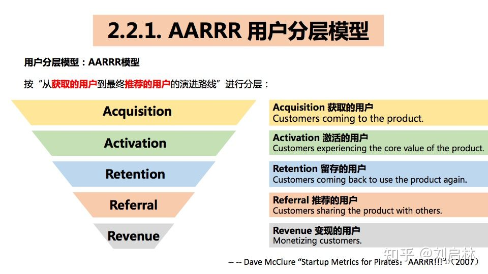

# 用户画像的基础、原理、方法论（模型）和应用
@(Interview)[Practise with myself, English Interview]

[toc]

用户画像（User Profile）的本质是用户需求描述，一种刻画用户需求的模型。

用户画像在推荐系统、广告系统、商业分析、数据分析、用户增长、用户研究、产品设计、数据化运营、精准营销、量化风控等领域得到广泛应用。

本文系统地构建了用户画像的知识体系。首先，介绍了用户画像的概念、要素、关系、意义等用户画像的基础知识；接着，介绍了用户画像的方法、分层标签、AARRR 用户分层模型、用户业务分层、分群标签、RFM 用户分群模型、用户属性分群、个性化标签、人工打标签、机器打标签、混合打标签、用户画像的原则、用户画像的评估等用户画像原理；然后，介绍百度的用户画像、微博的用户画像、今日头条的用户画像；最后，指出用户画像在推荐系统中的应用，以及用户画像的本质和用户画像面临的挑战。本文目录如下：

1. 用户画像基础
1.1. 用户
1.2. 用户画像的概念
1.3. 用户画像的要素
1.4. 用户画像的关系
1.5. 用户画像的意义

2. 用户画像原理
2.1. 用户画像的方法
2.2. 分层标签（用户分层）
2.2.1. AARRR 用户分层模型
2.2.2. 用户业务分层
2.3. 分群标签（用户分群）
2.3.1. RFM 用户分群模型
2.3.2. 用户属性分群
2.4. 个性化标签（用户画像）
2.4.1. 人工打标签
2.4.2. 机器打标签
2.4.3. 混合打标签
2.5. 用户画像的原则
2.6. 用户画像的评估

3. 用户画像应用
3.1. 百度的用户画像
3.2. 微博的用户画像
3.3. 今日头条的用户画像

4. 用户画像总结
4.1. 推荐系统的用户画像
4.2. 用户画像的本质
4.3. 用户画像的挑战
接下来，让我一起走进用户画像的世界。

## 1. 用户画像基础

### 1.1 用户

要想搞清楚用户画像，首先得搞清楚用户。比如：

- 你的用户的特征是什么？
- 怎么描述用户需求？
- 不同阶段的用户特征又是什么？

关于用户还有：
- 用户关键路径、
- 用户旅程（customer journey map）、
- 用户决策过程等等。

### 1.2 用户画像的概念

怎样区分
- User Portrait（用户肖像）
- Customer Segment（用户细分）
- User Persona（用户角色）
- User Profile（用户画像）

#### 1.2.1 几个易混淆概念区分
用户肖像、用户细分、用户角色和用户画像的对比如下表所示：

| 英文|     中文 |   含义 | 起源(领域)|
| :--------: | :--------:| :------: | :------: |
| **User Portrait**|   用户肖像|  人物画像|绘画|
| **User Segment**|   用户细分|  用户需求分析|商业模式|
| **User Persona**|   用户角色|  用户的自然属性、社会属性集合|设计|
| **User Profile[^1]**|   用户画像|  基于数据刻画用户需求的模型|大数据|
> 用户肖像、用户细分、用户角色和用户画像的对比

[^1]:  [User profiling](https://ux.stackexchange.com/questions/103217/whats-the-difference-between-user-profiles-and-personas) is a collection of data from analytics that you use to create a set of profiles based on data and behavior on your site.

#### 1.2. 2 用户互相是一种公共语言

那么，高层、产品、开发、市场、运营眼中的用户画像是什么？

用户画像是**刻画用户需求的模型**。用户画像是一种**公共语言**，串联互联网商业的高层、产品、开发、市场、运营等，提高沟通效率。

### 1.3 用户画像的要素

用户画像的三要素：人、物、环境。

| 要素|     解释|   备注|
| :-------- | :--------| :------ |
| 人|   自然属性、社会属性 |   |
| 物|   文本、图片、音频、视频、商品 | 关注人对物的兴趣、行为等   |
| 环境|   时间、地点、场景 |   |

### 1.4 用户画像的关系

用户画像描述的是用户与物品的关系。

### 1.5 用户画像的意义

用户画像广泛应用在推荐系统、广告系统、商业分析、数据分析、用户增长、数据运营、精准营销、量化风控等领域。

| 位置 |     意义|   应用|
| :-------- | --------:| :------: |
| 宏观|   战略制定|  市场趋势   竞争分析  产品定位|
| 中观|   运营优化|  功能优化   用户增长   个性化推荐  量化风控 精确营销|
| 微观|   价值发现|  用户特征识别   基础信息构建   **用户需求分析**|

## 2. 用户画像原理

### 2.1 用户画像的方法-标签化

用户画像的主流方法：用户标签化。

标签是用户属性、兴趣、行为等特征的抽象与描述。

- **标签的定义：**
  用户属性、兴趣、行为等特征的抽象与描述。
  
- **标签的关系：**
层次关系、顺序关系、集合关系、独立关系。

- **标签的分类：**
人工标签、机器标签；
属性标签、兴趣标签、行为标签；
分层标签、分群标签、个性化标签；

从分层标签、分群标签到个性化标签，正是一个由**粗到细**的过程。

### 2.2 分层标签

将总体中各个用户按某种特征分成若干个互不重叠的几部分，每一部分叫做层。

分层标签是指根据分层规则，对用户进行分层而打的标签。

用户分层是指基于分层标签描述用户。

#### 2.2.1 AARRR 用户分层模型

举个用户分层的例子：AARRR 用户分层模型。

AARRR 模型是由:
- Acquisition（获取）、
- Activation（激活）、
- Retention（留存）、
- Referral（推荐）、
- Revenue（变现）

五个部分组成，形成一个用户流量漏斗。

按“从**获取的用户**到最终**推荐的用户**的演进路线”进行分层如下：

#### 2.2.2 用户业务分层

实际应用中，也可以基于具体业务进行用户分层。比如：今日头条可以按资讯类别把用户分成科技用户、娱乐用户、游戏用户等等。

| 类型|     类型描述|   公司 |
| :-------- | --------:| :------: |
| 资讯类 |   科技、娱乐、游戏、体育、财经、数码、军事、旅游、......|  今日头条|
| 视频类 |   动画、音乐、舞蹈、知识、生活、时尚、娱乐、美食......|  今Bilibili|
| 电商类 |   家用电器、手机、电脑、家具、男装、美妆、母婴、食品......|  京东|

然后还需要将同一层内的用户继续切分以满足精细化需求，所以还需要继续切分，获取分群标签。

### 2.3 分群标签

按照指定的规则，将总体中若干个用户合并为组，这样的组称为群。分群标签是指根据分群规则，对用户进行分群而打的标签。

用户分群是指基于分群标签描述用户。

- **群：**
按照指定规则、将总体中若干个用户合并为组、这样的组成为群；
- **分群标签：**
根据分群规则，对用户分群而打的标签；
- **用户分群：**
基于分群标签描述用户。

### 2.3.1 RFM 用户分群模型

举个用户分层的例子：RFM 用户分群模型（Recency、Frequency、Monetary ）。

RFM是根据用户活跃程度、交易金额的贡献，对用户价值进行分群的一种方法。

RFM 的 8 个象限分别表示 8 类用户如下：

| Col1      |     Col2 |   Col3   | Col3   |
| :-------- | :--------:| :------: |:------: |
| field1    |   field2 |  field3  |field3  |

## References & Connections

1. [用户画像的基础、原理、方法论（模型）和应用 --刘启林 --知乎](https://zhuanlan.zhihu.com/p/140104236)
2. [推荐 ：一文从0到1掌握用户画像知识体系 --微信公众号--一个数据人的自留地](https://mp.weixin.qq.com/s/53_inN75whohoBx2AOT7GA)