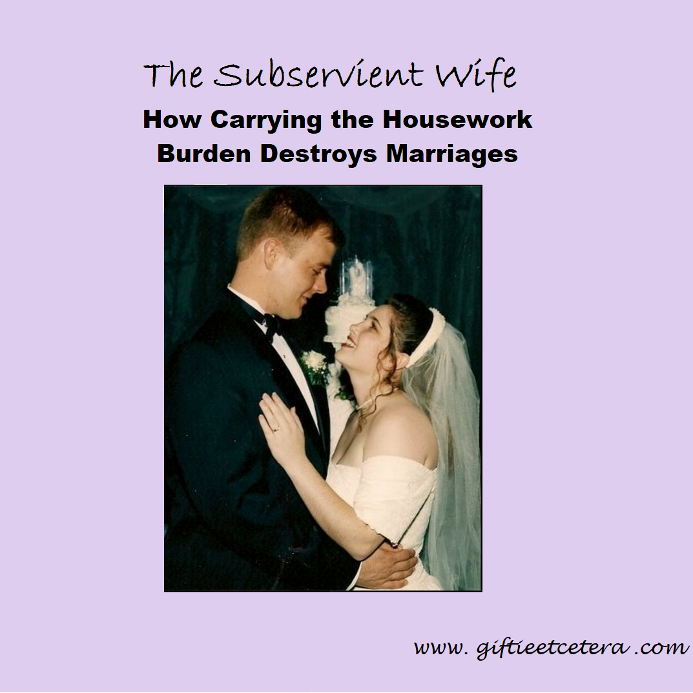

# The Subservient Wife: How Carrying the Housework Burden Destroys Marriages

I've been thinking about gender roles a lot lately.

Maybe it's because I recently was in an accident that the police officer stated was because I am one of those "women drivers." (I filed a complaint, it was founded, and the police officer was reprimanded.) 

Also, my child has had some medical issues at school and, though my husband works five minutes from the school and I work more than thirty minutes away, I got all the phone calls. 

I was starting to think that everything was falling on my shoulders - not because of any actions that my husband was taking, but because I am a woman - when I innocently clicked on a blog post about organizing.

Instead of really being about organizing, though, it was actually about being submissive to a husband in cleaning the house, even when the husband was actively messy in order to annoy the wife.

I am firmly against the concept of a subservient or submissive wife.

(Should I pause for you to gather your thoughts and absorb your shock? No? All of you already knew I didn't pledge to obey in the marriage vows? Well, yes, I guess that is pretty obvious.)

Yes, in my household, I do most of the organizing. I'm a natural at it, and order is a struggle for my husband. Still, he is the one who organizes the kids' rooms, due to all the dust. I am very allergic to dust. We share the cleaning, about 50/50 on laundry, all the dusting to him, and the kitchen cleaning mostly for me. I cook all the meals, but I only cook about a quarter of the time and, otherwise, it's leftovers or hubby microwaving something or baking meat (the only cooking that he does) for the kids and for his lunches. 

I probably do more chores, overall, especially if you count errands, but I work 15 hours a week to his 40 hours, so that seems fair.

But what does not happen is me doing chores in service to my husband. Instead, ALL members of my family - the kids, my husband, and I - serve each other.

The author of the article (sorry, I won't link it, as I found the title of it so deceptive and refuse to add "hits" to her blog) argued that letting go of resentment and serving one's husband frees one from resentment.

Know what really frees one from resentment? Sharing responsibilities.

In fact, the author sounded pretty resentful and as if she was repressing that feeling due to religious beliefs.

The author of the article argued that a wife should wait for God to change her husband.

Know what really changes a husband? A loving wife who shares her whole life with him, instead of making the house a virtual no man's land.

The author of the article argued that the Bible tells a story of women keeping the home and men working outside of the home.

But the division of labor for our ancestors was very even and the Bible reflects that.

Men worked sunrise to sunset, in the fields, hunting, making tools, and doing all sorts of household chores. Women surely tended babies more, due to biology, but also engaged in sunrise to sunset household chores. Having a man going off to work and a woman staying in the homestead is a new, modern concept. Families used to work together. When Mary and Joseph are mentioned in the Bible, they are most often spoken of as a couple, working as a team.

If one party does all of the housework, the problem is not just the natural resentment that is created.

I've seen marriage after marriage break up over the issue of one party resenting the other. I've also seen people stay married, by law and by living together, but without a real marriage, because one of the partners was carrying too heavy of a burden and the other was insensitive to that and unwilling to change. Their marriage is over, just as much as those who divorce, but they don't see it. It is heartbreaking.

Doing chores together is an opportunity to work together and strengthen the marriage that is lost. A marriage where spouses share chores is a marriage where they know (and teach their children by example) compromise, honor, and respect.

I wish women would stop using Christianity as an excuse for their husbands. Don't let men off of the hook for housework. It's good for their souls - and for your marriages.

[Etcetera](https://www.facebook.com/groups/345373425612939/).

## Reference

1.[The Subservient Wife: How Carrying the Housework Burden Destroys Marriages](http://www.giftieetcetera.com/2015/02/the-subservient-wife-how-carrying.html)