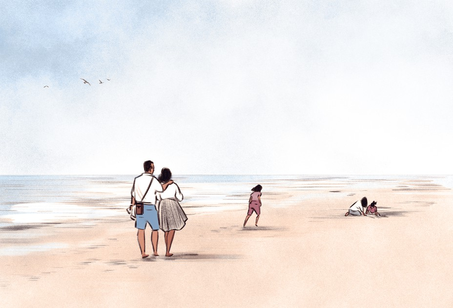
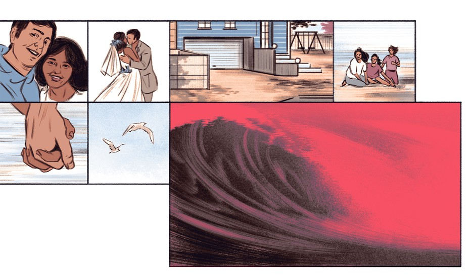
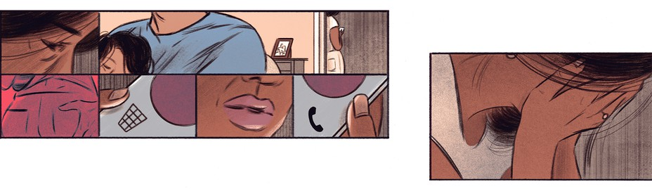
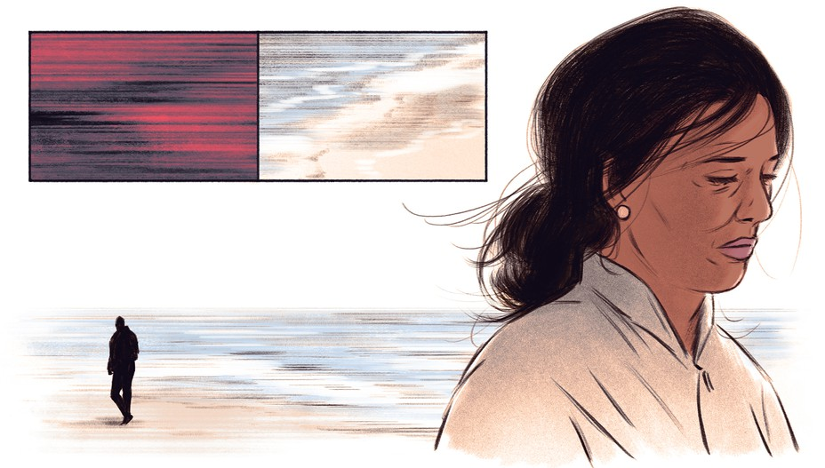

# WHY HAPPY PEOPLE CHEAT

A good marriage is no guarantee against infidelity.

By [Esther Perel](https://www.theatlantic.com/author/esther-perel/) 

[toc]

"Most descriptions of troubled marriages don’t seem to fit my situation,” Priya insists. “Colin and I have a wonderful relationship. Great kids, no financial stresses, careers we love, great friends. He is a phenom at work, fucking handsome, attentive lover, fit, and generous to everyone, including my parents. My life is *good*.” Yet Priya is having an affair. “Not someone I would ever date—ever, ever, ever. He drives a truck and has tattoos. It’s so clichéd, it pains me to say it out loud. It could ruin everything I’ve built.”

> “大多数问题婚姻的描述都不适合我的情况。” 普莉娅坚称。“科林和我感情很好，我们的孩子很乖，没有经济压力，从事着热爱的事业，有挚友。科林是个业务能手，长得特帅，是体贴的爱人，身体健康，对包括我父母在内的所有人都很慷慨。我的生活很好！”可普莉娅出轨了。“他并不是那种我会约会的对象，完全不是。他开卡车、身上有纹身。这种想法很俗气，大声说出来太难了。它会毁了我建立的一切。”

Priya is right. Few events in the life of a couple, except illness and death, carry such devastating force. For years, I have worked as a therapist with hundreds of couples who have been shattered by infidelity. And my conversations about affairs have not been confined within the cloistered walls of my therapy practice; they’ve happened on airplanes, at dinner parties, at conferences, at the nail salon, with colleagues, with the cable guy, and of course, on social media. From Pittsburgh to Buenos Aires, Delhi to Paris, I have been conducting an open-ended survey about infidelity.

> 普莉娅是对的。在婚姻生活中，除了疾病和死亡，很少有什么事情能有这么大的破坏力。作为一个治疗专家，多年来我遇到过数百对因不忠而关系破裂的情侣。我不仅在隐秘的治疗过程中谈论出轨，飞机上、聚会、会议、美甲店，和同事、修电视的工人，还有社交媒体上，我的谈话都会发生。从匹兹堡到布宜诺斯艾利斯，从新德里到巴黎，我一直在进行一场关于婚姻不忠的开放式调查。

Adultery has existed since marriage was invented, yet this extremely common act remains poorly understood. Around the globe, the responses I get when I mention infidelity range from bitter condemnation to resigned acceptance to cautious compassion to outright enthusiasm. In Paris, the topic brings an immediate frisson to a dinner conversation, and I note how many people have been on both sides of the story. In Bulgaria, a group of women I met seem to view their husbands’ philandering as unfortunate but inevitable. In Mexico, women I spoke with proudly see the rise of female affairs as a form of social rebellion against a chauvinistic culture that has long made room for men to have “two homes,” *la casa grande y la casa chica*—one for the family, and one for the mistress. Infidelity may be ubiquitous, but the way we make meaning of it—how we define it, experience it, and talk about it—is ultimately linked to the particular time and place where the drama unfolds.

> 婚姻被创造后就有了出轨，然而人们依然不能理解这种常见行为。当我提起出轨这个话题，全世界的人反应各异，有心酸的控诉、被动的接受，还有人谨慎地表示同情或者坦言感兴趣。在巴黎，这个话题会直接引起餐桌交流风波，我也因此注意到很多人不仅出轨过，还被戴过绿帽子。在保加利亚我遇到一群女人，她们似乎将丈夫与他人的调情看作可悲却无可避免的事情。在墨西哥，与我交谈的女人骄傲地把女性出轨率上升看作是一种对沙文主义文化的社会反抗，这种男权文化长久以来助长了男性拥有“两个家”的风气，一个住着老婆、一个住着小三。出轨也许很普遍，不过我们对它进行解读的方式最终与事情被揭发的具体时间和地点有关，如我们如何定义、度过、谈论它。

In contemporary discourse in the United States, affairs are primarily described in terms of the damage caused. Generally, there is much concern for the agony suffered by the betrayed. And agony it is—infidelity today isn’t just a violation of trust; it’s a shattering of the grand ambition of romantic love. It is a shock that makes us question our past, our future, and even our very identity. Indeed, the maelstrom of emotions unleashed in the wake of an affair can be so overwhelming that many psychologists turn to the field of trauma to explain the symptoms: obsessive rumination, hypervigilance, numbness and dissociation, inexplicable rages, uncontrollable panic.

> 美国的当代讨论主要讲述出轨造成的伤害。逐渐地，人们对背叛带来的伤痛的关心在增加。然而痛苦之处在于现如今出轨不仅是违背信任，更让人不再相信爱情。这种打击使得我们不断追问我们的过去与未来，甚至怀疑自我。的确，遭遇出轨后释放的情感破坏力太过强烈，以至于心理学家转向创伤领域来寻求解释以下症状的方法：强迫性沉思，过度警觉，麻木、不合群，莫名的愤怒以及不受控制的恐慌。

Intimate betrayal hurts. It hurts badly. If Priya’s husband, Colin, were to stumble upon a text, a photo, or an email that revealed his wife’s dalliance, he would be devastated. And thanks to modern technology, his pain would likely be magnified by an archive of electronic evidence of her duplicity. (I am using pseudonyms to protect the privacy of my clients and their families.)

> 最亲近的人出轨很伤人。要是普莉娅的丈夫科林无意中发现妻子调情的一条短信、一张照片或者一封邮件，他可能会崩溃，且因储存技术，妻子表里不一的证据对他造成的痛苦可能被放大。（我这里使用假名以保护客户及其家人的隐私。）

The damage that infidelity causes the aggrieved partner is one side of the story. For centuries, when affairs were tacitly condoned for men, this pain was overlooked, since it was mostly experienced by women. Contemporary culture, to its credit, is more compassionate toward the jilted. But if we are to shed new light on one of our oldest behaviors, we need to examine it from all sides. 

> 出轨使得另一半受委屈，这种伤害只是故事的一面。几个世纪以来，当男性出轨被隐忍地原谅时，这种痛苦就在被忽视了，因为这种痛苦大多由女人承受。值得称赞的是，当代文化对被抛弃的一方更富同情心。然而如果想要重新解读这种由来已久的行为，我们必须从各个方面去考量。

In the focus on trauma and recovery, too little attention is given to the meanings and motives of affairs, to what we can learn from them. Strange as it may seem, affairs have a lot to teach us about marriage—what we expect, what we think we want, and what we feel entitled to. They reveal our personal and cultural attitudes about love, lust, and commitment—attitudes that have changed dramatically over the past 100 years.

> 关注创伤和恢复，却很少关注出轨的意义和动机以及我们能够从中得出什么教训。听起来可能很奇怪，但出轨事件能教给我们很多婚姻之道，比如我们期待什么、我们认为我们想要什么以及我们觉得有权获得什么。诸如此类揭示了我们对爱、性欲以及承诺的个人以及文化态度，在过去一百年里这种态度发生了翻天覆地的变化。

------------------

Affairs are not what they used to be because marriage is not what it used to be. For much of history, and in many parts of the world today, marriage was a pragmatic alliance that ensured economic stability and social cohesion. A child of immigrants, Priya surely has relatives whose marital options were limited at best. For her and Colin, however, as for most modern Western couples, marriage is no longer an economic enterprise but rather a companionate one—a free-choice engagement between two individuals, based not on duty and obligation but on love and affection.

> 出轨不再是过去那个样子了，因为婚姻也与过去不一样了。在一些历史中以及当今世界的一些地区，婚姻是一种务实的联盟，它保障了经济稳定和社会凝聚力。作为移民的后代，普莉娅当然有那种亲戚，他们的婚姻选择不多，有选择还算好的。然而，就像大多数现代西方情侣一样，婚姻对于她和科林不再是经济上的结合而是一种两情相悦，一种两个个体间基于爱和感情而非责任、义务的自由契约。

Never before have our expectations of marriage taken on such epic proportions. We still want everything the traditional family was meant to provide—security, respectability, property, and children—but now we also want our partner to love us, to desire us, to be *interested* in us. We should be best friends and trusted confidants, and passionate lovers to boot.

> 我们从未对婚姻有如此大的期待。我们依然想要传统意义上的家庭带来的安全、尊重、财富以及孩子，然而现在我们也希望我们的伴侣爱我们、对我们有欲望、对我们感兴趣。我们应该是挚友、可以信赖的知己、激情似火的爱人。

Contained within the small circle of the wedding band are vastly contradictory ideals. We want our chosen one to offer stability, safety, predictability, and dependability. And we want that very same person to supply awe, mystery, adventure, and risk. We expect comfort and edge, familiarity and novelty, continuity and surprise. We have conjured up a new Olympus, where love will remain unconditional, intimacy enthralling, and sex oh so exciting, with one person, for the long haul. And the long haul keeps getting longer.

> **包含在戒指环里的是截然不同的理想。我们希望我们的另一半给予我们稳定、安全和可以预见的未来，值得信赖。同时又期望这个人让人敬畏，有神秘感和冒险精神，不惧风险。我们想要安稳、熟悉、可持续性，同时我们又想要锋芒、新鲜感和惊喜。我们幻想出一个新的奥林匹斯山，与一个人一路走来，始终保持无条件的爱**，**亲密无间且性趣依旧让人兴奋，且还要一路走下去**。

We also live in an age of entitlement; personal fulfillment, we believe, is our due. In the West, sex is a right linked to our individuality, our self-actualization, and our freedom. Thus, most of us now arrive at the altar after years of sexual nomadism. By the time we tie the knot, we’ve hooked up, dated, cohabited, and broken up. We used to get married and have sex for the first time. Now we get married and stop having sex with others. 

> 同时我们生活在一个讲求权利的时代。我们相信实现自我价值是我们应得的。在西方，性是一项关乎个性、自我实现和自由的权利。因此，在长期的性开放后，大多数人现在来到圣坛前，定下盟约时，已经经历了合得来、约会、同居、分手这些阶段。我们过去结婚后才有第一次性行为，现在我们结婚后不再和其他人做爱。

The conscious choice we make to rein in our sexual freedom is a testament to the seriousness of our commitment. By turning our back on other loves, we confirm the uniqueness of our “significant other”: “I have found The One. I can stop looking.” Our desire for others is supposed to miraculously evaporate, vanquished by the power of this singular attraction.

> 我们有意识地约束了性自由，这是我们严肃诺言的证明。通过了断余情，我们证明了我们特别伴侣的唯一性，“我已经找到了这个人，不会再聊骚了。”我们对其他人的性欲理应奇迹般地被这种单一的吸引物战胜，从而消失殆尽。

**In session after session, I meet people who assure me, “I love my wife/my husband. We are best friends and happy together,” and then say: “But I am having an affair.”**

At so many weddings, starry-eyed dreamers recite a list of vows, swearing to be everything to each other, from soul mate to lover to teacher to therapist. “I promise to be your greatest fan and your toughest adversary, your partner in crime, and your consolation in disappointment,” says the groom, with a tremble in his voice. Through her tears, the bride replies, “I promise faithfulness, respect, and self-improvement. I will not only celebrate your triumphs, I will love you all the more for your failures.” Smiling, she adds, “And I promise to never wear heels, so you won’t feel short.”

> 众多婚礼上，爱幻想的梦想家们背着长串的誓词、承诺会成为对方的一切，是灵魂伴侣、爱人，也是老师、治疗师。新郎声音颤抖地说到：“我承诺会成为你最好的爱慕者、最强大的对手和你的犯罪同伙，在你失意时安慰尼。”新娘眼含泪水回答到：“我承诺忠诚、相互尊重、不断改善自我。我不仅会恭喜你的胜利，你失败时我会格外关爱你。”接着又笑着说道：“我承诺永远不穿高跟鞋，这样你就不会觉得自己矮。”

In such a blissful partnership, why would we ever stray? The evolution of committed relationships has brought us to a place where we believe infidelity shouldn’t happen, since all the reasons have been removed; the perfect balance of freedom and security has been achieved.

> 这么幸福的伙伴关系，又为什么会迷失呢？承诺关系的演变使我们相信出轨不应该发生，因为没有原因要出轨，自由和安全的完美平衡已经实现。

And yet, it does. Infidelity happens in bad marriages and in good marriages. It happens even in open relationships where extramarital sex is carefully negotiated beforehand. The freedom to leave or divorce has not made cheating obsolete. So why do people cheat? And why do *happy* people cheat?

> 然而，出轨还是发生了。好的婚姻、坏的婚姻都有出轨，甚至还会发生在提前就谈及婚外情的开放性关系里。离开或者离婚的自由并不意味出轨会消失。那为什么会出轨？为什么幸福的人会出轨呢？

-------------------------------------

Priya can’t explain it. She vaunts the merits of her conjugal life, and assures me that Colin is everything she always dreamed of in a husband. Clearly she subscribes to the conventional wisdom when it comes to affairs—that diversions happen only when something is missing in the marriage. If you have everything you need at home—as modern marriage promises—you should have no reason to go elsewhere. Hence, infidelity must be a symptom of a relationship gone awry.

> 普莉娅也无法解释。她鼓吹她的婚姻生活多么好，使我相信科林就是她想要的丈夫。很明显，在出轨这个问题上她赞同传统观点，即只有婚姻中某些东西正在消失时，分心之人才会出现。如果在家里你能得到现代婚姻承诺的一切，你就没有理由去别的地方。因此，出轨一定是婚姻关系出现问题的征兆。

The symptom theory has several problems. First, it reinforces the idea that there is such a thing as a perfect marriage that will inoculate us against wanderlust. But our new marital ideal has not curbed the number of men and women who wander. In fact, in a cruel twist of fate, **it is precisely the expectation of domestic bliss that may set us up for infidelity**. Once, we strayed because marriage was not *supposed to* deliver love and passion. Today, we stray because marriage fails to deliver the love and passion it promised. It’s not our desires that are different today, but the fact that **we feel entitled—even obligated—to pursue them.**

> 征兆理论有几个问题。首先，它强化了完美的婚姻能让人不去沾花惹草。然而我们新的婚姻设想未能遏制四处聊骚男男女女。事实上，在命运残酷转折时，**正是我们对家庭幸福的期望将我们推向了背叛**。过去，因为没想着婚姻中会有爱和激情，我们迷失了；现在因为婚姻给不了承诺的爱与激情，我们又迷失了。**并非我们的欲望不同，而是我们感觉有资格、甚于说是有义务追求这些**。

Second, infidelity does not always correlate neatly with marital dysfunction. Yes, in plenty of cases an affair compensates for a lack or sets up an exit. Insecure attachment, conflict avoidance, prolonged lack of sex, loneliness, or just years of rehashing the same old arguments—many adulterers are motivated by domestic discord. And then there are the repeat offenders, the narcissists who cheat with impunity simply because they can.

> 其次，**出轨并不总是与婚姻亮起红灯有关**。确实，在很多案例中，出轨弥补了某些缺失或者建立了一个出口。不安全的依附关系，不想争吵、长期没有性生活、孤单或者多年来为一个问题争吵不休，很多出轨者是家庭不和睦导致的，所以就有反复出轨者和自恋狂，他们出轨仅仅因为他们找得到小三。

However, therapists are confronted on a daily basis with situations that defy these well-documented reasons. In session after session, I meet people like Priya—people who assure me, “I love my wife/my husband. We are best friends and happy together,” and then say: “But I am having an affair.”

> 然而，治疗专家每天面对的各种情况否决了这些证据充分的理由。一场场谈话使我结识了很多像普莉娅这样的人，他们向我保证：“我爱我的妻子或丈夫，我们是好朋友、我们在一起很幸福，”然后又说：“但是我出轨了。”

Many of these individuals were faithful for years, sometimes decades. They seem to be well balanced, mature, caring, and deeply invested in their relationship. Yet one day, they crossed a line they never imagined they would cross. For a glimmer of what?

> 这些人中有很多人多年来保持忠诚，有的甚至数十年。他们似乎在婚姻当中很好的保持了平衡，成熟、体贴，为婚姻付出很多。然后有一天他们越界了，这是他们不曾想过的。然而这是为什么呢？ 

The more I’ve listened to these tales of improbable transgression—from one-night stands to passionate love affairs—the more I’ve sought alternate explanations. Once the initial crisis subsides, it’s important to make space for exploring the subjective experience of an affair alongside the pain it can inflict. To this end, I’ve encouraged renegade lovers to tell me their story. I want to understand what the affair means for them. Why did you do it? Why him? Why her? Why now? Was this the first time? Did you initiate? Did you try to resist? How did it feel? Were you looking for something? What did you find?

> 一夜情、风流艳事，这类不可能的错误故事听得越多，我就越会发现不同的原因。一旦最初的危机平息下来，**最重要的就是给出空间去探寻婚外情的主观经验和它给当事人带来的苦痛，因此我鼓励犯错的一方说出他们的故事，我想知道出轨对他们意味着什么。为什么你要这么做？为什么是他？为什么是她？为什么是现在？这是初犯吗？是你提出来的吗？你尝试过拒绝吗？你感觉如何？你在追寻什么吗？你找到了什么？**

One of the most uncomfortable truths about an affair is that what for Partner A may be an agonizing betrayal may be **transformative for Partner B**. Extramarital adventures are painful and destabilizing, but they can also be liberating and empowering. Understanding both sides is crucial, whether a couple chooses to end the relationship or intends to stay together, to rebuild and revitalize.

> **出轨最让人不安的事实之一是，对一方来说是痛苦的，对另一方可能是蜕变。**婚外情让人痛苦不安，然而也能解放并赋予人力量。**无论一对夫妻选择结束婚姻，还是继续在一起、重建婚姻并为婚姻注入新的活力，理解双方的感受都至关重要。**

In taking a dual perspective on such an inflammatory subject, I’m aware that I risk being labeled “pro-affair,” or accused of possessing a compromised moral compass. Let me assure you that I do not approve of deception or take betrayal lightly. I sit with the devastation in my office every day. **But the intricacies of love and desire don’t yield to simple categorizations of good and bad, victim and perpetrator.** Not condemning does not mean condoning, and there is a world of difference between understanding and justifying. My role as a therapist is to create a space where the diversity of experiences can be explored with compassion. People stray for a multitude of reasons, I have discovered, and every time I think I have heard them all, a new variation emerges.

> 从两方面来考虑这种煽动性话题，我意识到我背负着要么被贴上“支持出轨“标签要么被指责道德标准中立的风险。我向你们保证，我不认可欺骗，也不会轻易对待背叛。在办公室我每天都能感受到这种毁灭性打击，**然而爱与欲望很复杂，并不能简单分为好或坏、受害者或者加害者**。不横加指责并不意味着宽恕，理解和辩护有很大区别。作为治疗专家，我的职责是创造一个各种不同体验都能探索并得到同情的地方。人们迷失有很多原因，我发现每当我觉得我知道所有原因的时候，一个新的情形又出现了。

Half-fascinated and half-horrified, Priya tells me about her steamy assignations with her lover: “We have nowhere to go, so we are always hiding in his truck or my car, in movie theaters, on park benches—his hands down my pants. I feel like a teenager with a boyfriend.” **She can’t emphasize enough the high-school quality of it all**. They have had sex only half a dozen times during the whole relationship; **it’s more about feeling sexy than having sex.** **Unaware that she is giving voice to one of the most common experiences of the unfaithful, she tells me, “It makes me feel alive.”**

> 普莉娅一半着迷、一半惊恐地跟我讲述她和情人的幽会：“我们没有地方可去，所以我们经常躲在他的卡车里、我的车里，或者电影院、公园长凳上，而他的双手放在我的裤子上。我就像和男朋友在一起的小姑娘。”**她不停强调这段外遇带给她的如高中生活般的感觉**。整个外遇期，他们只做了六次爱，**比起做爱更多的是感受性感**。**她告诉我：“这让我感觉自己还活着。”她没有意识到她所说的正是出轨的人最常见的感受**。

As I listen to her, I start to suspect that her affair is about **neither her husband nor their relationship**. Her story echoes a theme that has come up repeatedly in my work: **affairs as a form of self-discovery, a quest for a new (or lost) identity. For these seekers, infidelity is less likely to be a symptom of a problem, and more likely an expansive experience that involves growth, exploration, and transformation.**

> 听她讲述，**我开始觉得她的出轨与她的丈夫及她们的婚姻没有任何关系**。她的故事展现了一个我的工作中经常遇到的主题：**出轨是一种自我发现的形式，是对新的或者逝去的身份的追寻。对那些汲汲追寻的人来说，出轨不像是出现问题的征兆，而更像一种关于成长、探寻、蜕变的开阔性经历。**

“Expansive?!,” I can hear some people exclaiming. “Self-discovery?! Cheating is cheating, whatever fancy New Age labels you want to put on it. It’s cruel, it’s selfish, it’s dishonest, and it’s abusive.” Indeed, to the one who has been betrayed, it can be all these things. Intimate betrayal feels intensely personal—a direct attack in the most vulnerable place. And yet I often find myself asking jilted lovers to consider a question that seems ludicrous to them: ***What if the affair had nothing to do with you**?*

> “攻城拔寨？！”我听过很多人高呼 。“自我发现？出轨就是出轨，无论你想给它贴上怎样新奇的新时代标签！出轨是残忍的、自私的、不诚实的，也是一种虐待！”说真的，对被背叛的人来说，这就是他们的感受。**亲密关系中的背叛直击人心，给人最脆弱的地方直接一击**。我经常让被背叛的一方思考一个在他们看来也许很滑稽的问题：**如果出轨和你没有任何关系你会怎么办**？

**Sometimes when we seek the gaze of another, it’s not our partner we are turning away from, but the person we have become. We are not looking for another lover so much as another version of ourselves.** The Mexican essayist Octavio Paz described eroticism as a “thirst for otherness.” So often, the most intoxicating “other” that people discover in an affair is not a new partner; it’s a new self.

> **有时候当我们寻求婚外异性的关注，不是我们厌烦了伴侣，而是我们厌烦了自己。我们在寻找另一个自己而不是另一个爱人**。墨西哥散文作家奥克塔维奥·帕斯将性兴奋描绘成一种“对他人的渴望”。因此，通常人们在出轨里找到的最令人兴奋的“另一个人”并不是新的伴侣而是新的自我。

---------------------------------

To doggedly look for marital flaws in order to understand cases like Priya’s is an example of what’s known as the “**streetlight effect**”: ***A drunk man searches for his missing keys not where he dropped them but where the light is.*** **Human beings have a tendency to look for the truth in the places where it is easiest to search rather than the places where it’s likely to be.**

> 固执地寻找婚姻里的缺点以理解普莉娅这样的案例就是典型的“**路灯效应**”，也就是***喝醉的人不在掉钥匙的地方找丢失的钥匙而是在有灯的地方找***。**人类倾向于在比较容易搜查的地方寻找真相而非正确的地方。**

Perhaps this explains why so many people subscribe to the **symptom theory**. Blaming a failed marriage is easier than grappling with our existential conundrums, our longings, our ennui. **The problem is that, unlike the drunk, whose search is futile, we can always find problems in a marriage. They just may not be the right keys to unlock the meaning of the affair.**

> 或许这可以解释为什么这么多人同意**征兆理论**，谴责一段失败的婚姻要比与我们的生存难题、渴望、无聊斗争来得容易。问题就在于，**不像醉鬼无意义的搜寻，我们在婚姻里可以发现很多问题。只是他们可能不是解锁出轨意义的正确方式**。

A forensic examination of Priya’s marriage would surely yield something—her disempowered position as the partner who earns less; her tendency to repress anger and avoid conflict; the **claustrophobia** she sometimes feels; the gradual merging of two individuals into a “we,” as in, *Did we like that restaurant?* If she and I had taken that route, we may have had an interesting chat, but not the one we needed to have. The fact that a couple has “issues” doesn’t mean that those issues led to the affair.

> 普莉娅的婚姻剖析能说明一些问题，**她挣得少、地位低，她抑制愤怒，避免吵架，有时候感觉有幽闭恐惧症，两个人逐渐成了“我们”，比如我们喜欢那家餐厅吗？**如果她和我从这个角度看问题，我们的谈话会很有趣，却并非我们需要谈的东西。一对夫妻有问题并不意味着要出轨。

“I think this is about you, not your marriage,” I suggest to Priya. “So tell me about yourself.”

> 我向普莉娅建议道：“我认为问题在你，而不是你们的婚姻，和我谈谈你自己吧！”

“I’ve always been good. Good daughter, good wife, good mother. Dutiful. Straight A’s.” Coming from a traditional family of modest means, for Priya, *What do I want?* has never been separated from *What do they want from me?* She never partied, drank, or stayed out late, and she smoked her first joint at 22. After college, she married the right guy, and helped to support her family, as so many children of immigrant parents do. Now she is left with a nagging question: *If I’m not perfect, will they still love me?* A voice in her head wonders what life is like for those who are not so “good.” Are they more lonely? More free? Do they have more fun?

> “我历来不错，扮演着好女儿、贤妻良母、老实本分的学霸等角色。”对普莉娅来说，出生于保守的传统家庭就意味着**我想要什么永远和他们想要我做什么分不开**。她没参加过聚会、没喝过酒也没有深夜不归，在22岁她抽了第一支大麻。大学毕业后她嫁给一个优质男，并且像许多来自移民家庭的孩子一样帮扶着自己的娘家。**现在她正思考一个老生常谈的问题：如果我不完美他们依然会爱我吗？一个声音在她大脑盘旋：那些并不那么“顺遂”的人的生活是怎样的呢？他们更加孤独吗？更自由吗？他们是不是更欢乐？**

Priya’s affair is neither a symptom nor a pathology; **it’s a crisis of identity, an internal rearrangement of her personality.** In our sessions, we talk about duty and desire, about age and youth. Her daughters are becoming teenagers and enjoying a freedom she never knew. Priya is at once supportive and envious. As she nears the mid-century mark, she is having her own belated adolescent rebellion.

> 普莉娅出轨既不是一种征兆也不是一种病理，**这只是一种身份危机、一种个性的内心重构。**在对话中我们谈到了责任，欲望、衰老以及青春。她的女儿们进入了青春期，正享受着她不曾了解的自由，普莉娅既支持又羡慕。人近半百，普莉娅进入了迟到的青春期叛逆。

These explanations may seem superficial—petty First World problems, or rationalizations for immature, selfish, hurtful behavior. Priya has said as much herself. We both agree that her life is enviable. And yet, she is risking it all. That’s enough to convince me not to make light of her behavior. If I can help her make sense of her actions, maybe we can figure out how she can end the affair for good—since that’s the outcome she says she wants. It’s clear this is not a love story that was meant to become a life story (which some affairs truly are). This started as an affair and will end as such—hopefully without destroying Priya’s marriage in the process.

> 这些解释可能看来肤浅，不过是渺小的第一世界问题，或是为幼稚、自私、伤害性行为找理由。普莉娅讲了太多自己，我们都同意她的生活让人羡慕，然而现在她豁出去了，这足够使我确信不能忽视她的行为。如果我能帮助她理解自己的行为，我也许可以找出让她永远结束出轨的方法，因为她说这是她想要的结果。显然这并不是一段可以成为终身依靠（有些出轨确实是这样的）的婚外情事。一切以婚外情开始，最后也只是婚外情，希望不会毁掉普莉娅的婚姻。

-----------------------

**Secluded from the responsibilities of everyday life, the parallel universe of the affair is often idealized, infused with the promise of transcendence.** For some people, like Priya, it is a world of possibility—an alternate reality in which they can reimagine and reinvent themselves. Then again, it is experienced as limitless precisely because it is contained within the limits of its clandestine structure. It is a poetic interlude in a prosaic life.

> **在脱离日常生活责任的平行宇宙里，出轨常常是理想化的，充满了超脱的承诺**。对像普莉娅这样的一些人来说，这是一个充满可能的世界，是现实生活的一种替代，在这里她们可以重构并重塑自我。一切天衣无缝，因为它处于一种秘密结构中。出轨是平淡生活中一段充满诗意的插曲。

**Forbidden-love stories are utopian by nature, especially in contrast with the mundane constraints of marriage and family**. A prime characteristic of this liminal universe—and the key to its irresistible power—is that it is unattainable. Affairs are by definition precarious, elusive, and ambiguous. **The indeterminacy, the uncertainty, the not knowing when we’ll see each other again—feelings we would never tolerate in our primary relationship—become kindling for anticipation in a hidden romance.** Because we cannot *have* our lover, we keep wanting. **It is this just-out-of-reach quality that lends affairs their erotic mystique and keeps the flame of desire burning.** Reinforcing this segregation of the affair from reality is the fact that many, like Priya, choose lovers who either could not or would not become a life partner. By falling for someone from a very different class, culture, or generation, we play with possibilities that we would not entertain as actualities.

> **禁忌之恋故事的本质是乌托邦的，特别与婚姻、家庭的世俗约束相比而言。**这个难以把握的宇宙，以及难以抵抗的力量的关键，主要特征在于无法达到。显然，婚外情不稳定、难以捉摸、不明朗。**这种我们不允许出现在亲密关系里的不明确、不确定、不知道何时再相见的感觉，变成了我们期待隐秘恋情的诱因。**因为我们无法拥有爱人，我们一直在期待。**这种得不到的特性给出轨带来情色上的神秘感，使得欲望之火持续燃烧。**很多人，比如普莉娅会选择那种既不可能也不会成为另一半的人作情人，这使得出轨与现实愈加脱轨。喜欢一个不同阶层、不同文化背景、不同年代的人，我们可能会超脱凡俗。

Few of these types of affairs withstand discovery. One would think that a relationship for which so much was risked would survive the transition into daylight. Under the spell of passion, lovers speak longingly of all the things they will be able to do when they are finally together. **Yet when the prohibition is lifted, when the divorce comes through, when the sublime mixes with the ordinary and the affair enters the real world, what then?** Some settle into happy legitimacy, but many more do not. **In my experience, most affairs end, even if the marriage ends as well. However authentic the feelings of love, the dalliance was only ever meant to be a beautiful fiction.**

> 这种出轨很少能不被发现。有人可能会以为冒了这么大风险的一段关系应该公之于众。激情魔咒下，爱人们热切地谈论当要是最终走到一起能做的所有事情。然而当禁忌不再，**离了婚，当神圣接触到柴米油盐，婚外情成了现实生活，又会怎样呢？**有些人结婚并幸福的生活在一起，但更多人并非如此。**以我的经验来看，即使婚姻破裂，大多数婚外情也会结束。不管相爱的感觉有多么真切，调情不过是一场美丽的幻想。**

The affair lives in the shadow of the marriage, but the marriage also lives in the center of the affair. **Without its delicious illegitimacy, can the relationship with the lover remain enticing?** If Priya and her tattooed beau had their own bedroom, would they be as giddy as they are in the back of his truck?

> 婚外情处在婚姻的阴影之下，可婚姻也处于婚外情的中心。**没有了美味的非法性，同情人的关系还能保持诱惑吗**？如果普莉娅和她的纹身男友有自己的卧室，他们还会像在卡车后面那样意乱情迷吗？

--------------------------

The quest for the unexplored self is a powerful theme of the adulterous narrative, with many variations. Priya’s parallel universe has transported her to the teenager she never was. Others find themselves drawn by the memory of the person they once were. And then there are those whose reveries take them back to the missed opportunity, the one that got away, and the person they could have been. The sociologist Zygmunt Bauman wrote that in modern life,社会学家齐格蒙·鲍曼曾写过，

> 探寻未知的自我是出轨叙事中一个强有力的主题，有各种不同的说法。普莉娅的平行宇宙把她变成一个少女，一个她不曾拥有的少年状态，还有些人发现自己被记忆中原来的样子所吸引。于是就有一些人，幻想将找回错过的机会，错过的人和自己应该的样子。

> there is always a suspicion … that one is living a lie or a mistake; that something crucially important has been overlooked, missed, neglected, left untried and unexplored; that a vital obligation to one’s own authentic self has not been met, or that some chances of unknown happiness completely different from any happiness experienced before have not been taken up in time and are bound to be lost forever.
>
> > 现代生活中永远存在怀疑……自己生活在谎言或错误之中，某些至关重要的事被轻视、错过、未尝试、忽略、未加尝试和未加探索，没有旅行真正自我的重要义务，或是存在某种与以前经历过的幸福全然不同的未知幸福，而自己未能及时抓住这种机会，且注定要永远错过。

Bauman speaks to our nostalgia for unlived lives, unexplored identities, and roads not taken. As children, we have the opportunity to play at other roles; as adults, we often find ourselves confined by the ones we’ve been assigned or the ones we have chosen. When we select a partner, we commit to a story. Yet we remain forever curious: What other stories could we have been part of? **Affairs offer us a view of those other lives, a peek at the stranger within. Adultery is the revenge of the deserted possibilities.**

> 我们对未体验过的生活、未加探寻的自我和没有选择的道路有一种怀旧思绪，鲍曼与这种怀旧进行对话。孩童时期，我们有机会扮演其他角色，可成年后，我们往往发现自己被规定的那个我和我自己选择的那个我所制约。我们选择伴侣时，就把自己交付给了一段故事，可我们依然充满好奇，如果生活在其他故事里，我们会是什么样呢。**婚外情让我们得以窥探他人的生活，从内部观察陌生人，出轨是对失去可能性的报复。**

Dwayne had always cherished memories of his college sweetheart, Keisha. She was the best sex he’d ever had, and she still featured prominently in his fantasy life. They’d both known they were too young to commit, and parted reluctantly. Over the years, he had often asked himself what would have happened had their timing been different.

> 德维恩忘不了大学女友凯萨。她是他见过最棒的性感尤物，她依然活在他的幻想之中。他们都知道他们还太年轻不足以担起承诺，于是被迫分手。多年后，他曾经常问自己如果时间不同又会如何?

Enter Facebook. The digital universe offers unprecedented opportunities to reconnect with people who exited our lives long ago. Never before have we had so much access to our exes, and so much fodder for our curiosity. “Whatever happened to so-and-so?” “I wonder if she ever got married?” “Is it true he’s having difficulties in his relationship?” “Is she still as cute as I remember?” The answers are a click away. One day, Dwayne searched for Keisha’s profile. Lo and behold, they were both in the same city. She, still hot, was divorced. He, on the other hand, was happily married, but his curiosity got the better of him and “Add Friend” soon turned into a secret girlfriend.

> 打开脸书，这个数字世界提供了前所未有的机会，让我们与那些很久以前令人激动的人恢复联系。我们从来没有这么多机会接触到前任，也没有这么多满足好奇心的料。“某某发生了什么？”“我想知道她是否结了婚。”“他的感情出了问题，是真的吗？”“她还像记忆中那么可爱吗？”答案点击一下就有了。有一天德维恩搜索了凯萨的账号。惊喜的是他们在同一所城市。她依然身材火辣并且离婚了。另一方面，他幸福地结婚了，然而好奇心攫住了他，“添加好友”马上变成了秘密情人。

It seems to me that in the past decade, affairs with exes have proliferated, thanks to social media. These retrospective encounters occur somewhere between the known and the unknown—bringing together the familiarity of someone you once knew with the freshness created by the passage of time. The flicker with an old flame offers a unique combination of built-in trust, risk taking, and vulnerability. **In addition, it is a magnet for our lingering nostalgia. The person I once was, but lost, is the person you once knew.**

> 在我看来，似乎在过去十年内，正是因为社交媒体，和前任的婚外情激增。叙旧发生在熟知和陌生之间，你对曾认识的那个人很熟悉，又因时过境迁而生出新鲜感。与旧情人擦出火花是独一无二的经历，内心信任，也冒了风险，又很脆弱。此外，它引发我们挥之不去的怀旧情绪，因为失去的那个曾经的我正是你所了解的我。

------------------

Priya is mystified and mortified by how she is putting her marriage on the line. The constraints she is defying are also the commitments she cherishes. **But that’s precisely where the power of transgression lies: in risking the very things that are most dear to us. No conversation about relationships can avoid the thorny topic of rules and our all-too-human desire to break them. Our relationship to the forbidden sheds a light on the darker and less straightforward aspects of our humanity. Bucking the rules is an assertion of freedom over convention, and of self over society. Acutely aware of the law of gravity, we dream of flying.**

> 普莉娅迷惑又羞愧于自己是如何把婚姻置于危险之地的。她所反抗的束缚正是她所珍视的承诺，**然而这正是犯罪的力量所在：把最亲近的东西置于危险之中。任何关于两性关系的对话都无法回避关于规则以及我们打破规则的正常欲望。禁恋揭示了人性中更黑暗、更不坦然的一面。打破规则是摒弃传统、宣示自由，向社会宣示个体身份。明明知道有引力拽着，我们却想要飞翔。**

Priya often feels like **she’s a walking contradiction**—alternately dismayed by her reckless behavior and enchanted by her daredevil attitude; tormented by fear of discovery and unable (or unwilling) to put a stop to the affair. She is bewitched by this thought: *What if just this once, I act as if the rules don’t apply to me?*

> 普莉娅经常感觉自己是**活着的矛盾体**，为自己的莽撞行为感到沮丧，可又为不顾一切的态度感到兴奋；在被发现的恐惧中备受折磨，却无法也不愿收手，她在两个极端之间摇摆。她沉迷其中，想着就犯这么一次错怎么样，假装规则并不适用于我。

Our conversations help Priya bring clarity to her confusing picture. She is relieved that we don’t have to pick apart her relationship with Colin. But having to assume full responsibility leaves her heavy with guilt: “The last thing I’ve ever wanted to do is hurt him. If he knew, he would be crushed. And knowing that it had nothing to do with him wouldn’t make a difference. He would never believe it.”

> 谈话帮助普莉娅理清了混乱。我们不必剖析她与丈夫科林的关系，为此她松了口气。然而不得不担起全部责任使她愧意深重，“我最不想做的就是伤害他。如果他知道了，他会崩溃的。知道这与他无关也不会起什么作用，他不会相信的。”

She may be right. Perhaps knowing what motivated his wife’s duplicity would do nothing to alleviate Colin’s pain. Or perhaps it would. Even after decades of this work, I still cannot predict what people will do when they discover a partner’s infidelity. Some relationships collapse upon the discovery of a fleeting hookup. Others exhibit a surprisingly robust capacity to bounce back even after extensive treachery.

> 她或许是对的，也许知道究竟什么驱使了自己妻子去背叛并不会减轻丈夫的痛苦，也没准可以吧。即使工作了几十年，我依然不能预测当人们发现另一半出轨时会怎么做。一些夫妻关系会在暧昧或调情败露后而破裂，而另一些则展现出了惊人的恢复能力，即使是存在大量背叛。

**I often say to my patients that if they could bring into their marriage one-tenth of the boldness and the playfulness that they bring to their affair, their home life would feel quite different.**

Priya has tried to end her affair several times. She deletes her lover’s phone number, drives a different route home from dropping the kids off at school, tells herself how wrong this entire thing is. But the self-imposed cutoffs become new and electrifying rules to break. Three days later, the fake name is back in her phone. **Yet her torment is mounting in proportion to the risks she is taking.** She’s beginning to feel the corroding effects of the secret, and getting sloppier by the day. Danger follows her to every movie theater and secluded parking lot.

> 普莉娅几次试图结束出轨，她删除了她情人的手机号，送孩子上学后换一条路回家，并告诉自己这一切都是错的，然而这种自我强加的断绝反倒成了令人兴奋地要去打破的新规则。三天后，她带着假名字的手机号回到通讯录。**然而她的痛苦与她所冒的风险成正比，**她开始感受到这个秘密会造成的毁灭性影响，生活越来越狼狈。每一次去电影院、幽静的停车场，危险都伴随她左右。

It is not my place to tell Priya what she should do. Besides, she has already made it clear that for her, the right thing is to end the affair. She’s also telling me, however, that she doesn’t really want to. **What I can see, and what she has not yet grasped, is that the thing she is really afraid to lose is not her lover—it’s the part of herself that he awakened. This distinction between the person and the experience is crucial. She needs to know that if she lets Truck Man go, she isn’t doomed to lose herself as well.**

> 我没法告诉普莉娅该怎么做，而且她已经清楚地知道结束婚外情于她而言是一件正确的事。然而，她还告诉我，她并不想这么做。**我看得出她害怕失去的实际上并非她的情人，而是情人唤醒的那一部分自我，这一点她还没搞清楚。自我和经验之间是不同的，这至关重要。她必须知道，如果她放弃了开卡车的情人，不一定会同时失去自我**。

“You think you had a relationship with Truck Man,” I tell her. “Actually, you had an intimate encounter with yourself, mediated by him. I don’t expect you to believe me right now, but you can terminate your relationship and keep some of what it gave you. You reconnected with an energy, a youthfulness. I know that it feels as if, in leaving him, you are severing a lifeline to all of that, but I want you to know that over time you will find that the otherness you crave also lives inside you.”

> 我告诉她：“你认为你和他有感情，实际上你只是同隐藏的自己来了一场偶遇，而他是中间媒介。我不期望你现在就相信我所说的，但是你可以结束这段关系然后保留一些这段关系赋予你的东西。你重获了活力与青春，我知道离开他感觉就像丢失了救生索，然而我想让你明白，随着时间流逝你会发现你所渴望的东西依然伴随着你。”

I often say to my patients that if they could bring into their marriage even one-tenth of the boldness, the playfulness, and the verve that they bring to their affair, their home life would feel quite different. **Our creative imagination seems to be richer when it comes to our transgressions than to our commitments.** Yet while I say this, I also think back to a poignant scene in the movie *A Walk on the Moon*. Diane Lane’s character has been having an affair with a free-spirited blouse salesman. Her teenage daughter asks, “You love [him] more than all of us?” “No,” the mother replies, **but “sometimes it’s easier to be different with a different person.”**

> 我经常对我的病人说，如果你们哪怕能把出轨时十分之一的勇气、兴致和精力用在婚姻经营上，家庭生活会大不相同。**我们犯罪时的创造性思维似乎比遵守诺言时更加丰富**。然而当我说这些话时，我的思绪回到了影片《月球漫步》中的痛心一幕，戴安·莲恩饰演的角色和一个自由奔放的推销员出轨了，她青春期的女儿问她：“你爱他胜过我们所有人吗？”这位母亲回答道：“不，”但是她接着说到，“**有时候和不同的人在一起更能成为不一样的自己。**”

-----------------------

If priya succeeds in ending the affair, and doing so with finality, a new dilemma will arise: Should she tell her husband, or should she keep her secret to herself? Could her marriage survive the pain of revelation? Could it continue with a lie undisclosed? I have no tidy answer to offer. I don’t condone deception, but I’ve also seen too many carelessly divulged secrets leave unfading scars. In many instances, however, I have helped couples work toward revelation, hopeful that it will open up new channels of communication for them.

> 如果普莉娅成功结束婚外情，并且态度坚决地这么做，一个新的两难就会出现：她应该告诉她的丈夫还是自己保守秘密？她的婚姻能经受住被揭露的苦痛吗？就让它成为一个未经披露的谎言可以吗？我没有现成的答案。我不宽恕欺骗，我也见过很多不小心泄露秘密而留下不可磨灭的伤痕，可我多次帮助夫妻去说出秘密，期望这能为他们打开新的沟通渠道。

Catastrophe has a way of propelling us into the essence of things. In the wake of devastating betrayals, so many couples tell me that they are having some of the deepest, most honest conversations of their entire relationship. Their history is laid bare—unfulfilled expectations, unspoken resentments, and unmet longings. Love is messy; infidelity, more so. But it is also a window, like none other, into the crevices of the human heart.

> 灾难促使我们看清事物的本质。毁灭性的背叛之后，许多夫妻告诉我，他们正在就他们的关系进行最深入和最诚挚的对话。他们的过去放在桌面上来了——未实现的期望、未出口的憎恨、未满足的渴望。爱混乱不堪，背叛更甚。但后者也是一扇窗，可以直击心灵最隐秘之处，与别的方法都不相同。

**The revelation of an affair forces couples to grapple with unsettling questions**: What does fidelity mean to us and why is it important? Is it possible to love more than one person at once? Can we learn to trust each other again? How do we negotiate the elusive balance between our emotional needs and our erotic desires? Does passion have a finite shelf life? And are there fulfillments that a marriage, even a happy one, can never provide?

> **婚外情泄露迫使夫妻去解决令人不安的各种问题**：忠诚对我们意味着什么，为什么很重要？可能同时爱着多个人吗？我们能够重获彼此的信任吗？我们如何达到情感需求和情爱欲望之间难以把握的平衡？激情有保质期吗？是否存在婚姻，即使是幸福的婚姻也不能给予的满足感呢？

For me, these conversations should be part and parcel of any adult, intimate relationship from the beginning. It’s far better to address these issues before a storm hits. Talking about what draws us outside our fences, in an atmosphere of trust, can actually foster intimacy and commitment. But for many couples, unfortunately, the crisis of an affair is the first time they talk about any of this. Priya and Colin will have to negotiate these questions while also dealing with the ravages of betrayal, dishonesty, and broken trust.

> 在我看来，**这些谈话在任何一段成人亲密关系开始时都应该谈及。在风暴来临前，解决这些问题是最好的。在信任的氛围下讨论是什么把我们拉出围城的确能培养亲密感、增进承诺。**然而不幸的是，他们出轨后才第一次谈起这些话题。普莉娅和科林在讨论这些问题的同时，还要处理背叛、不诚实、失信造成的一片狼藉。

**Every affair will redefine a marriage, and every marriage will determine what the legacy of the affair will be.** Although infidelity has become one of the prime motives for divorce in the West, I’ve seen many couples stay together after the revelation of an affair. I believe the odds are in favor of Priya and Colin’s marriage surviving, but the quality of their future connection will depend on how they metabolize her transgression. Will they emerge stronger as a result? Or will they bury the affair under a mountain of shame and mistrust? Can Priya step out of her self-absorption and face the pain she caused? Can Colin find solace in knowing that the affair was not meant to be a rejection of him? And will he get to meet the carefree, youthful woman Priya became in her parallel life?

> **每一次出轨都会重新定义一段婚姻，而每段婚姻会决定出轨的后果如何。**尽管婚外情已成为西方国家离婚的主要原因之一，我也看过许多夫妻在婚外情败露后还待在一起。我相信普莉娅和科林的婚姻能够挽救回来，然而他们未来相处的质量取决于他们如何消化普莉娅的过错。他们会变得更强大吗？还是会把出轨掩藏在深深的羞愧和不信任之下？普莉娅能不再自私而正视她造成的伤痛吗？知道出轨并非妻子厌弃自己，这能让科林得到一丝安慰吗？他会遇见那个在平行世界中无忧无虑、年轻的普莉娅吗？

These days, many of us are going to have two or three significant long-term relationships or marriages. **Often when a couple comes to me in the wake of an affair, it is clear to me that their first marriage is over. So I ask them: Would you like to create a second one together?**

> 现在很多人都会经历两三次重要的长期关系或婚姻。经常如此，**一对夫妻因婚外情来找我时，我就知道他们的第一段婚姻宣告结束了。于是我问他们：“你们愿意一起开始建设第二段婚姻吗？**

-----------------

This article is adapted from Esther Perel’s book [*The State of Affairs: Rethinking Infidelity*](http://www.amazon.com/exec/obidos/ISBN=0062322583/theatla05-20/), which is being published this month by Harper.

----------------------

[Esther Perel](https://www.theatlantic.com/author/esther-perel/) is the author of *[Mating in Captivity: Unlocking Erotic Intelligence](http://www.amazon.com/exec/obidos/ISBN=0060753641/theatla05-20/)* and *[The State of Affairs: Rethinking Infidelity](http://www.amazon.com/exec/obidos/ISBN=0062322583/theatla05-20/)* and is the host of the podcast *[Where Should We Begin?](https://www.estherperel.com/podcast)*

## References & Connection

1. [WHY HAPPY PEOPLE CHEAT](https://www.theatlantic.com/magazine/archive/2017/10/why-happy-people-cheat/537882/)
2. [为什么幸福的男女也会出轨？--豆瓣翻译](https://www.douban.com/group/topic/113099998/)