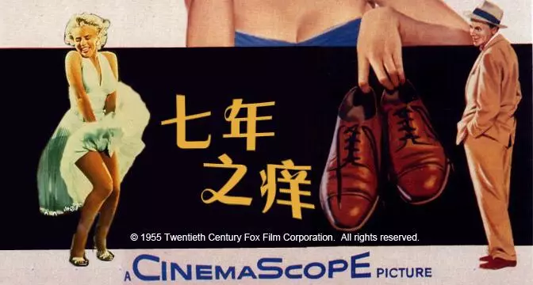
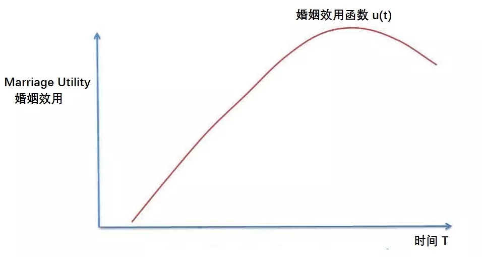
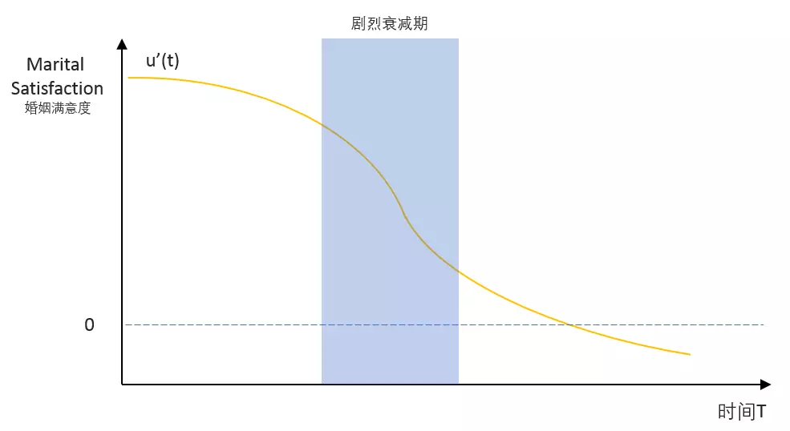
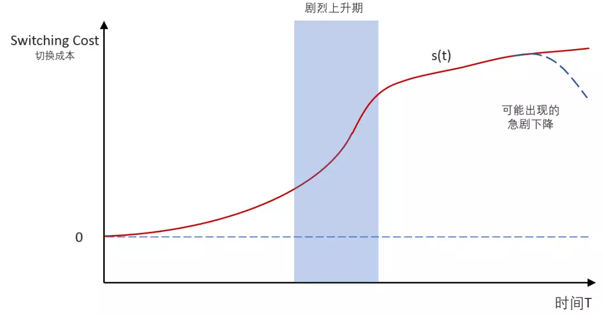
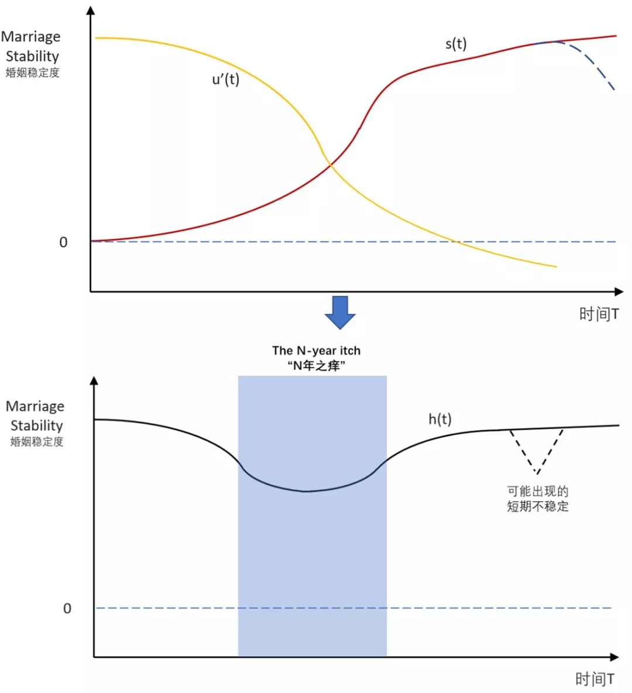
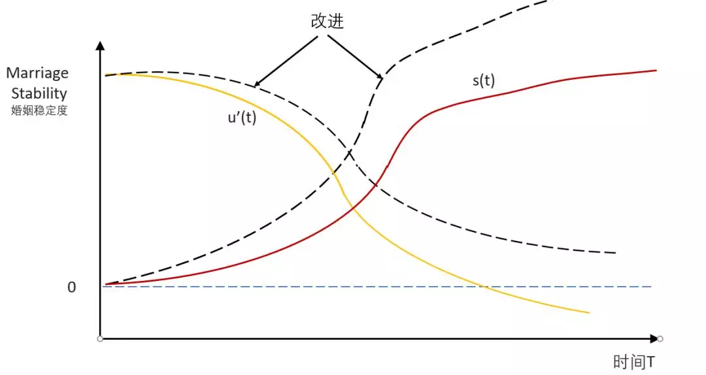
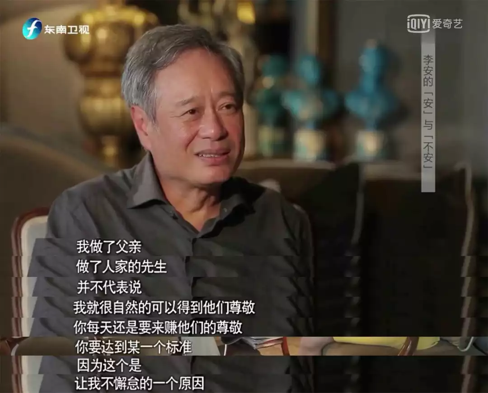
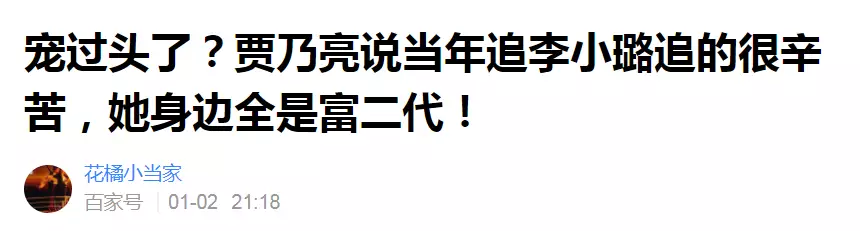
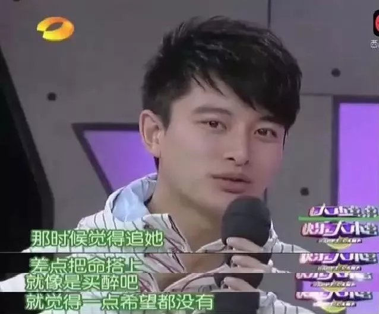
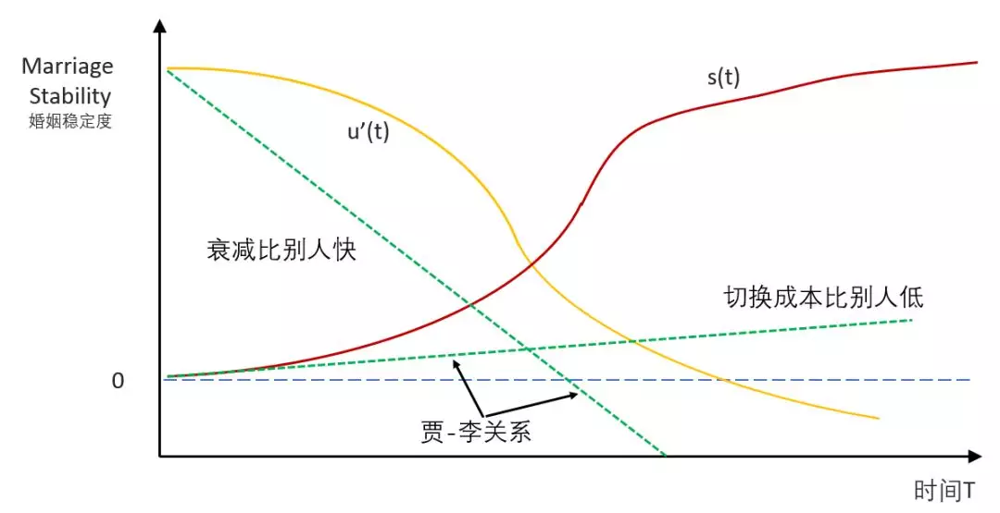

# 出轨经济学
@(婚姻)[模型解释, 出轨经济学, 婚姻, 婚姻满意度, 男女, 戴老板]

* [出轨经济学](#出轨经济学)
  * [The seven\-year itch](#the-seven-year-itch)
  * [第一个模型：婚姻效用模型 （Marriage Utility Model）](#第一个模型婚姻效用模型-marriage-utility-model)
  * [第二个模型：转换成本模型 （Switching Cost  Model）](#第二个模型转换成本模型-switching-cost--model)
  * [如何防止出轨](#如何防止出轨)
  * [贾\-李关系中的问题](#贾-李关系中的问题)
  * [对我们的启示](#对我们的启示)
  * [Referece](#referece)
  
  

[toc]

## The seven-year itch 

最近几天被“璐出贾笑”刷屏了。很多朋友在感慨：李小璐有贾乃亮这种男神丈夫，为什么还会跟一个哪方面都比不上她老公的人出轨呢？

我对娱乐圈的八卦通常毫无兴趣，但这件事情本身折射出很多经济学和心理学方面的规律，因此花了一些时间了解了这个事儿的来龙去脉。下面就从几个方面阐述一下出轨背后的动机和逻辑。

首先给大家介绍一下著名的**The seven-year itch Theory**，即**七年之痒理论**。

“The seven-year itch”（七年之痒）这个词来自于一部1955年的电影片名，导演Billy Wilder，主演玛丽莲梦露。那张著名的梦露捂住被风吹起的裙子的照片，就出自这部电影的拍摄过程。据说在拍摄这段镜头时，几千人围观，梦露反复拍了40多次，让一旁探班的老公Joe DiMaggio十分不爽。

电影非常经典，片名被翻译为“七年之痒”之后，这个词竟成为汉语常用词，但婚姻危机的高发期，到底是七年还是四年，学界尚且争论不休。不过，每对步入围城的伴侣都有几乎同样的感受：在经历完热恋的炽热和婚姻的甜蜜阶段之后，婚姻会经历一段低潮期，很多人都有想打破牢笼的欲望，少数人会付诸实践，比如这次事件中的女主角。

为了分析这种现象，我们用两个模型来量化整个婚姻声明周期。

## 第一个模型：婚姻效用模型 （Marriage Utility Model）

第一个模型叫做**婚姻效用模型（Marriage Utility Model）**，我们用一个函数U(t)来代表伴侣中的一方的婚姻效用变化，用大白话说，U(t)就是婚姻给一个人带来的幸福感随时间变化的曲线。

“Utility”(效用)是对人的感受的一种描述，没有办法做准确的度量。你如果让一个人对幸福感打分，恐怕他也很难用一个准确的分数来形容自身的感受。所以我们在这里只关心“效用“趋势和变化，不关注其绝对数量值是多少。

上图即为婚姻的效用函数，简单可以概括成:
1. **浪漫期**: 效用随时间不断增长；
2. **平淡期**：婚姻总效用开始面临边际效用递减（Deminishing Marginal Utility)，增速开始明显放缓；
3. **疲惫期**：由于各种生活，婚姻总效用开始缓慢衰减。整个过程会有反复和波动，但99%的婚姻符合以上曲线。

以下文字粗略反映了婚姻总效用随着时间的变化曲线：
> 女人18岁，你要骗她跟你睡
> 女人28岁，不用骗她就跟你睡
> 女人38岁，她编故事骗你跟她睡
> 女人48岁，你要编故事骗不跟她睡

在上述文字中，把女人换成男人，同样也成立。实际上，随着我国男人中年油腻现象越发严重，丈夫对妻子失去性吸引力，甚至远快于妻子对丈夫。

但婚姻效用模型还不能解释The seven-year itch Theory，即“总效用”还不是出轨与否的核心变量，我们还需要对模型做一定的处理。首先我们来看比较下列两位妻子对婚姻的满意度：
- 妻子A：丈夫去年收入10万，今年收入20万；
- 妻子B：丈夫去年收入100万，今年收入110万；

A和B两位妻子的丈夫，在过去一年均有10万绝对值的提升，如果纯粹按照婚姻效用函数，两者对伴侣满意度的提升应该是相同的，但在现实生活中，很显然是A的满意度会提升更多。引发这种不同的，就是[边际效用（Marginal Utility）](https://baike.baidu.com/item/%E8%BE%B9%E9%99%85%E6%95%88%E5%BA%94/555439?fr=aladdin)现象。
> 简单的解释**边际效应**：是指其他投入固定不变时，连续地增加某一种投入，所新增的产出或收益反而会逐渐减少。也就是说，当增加的投入超过某一水平之后，新增的每一个单位投入换来的产出量会下降。
> 
> 比如你饥饿的时候，吃1个馒头和第4个馒头的感觉（效应）是不一样的。
> 
> 通俗的解释是：
>我们向往某事物时，情绪投入越多，第一次接触到此事物时情感体验也越为强烈，但是，第二次接触时，会淡一些，第三次，会更淡……以此发展，我们接触该事物的次数越多，我们的情感体验也越为淡漠，一步步趋向乏味。
>
>这种效应，在经济学和社会学中同样有效，在经济学中叫“边际效益递减率”，在社会学中叫“剥夺与满足命题”，是由[霍曼斯](https://baike.baidu.com/item/%E9%9C%8D%E6%9B%BC%E6%96%AF/2632707)提出来的，用标准的学术语言说就是：“某人在近期内重复获得相同报酬的次数越多，那么，这一报酬的追加部分对他的价值就越小。”

事实上，在“出轨”现象，背弃婚姻的人更容易受到边际效用的变化的影响，而非总效用的变化（Feldman&Cauffman, 1999）。这就是为什么有些人抱怨“我对她/他那么好，偶尔太忙没顾上，怎么就变心了呢？”的原因。

我们将“婚姻边际效用”用u'(t)来表示，如下图所示，这本质上也是婚姻满意度函数。可以清晰的看到，婚姻满意度随着时间迁移，边际效用递减（Deminishing Marginal Utility)，同时会存在一个或多个剧烈衰减期，**如照顾刚出生孩子期间**、**经济拮据期间**、**婆媳矛盾期间**等。

但出轨通常并不在婚姻满意度的剧烈衰减期发生，如本次事件中的贾乃亮和李小璐，两者婚姻表面上看起来仍然甜蜜如故，即使李小璐对婚姻的满意度在缓慢下降，但并无“剧烈”的迹象。

而且，常识告诉我们，即使婚姻边际效用不断降低，但出规率并没有随着夫妻年龄的增长而增加，多数婚姻反而不断稳固。所以，在这里我们需要引入“出轨”的第二个核心模型：转换成本模型。

## 第二个模型：转换成本模型 （Switching Cost  Model）
婚姻的边际效用随着时间的推移而不断下降，但某一项事物却随着时间而不断累积，那就是“转换成本”(Switching Cost)，也就是通常所说的“出轨代价”或“离婚成本”，其包括以下几方面：
- 共同的孩子
- 社会的舆论
- 资产的分割
- 生活的冲击
- 传统的观念

我们用s(t)来表示Switching Cost随着时间变化的函数，如下图所示。通常“切换成本”随着时间线性增长，中间也会有迅速爬升阶段（如孩子的出生），也可能出现剧烈下降阶段（如孩子的成年）等。

我们把“满意度”（效用的边际）和“成本”相加，就得出了婚姻稳定度(Marriage Stability)函数 h(t)=u'(t)+s(t)，如下图所示：

**在某段时间内，婚姻满意度的下降大于转换成本的上升，形成一个明显的波谷，这段时间即“N年之痒”期间。**换句大白话说就是：**在婚内感受到越来越少的幸福，而换人成本还没那么高，此时最容易出轨**。

以上即为婚姻经济学模型的全部内容：婚姻稳定度=效用(婚姻满意度)+约束（转换成本）。上述模型**并非严格定量分析**，事实上，每一对夫妻的婚姻满意度曲线和转换成本曲线均不相同，**但整体符合上述曲线走势**。

我们需要数据来验证，我们不妨看一看著名偷情社交网站Ashley Madison的统计数据：
1. 约三分之一的Ashley Madison用户在他们的婚礼后的3-5年寻求他们的第一次婚外情；
2. 约四分之一的Ashley Madison用户是在他们孩子离家上大学的那一年注册了偷情账户。

因此，婚礼后3-5年和孩子成年离家这两个时间段，是出轨的高发期：前者是由于婚姻满意度的下降速度快于转换成本；后者是由于孩子成年引发的转换成本急剧下降。两者大致与我们的模型相符合。

有了**经过验证的模型**之后，下一个话题就很容易探讨：**如何防止出轨，以及贾乃亮和李小璐的问题出在哪儿**。

## 如何防止出轨
我们有了婚姻稳定度(Marriage Stability)函数图之后，就很容易得出防止出轨的方法：
1. 降低婚姻满意度的衰减斜率
2. 抬高出轨的转换成本。例如下面这两条应对措施。

摘自老掉牙的段子“老公出轨后，全国各省老婆的反应”
> 1. 发现老公出轨后，老婆一夜未睡。第二天，老婆先去美发店做个离子烫，下午做了个面膜，顺便到情趣商店买套性感内衣。晚上在家准备一个烛光晚餐，一共花费四百元。老公晚上回到家后，看到美丽性感的老婆，惊讶得合不拢嘴，深悔自己有眼无珠，并发誓再也不出轨了。这是个上海老婆
> &nbsp;
> 2.  发现老公出轨后，老婆一夜未睡。第二天，老婆回到娘家，把这件事原原本本的告诉了自己的弟弟，弟弟喊上姑姑家的大哥、舅舅家的老弟，每人手里提着条木棍，在丈夫回家的路上截住他，一针胖揍，老公被揍的鼻青脸肿，跟老婆下跪道歉，并发誓再也不出轨了。这是个东北老婆

上述两条纯属段子，如有雷同纯属巧合。两条段子中描述的情景并非“如何防止出轨”，而是“如何处理出轨”（而且这两种处理方式很明显都错了，尤其是上海版），不过却精确地阐述了防止出轨的正确方法：第一条提升婚姻满意度（或降低衰退斜率）；第二条抬升出轨成本。

所以，正确防止出轨的方式应该如下图：

**首先对于第一条：降低婚姻满意度的衰减斜率**:

简单来说：每个人在婚前都会为对方的幸福感而努力，但结婚并非是这种努力的终点，而是一个新的起点，婚后更加需要努力的让另一半满足，降低对方的满意度衰减斜率。

著名导演，也是著名好丈夫好父亲李安说的比我透彻，这里借用一下他的话：
> “我做了父亲、做了人家的先生，并不代表说，我就很自然地可以得到他们的尊敬。你每天还是要来赚他们的尊敬，你要达到某一个标准，因为这个，是让我不懈怠的原因。”——李安

李安的这番话讲的非常透彻，不过这番话其实是对着鲁豫说的，所以还是有点儿担心导演……不能不防啊！

**其次对于第二条：抬高出轨的转换成本**:

。此种方法的措辞比较多，社会上常见的做法在财产上做文章，例如签署净身出户协议、房产赠与改名。通常大家认为，这些招数对男人比较管用，尤其是净身出户协议这种“大杀器”。不过很可惜的是，似乎目前婚姻法并不支持此类协议，所以如果要跟老公签，最好先找律师问清楚。

另外一个很重要的措施是：**提前给另一半阐述出轨的严重后果**，例如绝不姑息、马上离婚、财产分割等。这样，会无形中抬升对方内心中的“转换成本”。很多人精虫上脑管不住自己，部分原因也在于没有清晰地认识到“转换成本”有多大，等到后悔时却什么都晚了。

## 贾-李关系中的问题

**首先第一条：李小璐的婚姻满意度函数的衰减斜率非常快**:

这个结果并非是贾乃亮做的不好（相反贾很努力了），而是从这段关系一开始，就已经奠定了。我们可以看下面的这张娱乐新闻标题：

另外，还有很多贾乃亮追求李小璐的故事，均为贾乃亮亲自讲述，比如下面这条：
> “我苦苦追了一年，想尽办法组局约她，兜里钱都花没了。后来不得已接了一个片酬比平时低三倍的戏，还特别累，但是没办法啊，我想约她总得请她吃饭吧，结果拍了三个月回来，人家又快把我忘了。”

或者下面这张图：

贾乃亮个人条件其实很好，个高英俊大长腿，并不比戴老板差。之所以追李小璐追的如此辛苦，原因可能有二：一是李小璐身边并不缺贾乃亮这种类型的男人，她见的太多了；二是贾乃亮身上闪光的地方，在李小璐眼里没有什么价值。

以上两条无论哪条成立，都会导致李小璐婚后的幸福函数衰减斜率远大于普通情侣。用简单的话说：**贾乃亮已经拼尽了全力去追求对方，而这些努力在对方眼里并非珍贵。婚后，贾乃亮仍然延续了努力和热情，但这些东西既然在婚前都没有被特别珍惜，在婚后自然也无法改善李小璐满意度的衰减斜率，over。**

**其次第二条：贾乃亮没有抬升李小璐的转换成本，反而做了压低**:

在两人携手参加的某一期节目里，主持人先是问贾乃亮是否接受另一半有异性知己，贾乃亮大方称“随便”。然后主持人又问“对方出轨后主动承认错误会原谅吗”这个问题，贾乃亮做了如下回答：

我们在前面阐述过，抬高转换成本的很有用的措施就是“**提前给另一半阐述出轨的严重后果**”，而在贾乃亮这里，简直是反其道而行之。事实上，这种“Infidelity Passport”(出轨许可证)，在国外早就被证明是昏招中的昏招，愚蠢中的愚蠢。

当然，如此愚蠢的人并非独家，女版的贾乃亮也照样存在。比如2014年，陈思成和佟丽娅被问到“如何面对另一半出轨”，佟丽娅说“对我来说回家就好”，于是没过几年，陈老师就被卓伟老师拍到玩3P了……

综上两条，李小璐的婚姻稳定度函数，将呈现下图的样子，特意用绿色虚线标注：

结论：李小璐的婚姻稳定度函数h(t)一定会出现时间跨度较普通情侣更长的“波谷”，即出轨高危期远高于普通夫妻。本身处在娱乐圈中，诱惑又比常人更多，因此**出轨几乎成为一个必然的选项，只是时间问题**。

**换句大白话说：这尼玛怎么可能不出轨？**

## 对我们的启示
其实分析了这么多，大家看到这里，对如何防止出轨应该都有了自己的结论：
1. **努力降低婚姻满意度衰减的速度；**
2. **努力抬高另一半出轨的转换成本。**

具体如何做，大家可以自由发挥。实在还没想好怎么办的同学，可以先跟另一半一起看几部关于出轨的惊悚电影，推荐如下表：
>《看不见的客人》，西班牙，豆瓣评分8.7
>《女尸迷案》，西班牙，豆瓣评分7.4分
>《消失的爱人》，西班牙，豆瓣评分8.7分
>《福斯特医生》，美剧，豆瓣评分8.9
>《赛末点》，英国，豆瓣评分8.1

以上电影均带有惊悚或黑暗色彩，远没有《英国病人》这种出轨片来的唯美浪漫。说不定看完之后，两个人心里的“转换成本”都高了不少呢（别吓得不敢结婚就行……

----------------------------------------

我原先对**模型**、**建模**这类带有很强技术色彩的术语不是非常明白，后来看了吴军的一篇文章，大意是说:

以色列的一家创业公司的在线相亲网站，在用户输入了 年龄、收入、住宅、兴趣爱好等参数的情况下，就开始给这些用户评分，然后男女根据分数进行匹配，比如7分男，看到的是6~8分女，不会给他看到9,10分女，这样情况下，相亲成功率大幅提升。

吴军的这篇文章瞬间让我意识到了什么是**模型**，什么是**参数**，什么又是**算法**，并且让我知道这些概念如何应用于生活和产品方面。

本篇文章其实算是对**模型**这个概念的一个加强理解。稍后我会把吴军的文章也整理出来，把两篇文章链接起来。

## Referece

1. 出轨经济学( 戴老板:) https://dwz.cn/phq5qQg0

   > 原创： 戴老板  饭统戴老板
   > 微信公众号ID：worldofboss

2. 效用模型的原理概述: https://www.cnblogs.com/xunziji/p/6853161.html
