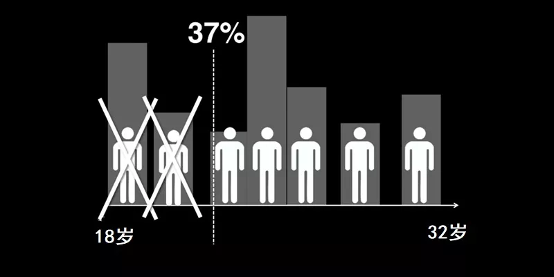
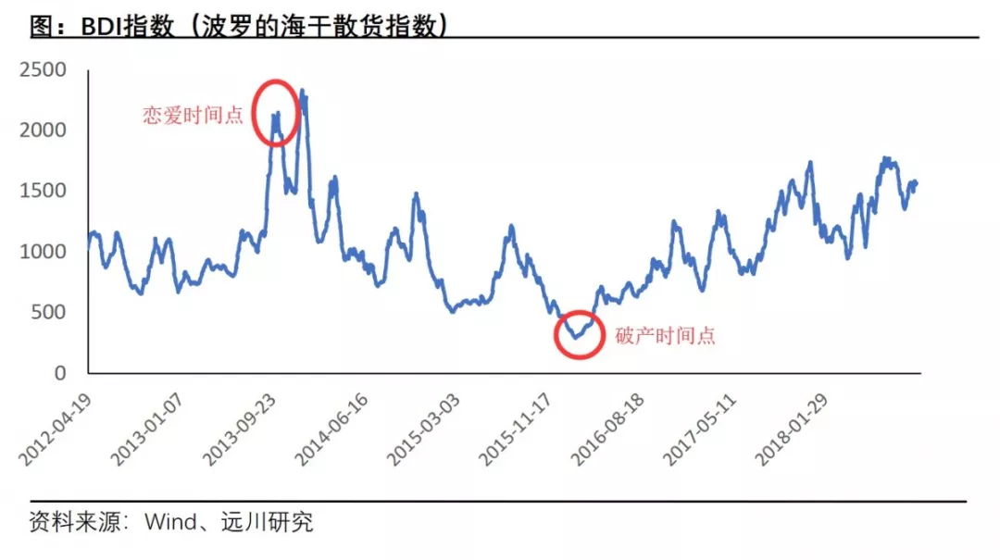
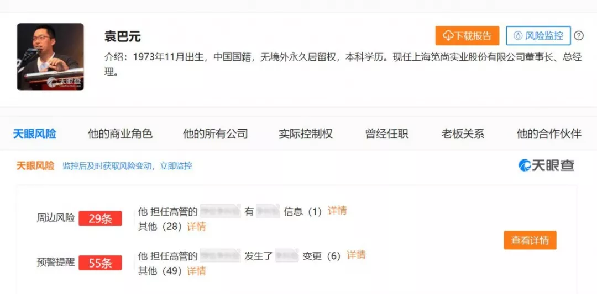

# 择偶经济学
@(婚姻)[模型解释, 择偶经济学, 婚姻, 婚姻满意度, 男女, 戴老板]

[toc]

* [择偶经济学](#择偶经济学)
  * [0\. 张雨绮的择偶](#0-张雨绮的择偶)
  * [1\. 结婚时机学：最佳停止理论](#1-结婚时机学最佳停止理论)
  * [2\. 配偶互补学：帕累托的最优](#2-配偶互补学帕累托的最优)
  * [3\. 潜力判断学：行业周期理论](#3-潜力判断学行业周期理论)
  * [4\. 婚前调查学：请问咱妈贵姓](#4-婚前调查学请问咱妈贵姓)
  * [5\.  尾声](#5--尾声)
  * [参考资料：](#参考资料)
  
  

## 0. 张雨绮的择偶

[张雨绮](https://baike.baidu.com/item/%E5%BC%A0%E9%9B%A8%E7%BB%AE/8785636?fr=aladdin)在演艺圈内以彪悍著称，掌掴汪小菲，脚踹王全安，刀劈袁巴元，似乎没人打得过她，但大家疑惑的是，为什么她选男人的眼光，跟矫健的身手相比差这么多？

2011年4月，张雨绮跟导演王全安领证结婚，婚后甜蜜无比。谁能料到王导演出门不喜欢开私家车，反而热衷打的，2014年9月因为嫖娼被抓，张雨绮可没有嫁给脸盲的那谁这么能忍，两人在第二年离婚。

2016年10月，张雨绮跟绍兴商人袁巴元闪电结婚，这次粉丝们多长了心眼，帮她扒出袁巴元的各种黑料：履历掺假难言诚信、欺骗前任实属渣男，拖欠工资官司不断等。结婚两年后，两人发生争执，张雨绮再次离婚。

电影《美人鱼》里，张雨绮霸气地说：“我有钱有身材，追我的人从这里排到法国！”其实，别说排到法国，就是追你的人绕地球三圈，如果没有正确的择偶姿势，也只是在按概率挑渣男而已，既浪费了感情，又耽误了青春。

对付前几任，手、脚、刀都用上了，要是下一任还是渣男，难道要上枪吗？

其实无论是女明星，还是普通人，科学择偶都是一门必修课，除了遵从感情的指引走心，还得依靠科学的力量走脑。比如戴老板的单身好友M总，最近就试图用统计学来找[^2]列了下面这么一张表：

[^2]: 爱情数学，汉娜·弗莱，2016

1.  我附近女性有多少？（上海:1500万）
2.  多少人年龄上适合？（20%:300万）
3.  多少人可能是单身？（20%:60万）
4.  多少人学历是本科？（20%:12万）
5.  多少人颜值还可以？（10%:1.2万）
6.  多少人单位还可以？（10%:1200）
7.  多少人喜欢啤酒肚？（20%:240）
8.  多少人不介意微秃？（10%:24）
9.  多少人我妈会喜欢？（50%: 12）
10. 多少人可能喜欢我？（10%: ≈1）

于是，事业有成、车房不缺、发际线高企、啤酒肚低垂的魔都金融高管M总，悲哀地发现，整个上海适合他的结婚对象，可能只有一个。

M总的这种貌似科学的方式，当然不靠谱。其实最适合用来指导婚恋的，是经济学。作为一门古老的学科，经济学原理已经影响人们的择偶选择长达几千年。本篇文章就来跟大家探讨择偶经济学的原理和应用。文章分成四个部分：

1. 结婚时机学：最佳停止理论
2. 配偶互补学：帕累托的最优
3. 潜力判断学：行业周期理论
4. 婚前调查学：请问咱妈贵姓

下面进入正文部分。

## 1. 结婚时机学：最佳停止理论

1611年，伟大的天文物理学家约[翰尼斯·开普勒（Johannes Kepler）](https://en.wikipedia.org/wiki/Johannes_Kepler)的妻子去世，两年后，科学家准备续弦，重新组建家庭。

天文物理学家择偶，过程自然是非常硬核。由于开普勒的上一段婚姻并不幸福，所以这次他拿出研究天文学的精神，列出多项参数，对交往的女士详细考察，力求找到完美的对象，其严谨程度不亚于在太空中寻找一颗小行星。

开普勒像面试一样挨个交往相亲对象，在见到第5名女性时，他眼前一亮，被对方的勤俭持家、善良忠诚所打动，本想就此收手，但毕竟男人都是大猪蹄子，“下一个是不是更棒？”的想法，驱使他继续去情场猎艳。

最后，开普勒一共交往了11名女士，但他并没有找到更好的，反而一直对第5名女士牵肠挂肚。在某天去演讲的途中，他突然下定决心，调头前往第5名女士的家里，厚着脸皮向这位被他拒绝过的女士求婚。幸运的是，对方答应了。

就这样，开普勒跟这名叫做苏珊·罗伊特林格的女子结婚了，两人生育了6名子女，生活幸福，携手到老。

并不是每个人都能像开普勒这样幸运，他的故事给我们留下了这样的一个迷思：一个人在交往了多少对象之后，才应该放弃“下一个更好”的想法，确定自己的理想伴侣？换句话说就是：**我该什么时候收手**？

这个问题，表面上是个感情问题，本质上却是个数学问题。它的系统性解决，要等到340年之后的1960s年代。

1960年2月，《科学美国人》刊登了一组数学难题，其中有一个跟开普勒相亲问题有相同本质的“**[经典秘书问题](https://www.cnblogs.com/TenosDoIt/p/3747946.html)**”：
> 假设有n名候选人来申请秘书岗位，你作为面试官，要挨个面试他们，并当场决定要不要。要，面试结束，不要，换下一个，不能回过头去录用被拒绝过的人。那么什么样的策略，才使最佳人选被选中的概率最大？

这个问题最好的解决方案叫做“**最优停止理论（optimal stopping theory）**”。推导过程在此不赘述，简单来说就是：考察前37%的申请人时，不要接受任何人的申请；然后，只要任何一名申请人比前面所有人选都优秀，就要毫不犹豫地选择他。

这个结论如果用在爱情上，就是：要想找到最理想的对象，你应该果断拒绝掉前37％的追求者（不管他们有多好），然后在遇到比之前37%的人更好的人选时，果断娶/嫁他，不要管后面是不是还有更好的。

以开普勒为例，他一共给自己安排了11次相亲，最大概率找到理想妻子的方法是：放弃掉前11×37%≈4位女士，然后从第5个开始，只要下一位女士比前面4个更令他心生爱慕，就马上终止相亲，跟这位女士结婚。

事实上，开普勒遇到的第5位女士，就比前4位都要好，开普勒完全被她迷住，从概率上来讲，这位女士最可能是开普勒的理想妻子，事实证明也是对的。在他相完11次亲之后，开普勒并没发现比第5位更好的，只能厚着脸皮再找回来。

按照这套理论，“结婚时机学”方法论可以总结为：

1. 估算出这辈子你能谈多少次恋爱，用N来表示。比如假设你从18岁就开始谈恋爱，可以谈到32岁（再拖就要被老妈吊打和以死相逼），2年谈一次，那么N就等于（32-18）/2 = 7次；
2.  算出临界点 M=N×37% 。比如7×37% = 2.59 ≈ 2次
3.  执行策略：前M个恋爱对象统统放弃，后面只要遇到比前M个好的人，就定下来。在假设中，就是前2个恋人放弃，从第3个开始，只要比前2个好，就确定关系。

感兴趣的同学可以算一算，最大概率适合你的人，是还没出现，还是已经被你错杀了？

当然，以统计学为基础的模型，一旦用于感情生活，就会过于*冰冷和生硬*。虽然数字和概率要远比山盟海誓和甜言蜜语真实，但还是请读者谨慎使用。其实“最优停止理论”还可以广泛用于面试、买房、购物等，婚姻只是一个小小的应用领域。

卡内基-梅隆大学的运筹学教授迈克尔·特里克，曾经用这套方法来指导择偶，他在结束“观察期”后，很快便发现某个交往的姑娘比之前所有约会对象都优秀，符合算法为这个步骤开出的所有条件。于是果断出手，向她求婚。

万万妹想到，女孩干脆利落地拒绝了他。

这个悲伤的故事，可以用一段流传甚广的段子来总结：总有一天，你会遇到这样一个女孩，她温柔体贴，漂亮大方，不嫌你穷，不嫌你丑，不要钱，不要房，不要车，也不要你。

时机可以单向演算，婚姻却是双向选择。在决定出手前，一定先让自己足够优秀，否则任何模型计算出来的时机，都可能变成一场缜密的一厢情愿。

## 2. 配偶互补学：帕累托的最优

地产圈企业家有两段婚姻非常有名，一个是万科创始人[王石](https://baike.baidu.com/item/%E7%8E%8B%E7%9F%B3/1796370?fr=aladdin)的婚姻，一个是 SOHO中国董事长[潘石屹](https://baike.baidu.com/item/%E6%BD%98%E7%9F%B3%E5%B1%B9)的婚姻。

1977年，25岁的王石跟太太王江穗结婚。王石的父亲王辉曾经是三五八旅王震的下属，担任过柳州铁路局局长；王江穗的父亲王宁也是老革命，80年代曾官至广东省委副书记和省公安厅厅长，他当年在省委的领导，后来更是天下皆知。

王石从部队复员后进入郑州铁路局工作，靠“推荐”上了大学，毕业后被分配到广州铁路局，认识并娶了王宁的三女儿王江穗，此后便一帆风顺，他于1980年进入广东经贸委，1983年辞职到深圳，倒车皮炒东北玉米，攒了第一桶金。

这段婚姻的关键词是：**门当户对**。

1994年，华尔街回来的投资银行家张欣跟潘石屹结婚。张欣妹妹特地从美国飞过来看这个出生于甘肃天水农村而且离过两次婚的姐夫，见完后用一首歌来表达失望之情：“没有花香，没有树高，他是一棵无人知道的小草。

张欣和潘石屹的差距，可以用光年来计算。张欣第一次见潘石屹时，潘石屹穿着一件藕荷色的西装，一条大花的领带，头顶还有点儿秃，活像一个乡镇企业家。而毕业于剑桥大学的张欣，却是个不折不扣的华尔街精英。

这段婚姻的关键词是：**优势互补**。

这两段婚姻，最后结局却是不同的方向：王石和王江穗的婚姻被所有人看好，但结婚36年后，王石投入田朴珺的怀抱；而潘石屹和张欣的婚姻被所有人看衰，但两个默契配合，创造了惊人的财富，感情虽有过磕碰，但维持至今。

到底是“门当户对”好，还是“优势互补”好，在回答这个问题之前，我们先需要了解一个经济学概念。

1992年诺贝尔经济学奖得主，芝加哥大学教授[加里·贝克儿（Gary Becker）](https://baike.baidu.com/item/%E5%8A%A0%E9%87%8C%C2%B7S%C2%B7%E8%B4%9D%E5%85%8B%E5%B0%94/11052236?fr=aladdin)曾经提出过这样的理论：“个人通过寻找配偶，来达到效用最大化。”按照贝克儿的观思路，婚姻应该是一个追求**[帕累托最优（Pareto Optimality）](https://baike.baidu.com/item/%E5%B8%95%E7%B4%AF%E6%89%98%E6%9C%80%E4%BC%98/1768788?fr=aladdin)**的过程。

帕累托最优是经济学中的一个重要概念，在经济学，工程学、社会学等学科里有广泛的应用。它指的是这样一种状态：**在不使任何人境况变坏的情况下，不可能再使某些人的处境变得更好。而追求帕累托最优的过程，叫做帕累托改进**。

两个人的婚姻结合，就是一个追求帕累托改进的过程。我们可以采用一个成熟模型[^3]：

[^3]:从红楼梦中看婚姻的帕累托最优，2012

假设男生婚前的生活质量用X表示，女生婚前的生活质量用Y表示，婚后一起生活，婚姻生活创造的东西，用一个随时间变化的变量m来表示，他们共同拥有双方的资源，婚后的每人所得分别都是$ \frac{X+Y+m}{2}$。

门当户对的情况下，X≈Y，那么，只要m>0，两者都能达到帕累托改进。换句话说，只要夫妻能够在婚姻中创造一些正向产品，都会让彼此感到比婚前幸福。所以**大部分的门当户对的婚姻，在刚开始的那些年都非常顺利**。

门不当户不对的情况下，X和Y相差很大。假设X=3，Y=9，则各人所得为（3+9+m）/2。当m<6时，婚后各人所得小于9，此时Y的状况变糟了，对婚姻是不满意的；当m=6时，婚后各人所得等于9。因此，要想婚姻幸福，m必须大于6。

因此，类似张欣和潘石屹这样差异悬殊的婚姻，需要在婚后的共同生活中创造出相当多的“正能量”，也即m一定要相当大，才能维持幸福感。所幸的是，张欣和潘石屹互补性非常强，对这一点，张欣婚前就想的很清楚：
> “他能教会我许多东西。我一直在国外生活，对国内很多东西都不懂，而他是一个土生土长的中国企业家，我希望未来能在中国发展，那么他就是我现成的又具有实际经验的老师。我觉得这个婚可以结，退一万步说，即使失败了，我也会从这个婚姻中受益。”

这哪里是婚姻的态度，这简直是创业找合伙人的态度。

不过尽管想的很清楚，但潘张二人的婚姻，在最初两年仍然是磕磕碰碰，甚至一度差点儿离婚，后面两人开始逐渐默契，创办的SOHO中国获奖无数，上市后更是让两人身家超过百亿。正是不断增长的m值，让二人的婚姻稳固无比。

当然，既有钱又有名的潘总，身边不乏往上扑的小姑娘，但婚姻之所以仍然牢固，得益于张欣的技巧：**大幅提高出轨成本**（方法详见[《出轨经济学》](https://www.evernote.com/l/ALqLaVYbI-lAgZGiMba34V5phgwxdozP4ic/)）。不信的话，可以揣度下为何地产商潘老板，最近却转型摄影家潘老师了。

倒回到王石的婚姻中。尽管王石婚后的成功都跟王江穗密不可分（无论对家庭的付出，还是对事业的“助力”），但**在“门当户对”的婚姻里，人人往往追求一致性，比如家庭、财富、习俗等，却疏忽了互补性**。

中国多数男人在成功后都会狼心狗肺，认为自己的成就跟妻子的付出关系不大，将婚姻共同创造的价值局限到孩子等少数事物范围内，即**认为m值很小**。然后，在妻子为丈夫烧了几十年的饭之后，丈夫却转身给年轻姑娘做红烧肉吃。

总结来说，“优势互补”最初几年会磕磕绊绊，但越往后帕累托改进的空间越大，婚姻之路会愈发顺畅；“门当户对”的婚姻前几年会一帆风顺，但由于过于追求一致性，缺乏互补性，越往后帕累托改进的空间越小，出现问题的可能性反而越大。

假如你的事业突飞猛进，那么尽量找一个优势互补的对象，刚开始的磕绊会被迅速增长的成就所冲销；如果你的生活在可预见的将来都很平淡，那么找一个门当户对的对象，或许是一个更好的选择。

## 3. 潜力判断学：行业周期理论

2013年9月，前男友够组建两个加强连的[徐若瑄](https://baike.baidu.com/item/%E5%BE%90%E8%8B%A5%E7%91%84)，遇到了新加坡马可波罗海业集团主席李云峰。女的清纯性感，男的英俊多金，两个人迅速擦出爱情的火花，几个月后便步入婚姻的殿堂。

2016年4月，结婚不足三年的徐若瑄，突然被曝出丈夫公司陷入危机，单季度亏损820万美元，欠债超过12.7亿人民币，濒临破产保护，徐若瑄不得不在艰难地生完小孩之后，复出赚钱。

从2013年9月，到2016年4月，命运仿佛向徐若瑄开了一个峰回路转的玩笑。但徐若瑄不知道的是，冥冥之中的确有一种神秘的力量，在操纵着她的婚姻。这种神秘力量，叫做**行业周期**。

现在，就让我们从行业分析的角度，来剖析徐若瑄的这段大起大落，请各位想嫁入豪门的女同学……和男同学，仔细记好笔记。

徐若瑄的丈夫李云峰，从事的是航运生意。旗下的[马可波罗海运（Marco Polo Marine）](https://baike.baidu.com/item/%E9%A9%AC%E5%8F%AF%E6%B3%A2%E7%BD%97%E6%B5%B7%E4%B8%9A%E6%9C%89%E9%99%90%E5%85%AC%E5%8F%B8/13012319)主要提供两块业务服务，一是做为船东与租船业务，主要为海上支援船与散货驳船，运煤起家。二是在印尼巴丹岛有船厂提供造船修理等业务。

简单说，徐若瑄的婚后物质幸福指数，就是海运行业景气指数，感情幸福指数嘛，不能说全然相关，但肯定受其影响，心知肚明的事儿这里就不论证了。

海运行业的景气程度，有一个成熟的指数可以反映：[波罗的海干散货指数](https://baike.baidu.com/item/%E6%B3%A2%E7%BD%97%E7%9A%84%E6%B5%B7%E5%B9%B2%E6%95%A3%E8%B4%A7%E6%8C%87%E6%95%B0/6790749?fr=aladdin)（Baltic Dry Index，简称BDI）。这个指数其实跟波罗的海关系不大，是由几条主要航线的即期运费加权计算而成，反映的是海运行业的景气程度，非常权威。

我们把徐若瑄和李云峰的恋情时间拉出来，结合BDI指数，可以得到下面这张图：

从图中我们可以看出，李云峰和徐若瑄相识的时候，正好处于航运业景气高点，而没过多久，航运景气度就随着欧债危机和中国经济低迷，一路走低，到了2016年4月，传出了李云峰公司破产的消息，此时正好是行业周期低点。

总结起来可以说，徐若瑄婚后生活幸福指数，是由一个波动上千年的海运周期决定。她要是知道这一点，恐怕会目瞪狗呆。

这种因为“行业周期影响婚后生活”的例子，其实比比皆是。著名影星车晓，在2010年1月24日跟山西首富，海鑫钢铁集团掌门人李兆会结婚，两人的奢华婚礼曾轰动全国。2012年4月，二人离婚。两年时间，其实是一个钢铁价格周期。

当然，还有一些豪门婚姻，被一些突发的因素所干扰，比如大s徐熙媛就绝对不会料到，自己的豪门婚姻会跟“八项规定”扯上关系。

2011年3月，徐熙媛俏江南少东家汪小菲结婚，一时风光无限。可是没料到的是，婚礼一年后，“八项规定”就横空出世，高端餐饮行业遭遇重创，汪小菲和母亲张兰，也因业绩完不成对赌，逐渐失去了公司控制权。

当然，尽管丈夫的财富受到了周期的影响，但无论是徐若瑄，还是徐熙媛，感情生活上都很幸福，大s的“剥虾论”更是让一众女粉丝羡慕。不过问题在于：假如她们的丈夫当初是在行业低谷与她们相识，她们还会嫁吗？

以前北京有个搞私募的大哥，2015年牛市那会儿靠打板赚了几个亿吧，娶了个三线小明星，腿长肤白，妖娆性感，回头率超高。后来股市遭遇N次股灾，大哥公司身价缩水95%以上，今年女方提出离婚，据说已经到了庭审阶段了。

**人们往往会把来自周期的力量，错误地归功于自己的能力，等到潮水退去的时候，才发现自己其实啥都不是**。

对于欲嫁豪门的女明星来说，夫家的行业周期很重要，豪门有兴衰，入手需谨慎。不过对于老百姓来说，周期这玩意儿，别太当回事儿。普通人相濡以沫，相互扶持，想太多没意义。

## 4. 婚前调查学：请问咱妈贵姓

据说在上海相亲，每一个问题都是刀光剑影，步步惊心，比如这样一句：“小伙子，你家停车好停伐？停车费多少钱啊？回家高架堵不啦？”

这种充满套路和陷阱的问题，其实就是最简单的婚前调查手段。很多不懂门道的同学，往往被淘汰了都不知道为啥。

戴老板有个朋友，人称磁器口江疏影，长得漂亮不说，还是公司调研的一把好手。有一次，一个朋友帮她介绍了一个河北富二代，说是刚从英国留学回来，家里做轮胎生意，跟外企合资，年利润大几千万。就这么多信息。

磁器口江疏影花了两天时间，凭借这点儿信息，先去轮胎行业协会筛合格企业，再用纳税信息缩小范围，最后用天眼查拉股权关系，成功地把范围缩小到两家企业：两家企业的实际控制人都是女性，是50岁左右。

于是，她在跟这位富二代的第一次约会时，问了个一般女孩不会提的问题：阿姨贵姓啊？

这位不走寻常路的美女，其实已经不是在相亲，而是满足她的探究欲。富二代回答了她妈贵姓的这个古怪问题之后，她马上对号入座，一口气把富二代妈妈的名字、公司、地址、股权、融资、诉讼统统都讲了出来，对面的人下巴差点儿掉下来。

讲完后喝了一大杯苏打水，然后招呼服务员买单，跟富二代说其实我对你不太感兴趣，然后潇洒地扬长而去。我后来问她，是因为你研究出他的家族企业有什么风险吗？她摇摇头，说这倒没有，没兴趣的主要原因是因为丑。

其实**越是受教育程度高，越擅长用各种工具来做婚前调查，问小区物业费和停车费，只能说是初级手段**。

以张雨绮为例，她最近的一段婚姻失败，其实跟没有做好婚前调查有很大的关系。比如袁巴元这个人的所有信息，其实都可以用商业安全工具“天眼查”来查询得到，以下是“天眼查”上袁巴元老板详情页的截图，信息应有尽有。

根据媒体报道，张雨绮和袁巴元认识70天就闪婚，这么短的时间，很难深入了解一个人。借助天眼查，一是可以对袁巴元旗下18家公司做“股权穿透”，了解他的真实财富水平；二是可以用监控提醒功能，第一时间获取袁巴元所有公司的任何变更动态，毕竟嫁人之后老公的风险值也就约等于是你的风险值。

在过去一年里，金融圈贡献了主要的娱乐内容，娱乐圈则普及了金融知识。在金融和商业这方面，张雨绮还要多学多练，跟同行好好学习，比如赵薇和范冰冰。

## 5.  尾声
在《吐槽大会》里，张雨绮说：“谁的人生，没有几个大坑呢？跨过去啊，就是成长。”对此李诞说：“人生很长，困难都在后头，我就不多说了，我感觉你，早晚还得来一回。”那会儿张雨绮还没第二次离婚。

人生的坑的确很多，但相当一部分，是可以用科学的防范来规避的。本文给大家总结的四条择偶经济学细则，就是可以帮你避免掉坑的方法：
1. “结婚时机学”告诉你什么时候该出手
2. “择偶互补学”告诉应该选什么样的人
3. “职业周期学”教你如何判断对方工作
4. “婚前调查学”给你介绍了调查方法论

当然，所有的经济学方法论，最后都可能在爱情的面前败下阵来。毕竟，理智和逻辑是我们进化的推手，但感情和热爱，却是让我们蜕变成“人”的最根本基础。

## 参考资料：

> 原文：择偶经济学 https://dwz.cn/VhOD46X0
> 作者： 饭统戴老板
> 公众号ID: worldofboss

1. 择偶经济学 (饭统戴老板)  https://dwz.cn/VhOD46X0
2. 算法之美，Christian & Griffiths，2018
2. 爱情数学，汉娜·弗莱，2016
3. 从红楼梦中看婚姻的帕累托最优，2012
4. 爱情市场，玛丽娜·艾德谢德，2017
4. [Evernote](https://www.evernote.com/l/ALqLaVYbI-lAgZGiMba34V5phgwxdozP4ic/)
