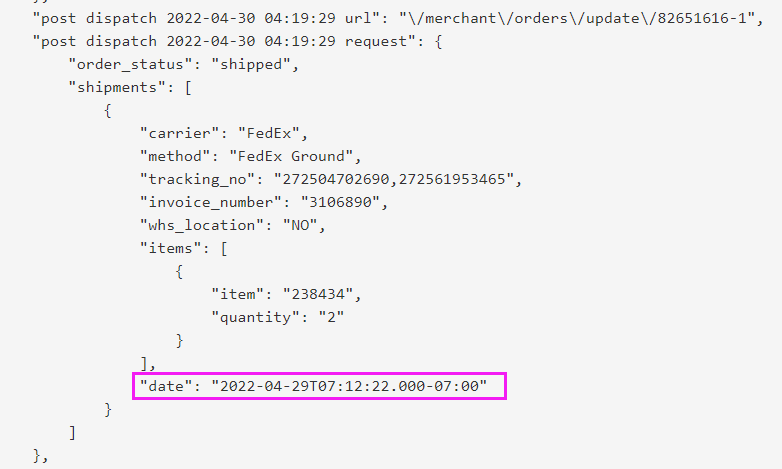
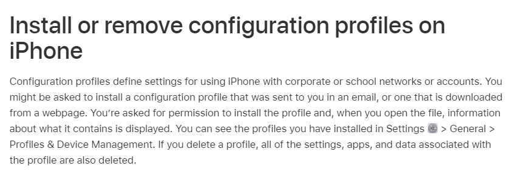
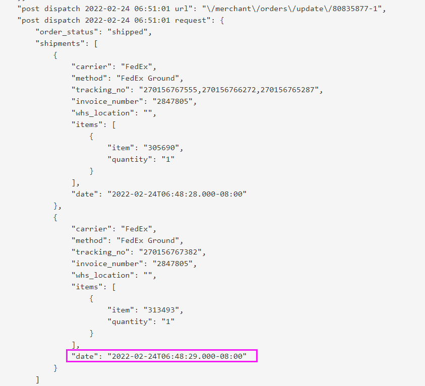

[toc]


## Datetime


 


[yyyy'-'MM'-'dd'T'HH':'mm':'ss - What is the meaning of 'T' here?](https://stackoverflow.com/questions/6340794/yyyy-mm-ddthhmmss-what-is-the-meaning-of-t-here)

It just shows the start of the **Time** component in a standard ISO 8601 date time string. Wikipedia has a [detailed page](http://en.wikipedia.org/wiki/ISO_8601#Combined_date_and_time_representations) about this standard format.

> 它只是在标准ISO 8601日期时间字符串中显示Time组件的开始。Wikipedia有关于这种标准格式的详细页面。

### Combined date and time representations

```D
<date>T<time>
```

A single point in time can be represented by concatenating a complete date expression, the letter *"T"* as a delimiter, and a valid time expression. For example, "2007-04-05T14:30". In ISO 8601:2004 it was permitted to omit the *"T"* character by mutual agreement as in "200704051430" but this provision was removed in ISO 8601-1:2019. Separating date and time parts with other characters such as space is not allowed in ISO 8601, but allowed in its profile RFC 3339.

If a time zone designator is required, it follows the combined date and time. For example, "2007-04-05T14:30Z" or "2007-04-05T12:30−02:00".

Either basic or extended formats may be used, but both date and time must use the same format. The date expression may be calendar, week, or ordinal, and must use a complete representation. The time may be represented using a specified reduced precision format.


这段话有些词虽然认识，但是由于一词多义，造成了阅读上的障碍。

- but this **provision** was removed. 

  Provision的本意是提供（名词），但是这里显然无法解释通畅，翻开字典发现：

  n. 提供, 供给; 饮食供应, 准备; **条款**
  v. 为…提供所需物品（尤指食物）

  其有条款的意思：**a clause in a law or contract stating that a condition must be met**. 

  >  This provision gives the president total and unchecked power.这条规定赋予了总统绝对及不受约束的权力。

- characters such as space is not allowed in ISO 8601, but allowed in its **profile** RFC 3339.

  Profile第一印象是轮廓，User Profile是用户画像，在互联网兴起之前这个是用户信息的意思，等用于 User Information. 

  但是这里做哪个解决都有点不通。

  然后Google了一下，大概推断出来这个是配置文件。 如这篇文章《[Configuration Profiles vs Endpoint Security settings - How do you do yours?](https://www.reddit.com/r/Intune/comments/mhqm8m/configuration_profiles_vs_endpoint_security/)》

   然后更重要的是，苹果公司系列产品，对配置文件都叫 [configuration profiles](https://support.apple.com/guide/iphone/install-or-remove-configuration-profiles-iph6c493b19/ios):

   

  A [configuration profile](https://developer.apple.com/business/documentation/Configuration-Profile-Reference.pdf) is an XML file that allows you to distribute configuration information. If you need to configure a large number of devices or to provide lots of custom email settings, network settings, or certificates to a large number of devices, configuration profiles are an easy way to do it.

   


### Coordinated Universal Time (UTC)

If the time is in [UTC](https://en.wikipedia.org/wiki/Coordinated_Universal_Time), add a *Z* directly after the time without a space. *Z* is the zone designator for the zero UTC offset. "09:30 UTC" is therefore represented as "09:30Z" or "T0930Z". "14:45:15 UTC" would be "14:45:15Z" or "T144515Z".

### Time offsets from UTC

he [UTC offset](https://en.wikipedia.org/wiki/UTC_offset) is appended to the time in the same way that 'Z' was above, in the form ±[hh]:[mm], ±[hh][mm], or ±[hh].

Negative [UTC offsets](https://en.wikipedia.org/wiki/UTC_offset) describe a [time zone](https://en.wikipedia.org/wiki/Time_zone) west of [UTC±00:00](https://en.wikipedia.org/wiki/UTC±00:00), where the [civil time](https://en.wikipedia.org/wiki/Civil_time) is behind (or earlier) than [UTC](https://en.wikipedia.org/wiki/UTC) so the zone designator will look like "−03:00","−0300", or "−03".

Positive [UTC offsets](https://en.wikipedia.org/wiki/UTC_offset) describe a [time zone](https://en.wikipedia.org/wiki/Time_zone) at or east of [UTC±00:00](https://en.wikipedia.org/wiki/UTC±00:00), where the [civil time](https://en.wikipedia.org/wiki/Civil_time) is the same as or ahead (or later) than [UTC](https://en.wikipedia.org/wiki/UTC) so the zone designator will look like "+02:00","+0200", or "+02".

Examples

- "−05:00" for New York on standard time ([UTC-05:00](https://en.wikipedia.org/wiki/UTC-05:00))
- "−04:00" for New York on daylight saving time ([UTC-04:00](https://en.wikipedia.org/wiki/UTC-04:00))
- "+00:00" (but not "−00:00") for London on standard time ([UTC±00:00](https://en.wikipedia.org/wiki/UTC±00:00))
- "+02:00" for Cairo ([UTC+02:00](https://en.wikipedia.org/wiki/UTC%2B02:00))
- "+05:30" for Mumbai ([UTC+05:30](https://en.wikipedia.org/wiki/UTC%2B05:30))
- "+14:00" for Kiribati ([UTC+14:00](https://en.wikipedia.org/wiki/UTC%2B14:00))

See [List of UTC time offsets](https://en.wikipedia.org/wiki/List_of_UTC_time_offsets) for other [UTC offsets](https://en.wikipedia.org/wiki/UTC_offset).


### UTC−07:00

最神奇的是维基百科竟然建立起了UTC Offset一系列的超链接， 比如，如果想查询UTC减7是哪些时差，则可以从URL上这样访问：

https:/ /en.wikipedia.org/wiki/**UTC−07:00**.

**UTC−07:00** is an identifier for a [time offset from UTC](https://en.wikipedia.org/wiki/UTC_offset) of −07:00. In North America, it is observed in the [Mountain Time Zone](https://en.wikipedia.org/wiki/Mountain_Time_Zone) during [standard time](https://en.wikipedia.org/wiki/Standard_time), and in the [Pacific Time Zone](https://en.wikipedia.org/wiki/Pacific_Time_Zone) during the other eight months (see [Daylight saving time](https://en.wikipedia.org/wiki/Daylight_saving_time)). Some locations use it year-round.

-7 这里可以表示两个地方的时间：

- 一个是标准时间下的（北美）山地时区时
- 另一个是 夏令时 下的 太平洋时区


### Pacific Time Zone

 

In the United States and Canada, this time zone is generically called the Pacific Time Zone. Specifically, time in this zone is referred to as **Pacific Standard Time (PST)** when standard time is being observed (early November to mid-March), 

and **Pacific Daylight Time (PDT)** when daylight saving time (mid-March to early November) is being observed.


所以据此推测，在本年度3月中旬之前的订单，订单送出去的时间是要-8才能体现PST时间。为了验证这个想法，就去BSICT服务器上找到一笔2月份shipping的[订单](https://bsitc-bridge48.com/cartrover/sales/sales/salesInfo/OverStock80835877-1)：

 

果真是要minus 8.


### Daylight saving time

**Daylight saving time** (**DST**), also known as **daylight savings time** or **daylight time** (United States, Canada, and Australia), and **summer time** (United Kingdom, [European Union](https://en.wikipedia.org/wiki/Summer_time_in_Europe), and others), is the practice of advancing clocks (typically by one hour) during warmer months so that darkness falls at a later clock time.

 


对Dean这句话不是很理解，按常规理解，GMT就是UTC+0， 怎么会+1呢。

后来去 [Worldtimebuddy](https://www.worldtimebuddy.com/) 上看了一下：

 

GMT+1是不列颠的夏令时（summer time）的时间

The idea of aligning waking hours to daylight hours to conserve candles was first proposed in 1784 by US [polymath](https://en.wikipedia.org/wiki/Polymath) [Benjamin Franklin](https://en.wikipedia.org/wiki/Benjamin_Franklin).