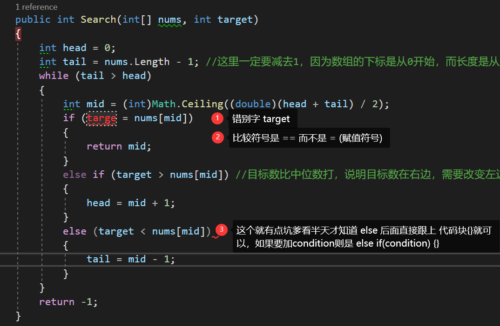

# LeetCode刷题经验教训

@(.NET开发)[编程语言, 技术扫盲, 命令式编程, LeetCode]


## 2021-9-7 [Two Sum](https://leetcode-cn.com/problems/two-sum/)

[两数之和](https://leetcode-cn.com/problems/two-sum/)

最大收获：由于缺乏VScode的强大IDE支持，发现许多基础的语法都已经不会了，比如for和foreach循环都不会写，数字的属性Lenght因为大小写问题编译一直报错等等：

- for (int i=1; i< nums.Length; i++) 第一个初始化，第二个是**defines the condition for executing the code block.** 第3个是**being executed (every time) after the code block has been executed.**

- 数组的长度是属性，需要大写，遵循[Pascal](https://www.theserverside.com/definition/Pascal-case)原则： int[] nums... nums.**Lenght**(而不是num.lenght)

- C#里面定义数组

  ```C#
  // return new array {0,i}; 一开始写成这样了
  // return new int[i,y]; 这种[]也是错的： Cannot implicitly convert type 'int[*,*]' to 'int[]'
  // return new int{i,y};： Cannot initialize type 'int' with a collection initializer because it does not implement 'System.Collections.IEnumerable
  return new int[]{0,i};
  ```

- **Length**容易打错成**Lenght**
- for(j=i+1;j<nums.Length;j++)==> J未定义

### 第一次提交：

```C#
public class Solution{
    public int[] TwoSum(int[] nums, int target)
    {
        for(int i=0;i<nums.Length;i++)
        {
            for int(j=1;j<nums.Lenght;j++)
            {
                if(nums[i]+nums[j]==target)
                {
                    return new int[]{i,j}
                }
            }
        }
        return null
    }
}
```

以下的测试用例failed:


```C#
[2,5,5,11]
10
```


原因是：当i=1的时候，其值为5； 而第二个嵌套循环的j=1，期值也为5，于是就出现[1,1]确实等于5，不是预期的[1,2]了；


### 第二次提交


```C#
public class Solution{
    public int[] TwoSum(int[] nums, int target)
    {
        for(int i=0;i<nums.Length;i++) //第一个数组的元素一定不是该数组的最后一个元素，因此可以为i<nums.Length -1 
        {
            for (int k = i+1;k<nums.Length;k++)
            {
                if(nums[i]+nums[k] ==target)
                {
                    return new int[] {i,k}
                }
            }
        }
        return null
    }
}
```


### [视频解题](https://leetcode-cn.com/problems/two-sum/solution/liang-shu-zhi-he-by-leetcode-solution/)：


思路：**以空间换时间**；(你可以通过加大内存来换取NASA火箭的发射速度，而不是为了节约内存而让登月登上几十年)


## 2021-9-8 [Binary Search](https://leetcode-cn.com/problems/binary-search/solution/er-fen-cha-zhao-by-leetcode-solution-f0xw/)

- while loop的语法

  ```C#
  while(condition)
  {
  	//code block
  }
  ```

  都是一些非常基础的，但是离开的IDE却发现是傻眼的，一是平时练的少，二是没有注意观察总结

- Math.Ceiling:需要做类型转化

  ```C#
  mid = Math.Ceiling((head + tail) / 2);
  =>
  int mid = (int)Math.Ceiling(double((head + tail) / 2)); //尼玛还是错的！Invalid expression term 'double' 
  =>
  int mid =(int)Math.Ceiling((double)((head + tail)/ 2))
  ```

  否则编译报错:The call is ambiguous between the following methods or properties: 'Math.Ceiling(decimal)' and 'Math.Ceiling(double)' 

- 错别字： Ceiling而不是 Cei**l**ling

-  **not all code paths return a value;** 需要注意一开始养成习惯


### 第一次提交代码：数组越界

```C#
public class Solution {
    public int Search(int[] nums, int target) {
        int head = 0;
        int tail = nums.Length;
        //int mid = (int)Math.Ceiling((double)((head + tail) / 2));
        while(tail >= head)
        {
            int mid = (int)Math.Ceiling((double)((head + tail) / 2));
            if(target == nums[mid]) return mid;
            if(target > nums[mid])
            {
                head = mid + 1;
                //mid = (int)Math.Ceiling((double)((head + tail) / 2));
                //这段代码出现了3次，一定有办法优化，这里是可以统一放到while loop里面优化
            }
            if(target < nums[mid])
            {
                tail = mid -1;
                //mid = (int)Math.Ceiling((double)((head + tail) / 2));
            }
        }
        return -1;
    }
}
```

```C#
[-1,0,3,5,9,12]
13
System.IndeOutOfRangeException: Index was outside the bounds of the array.
```


### 第二次提交

- public 和 class全是小写。。。

```C#
public class Solution {
    public int BinarySearch(int[] nums, int targe)
    {
        int head = 0;
        int tail = nums.Length -1; //这里一定要减去1，因为数组的下标是从0开始，而长度是从1开始；
        //while(tail > head)//必须考虑等于的情况，比如输入 [5],target=5,这种情况就会报错
        while(taile >=head) 
        {
            //int mid = (int)Math.Ceiling((double)(head + tail) / 2); //不能向上取整
            int mid = (int)((head + tail) /2);//默认向下取整
            if(targe = nums[mid])
            {
                return mid;
            }
            else if(target > nums[mid]) //目标数比中位数打，说明目标数在右边，需要改变左边的head的指针
            {
                head = mid +1 ;
            }
            else (target < nums[mid])//目标数比中位数小，在数字的右边，需要改变的是tail的指针
            {
                tail = mid -1;
            }
        }
        return -1;
    }
}
```




#### 为何不能向上取整

```C#
[-1, 0, 3, 5, 9, 12 ]   

9
```

为例：

Loop1: (head + tail) /2 = (0+5) /2 = 3; 跳进(target > num[mid])内执行 3 +1 =4；

Loop2: (head + tail) / 2=(**4** +5) /2 =5; => num[5] = 12; 无法匹配到9；


### 第三次提交

```C#
public class Solution{
    public int BinarySearch(int[] nums, int target)
    {
        int left = 0;
        int right = nums.Length -1;//这里一定要减去1，因为数组的下标是从0开始，而长度是从1开始；
        while(right >=left) //必须考虑等于的情况，比如输入 [5],target=5,这种情况就会报错
        {
            int mid = (int)((left + right) /2);//默认向下取整
            if(target == nums[mid])
            {
                return mid;
            }
            if(target > nums[mid])//目标值比中间值大，于数组右边，需调整left的指针
            {
                left=mid +1;
            }
            if(target <num[mid])//目标值比中间小，于数字左边，需要调整right的指针
            {
                right = mid =1;
            }
        }
        return -1;
    }
}
```

```
执行用时：140 ms, 在所有 C# 提交中击败了22.93%的用户

内存消耗：35.1 MB, 在所有 C# 提交中击败了46.36%的用户
```


## 2021-9-9 First Bad Version

You are a product manager and currently leading a team to develop a new product. Unfortunately, the latest version of your product fails the quality check. Since each version is developed based on the previous version, all the versions after a bad version are also bad.

Suppose you have n versions [1, 2, ..., n] and you want to find out the first bad one, which causes all the following ones to be bad.

You are given an API bool isBadVersion(version) which returns whether version is bad. Implement a function to find the first bad version. You should minimize the number of calls to the API.

来源：力扣（LeetCode）
链接：https://leetcode-cn.com/problems/first-bad-version
著作权归领扣网络所有。商业转载请联系官方授权，非商业转载请注明出处。


学到:

- 可以一次性申明2个同类型的变量： int head =0, buttom = n.Lenght;

- (head+buttom)/2 昨天我还没有意识到这样写有什么不对，今天才知道可能会导致**int溢出**

- 底部是 **bottom** 而不是 **buttom**,我之所以写错，大概是因为butt这个单词的混淆作用

  > Reference: [butt, bottom, buttock and ass?](https://ell.stackexchange.com/questions/39087/butt-bottom-buttock-and-ass)

- bottom有屁股的意思，尽量少用这个变量

### [第一次提交](https://leetcode-cn.com/problems/first-bad-version/solution/di-yi-ge-cuo-wu-ban-ben-by-leewang-x-v3we/)

```C#
/* The isBadVersion API is defined in the parent class VersionControl.
   bool IsBadVersion(int version); */
public class Solution:VersionControl{
    public int FirstBadVersion(int n)
    {
        int head = 0, bottom = n.Length;
        while(bottom >= head)
        {
            int mid = (bottom - head) /2 + head;
            if(IsBadVersion(mid))//中间的版本已经是出现错误了
            {
                if(IsBadVersion(mid-1))//再往前检查一位，如果前面那位是false，则说明中间版本是第一个错误版本
                {
                    return mid;
                }
                //中间版本就出现错误，说明第一个错误坐落在[head,mid]之间，因此需要修改bottom的指针
                bottom = mid -1;
            }
            else //中间的版本没有错误
            {
                if(IsBadVersion(mid+1))//往后检查一位，如果刚好出现true,则说明就是mid+1
                {
                    return mid +1;
                }
                //否则，说明错误坐落在[mid,bottom]之间，则需要调整head的指针
                head = mid +1;
            }
        }
    }
}
```


```C#
执行用时：28 ms, 在所有 C# 提交中击败了99.40%的用户

内存消耗：14.9 MB, 在所有 C# 提交中击败了42.56%的用户
```


## 2021-9-10 [Search Insert Position](https://leetcode-cn.com/problems/search-insert-position/)

Given a sorted array of distinct integers and a target value, return the index if the target is found. If not, return the index where it would be if it were inserted in order.

You must write an algorithm with O(log n) runtime complexity.

-  while(right > = left)：>=中间不要有空格


###  第一次提交

```C#
public class Solution {
    public int SearchInsert(int[] nums, int target) {
        int left = 0, right = nums.Length-1;
        int temp = 0;
        while(right >= left)
        {
            int mid = (right -left) /2 + left;
            temp = mid;
            if(target == nums[mid])
            {
                return mid;
            }
            else if (target >nums[mid])
            {
                //修改left的指针，并且把当前的指针传递到外面return
                temp= mid +1;
                left = mid +1;
            }
            else {
                //修改right的指针，并且把当前的指针位置传递到外面
                temp= mid -1;
                right = mid -1;
                /*这里使用[1,3,5,6] 0 进行测试失败。 
                因为这里计算出来的mid已经是0了，
                再减去1则变成-1：输出； 预期结果0*/
            }
        }
        return temp;
    }
}
```


### 第二次提交（未开始）：


## 2021-9-13 [Squares of the Sorted Array.](https://leetcode-cn.com/problems/squares-of-a-sorted-array/)


Given an integer array `nums` sorted in **non-decreasing** order, return ***an array of the squares of each number*** sorted *in non-decreasing order*.

给你一个按 **非递减顺序** 排序的整数数组 `nums`，返回 **每个数字的平方** 组成的新数组，要求也按 **非递减顺序** 排序。

- 原题是: **sorted in** non-decreasing **order**， **sorted in .... order** 说的很清楚了，这个数组是 **排序**的，只是以 *非递减*的形式排序

- **non-decreasing**：非递减排序，第一次看懵了...很难拐过弯。非递减排序应该就是**递增排序（ascending)**。

- **square**: square有很多个意思，可以做动词和名词。这里是做动词，表示~~乘~~平方的意思：

  > **multiple (a number) by itself.** 
  >
  > > 5 squred equals 25

### [双指针法](https://leetcode-cn.com/problems/squares-of-a-sorted-array/solution/dai-ma-sui-xiang-lu-shu-zu-ti-mu-zong-ji-1rtz/)

数组其实是有序的， 只不过负数平方之后可能成为最大数了。**那么数组平方的最大值就在数组的两端，不是最左边就是最右边**，不可能是中间。此时可以考虑双指针法了，**i**指向起始位置，**j**指向终止位置。

> 即便我复制了代码在VS里面debug了，依然看不懂，是因为我对这句话没有理解，或者说，该case的数组本质与特征没有观察到。
>
> 2021-9-14 10:57:40

定义一个新数组result，和A数组一样的大小，让k指向result数组终止位置。

如果`A[i] * A[i] < A[j] * A[j]` 那么`result[k--] = A[j] * A[j];` 。

如果`A[i] * A[i] >= A[j] * A[j]` 那么`result[k--] = A[i] * A[i];` 。


-  **if(int[i]\*int[i] > int[j]*int[j])**  这种写法编译器会通不过，乘法符号 \* 周围需要用空格隔开；这种写法。。。。。悲剧啊 **（nums[i] * nums[i])**!!!


## 2021-9-15 [Rotate array](https://leetcode-cn.com/problems/rotate-array/)

Given an array, **rotate** the array **to the right** by `k` steps, where `k` is non-negative

给定一个数组，将数组中的元素向右移动 `k` 个位置，其中 `k` 是非负数。

**Example 1:**

```javascript
Input: nums = [1,2,3,4,5,6,7], k = 3
Output: [5,6,7,1,2,3,4]
Explanation:
rotate 1 steps to the right: [7,1,2,3,4,5,6]
rotate 2 steps to the right: [6,7,1,2,3,4,5]
rotate 3 steps to the right: [5,6,7,1,2,3,4]
```

**Follow up:**

- Try to come up with as many solutions as you can. There are at least three different ways to solve this problem.
- Could you do it in-place with `O(1)` extra space?

### 经验教训

- 这题我连题目都没有读懂过，一看英文的Rotate，我的脑海中第一印象是以为是数组的中间元素为轴进行左右两边的元素旋转；
- 仔细看了例题才看的看到，原来是这个素组收尾相连的进行移动，有点类似于圆形的旋转机械开关一样进行旋转。
- **Rotate** xxx **to** the **left/right**

 ==）


