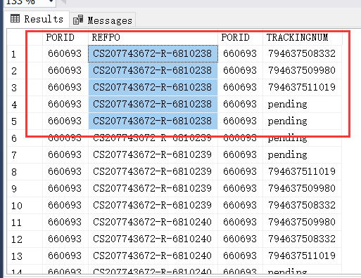
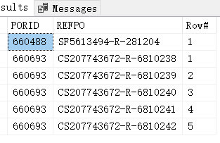
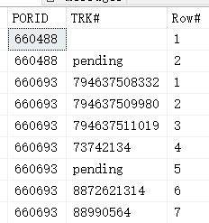

# SQL- 多对多缺乏外键关联的情况下处理
@(数据库与SQL)[百美-业务知识, 百美-SQL调优, SQL-Row_number, SQL-取模]

[toc]


## 1. 需求背景

<font size=6>User-Test feedback meeting minutes </font>

| 时间      |     地点| 参会人员  | 备注 |
| :-------- | :--------|:--------| :------|
| 2021-6-2|  Fuzhou Office  | Linda、Charlenen、Carol、Flora、Luna、Whalen、Lee| |

**背景**：
 - 跨境电商在做Ship-confirm的时候，需要带上Tracking Number(快递单号，下文简称Trk#)；
 - 通常会发生一个订单需要带上多个Trk#s的情况；

---------------------
 - 在导入R#订单的时候，如果符合相应的条件（相同的网站下的相同订单号、Must Ship By ，同一批量导入批次的订单），则会把这些R#合并到同一个`PORequest`上。
 - 因此 一个`PORequest`可能包含**0~N**条的R#；
 - 在`PORequest`处理过程中，也可能会产生`0~N`个***Replacement***的箱子，对应也就可能存在0~N 个`Tracking Number`(后文简称`TRK#`)；

**现在业务针对同一个PORequest内的`R#`与`Trk#`，在**批量处理页面**，做如下要求：**

1. 如果没有`TRK#`生成，或者`TRK#`都是Pending状态，则该`R#`对应的`TRK`栏位不展示；
2. 如果有`TRK#`生成，则`TRK#`会逐个被分配给每一个`R#`，直至所有的`TRK#`都被`R#`分配；

执行完2之后，会产生三种情况：
1. `R#s`和`TRKs`刚好一一对应，则无需做任何进一步的处理；
| R# |     TRK# | 
| :-------- | --------:| 
| R1|   TRK1 |   
| R2|   TRK2 |   
| R3|   TRK3 |   
| R4|   TRK4 |   

2.  如果还有`R#s`没有被分配到，则随机取之前已经被分配过的任意一个`TRK#`分配给这些`R#`；
| R# |     TRK# | 
| :-------- | --------:| 
| R1|   TRK1 |   
| R2|   TRK2 |   
| R3|   TRK1 |   
| R4|   TRK1 |   


3.  如果所有`R#s`都被分配完，还有剩余的`TRKs`,则继续开始新一轮的分配，直至所有的`TRKs`都被分配完毕；多个`TRKs`用逗号隔开。
| R# |     TRK# | 
| :-------- | --------:| 
| R1|   TRK1,TRK5 |   
| R2|   TRK2,TRK6|   
| R3|   TRK3,TRK7 |   
| R4|   TRK4 |   


## 2. 最终实现语句

```sql

SELECT DISTINCT(PORID) INTO #PORIDs FROM T_POReplaceDetails WHERE REFPO IN @Rs

 SELECT PORID, MIN(Cou_) AS Cou_  INTO #Data1
     FROM
        (
            SELECT PORID,  COUNT(1) AS Cou_  FROM dbo.POBreakdown
            WHERE PORID IN ( SELECT PORID FROM #PORIDs )
                  AND GenerateDate IS NOT NULL
            GROUP BY PORID
         UNION
            SELECT PORID, COUNT(1) FROM dbo.T_POReplaceDetails
            WHERE PORID IN  ( SELECT PORID FROM #PORIDs )
            GROUP BY PORID
        ) AS d
        GROUP BY PORID

 SELECT a.PORID, b.REFPO, a.TRACKINGNUM
    INTO #Data23
    FROM
    (
        SELECT a.PORID,TRACKINGNUM,
               ROW_NUMBER() OVER (PARTITION BY a.PORID ORDER BY POBID) % b.Cou_ AS Rows FROM dbo.POBreakdown AS a
        INNER JOIN #Data1 AS b ON a.PORID = b.PORID
        WHERE GenerateDate IS NOT NULL AND a.PORID IN  ( SELECT PORID FROM #PORIDs )
    ) AS a
   
    INNER JOIN
    (
         SELECT a.PORID, REFPO,
                 ROW_NUMBER() OVER (PARTITION BY a.PORID ORDER BY REFPO) % b.Cou_ AS Rows FROM dbo.T_POReplaceDetails AS a
          INNER JOIN #Data1 AS b ON a.PORID = b.PORID
          WHERE a.PORID IN  ( SELECT PORID FROM #PORIDs )
     ) AS b
     ON a.PORID = b.PORID AND a.Rows = b.Rows;

SELECT * INTO #Trks FROM
( 
    SELECT PORID, REFPO,
       STUFF( (SELECT ',' + TRACKINGNUM FROM #Data23 t
           WHERE t.PORID = t1.PORID AND t.REFPO = t1.REFPO AND t.TRACKINGNUM <> 'pending' 
           FOR XML PATH('') ), 1, 1,'') AS TRK
    FROM #Data23 AS t1
    WHERE t1.TRACKINGNUM <> 'pending' 
    GROUP BY PORID, REFPO
) x

SELECT trk.PORID,
       trk.REFPO,
       trk.TRK AS Tracking,
       pob.SHIPVIA,
       pob.SHIPDATE AS Shipdate
FROM #Trks trk  INNER JOIN POBreakdown pob ON trk.PORID = pob.PORID
GROUP BY trk.PORID,trk.REFPO, trk.TRK, pob.SHIPVIA, pob.SHIPDATE;

```

## 3. 思路

### 3.1 观察表结构
观察两张表结构：

```sql
SELECT PORID,REFPO FROM dbo.T_POReplaceDetails WHERE PORID IN ( 660693, 660488 )
```
**dbo.T_POReplaceDetails：** 
| PORID  | REFPO                 |
|--------|-----------------------|
| 660488 | SF5613494-R-281204    |
| 660693 | CS207743672-R-6810241 |
| 660693 | CS207743672-R-6810240 |
| 660693 | CS207743672-R-6810239 |
| 660693 | CS207743672-R-6810238 |
| 660693 | CS207743672-R-6810242 |
| 660693 | CS207743672-R-6810243 |
| 660693 | CS207743672-R-6810246 |
| 660693 | CS207743672-R-6810244 |

**dbo.POBreakdown：**
| PORID  | TRACKINGNUM  |
|--------|--------------|
| 660488 |              |
| 660488 | pending      |
| 660693 | 794637508332 |
| 660693 | 794637509980 |
| 660693 | 794637511019 |
| 660693 | pending      |
| 660693 | pending      |

首先能想到的是`dbo.T_POReplaceDetails`这张表上的**REFPO**字段对应需要取到`dbo.POBreakdown`上的`TRK#`字段，得到的最终类似于这样一个效果：

| PORID  | REFPO                 | 连接  | PORID  | TRACKINGNUM  |
|--------|-----------------------|---|--------|--------------|
| 660488 | SF5613494-R-281204    | <=>  | 660488 |              |
| 660693 | CS207743672-R-6810241 | <=>  | 660488 | pending      |
| 660693 | CS207743672-R-6810240 | <=>  | 660693 | 794637508332 |
| 660693 | CS207743672-R-6810239 | <=>  | 660693 | 794637509980 |
| 660693 | CS207743672-R-6810238 | <=>  | 660693 | 794637511019 |
| 660693 | CS207743672-R-6810242 | <=>  | 660693 | pending      |
| 660693 | CS207743672-R-6810243 | <=>  | 660693 | pending      |
| 660693 | CS207743672-R-6810246 | <=>  |        |              |
| 660693 | CS207743672-R-6810244 | <=>  |        |              |

### 3.2 能否直接Inner Join两张表呢？

直接用通过**PORID**对两张表做Inner Join不行，相同的PORID和不同的REFPO+Trk之间会做交叉合并：

```
SELECT * FROM
(
    SELECT PORID,REFPO FROM dbo.T_POReplaceDetails
    WHERE PORID IN ( 660693, 660488 )

) AS x
    INNER JOIN
    (
        SELECT a.PORID,TRACKINGNUM FROM dbo.POBreakdown AS a
        WHERE a.PORID IN ( 660693, 660488 )
    ) AS y
        ON x.PORID = y.PORID
		ORDER BY x.REFPO
```




而期望的效果是 **CS207743672-R-6810238**有且只展示一条，后面的TRK如果全部分配一轮过后，有剩余再用逗号隔开叠加上去。

###  3.3 ROW_NUMBER() 的引入

这时候就想到需要给2两张表进行分组排名，然后两边按照相同的排名进行连接：

```sql
SELECT * FROM
(
    SELECT PORID,REFPO
	,ROW_NUMBER() OVER(PARTITION BY PORID ORDER BY REFPO) AS Row#
	FROM dbo.T_POReplaceDetails
    WHERE PORID IN ( 660693, 660488 )

) AS x
    INNER JOIN
    (
        SELECT PORID,TRACKINGNUM as TRK#
		, ROW_NUMBER() OVER (PARTITION BY PORID ORDER BY POBID ) AS Row#
		FROM dbo.POBreakdown 
        WHERE  PORID IN ( 660693, 660488 ) 
    ) AS y
        ON x.PORID = y.PORID AND y.Row#= x.Row#
```

| PORID  | REFPO                 | Row# | PORID  | TRK#         | Row# |
|--------|-----------------------|------|--------|--------------|------|
| 660488 | SF5613494-R-281204    | 1    | 660488 | 1            |      |
| 660693 | CS207743672-R-6810238 | 1    | 660693 | 794637508332 | 1    |
| 660693 | CS207743672-R-6810239 | 2    | 660693 | 794637509980 | 2    |
| 660693 | CS207743672-R-6810240 | 3    | 660693 | 794637511019 | 3    |
| 660693 | CS207743672-R-6810241 | 4    | 660693 | pending      | 4    |
| 660693 | CS207743672-R-6810242 | 5    | 660693 | pending      | 5    |


到目前为止，看数据结果是OK的，似乎达到了所要的目的。

不过为了严谨性，我们还需要对TRK数量多于REFPO数量的情况下做测试。为此我们先删除掉一些REFPO，再新增一些TRK#，最终得到如下的结果：

  


然而我们在执行上述的脚本观察到，虽然每个REFPO都获取到了TRK，但是剩余的6和7的TRK并未重新分配。

| PORID  | REFPO                 | Row# | PORID  | TRK#         | Row# |
|--------|-----------------------|------|--------|--------------|------|
| 660488 | SF5613494-R-281204    | 1    | 660488 | 1            |      |
| 660693 | CS207743672-R-6810238 | 1    | 660693 | 794637508332 | 1    |
| 660693 | CS207743672-R-6810239 | 2    | 660693 | 794637509980 | 2    |
| 660693 | CS207743672-R-6810240 | 3    | 660693 | 794637511019 | 3    |
| 660693 | CS207743672-R-6810241 | 4    | 660693 | 73742134     | 4    |
| 660693 | CS207743672-R-6810242 | 5    | 660693 | pending      | 5    |

### 3.4  取模(Modulo)函数的引入

为了方便观察，我们暂时先把`PORID = 660488`数据移除掉：
```sql
SELECT ROW_NUMBER() OVER(PARTITION BY PORID ORDER BY REFPO) AS RowNum,PORID,REFPO
 ,ROW_NUMBER() OVER(PARTITION BY PORID ORDER BY REFPO) % 5 AS RowMod
FROM dbo.T_POReplaceDetails
WHERE PORID IN ( 660693)
```

| RowNum | PORID  | REFPO                 | RowMod |
|--------|--------|-----------------------|--------|
| 1      | 660693 | CS207743672-R-6810238 | 1      |
| 2      | 660693 | CS207743672-R-6810239 | 2      |
| 3      | 660693 | CS207743672-R-6810240 | 3      |
| 4      | 660693 | CS207743672-R-6810241 | 4      |
| 5      | 660693 | CS207743672-R-6810242 | 0      |

```sql
SELECT ROW_NUMBER() OVER (PARTITION BY PORID ORDER BY POBID ) AS RowNum, PORID,TRACKINGNUM as TRK
, ROW_NUMBER() OVER (PARTITION BY PORID ORDER BY POBID ) % 5 AS RowMod
FROM dbo.POBreakdown 
WHERE  PORID IN ( 660693) 
```
| RowNum | PORID  | TRK          | RowMod |
|--------|--------|--------------|--------|
| 1      | 660693 | 794637508332 | 1      |
| 2      | 660693 | 794637509980 | 2      |
| 3      | 660693 | 794637511019 | 3      |
| 4      | 660693 | 73742134     | 4      |
| 5      | 660693 | pending      | 0      |
| 6      | 660693 | 8872621314   | 1      |
| 7      | 660693 | 88990564     | 2      |

再`Inner Join`两张表的数据到临时表`#Trks`中：

```sql
SELECT x.PORID,x.REFPO,x.RowMod,y.TRK  INTO #TRKs  FROM
(
    SELECT ROW_NUMBER() OVER(PARTITION BY PORID ORDER BY REFPO) AS RowNum,PORID,REFPO
	 ,ROW_NUMBER() OVER(PARTITION BY PORID ORDER BY REFPO) % 5 AS RowMod
    FROM dbo.T_POReplaceDetails
    WHERE PORID IN ( 660693 )

) AS x
    INNER JOIN
    (
        SELECT ROW_NUMBER() OVER (PARTITION BY PORID ORDER BY POBID ) AS RowNum, PORID,TRACKINGNUM as TRK
		, ROW_NUMBER() OVER (PARTITION BY PORID ORDER BY POBID ) % 5 AS RowMod
        FROM dbo.POBreakdown 
        WHERE  PORID IN ( 660693) 
    ) AS y
        ON x.PORID = y.PORID AND y.RowMod = x.RowMod
		ORDER BY x.REFPO

SELECT * FROM #TRKs
```

| PORID  | REFPO                 | RowMod <br>两边余数| TRK          |
|--------|-----------------------|--------|--------------|
| 660693 | CS207743672-R-6810238 | 1      | 794637508332 |
| 660693 | CS207743672-R-6810238 | 1      | 8872621314   |
| 660693 | CS207743672-R-6810239 | 2      | 794637509980 |
| 660693 | CS207743672-R-6810239 | 2      | 88990564     |
| 660693 | CS207743672-R-6810240 | 3      | 794637511019 |
| 660693 | CS207743672-R-6810241 | 4      | 73742134     |
| 660693 | CS207743672-R-6810242 | 0      | pending      |

#### 3.4.1 核心实现

**这里是本业务实现的算法关键所在：通过对两张表数据的取模,然后对两张表的相同的余数和组ID（PORID）进行关联，从而实现REFPO和TRK的均匀分配。**

**`被取模的数据取决于两边分组count数最小的一方。`**

> 关于取模更多的介绍，可以点击[这里](https://www.computerhope.com/jargon/m/modulo.htm)。


比如以上述数据为例，同一个组别内（PORID=660693 ）REFPO总计有5个（38 ~ 42）；而TRK#总计有7个； 这时候需要对两边取模的话，被除数必须是两边当中**最小的那个数**，也就是5。

这样子取模才能确保：
- `6%5=1`： 位于第6位的TRK会被分配到第1个`REFPO`
- `7%5=2`： 位于第7位的TRK会被分配给第2个`REFPO`

而反过来，如果是`REFPO`多的话，也能确保多余的`REFPO`获取到（虽然是重复的）`TRK`；

如果对这段话不明白，可以翻上去就数据取模列进行观察。

---------------------------

到目前为止，可以看到在进行第一轮的`TRK`分配之后，每个`REFPO`都拿到了`TRK`；经常第一轮分配，还剩下多余的`TRK`没有分配，因此又会进行第二轮的分配，以此类推，直至所有的`TRK`都以此被分配完。

但是分配到一个以上TRK的REFPO，又以多了的形式展示了出来。问题似乎又回到了`3.2环节上了`。但是这里与`3.2的Inner Join`结果不同的是，这里的每个REFPO的TRKs（叠加起来）都不会相同，比如***CS207743672-R-6810238***的TRK是*794637508332、8872621314*；而3.2的是每个`REFPO`的`TRK`都相同。

那么有没有一种办法，让`REFPO`只保留一个，而对应的多个`TRKs`合并，然后用逗号隔开呢？

这时候就需要SQL 的 **`XML FOR PATH`**函数登场了。

### 3.5  FOR XML PATH 函数的引入

使用 **`XML FOR PATH`**函数配合 `Group By` 函数：

```sql
SELECT PORID,REFPO,
(select ',' + t.TRK from #TRKs t where t.PORID = t1.PORID AND 
    t.REFPO = t1.REFPO FOR xml path(''))  AS TRK
FROM #TRKs AS t1
GROUP BY PORID,REFPO
```

| PORID  | REFPO                 | TRK                      |
|--------|-----------------------|--------------------------|
| 660693 | CS207743672-R-6810238 | ,794637508332,8872621314 |
| 660693 | CS207743672-R-6810239 | ,794637509980,88990564   |
| 660693 | CS207743672-R-6810240 | ,794637511019            |
| 660693 | CS207743672-R-6810241 | ,73742134                |
| 660693 | CS207743672-R-6810242 | ,pending                 |

到目前为止大体接近业务需要，至于TRK列前面出现的多余的逗号，可以使用`STUFF`函数或`LEFT/RIGHT`函数去除。


### 3.6  STUFF函数引入

```
SELECT PORID,REFPO,
STUFF((select ',' + t.TRK from #TRKs t where t.PORID = t1.PORID AND 
    t.REFPO = t1.REFPO FOR xml path('')),1,1,'厚礼蟹 ')  AS TRK
FROM #TRKs AS t1
GROUP BY PORID,REFPO  
```

| PORID  | REFPO                 | TRK                            |
|--------|-----------------------|--------------------------------|
| 660693 | CS207743672-R-6810238 | 厚礼蟹 794637508332,8872621314 |
| 660693 | CS207743672-R-6810239 | 厚礼蟹 794637509980,88990564   |
| 660693 | CS207743672-R-6810240 | 厚礼蟹 794637511019            |
| 660693 | CS207743672-R-6810241 | 厚礼蟹 73742134                |
| 660693 | CS207743672-R-6810242 | 厚礼蟹 pending                 |


### 3.7 RIGHT函数引入

```
SELECT PORID,REFPO,RIGHT(x.TRK,LEN(x.TRK)-1) AS TRK FROM 
(
	SELECT PORID,REFPO,
	(select ',' + t.TRK from #TRKs t where t.PORID = t1.PORID AND  t.REFPO = t1.REFPO FOR xml path(''))  AS TRK
	FROM #TRKs AS t1
	GROUP BY PORID,REFPO
) x
```

| PORID  | REFPO                 | TRK                     |
|--------|-----------------------|-------------------------|
| 660693 | CS207743672-R-6810238 | 794637508332,8872621314 |
| 660693 | CS207743672-R-6810239 | 794637509980,88990564   |
| 660693 | CS207743672-R-6810240 | 794637511019            |
| 660693 | CS207743672-R-6810241 | 73742134                |
| 660693 | CS207743672-R-6810242 | pending                 |

**RIGTH：返回字符串从右边开始指定个数字符: **

```
RIGHT(character_expression,integer_expression);
```

**LEFT：返回字符串中从左边开始指定个数字符。**

```
LEFT(character_expression,integer_expression);
```

## 4. 用到的SQL技术

- **ROW_NUMBER() OVER(PARTITION BY COLUMN ORDER BY COLUMN)** （[分组（分区）排名函数](https://www.yiibai.com/sqlserver/sql-server-row_number-function.html)）
- Union 函数
- 取模方法
- SQL `STUFF`方法
- SQL `FOR XML PATH`方法


### 4.1 分区分组排名函数

 > `partition  by`：关键字是分析性函数的一部分，它和聚合函数（如group by）不同的地方在于它能返回一个分组中的多条记录，而聚合函数一般只有一条反映统计值的记录;
 >  
 >  `partition  by`用于给结果集分组，如果没有指定那么它把整个结果集作为一个分组。
 >   
 >   `partition by` 与`group by`不同之处在于前者返回的是**分组里的每一条数据**，并且可以**对分组数据进行排序操作**。后者只能返回**聚合之后的组**的数据统计值的记录。

以下面两列数据为例来解释说明：

#### 4.1.1 原始数据
```sql
SELECT a.PORID, TRACKINGNUM FROM dbo.POBreakdown AS a
WHERE a.PORID IN ( 660693, 660488 )
```

| PORID  | TRACKINGNUM  |
|--------|--------------|
| 660488 |              |
| 660488 | pending      |
| 660693 | 794637508332 |
| 660693 | 794637509980 |
| 660693 | 794637511019 |
| 660693 | pending      |
| 660693 | pending      |


#### 4.1.2 Group by的数据

```sql
SELECT a.PORID, TRACKINGNUM FROM dbo.POBreakdown AS a
WHERE a.PORID IN ( 660693, 660488 )
GROUP BY  a.PORID,TRACKINGNUM;
```

| PORID  | TRACKINGNUM  |
|--------|--------------|
| 660488 |              |
| 660488 | pending      |
| 660693 | 794637508332 |
| 660693 | 794637509980 |
| 660693 | 794637511019 |
| 660693 | pending      |


#### 4.1.3  ROW_NUMBER() OVER(PARTITION BY col ORDER BY col)

```sql
SELECT a.PORID, TRACKINGNUM,
	ROW_NUMBER() OVER (PARTITION BY a.PORID ORDER BY a.POBID) AS RowNumber
FROM dbo.POBreakdown AS a
WHERE a.PORID IN ( 660693, 660488 )
```

| PORID  | TRACKINGNUM  | RowNumber |
|--------|--------------|-----------|
| 660488 |              | 1         |
| 660488 | pending      | 2         |
| 660693 | 794637508332 | 1         |
| 660693 | 794637509980 | 2         |
| 660693 | 794637511019 | 3         |
| 660693 | pending      | 4         |
| 660693 | pending      | 5         |

相比前面，可以看到`PORID=660693` ，`TrackingNum = pending`这条路数据并没有被合并，而是都展示出来，只是RowNumber不一样（分别是4，5）。
	
这就是：**partition by 与group by不同之处在于前者返回的是分组里的每一条数据，并且可以对分组数据进行排序操作。后者只能返回聚合之后的组的数据统计值的记录** 的意思。

## 10 . 文档修订记录

| 版本号|     变化状态|   简要说明|  日期	|   变更人/参与者   |
| :-------- | :--------| :------ |:------ |:------ |
| V1.0|   建立| 新建文档 |2021-6-2  | Lee|
| V1.1|   建立| 补充完成思路3 |2021-6-3  | Lee|


