# UTC, PST, PDT时间


[toc]


## 一句话总结这篇文章


**`2022-06-06T09:22:48-07:00`**因为后面的***时区***是 -07，因为这个**-7** 表示是时区，该时区晚于（-7）UTC时间7个小时，所以前面的***时间点***是美西时间。

> 如果该时区的时间早于UTC，比如北京时间，则就要用 +8:00的形式了。

----------------

由于该时间点是PDT美西时间+时区来表示UTC时间，因此如果要换算成+00的UTC时间，则需要把改时间点加上7，也就是

**`DATEADD(HOUR,7,'{the PDT Time}')`**

同样的北京时间的话需要减去7

**`DATEADD(HOUR,-8,'{Bejing Time}')`**


## Datetime

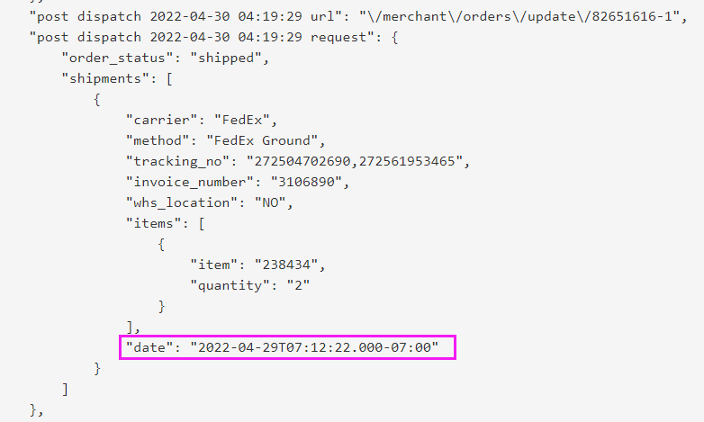 


[yyyy'-'MM'-'dd'T'HH':'mm':'ss - What is the meaning of 'T' here?](https://stackoverflow.com/questions/6340794/yyyy-mm-ddthhmmss-what-is-the-meaning-of-t-here)

It just shows the start of the **Time** component in a standard ISO 8601 date time string. Wikipedia has a [detailed page](http://en.wikipedia.org/wiki/ISO_8601#Combined_date_and_time_representations) about this standard format.

> 它只是在标准ISO 8601日期时间字符串中显示Time组件的开始。Wikipedia有关于这种标准格式的详细页面。

### Combined date and time representations

```D
<date>T<time>
```

A single point in time can be represented by concatenating a complete date expression, the letter *"T"* as a delimiter, and a valid time expression. For example, "2007-04-05T14:30". In ISO 8601:2004 it was permitted to omit the *"T"* character by mutual agreement as in "200704051430" but this provision was removed in ISO 8601-1:2019. Separating date and time parts with other characters such as space is not allowed in ISO 8601, but allowed in its profile RFC 3339.

If a time zone designator is required, it follows the combined date and time. For example, "2007-04-05T14:30Z" or "2007-04-05T12:30−02:00".

Either basic or extended formats may be used, but both date and time must use the same format. The date expression may be calendar, week, or ordinal, and must use a complete representation. The time may be represented using a specified reduced precision format.


这段话有些词虽然认识，但是由于一词多义，造成了阅读上的障碍。

- but this **provision** was removed. 

  Provision的本意是提供（名词），但是这里显然无法解释通畅，翻开字典发现：

  n. 提供, 供给; 饮食供应, 准备; **条款**
  v. 为…提供所需物品（尤指食物）

  其有条款的意思：**a clause in a law or contract stating that a condition must be met**. 

  >  This provision gives the president total and unchecked power.这条规定赋予了总统绝对及不受约束的权力。

- characters such as space is not allowed in ISO 8601, but allowed in its **profile** RFC 3339.

  Profile第一印象是轮廓，User Profile是用户画像，在互联网兴起之前这个是用户信息的意思，等用于 User Information. 

  但是这里做哪个解决都有点不通。

  然后Google了一下，大概推断出来这个是配置文件。 如这篇文章《[Configuration Profiles vs Endpoint Security settings - How do you do yours?](https://www.reddit.com/r/Intune/comments/mhqm8m/configuration_profiles_vs_endpoint_security/)》

   然后更重要的是，苹果公司系列产品，对配置文件都叫 [configuration profiles](https://support.apple.com/guide/iphone/install-or-remove-configuration-profiles-iph6c493b19/ios):

  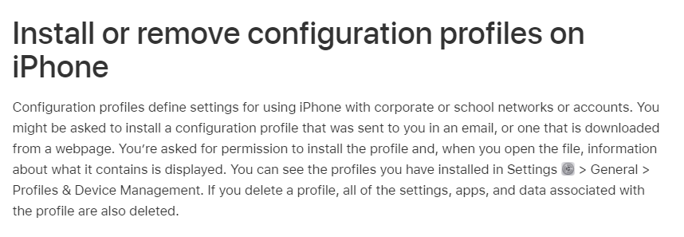 

  A [configuration profile](https://developer.apple.com/business/documentation/Configuration-Profile-Reference.pdf) is an XML file that allows you to distribute configuration information. If you need to configure a large number of devices or to provide lots of custom email settings, network settings, or certificates to a large number of devices, configuration profiles are an easy way to do it.

  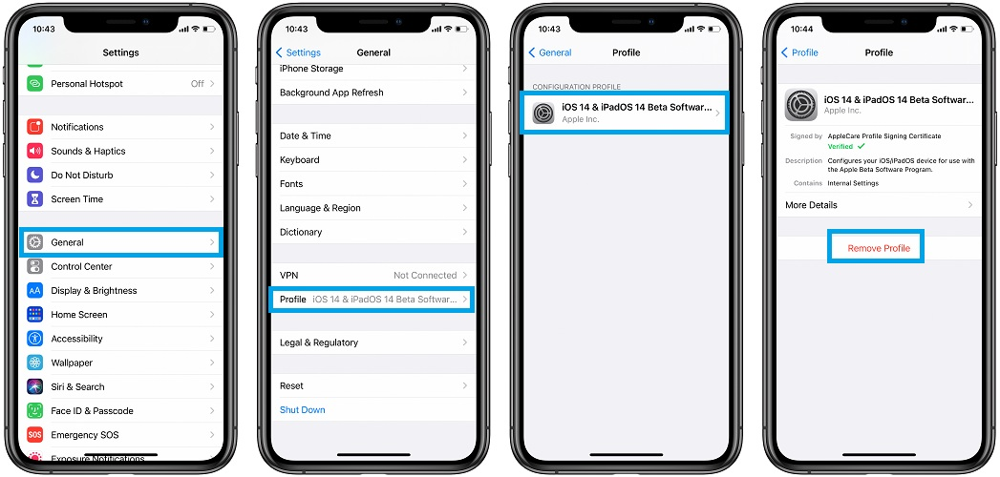 


### Coordinated Universal Time (UTC)

If the time is in [UTC](https://en.wikipedia.org/wiki/Coordinated_Universal_Time), add a *Z* directly after the time without a space. *Z* is the zone designator for the zero UTC offset. "09:30 UTC" is therefore represented as "09:30Z" or "T0930Z". "14:45:15 UTC" would be "14:45:15Z" or "T144515Z".

### Time offsets from UTC

he [UTC offset](https://en.wikipedia.org/wiki/UTC_offset) is appended to the time in the same way that 'Z' was above, in the form ±[hh]:[mm], ±[hh][mm], or ±[hh].

Negative [UTC offsets](https://en.wikipedia.org/wiki/UTC_offset) describe a [time zone](https://en.wikipedia.org/wiki/Time_zone) west of [UTC±00:00](https://en.wikipedia.org/wiki/UTC±00:00), where the [civil time](https://en.wikipedia.org/wiki/Civil_time) is behind (or earlier) than [UTC](https://en.wikipedia.org/wiki/UTC) so the zone designator will look like "−03:00","−0300", or "−03".

Positive [UTC offsets](https://en.wikipedia.org/wiki/UTC_offset) describe a [time zone](https://en.wikipedia.org/wiki/Time_zone) at or east of [UTC±00:00](https://en.wikipedia.org/wiki/UTC±00:00), where the [civil time](https://en.wikipedia.org/wiki/Civil_time) is the same as or ahead (or later) than [UTC](https://en.wikipedia.org/wiki/UTC) so the zone designator will look like "+02:00","+0200", or "+02".

Examples

- "−05:00" for New York on standard time ([UTC-05:00](https://en.wikipedia.org/wiki/UTC-05:00))
- "−04:00" for New York on daylight saving time ([UTC-04:00](https://en.wikipedia.org/wiki/UTC-04:00))
- "+00:00" (but not "−00:00") for London on standard time ([UTC±00:00](https://en.wikipedia.org/wiki/UTC±00:00))
- "+02:00" for Cairo ([UTC+02:00](https://en.wikipedia.org/wiki/UTC%2B02:00))
- "+05:30" for Mumbai ([UTC+05:30](https://en.wikipedia.org/wiki/UTC%2B05:30))
- "+14:00" for Kiribati ([UTC+14:00](https://en.wikipedia.org/wiki/UTC%2B14:00))

See [List of UTC time offsets](https://en.wikipedia.org/wiki/List_of_UTC_time_offsets) for other [UTC offsets](https://en.wikipedia.org/wiki/UTC_offset).


### UTC−07:00

最神奇的是维基百科竟然建立起了UTC Offset一系列的超链接， 比如，如果想查询UTC减7是哪些时差，则可以从[URL](https://en.wikipedia.org/wiki/UTC%E2%88%9207:00)上这样访问：

https://en.wikipedia.org/wiki/UTC−07:00

**UTC−07:00** is an identifier for a [time offset from UTC](https://en.wikipedia.org/wiki/UTC_offset) of −07:00. In North America, it is observed in the [Mountain Time Zone](https://en.wikipedia.org/wiki/Mountain_Time_Zone) during [standard time](https://en.wikipedia.org/wiki/Standard_time), and in the [Pacific Time Zone](https://en.wikipedia.org/wiki/Pacific_Time_Zone) during the other eight months (see [Daylight saving time](https://en.wikipedia.org/wiki/Daylight_saving_time)). Some locations use it year-round.

-7 这里可以表示两个地方的时间：

- 一个是标准时间下的（北美）山地时区时
- 另一个是 夏令时 下的 太平洋时区


### Pacific Time Zone

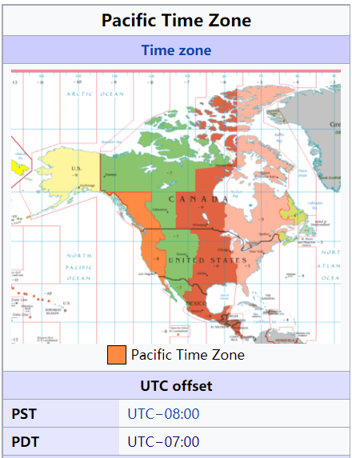 

In the United States and Canada, this time zone is generically called the Pacific Time Zone. Specifically, time in this zone is referred to as **Pacific Standard Time (PST)** when standard time is being observed (early November to mid-March), 

and **Pacific Daylight Time (PDT)** when daylight saving time (mid-March to early November) is being observed.


所以据此推测，在本年度3月中旬之前的订单，订单送出去的时间是要-8才能体现PST时间。为了验证这个想法，就去BSICT服务器上找到一笔2月份shipping的[订单](https://bsitc-bridge48.com/cartrover/sales/sales/salesInfo/OverStock80835877-1)：

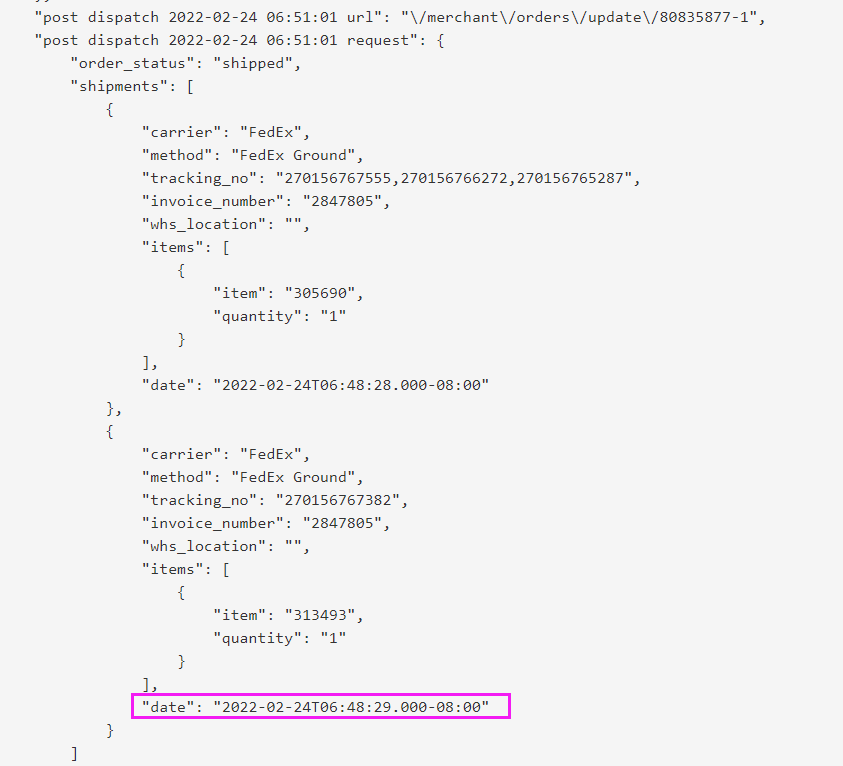 

果真是要minus 8.


### Daylight saving time

**Daylight saving time** (**DST**), also known as **daylight savings time** or **daylight time** (United States, Canada, and Australia), and **summer time** (United Kingdom, [European Union](https://en.wikipedia.org/wiki/Summer_time_in_Europe), and others), is the practice of advancing clocks (typically by one hour) during warmer months so that darkness falls at a later clock time.

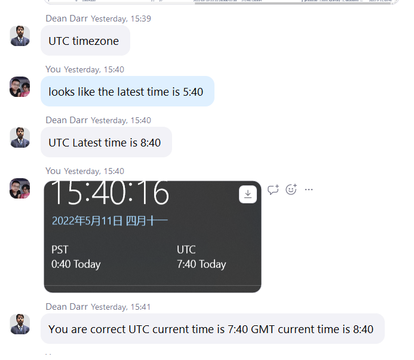 


对Dean这句话不是很理解，按常规理解，GMT就是UTC+0， 怎么会+1呢。

后来去 [Worldtimebuddy](https://www.worldtimebuddy.com/) 上看了一下：

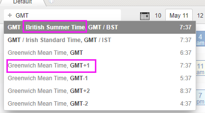 

GMT+1是不列颠的夏令时（summer time）的时间

The idea of aligning waking hours to daylight hours to conserve candles was first proposed in 1784 by US [polymath](https://en.wikipedia.org/wiki/Polymath) [Benjamin Franklin](https://en.wikipedia.org/wiki/Benjamin_Franklin).


## 数据库里面的时区


### MMSQL

#### [DATEDIFF](https://www.w3schools.com/sql/func_sqlserver_datediff.asp) 函数 与UTC的时差

Return the difference between tow date values. In years , for example

```sql
SELECT DATEDIFF(year, '2017/08/25', '2011/08/25') AS DateDiff;
-- DateDiff: -6
```

**Date2 -  Date1**

因此,要比较当前时间（比如北京时间）和UTC时间的差距，是要把UTC时间放在Date1位置：


```sql
SELECT  DATEDIFF(HOUR, GETUTCDATE(),GETDATE()) as 'GetDate-UTC',
        DATEDIFF(HOUR, GETUTCDATE(),'2022-5-16 15:16:50') as 'Beijing-UTC'
;
```


**执行结果：**

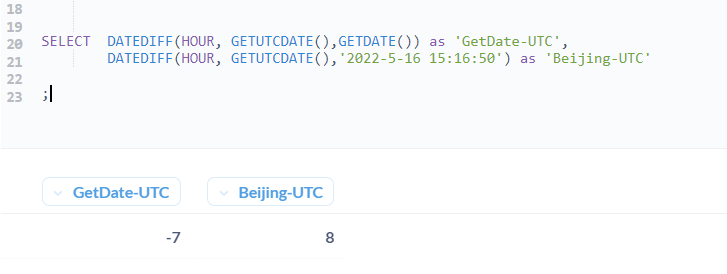 

- 可以看到GetDate()函数获取回来的是数据库服务器的时间，是-7，也就是对应[PDT](https://www.timeanddate.com/time/map/)([Pacific Daylight Time](https://www.timeanddate.com/time/zones/pdt))的时间；

  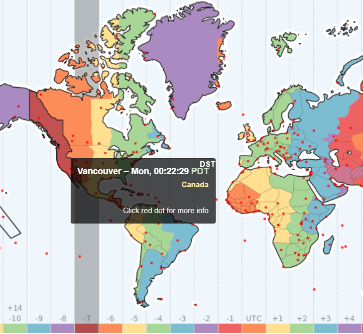 


#### DATEADD函数：UTC时间+时区

```sql
SELECT DATEADD(HOUR, 8, GETUTCDATE()) AS DateAdd;
```

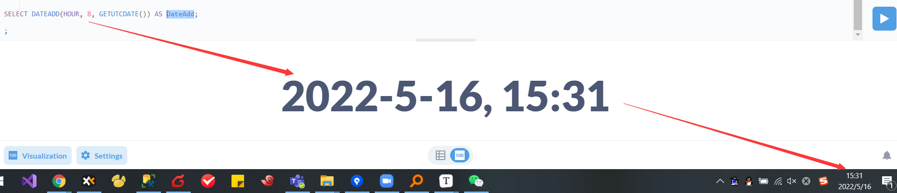


#### [AT TIME ZONE](https://docs.microsoft.com/en-us/sql/t-sql/queries/at-time-zone-transact-sql?view=sql-server-ver15) 

在MS Managment Studio 下看起来没什么问题：

```sql
SELECT  GETUTCDATE() AS UTCTime,  
        GETUTCDATE() AT TIME ZONE 'UTC-08' AS 'UTC-8',
        GETUTCDATE() AT TIME ZONE 'China Standard Time' AS 'BeijingTime'
```

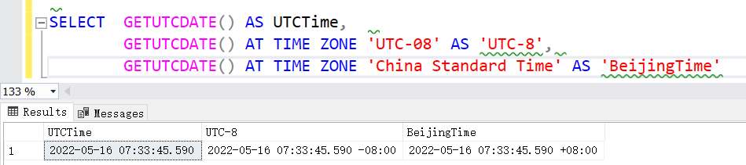 


但是在Metabase下有问题：

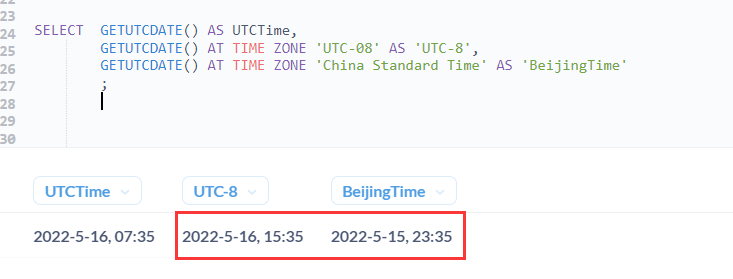 

结论：

- 尽量不用At Time Zone这个方法；
- 如果要使UTC转化为北京时间，则优先考虑用DateAdd方法


##### **2022-6-10 更新：**

```sql
SELECT GETDATE() AS GetDateTime,
       GETUTCDATE() AS UTCTime,
       GETDATE() AT TIME ZONE 'China Standard Time' AS OrderDate_TimeZoneBeijing,
       GETUTCDATE() AT TIME ZONE 'China Standard Time' AS OrderDate_TimeZoneBeijing2,
       GETDATE() AT TIME ZONE 'Pacific Standard Time' AS OrderDate_TimeZonePST,
       GETDATE() AT TIME ZONE 'Central European Standard Time' AS OrderDate_TimeZoneCET;
```

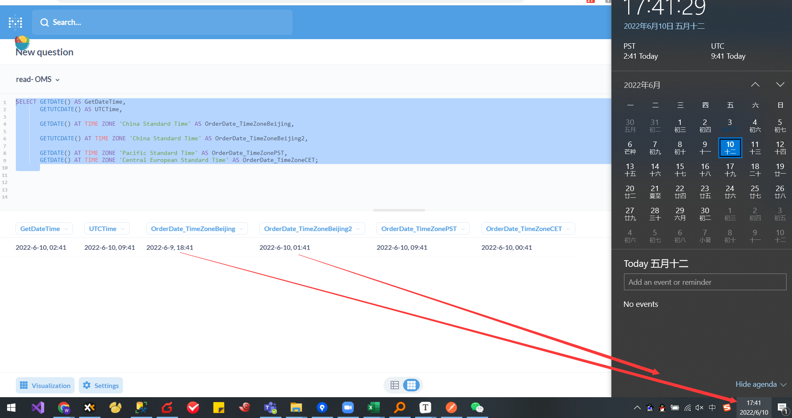


- Metabase真有bug（MSSQL数据库下）！


```sql
SELECT GETDATE() AS GetDateTime,
       GETUTCDATE() AS UTCTime,
       GETDATE() AT TIME ZONE 'China Standard Time' AS OrderDate_TimeZoneBeijing,
       GETDATE() AT TIME ZONE 'Pacific Standard Time' AS OrderDate_TimeZonePST,
       GETDATE() AT TIME ZONE 'Central European Standard Time' AS OrderDate_TimeZoneCET;
```


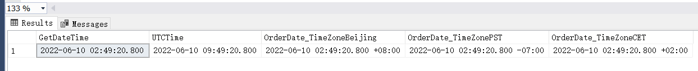


| Time                          | Value                              | Remark                                                       |
| ----------------------------- | ---------------------------------- | ------------------------------------------------------------ |
| GetDateTime                   | **2022-06-10 02:49:20.800**        | 服务器部署在美国，<br />所以GetDateTime**美西本地**的时间（PST） |
| **UTCTime**                   | 2022-06-10 09:49:20.800            | UTC时间，时区是+0；                                          |
| OrderDate_TimeZone**Beijing** | 2022-06-10 02:49:20.800 +**08:00** | 美西本地时间，时区是+8 （北京时区）<br />结论是：时间还是美西的时间，+8表示的是时区 |
| OrderDate_TimeZone**PST**     | 2022-06-10 02:49:20.800 -07:00     | 美西本地时间，时区是-7 （美西本地时区）                      |
| OrderDate_TimeZone**CET**     | 2022-06-10 02:49:20.800 +**02:00** | 美西本地时间，时区是+2 （欧洲时间）                          |


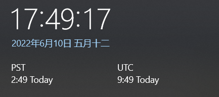


#### 那么，这对我有什么意义呢？

https://bsitc-bridge48.com/cartrover/sales/sales/salesInfo/CSNCS407112203

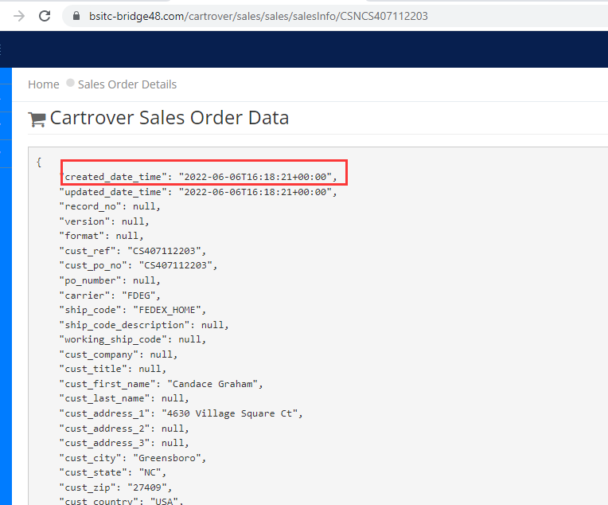 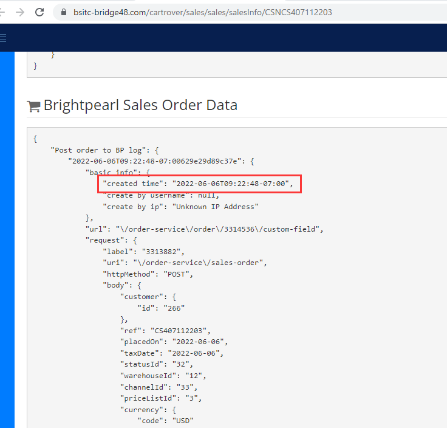

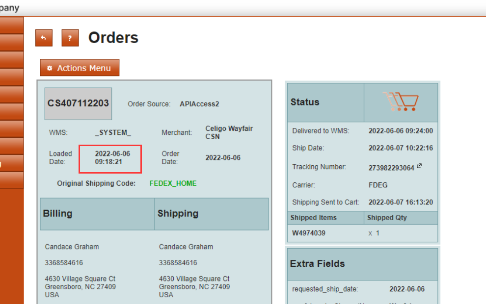 


- 我需要能看懂**UTC**的两种表达方式：**`2022-06-06T16:18:21+00:00`** 和 **`2022-06-06T09:22:48-07:00`** 其实是等价的。

- **`2022-06-06T16:18:21+00:00`**  因为后面的***时区***是+00，表明前面的***时间点***是UTC的时间

- **`2022-06-06T09:22:48-07:00`**因为后面的***时区***是 -07，表明前面的***时间点***是美西时间，和UTC时间差距-7（也就是UTC时间比美西时间早了7个小时）。通过这个-7时区,可以直接换算出UTC的时间点是 

  ```sql
  SELECT DATEADD(HOUR,7,'2022-06-06T09:22:48')
  -- 2022-06-06 16:22:48.000
  ```

  这里最令人迷惑的地方是-7，按照直觉应该是 `DATEADD(HOUR,-7,'2022-06-06T09:22:48')`,但是这个-7不是表示minus seven, 而是一个指示器，指示当前的时间比UTC时间**晚**了7个小时：

  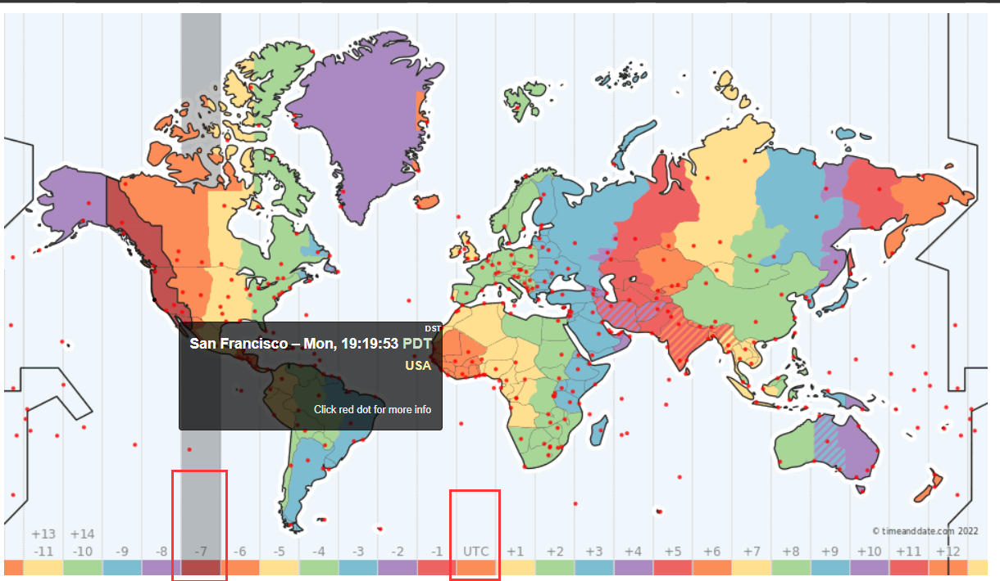 

  正是由于对这个***-7***处于直觉上的错误理解，我直接闹了个大乌龙：

  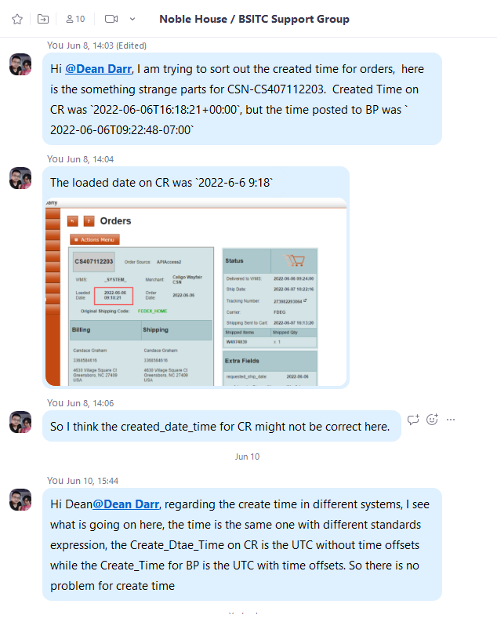 

​       最后是通过https://www.worldtimebuddy.com/ ，根据Cartrover UI的Loaded Time,反推回去得出这两个时间其实是UTC的不同表达方式：

​		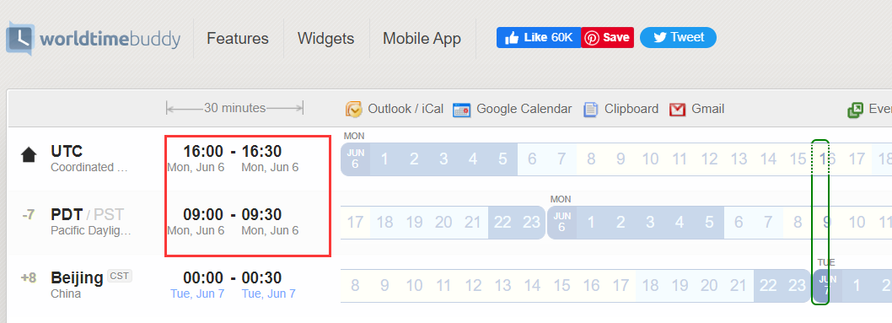 


最后牢记一个结论:

**`2022-06-06T09:22:48-07:00`**因为后面的***时区***是 -07，因为这个-7 表示是时区，该时区晚于UTC时间7个小时，所以前面的***时间点***是美西时间。

**Reference:**

1. [How to Convert UTC to Local Time Zone in SQL Server in SQL Server](https://popsql.com/learn-sql/sql-server/how-to-convert-utc-to-local-time-zone-in-sql-server)


##### 关于跨天的订单

以[这笔CSN-CS408350529](https://bsitc-bridge48.com/cartrover/sales/sales/salesInfo/CSNCS408350529)为例:

```php
"created_date_time": "2022-06-14T00:42:14+00:00",
```

```php
        "2022-06-13T17:47:20-07:0062a7da98518db": {
            "basic info": {
                "created time": "2022-06-13T17:47:20-07:00",
                "create by username": null,
                "create by ip": "Unknown IP Address"
            },
```

```sql
SELECT top 10  * from  PO where MerchantPONUM = 'CS408350529'
```

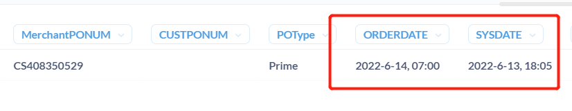 

因此会出现 `SysDate` 比 `OrderDate`早的[情况](https://bsitc.on.spiceworks.com/tickets/open/24899/activity)。

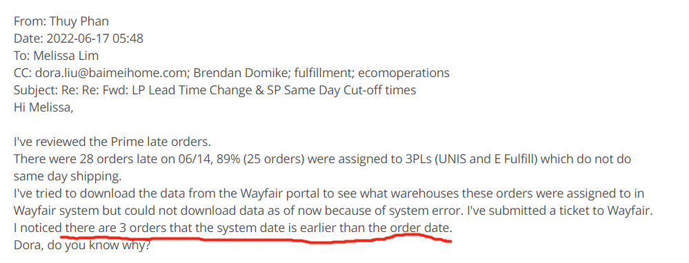 


#### time_zone_info

```sql
select * from sys.time_zone_info;
```

```sql
name                            | current_utc_offset | is_currently_dst 
--------------------------------+--------------------+------------------
Dateline Standard Time          | -12:00             | false            
UTC-11                          | -11:00             | false                      
Marquesas Standard Time         | -09:30             | false            
Alaskan Standard Time           | -09:00             | false            
UTC-09                          | -09:00             | false            
Pacific Standard Time (Mexico)  | -08:00             | false            
UTC-08                          | -08:00             | false            
Pacific Standard Time           | -08:00             | false            
......
```

### MySQL

#### [Convert_TZ](https://stackoverflow.com/questions/2187593/can-mysql-convert-a-stored-utc-time-to-local-timezone)

```sql
select count(1)  from sales_order
where 
status = 3  
and   CONVERT_TZ (updated, '+00:00','+08:00') >=  '2022-5-14, 00:00'
and CONVERT_TZ(updated,'+00:00','+08:00' ) <= '2022-5-15, 01:07'
order by updated asc
```

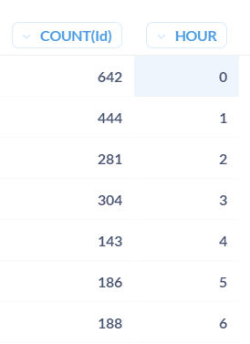 


1. [Dates and Times in SQL Server: AT TIME ZONE](https://bornsql.ca/blog/dates-and-times-in-sql-server-at-time-zone/)
2. [How to Convert UTC to Local Time in MySQL](https://ubiq.co/database-blog/how-to-convert-utc-to-local-time-in-mysql/)
3. [Convert Datetime column from UTC to local time in select statement](https://stackoverflow.com/questions/8038744/convert-datetime-column-from-utc-to-local-time-in-select-statement)


## C#代码里面的时区表达与转化（未完待续）


## HTTP请求里面的时间戳

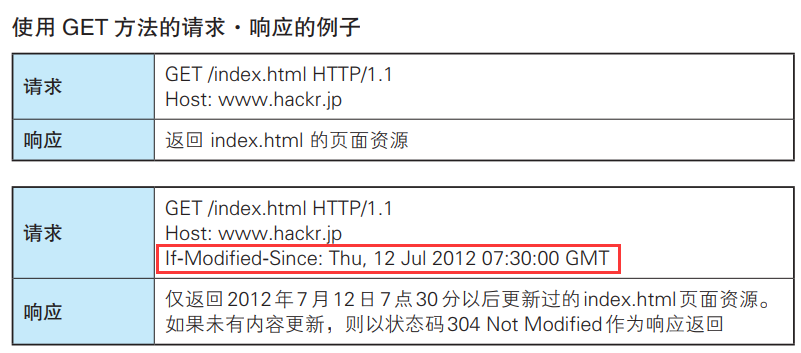 


## 其他

### Carrrover API - [Timestamp](https://developers.cartrover.com/#intro)

Timestamp fields should be submitted to the API in [ISO 8601](https://en.wikipedia.org/wiki/ISO_8601) format in order to specify the timezone.

Timestamp fields returned by the API will be formatted in ISO 8601 and always be in the UTC timezone.

> 2018-08-27T02:24:58+00:00

If you are passing a timestamp as a GET parameter, **YOU MUST** encode the plus symbol (`+`) as `+`


### 如何在Windows上添加UTC时间

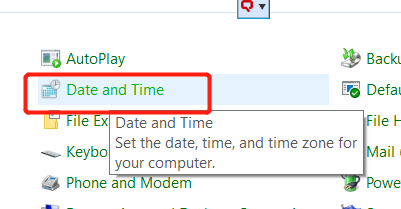


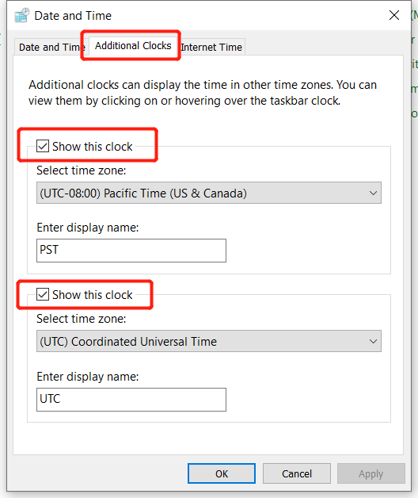  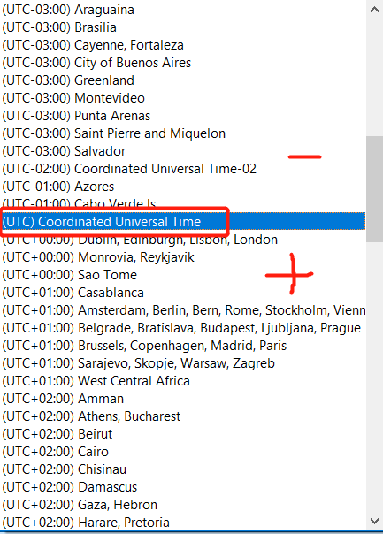  
