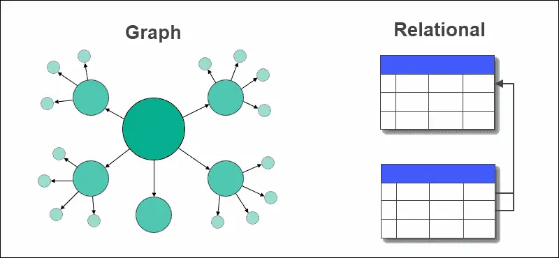

# [Why are relational DBs are the standard instead of graph-based DBs?](https://news.ycombinator.com/item?id=28736405)

现在最流行的数据库都是关系型数据库。这种数据库以表格的形式存储数据。

但是，现实世界中，事物之间的关系不像表格，更像一张互相连接的网。也就是说，图数据库才是描述事物更合适的方式，也更容易扩展和理解。

 

那么，为什么关系型数据库才是主流，图数据库始终属于小众应用？

原因跟数据的存储媒介有关。磁带发明以后，没过多久，关系型数据库就诞生了，这不是偶然的。因为磁带的数据是线性存储，关系型数据库恰恰最适合线性读写数据。

磁盘是磁带的继承者，也是线性存储，这决定了关系型数据库的主导地位。

Hi,

I've been recently exposed to some informational systems where all the domain data was modeled as one graph instead of a set of inter-related tables.

I worked with RDBs (primarily Postgres) for 5+ years and I cannot say that it ever felt wrong, but the more I think about modeling data as graphs, the more it makes me confused why it's not the default way.

Graphs seemed to be: (1) Easier to scale (both storage-wise and complexity-wise). (2) Closer to how we model the world in our minds, hence easier to reason about. (3) Easier to query (felt more like GraphQL than SQL if it makes any sense).

The way I see it, there are two major ways to connect singular entities in a data model: 1. Lists (aka tables) that allow you to sort, filter, and aggregate within a set of entities of the same kind. 2. Relations (aka graph edges or foreign keys) to connect singular entities of different kinds.

... And I can imagine relational DBs being List-first Relation-second, and graph DBs being the opposite. But maybe that's too much of a simplification.

Anyway, looking back at different domains I worked with, it felt like I had spent much more time working with relations than with lists.

Another signal: I have an intern developer, and it took him 1 minute to understand the basics of how graphs work, but then I spent two hours explaining why we needed extra tables for many-to-many relations and how they worked.

Any thoughts? What am I missing? Are RDBs the default way mostly due to historical reasons?

Discussion on this topic that I could find: https://news.ycombinator.com/item?id=27541453

## relation, network and hierarchical 

This exact debate took place in the early 70s. There were three major database models: relational, network, and hierarchical. Network and hierarchical had quite a bit of success, technically and as businesses. IMS was (is?) an IBM product based on the hierarchical model.

Network databases, which seem quite similar to graph databases, were standardized (https://en.wikipedia.org/wiki/CODASYL).

Both the hierarchical and network models had low-level query languages, in which you were navigating through the hierarchical or network structures.

Then the relational model was proposed in 1970, in Codd's famous paper. The genius of it was in proposing a mathematical model that was conceptually simple, conceivably practical, and it supported a high-level querying approach. (Actually two of them, relational algebra and relational calculus.) He left the little matter of implementation as an exercise to the reader, and so began many years of research into data structures and algorithms, query processing, query optimization, and transaction processing, to make the whole thing practical. And when these systems started showing practical promise (early 80s?), the network model withered away quickly.

Ignoring the fact that relational databases and SQL are permanently entrenched, an alternative database technology cannot succeed unless it also supports a high-level query language. The advantages of such a language are just overwhelming.

But another factor is that all of the hard database research and implementation problems have been solved in the context of relational database systems. You want to spring your new database technology on the world, because of its unique secret sauce? It isn't going anywhere until it has a high-level query language (including SQL support), query optimization, internationalization, ACID transactions, blob types, backup and recovery, replication, integration with all the major programming languages, scales with memory and CPUs, ...

(Source: cofounder of two startups creating databases with secret sauces.)

## re-invent wheel

--------------

This kind of history is so important, and even this fairly *recent* history seems kind of hard to access. I am curious how you learned it? (Books? Articles? Finding people involved to interview? usenet posts?)

I learned almost none of it in my formal computer science education in the laste 90s -- maybe because at that time it was recent enough that "middle-aged prime of their career" people still *remembered* it, it didn't seem necessary to teach it to newcomers as "history".

I wonder how much post-1950 history is taught in current undergrad CS programs, like if a "databases" course will include a summary of any of the material you summarize.

----------

 My late professor used to lament quite a lot about work being redone. Not a week went by without one or two papers/submissions/talks/works being mentioned with an immediate followup like “this is the same as this paper from the 70/80/90” or “this is the same as this paper by that author”. I found it quite sad, both because of the apparent double work and because this whole catalogue of computer science material went unused because of the tirades instead of their being a constructive way to share it.Although I very well can imagine the frustration, as I have seen the same things with libraries being reinvented, I think there is value in revisiting some problems in a different context. Maybe the problems are just not that of a big deal anymore in newer languages/eco systems even though they are fundamentally the same problem as in the 70s.

## MongoDB

Databases are interesting because they were the forefront of computing when it was invented, and they still are today. The computer science sorting algorithms and trees (and trie) go directly to how good (for all the different kinds of definitions of good) a database *is*.

MongoDB threw out a ton of history in order to invent a different wheel, and it's faster for interesting reasons, but it's also for a different era than single monolith computing (aka Oracle DB). That doesn't mean MongoDB is appropriate for all situations, but that a fundamental precept of computing has changed. Used to be, there was room for maybe five computers in the whole world. Today, my computer has multiple virtual computers inside of it and they are treated as cattle, not pets. The work being redone is because (sometimes) the work has been invalidated by newer experiments.

We're going to have to "redo" a lot work once dark matter is found as well.

-------------

MongoDB is a classic example of the innovator's dilemma. In its first incarnation it had no ACID transactions, no joins, no Geo-Spatial indexes, no inverted indexes, no SQL query language etc.

What it did have (which no relational database had at the time) was JSON as a coin of the realm and a distributed database model. Run the clock forward and MongoDB now competes on equal footing with relational databases for all those features but it still has the key competitive advantages of JSON as a native format and a distributed architecture.

## Tape and Disk

Tape. SQL databases emerged when data was stored on tape.

join table1, table2 where table1.id = table2.customer_id

type operations would have a tape for table1 in one drive, and a tape for table2 in the other drive. Things like fixed length records emerged to make it possible to fast forward the tape a specific number of inches to the point where the next record would begin, facilitating non-linear access.

Once that model was completely baked into the tooling, it didn't go away when the data moved to HDs then SSDs. The paradigms have outlived the hardware.

It's a bit like the save icon still being a floppy disk.

-------------

That's wrong. Since its inception, on of the main points of the relational mode is physical data independence.

No assumptions on how or where the data is physically stored is made by the model. Besides, it seems more plausible to me that Codd would be working on machines with disks, not tapes, by the time he proposed the model. See this, for example: [https://www.theregister.com/2013/11/20/ibm_system_r_making_r...](https://www.theregister.com/2013/11/20/ibm_system_r_making_relational_really_real/)

So my understanding is relational databases were born on disks, not on tapes, but that distinction doesn't really matter to it. Additionally, it is the **physical independence of the model**（模型的物理独立性） that let all implementations based on it adapt when SSDs (and newer) storage systems arrived.

Finally, saying "the paradigms have outlived the hardware" doesn't make sense in this context. To repeat: **the relational model was proposed precisely to isolate logical database design from hardware details**. As a paradigm, it has been independent of hardware from conception, so of course it would outlive any specific hardware incarnation.

##  Relational model： decouples the logical from the physical representation

(disclaimer: I am VP of Engineering at RelationalAI where we are building a graph database that uses the relational model)

Thanks, this is a great question with many technical, social, and commercial aspects to it.

TLDR: the relational model has a super power for data management systems: it decouples the logical from the physical representation and will eventually always win. There are technical reasons why it was hard until recently to build a graph database based on the relational model.

Database were not always relational: In the 1960s databases actually had a navigational paradigm and used a hierarchical or network data model (not unlike some current graph databases).

The 1970s saw the rise of relational database management systems with early proofpoints of Ingres and System R. The important improvement here was that the physical organization of data is separated from its logical organization in relations. This is the super power of the relational model. This innovation led to an explosion of commercial activity with Oracle, DB2, Sybase (licensed to become Microsoft SQL Server) and some more. Many of these are now still industry giants.

The 90s was a big hype of objected-oriented programming and some got the idea that database management systems should be following the object-oriented model as well. This was mostly a catastrophic failure and instead systems based on the relational model kept improving and won in the end.

In the 2000s there was a large emphasis on scalability to large numbers of users and data, and the development of NoSQL systems started. Most of these did not follow the relational model. These are the key value stores, document databases etc. Key value stores addressed the problem of poor scalability but compromised on the data model and transactions. Document databases have better locality of data and made schema changes easier. They all had something in common: compromise on the relational model to gain an advantage over existing relational systems. However, systems based on the relational model kept improving the meantime and have gradually started to gain market (or mind) share again (eg Aurora, Snowflake, Spanner, CockroachDB).

In my opinion, graph databases are next. Graph databases identified a weakness, which in this case is modelling and the inability of *current* relational systems to handle graph structured data well. Graph data involves many joins and often recursive computations, which current commercial SQL relational systems do not do well. However, the new graph databases are not superior universally. For example, take TPC-H (OLAP - analytical) or TPC-C (OLTP - transactional), put that on a graph database and you'll typically see pretty terrible performance even though the data can easily be modeled as a graph. Several popular graph database systems do not even scale well beyond a single node.

I think you are absolutely right that graph data models are easier to work with. Starting from an ER diagram (or similar) it's not straightforward to go to tables. Assuming that your ER model is a good model, you're grouping stuff into tables based on functional dependencies. Tables here are a collection of relations, eg for an _order_, the SQL table might include relations to the customer, order date, etc. It does not include relations to products included in the order, because these have a different primary key. This is difficult for users to understand.

Predictably, the relational model is catching up though with graph database systems. A major research innovation in databases from recent years are better join algorithms, specifically for joins involving many relations, self-joins and skewed data. They're called worst-case optimal join algorithms (WCOJ) and several early prototype systems have shown promising results with these.

Based on these ideas, RelationalAI ( https://docs.relational.ai/ , https://twitter.com/RelationalAI ) is building a graph database management system based on the relational model. Presumably, this is the relational model utilizing its super power again and demonstrating that relational models will always win and innovate to incorporate legit limitations of previous systems.

## Reference 

1.  [Why are relational DBs are the standard instead of graph-based DBs?](https://news.ycombinator.com/item?id=28736405)
2. [科技爱好者周刊（第 191 期）：一个程序员的财务独立之路](https://www.ruanyifeng.com/blog/2022/01/weekly-issue-191.html)