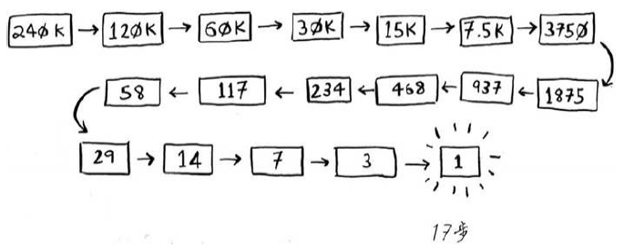
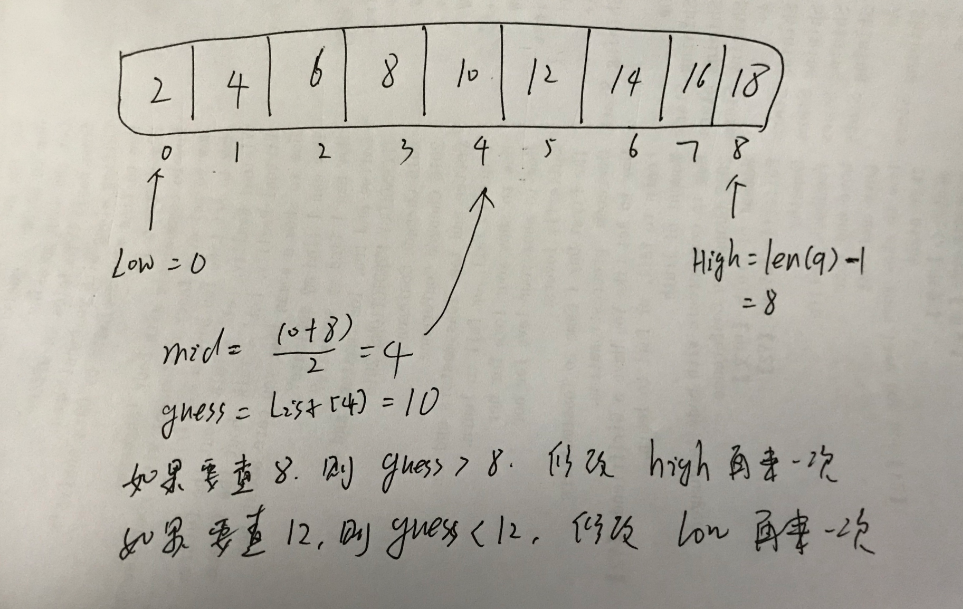
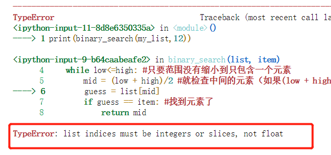
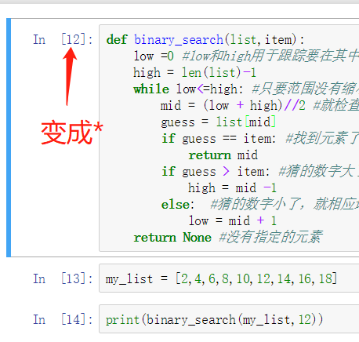
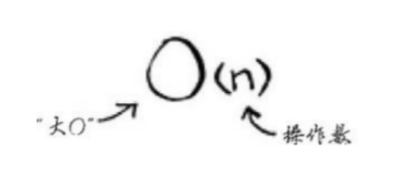
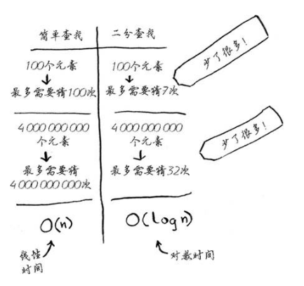
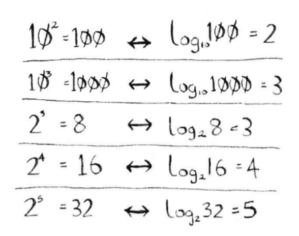
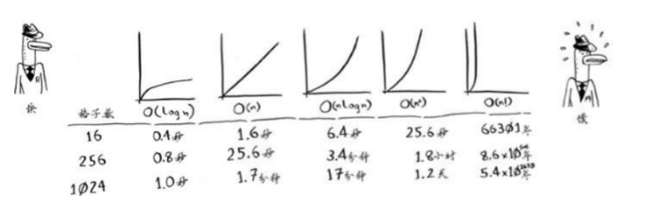
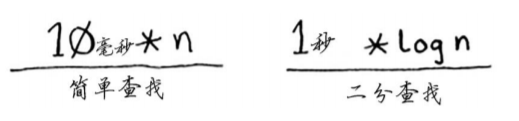

# 二分查找&大O表示法
@(算法篇)[图解算法, 常用算法, 大O表示法, 二分查找]

[toc]

* [二分查找&amp;大O表示法](#二分查找大o表示法)
  * [1\. 二分查找法的Python实现](#1-二分查找法的python实现)
    * [1\.1 调试问题总结：](#11-调试问题总结)
  * [2\. 大O表示法](#2-大o表示法)
    * [2\.1 算法的运行时间以不同速度增加](#21-算法的运行时间以不同速度增加)
      * [2\.1\.1 对数 （Logarithm）](#211-对数-logarithm)
    * [2\.2 大O表示法指出了最糟糕情况下的运行时间](#22-大o表示法指出了最糟糕情况下的运行时间)
    * [2\.3 一些常见的大O运行时间](#23-一些常见的大o运行时间)
  * [3\. 小结：](#3-小结)
  * [4\. 大O的常量问题](#4-大o的常量问题)
  * [5\. Reference](#5-reference)


假设现在你需要从一个有序的数字列表中查找出一个数。起先你打算写个程序用逐个检查检查匹配，如果列表中包含100个数字，你**最多**需要猜100次。一百次也许对计算机来说是小菜一碟。

但是如果列表包含了240,000条数据，那么程序**最多**需要检查24万次。这显然不是你想要的低效能的程序，于是你开始思考能改进程序匹配查找的**算法**。

于是你发现一种叫**二分查找法**的算法，如果包含100个元素，最多只要猜7次；如果包含24万条数据，最多需要猜17次，厉害了我的二哈查找法...




> 说明：上述的，程序要查找的次数和列表的长度相同的情况，叫做**线性时间(Linear time)**。

## 1. 二分查找法的Python实现

函数binary_search 接受一个有序数组和一个元素。如果指定的元素包含在数组中，这个函数将返回其位置。

你将跟踪要在其中查找的数组部分——开始时为整个数组。

```python
def binary_search(list,item):
	low =0 #low和high用于跟踪要在其中查找的列表部分
	high = len(list)-1
	while low<=high: #只要范围没有缩小到只包含一个元素
		mid = (low + high)//2 #就检查中间的元素（如果(low + high)不是偶数，Python自动将mid向下取整。）
		guess = list[mid]
		if guess == item: #找到元素了
			return mid
		if guess > item: #猜的数字大了，就修改high
			high = mid -1
		else:  #猜的数字小了，就相应地修改low
			low = mid + 1
	return None #没有指定的元素
```

执行：
```python
my_list = [2,4,6,8,10,12,14,16,18]
print(binary_search(my_list,12))
```





### 1.1 调试问题总结：
1. guess是具体的一个数字，而mid是下标的位置，因此不要混淆。我第一次写代码携程 high = guess -1....
2. 调用的时候 print binary_search(my_list,8)，Jupyter上会报错！必须用print (binary_search(my_list,8))形式，加上圆括号。
3. Jupyter Notebook的调试方式：https://davidhamann.de/2017/04/22/debugging-jupyter-notebooks/
4. **2018年10月19日新增**：书中 mid = (low + high)/2 #就检查中间的元素。如果(low + high)不是偶数，**Python自动将mid向下取整**。这里自动向下取整Python 2.5以下的版本中是没问题，[但是2.5以上的版本就无效](https://www.cnblogs.com/langdashu/p/5120909.html)。在调试的时候会报错：



> TypeError: list indices must be integers or slices, not float

解决的办法就是用**//**来代替**/**，或者用math.ceil()方法来代替（需要引入 import math）

5. Jupyter notebook执行过程，[]里面变成*号问题：
    
     在**Kernnel**菜单中-->**Restart**下可以解决问题。需要注意的是，restart过程比较长，需要耐心等待。UI上会有字幕提示restart的过程状态。
6.  第二次调试，通过（2019-2-23）


## 2. 大O表示法
**[大O表示法(Big O Notation)](https://en.wikipedia.org/wiki/Big_O_notation)**是一种特殊的表示法，指出了算法的速度有多快。

大O表示法指出了算法有多快。例如：**假设列表包含n个元素。简单查找需要检查每个元素，因此需要执行n此操作**。使用大O表示法，这个运行时间为O(n)。单位呢？没有---大O表示法指的并非以秒为单位的的速度。大O表示法**让你能够比较操作数，它指出了算法运行时间的增速。**



别忘了，**O(n)时间意味着查看列表中的每一个元素一次**。

> 所以，二分查找法的运行时间是 **对数时间**（或者叫**log时间**）。

### 2.1 算法的运行时间以不同速度增加

如果用简单查找100个元素，需要100次；如果要查找40亿个，则需要40亿次（这好像是废话...）。换言之，最多需要查找的次数与列表的时间相同，这被称为**线性时间(Linear time)**。

二分查找法则不同。如果包含100个元素则只需要查找7次 （$log_27=128$）,如果列表包含40亿个数字，最多只需要查找32次，厉害吧！

所以二分查找的运行时间为**对数时间（或log时间）**。下面总结了我们发现的情况：


#### 2.1.1 对数 （Logarithm）
你可能不记得什么是对数了，但是很可能记得什么是杨幂，打错了，幂(power)。$log_2 128$相当于问“将多少个2相乘的结果为100”。答案是7个($2^7$=128)。因此$log_2 128=7$。

**对数运算是幂运算的逆运算**。



> Power: the number of times that an amount is to be multiplied by itself.
> 
> 本书经常会谈到log时间，因此你必须明白对数的概念。如果你不明白，可汗学院（khanacademy.org）有一个不错的视频，把这个概念讲得很清楚。

### 2.2 大O表示法指出了最糟糕情况下的运行时间
假设你使用简单查找在电话簿中找人。你知道，简单查找的运行时间为O (n )，这意味着在最糟情况下，必须查看电话簿中的每个条目。

但是如果要查找的是Adit——电话簿中的第一个人，一次就能找到，无需查看每个条目。考虑到一次就找到了Adit，请问这种算法的运行时间是O (n )还是O (1)呢？

简单查找的运行时间总是为O(n)。查找Adit时，一次就找到了，这是最佳情形，**但大O表示法说的是最糟糕的情形。因此，你可以说，在最糟糕情况下，必须查看整个列表，对应的运行时间为O(n)。这是一个保证：你知道简单查找的运行时间不可能超过O(n)。

### 2.3 一些常见的大O运行时间
- **O(log n)**,也叫**对数时间**，这样的算法包括二分查找法。
- **O(n)**,也叫**线性时间**，这样的算法包括简单查找。
- **O(n*log n)**,这样的算法包括快速排序----一种速度较快的排序算法。
-  $O(n^2)$,这样的算法包含选择排序算法----一种速度较慢的排序算法。
- **$O(n!)$**,这样的算法包括旅行商问题的解决方案----一种非常慢的算法。

还有其他的运行时间，但这5种是最常见的。

下面按从快到慢的顺序列出了使用这些算法绘制网格所需的时间：




## 3. 小结：
1. **算法的速度指的并非时间，而是操作数的增速**。
2. 算法得运行时间用大O表示法。(算法运行时间并不以秒为单位。)
3. 讨论算法的速度时，我们说的是**随着输入的增加，其运行时间将以什么样的速度增加**。
4. $O(log n)$比$O(n)$快，**当需要搜索的元素越多时，牵着比后快得越多**。


## 4. 大O的常量问题

> 4.3 再谈大 O 表示法 P53


算法所需的固定时间量，被称为常量。例如，`print_ items`所需的时间可能是10毫秒 * n，而print_items2所需的时间为1秒 * n。

通常不考虑这个常量，因为如果两种算法的大O运行时间不同，这种常量将无关紧要。就拿 二分查找和简单查找来举例说明。假设这两种算法的运行时间包含如下常量。

 

你可能认为，简单查找的常量为10毫秒，而二分查找的常量为1秒，因此简单查找的速度要快得多。现在假设你要在包含40亿个元素的列表中查找，所需时间将如下。

| Name     | 算法           | 时间  |
| -------- | -------------- | ----- |
| 简单查找 | 10毫秒 * 40 亿 | 463天 |
| 二分查找 | 1秒 * 32       | 32秒  |

正如你看到的，二分查找的速度还是快得多，**常量根本没有什么影响**。

但有时候，常量的影响可能很大，对 ***快速查*** 找和 ***合并查找*** 来说就是如此。快速查找的常量 比 合并查找小，因此如果它们的运行时间都为 $O(n log n)$，快速查找的速度将更快。实际上，快速查 找的速度确实更快，因为相对于遇上最糟情况，它遇上平均情况的可能性要大得多。


## 5. Reference

1. [Grokking Algorihtms](https://www.manning.com/books/grokking-algorithms) - An illustrated guide for programmers and other curious people.

2. Grok：to understand completely and intuitvely  v.〈美俚〉(由于移情作用而)透悉[彻悟] / 通过感觉意会

   ***Grok*** [/ˈɡrɒk/](https://en.wikipedia.org/wiki/Help:IPA/English) is a [neologism](https://en.wikipedia.org/wiki/Neologism) coined by American writer [Robert A. Heinlein](https://en.wikipedia.org/wiki/Robert_A._Heinlein) for his 1961 [science fiction](https://en.wikipedia.org/wiki/Science_fiction) novel *[Stranger in a Strange Land](https://en.wikipedia.org/wiki/Stranger_in_a_Strange_Land)*. While the *[Oxford English Dictionary](https://en.wikipedia.org/wiki/Oxford_English_Dictionary)* summarizes the meaning of *grok* as "to understand intuitively or by empathy, to establish rapport with" and "to empathize or communicate sympathetically (with); also, to experience enjoyment",[[1\]](https://en.wikipedia.org/wiki/Grok#cite_note-OED-1) Heinlein's concept is far more nuanced, with critic Istvan Csicsery-Ronay Jr. observing that "the book's major theme can be seen as an extended definition of the term."[[2\]](https://en.wikipedia.org/wiki/Grok#cite_note-CR-2) The concept of *grok* garnered significant critical scrutiny in the years after the book's initial publication. The term and aspects of the underlying concept have become part of communities such as [computer science](https://en.wikipedia.org/wiki/Computer_science). (--Wikipedia)

