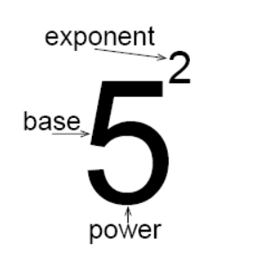

# 次幂，次方，乘方，乘幂-沃日腻打野

@(算法篇)[数学基础概念]

> 我觉得计算机系一定要先懂英文 再不行就先懂古文，不然你就会宏，幂，句柄，套接字、缺省、闭包这些词弄得成个自闭的草包。

- 幂是运算结果
- 幂包含了基数（因子）和指数

## 1. 基础概念

- 我们先分一下两个概念：**运算** 和 **运算结果** 。

- **运算诸如：** ![[公式]](https://www.zhihu.com/equation?tex=%2B%2C-%2C%5Ctimes%2C%5Cdiv%2C%28x%29%5Ek%2C%5Csqrt%5Bk%5D%7Bx%7D%2C%5Cldots) 

- 读作：加，减，乘，除以，k次方，k次方根。

- **对应的运算结果分别是：**和，差，积，商，幂，根。

- 幂 和 根 通常follow一个数字K。

- 如 ![[公式]](https://www.zhihu.com/equation?tex=a%5Ek) 读作“ ![[公式]](https://www.zhihu.com/equation?tex=a) 的 ![[公式]](https://www.zhihu.com/equation?tex=k) 次方”或“ ![[公式]](https://www.zhihu.com/equation?tex=a) 的 ![[公式]](https://www.zhihu.com/equation?tex=k) 次(方)幂”。

- ![[公式]](https://www.zhihu.com/equation?tex=%5Csqrt%5Bk%5D%7Ba%7D) 则读作“ ![[公式]](https://www.zhihu.com/equation?tex=a) 的 ![[公式]](https://www.zhihu.com/equation?tex=k) 次方根”。

  > (平时老师们读 ![[公式]](https://www.zhihu.com/equation?tex=%5Csqrt%7Ba%7D) 为“根号下 ![[公式]](https://www.zhihu.com/equation?tex=a) ”是错的，但字面上很好理解)“幂”是 次方一类 运算的结果。

- “平方”和“二次方”是一样的。
- “立方”和“三次方”也是一样的。
- 但我平常不读 ![[公式]](https://www.zhihu.com/equation?tex=a%5E2.a%5E3) 为**“** ![[公式]](https://www.zhihu.com/equation?tex=a) 的**平方幂”和“** ![[公式]](https://www.zhihu.com/equation?tex=a) 的**立方幂”**，而是读**“** ![[公式]](https://www.zhihu.com/equation?tex=a) 的**二次方幂”和“** ![[公式]](https://www.zhihu.com/equation?tex=a) 的**三次方幂”或直接说“** ![[公式]](https://www.zhihu.com/equation?tex=a) 的**平方”和“** ![[公式]](https://www.zhihu.com/equation?tex=a) 的**立方”。**

**看个人习惯吧。**

作者：Craker.卿璃姊
链接：https://www.zhihu.com/question/367141828/answer/980410259
来源：知乎
著作权归作者所有。商业转载请联系作者获得授权，非商业转载请注明出处。

## 2. 什么是幂？

> [幂](https://baike.baidu.com/item/%E5%B9%82/21810#viewPageContent)：盖东西用的巾。大巾谓之幂。 怎么和幂运算关系上了

幂并非外来术语，其原意为盖东西的方布。

《九章算数》第一章《方田》中的第二个问题如下：又有田广十二步，从十四步。问为田几何？

答曰：一百六十八步。方田术曰：广从步数相乘得积步。

**所谓方田就是矩形的田，广是宽度，从是高度。**

对于这条问题，三国时刘徽注解道：

> 此积谓田幂。**凡广从相乘谓之 幂**。所以至少从三国时期，幂可以表示长宽相乘。

唐李淳风则对刘徽注又有阐述说：

> 经云广从相乘得积步，注云“广从相乘谓之幂”。观斯注意，积幂义同。以理推之，固当不尔。何则？幂是方面单布之名，积乃众数聚居之称。循名责实，二者全殊。虽欲同之，窃恐不可。今以凡言幂者据广从之一方；其言积者举众步之都数。经云相乘得积步，即是都数之明文。注云谓之为幂，全乖积步之本意。此注前云积为田幂，于理得通。复云谓之为幂，繁而不当。今者注释，存善去非，略为料简，遗诸后学。

李淳风认为，既然幂是方布，所以把面积叫做田幂是合理的，但是把幂定义为？是不妥当的。可见从三国到唐，幂表示长宽相乘的含义并不是被广泛接受的。

徐光启于明朝万历年间翻译《几何原本》时，使用了“幂”字，并对“幂”的含义进行了修订。他自注说：

**自乘之数曰幂。**这就相当于定义幂为了。

## 3. [Powers and exponents](https://www.mathplanet.com/education/pre-algebra/discover-fractions-and-factors/powers-and-exponents)

We know how to calculate the expression 5 x 5. This expression can be written in a shorter way using something called exponents.

$$5⋅5=5^2$$

An expression that represents **repeated multiplication of the same factor is called a power**.

The number 5 is called the base, and the number 2 is called the exponent. The exponent corresponds to the number of times the base is used as a factor.

| $$3^1$$ | 3 to the first power               | 3                     |
| ------- | ---------------------------------- | --------------------- |
| $$4^2$$ | 4 to the second power or 4 squared | 4 ∙ 4                 |
| $$5^3$$ | 5 to the third power or 5 cubed    | 5 ∙ 5 ∙ 5             |
| $$2^6$$ | 2 to the power of six              | 2 ∙ 2 ∙ 2 ∙ 2 ∙ 2 ∙ 2 |

### Multiplication

If two powers have the same base then we can multiply the powers. When we multiply two powers we add their exponents.

The rule:

$$x^a⋅x^b=x^{a+b}$$

**Example**

$$4^2⋅4^5=(4⋅4)⋅(4⋅4⋅4⋅4⋅4)=4^7=42+5$$

### Division

If two powers have the same base then we can divide the powers. When we divide powers we subtract their exponents.

The rule:

$$\frac{x^a}{x^b}=x^{a−b}$$

## 4. [奇怪的知识又增加了](https://www.zhihu.com/question/27192923)

|                   |          |        |                                                              |
| ----------------- | -------- | :----- | ------------------------------------------------------------ |
| Macro             | 宏       | 巨集   | 把很长的一串CPU指令映射成一个长度较短的符号， 当作单个指令来用。(长指令) |
| handle            | 句柄     | 识别号 | 理解成文件的JJ （引用/“伪指针”）                             |
| default           | 缺省     | ？     |       
| hook              | 狗子     | ？     | 
| socket            | 套接字   | ？     |                                                              |
| robust            | 鲁棒性   | ?      | 不管怎样粗鲁的对待，性能都很棒棒”                            |
| tautology         | 套套逻辑 |        |                                                              |
| induction formula | 诱导公式 |        | **induction**(technical),a method of discovering general  rules and principles from particular facts and examples.  英语里就没这套公式，应该是来自俄语的 формулы приведения 翻译自俄语的формула приведения，这里的名词приведение 来自动词привести，привести同时有“诱导”和“化简”两重含义， 这里应该是“化简”的意思。  维基百科是：Reduction formulae. |

## References & Connections

1. [数学中幂运算，为何选“幂”这个词来表达？想不到关联的地方，很违和吧 --知乎](https://www.zhihu.com/question/24214993/answer/27146492)
2. [平方、立方和幂的区别是什么？](https://www.zhihu.com/question/367141828/answer/980410259)
3. [为什么handle会被翻译成句柄？](https://www.zhihu.com/question/22950899)

