# 你喝的不是饮料！是糖！是脂肪！

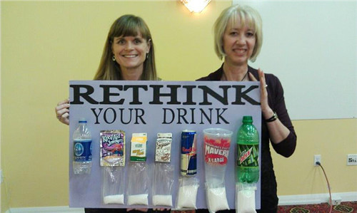

红牛右三。雪碧右一像是。左一应该是矿泉水。没错，袋子里是糖分含量！！！

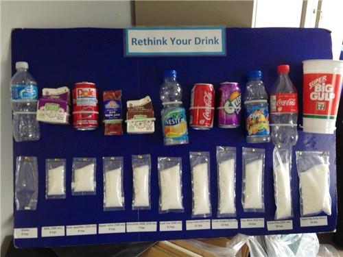

　　这一条条的糖，干吃得多难吃啊！！！！

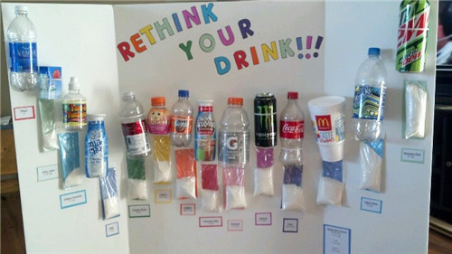

　　各种对比啊！！！很透彻啊！！！这是家庭作业吗？？？老美把孩子们调动起来反可乐反老麦啦！！

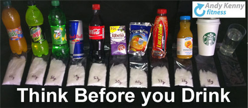

　　星巴克也入榜啦……

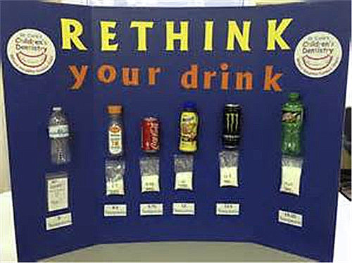

　　这是不是有点儿批斗的意思啊，榜上有名的日子都不会好过吧。

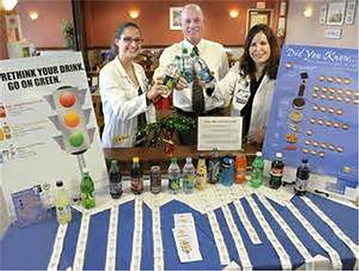

　　俺们都开始讲究绿色健康啦，吃喝都得新鲜啊blablabla！！！！

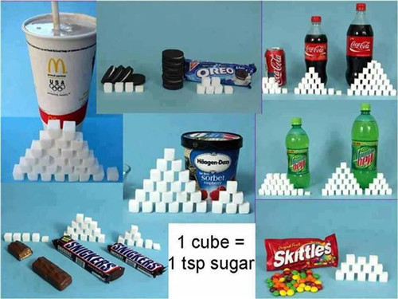

　　奥利奥、哈根达斯、士力架之类的，你们的金字塔也堆滴蛮高滴嘛！！！

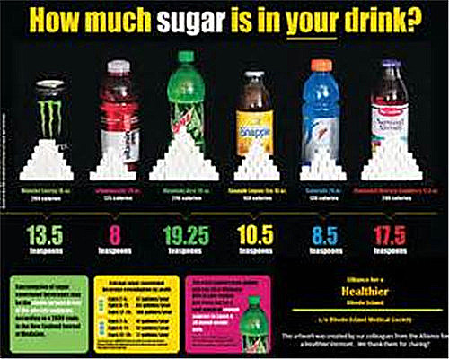

　　“你的饮料里到底含有多少糖糖sugar？”

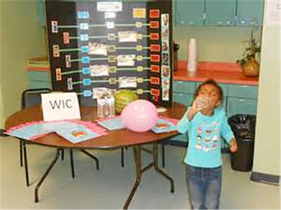

　　姑娘我不管，照喝不误！

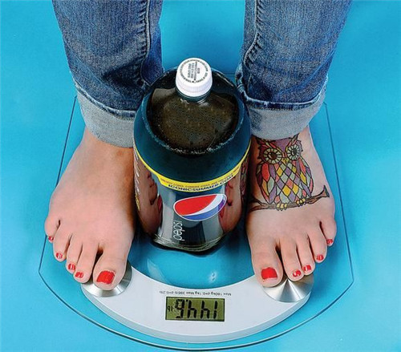

　　喝吧，喝完就成这样！144.6斤是吧。

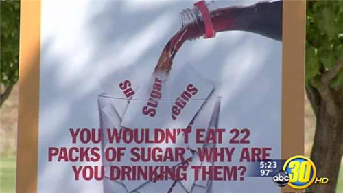

“你不会生吃22袋白糖吧。那你干嘛要喝22袋白糖呢，亲”！

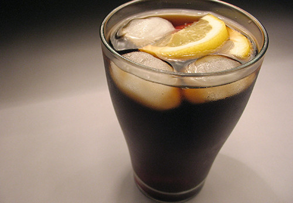

　　要重新想想了吧……

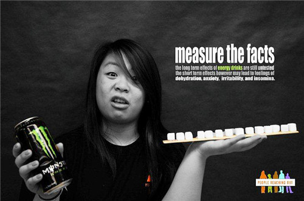

　　

　　“诶，你怎么直接喝脂肪呢！改喝白开水吧。”

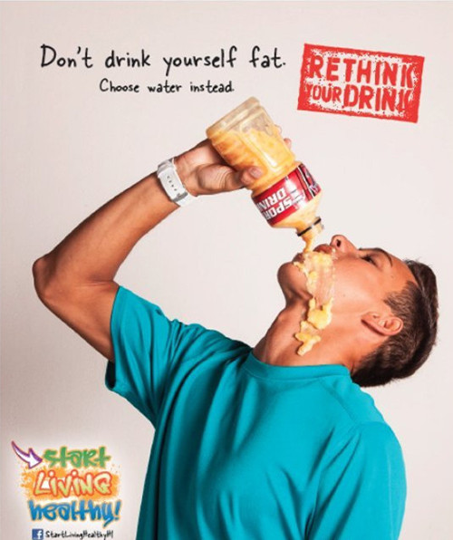

　　你在喝多少白糖自己心里清楚吗？？？行动起来，减少含糖饮料的消费。多喝白开水和其他替代性的健康饮料！！！

　　不鼓励你多喝含糖饮料，而是鼓励你和家人多喝健康的白开水，这样 就对了。