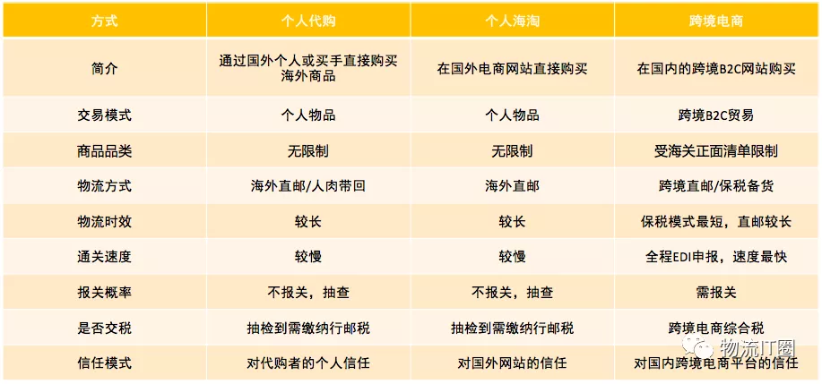
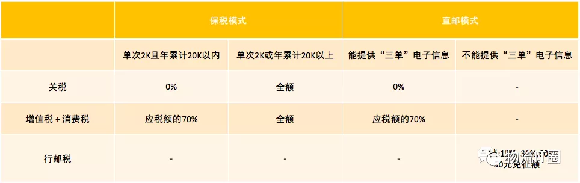
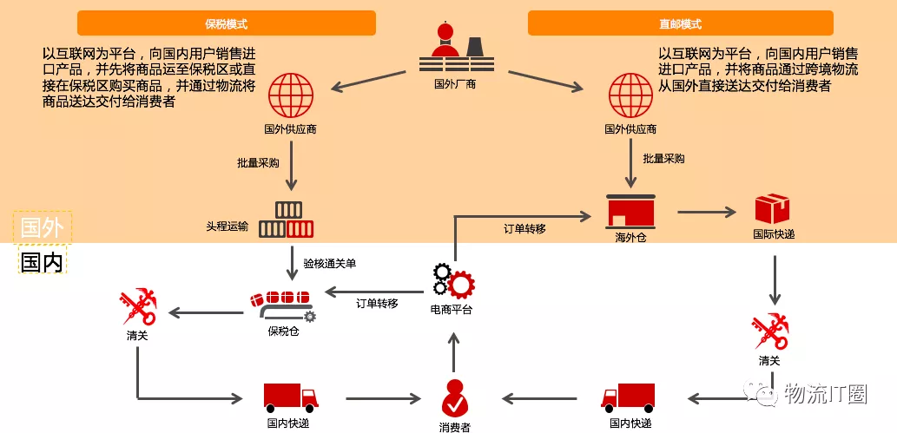
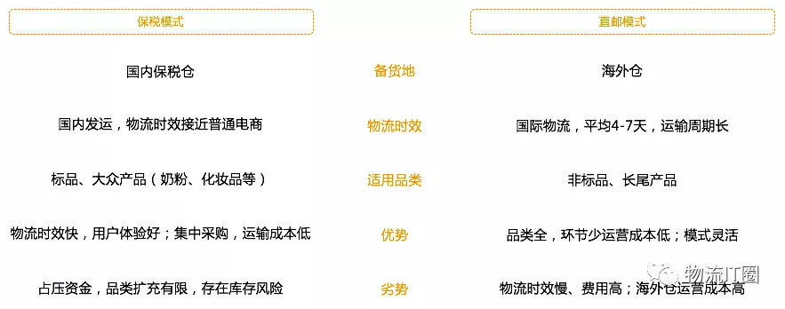
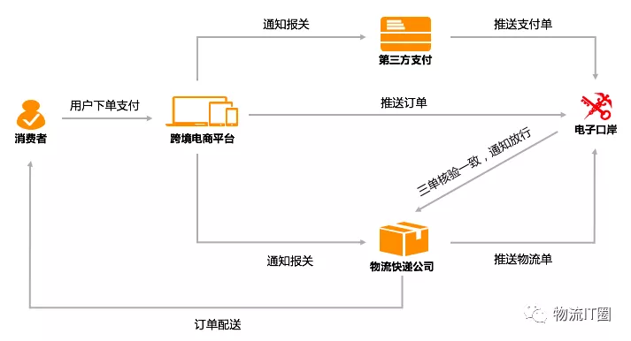
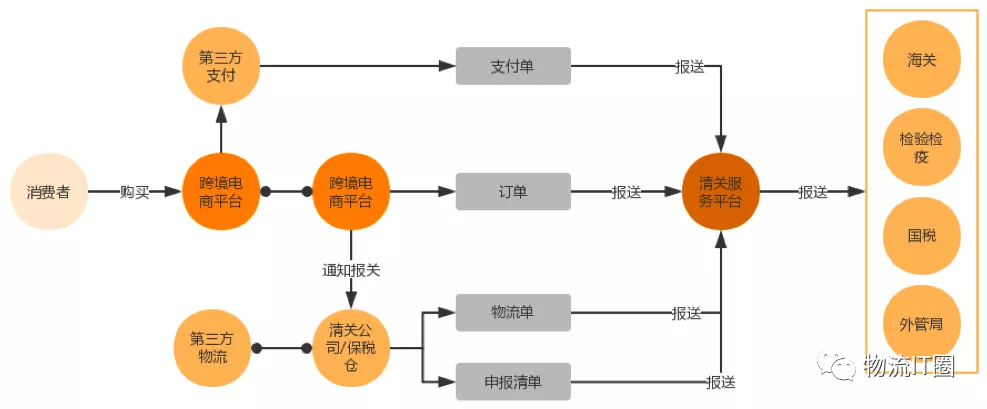
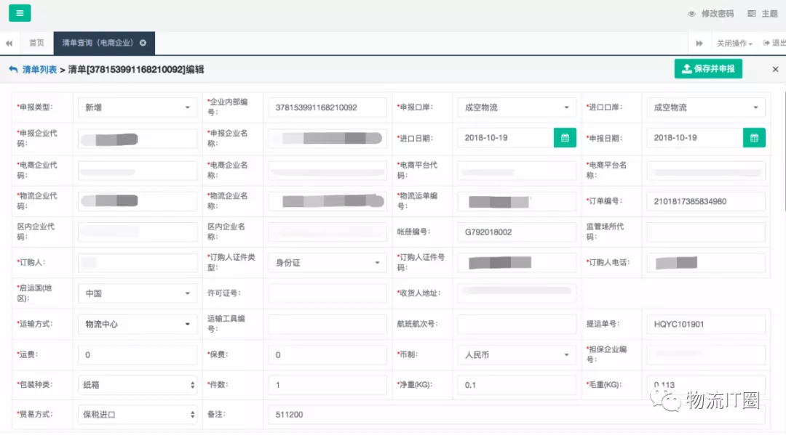
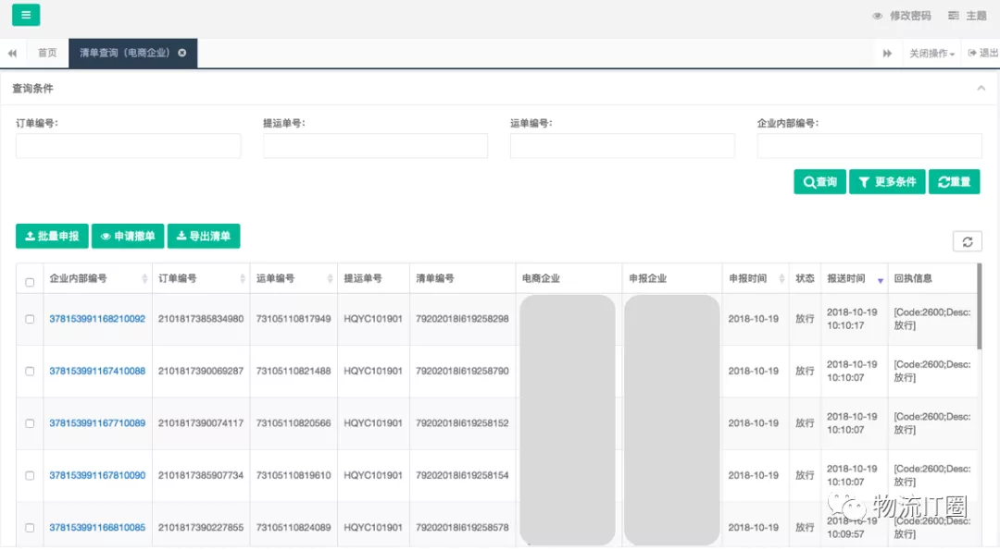
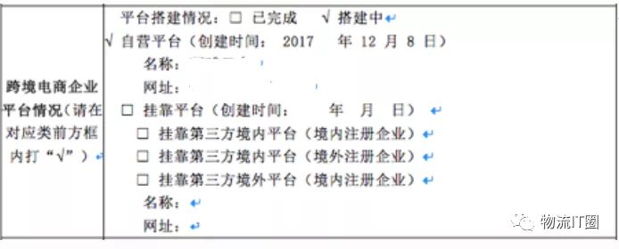

## 跨境电商是怎么清关的？

@(百美)[电商行业,跨境电商,清关,物流IT圈]

[toc]

## 1. 什么是“跨境电商”？

### 1.1 概念定义

从广义业务上讲，所谓跨境电商的业务模式，‘跨境’是指分属不同关境的交易主体，‘电商’是指通过电子商务平台达成交易、进行支付结算，并通过跨境物流送达商品、完成交易。

因此较之一般电商，跨境电商的关键区别在于跨境，其他如平台搭建、交易流程较于一般电商并无实际区别。从交易主体性质、进出口性质两个角度划分，跨境电商可以分为**跨境出口B2B**、**跨境出口B2C**、**跨境进口B2B**、**跨境进口B2C**等四个子领域，本文主要介绍的就是跨境进口B2C业务的清关流程。

从狭义业务上讲，对于国内消费者而言，跨境电商等同于跨境B2C电商，包含代购、海淘等各种方式，只要是能够直接购买到海外原装产品、通过线上手段购买到的各类途径，都可以算作是跨境电商。

从海关监管机制上看，跨境电商是一种特有的海关清关通道，区别于常规的个人快件清关通道、一般贸易清关通道等。

**本文介绍的均是基于海关监管机制角度模式下的电子清关流程**，包含保税备货、跨境直邮两种模式。

### 1.2 业务背景

国内消费者购买海外商品主要有三种途径，代购、海淘、跨境电商，差异如下：

**跨境电商最开始的形式就是代购和海淘**，国内消费者要么是通过国外个人或者买手直接购买海外产品，要么是在支持全球物流配送的国外电商网站直接购买。这两种方式最大的问题在于：

- **从消费者角度**：商品质量，由于买卖家物理距离远、语言问题等，一旦遇到商品质量问题，退换货基本无望；
- **从国家角度**：海关监管，通过代购、海淘模式购买的商品，绝大部分以个人快件形式进入各海关口岸，个人快件原则上也是需要申报的，但是为了减少税费成本，各大代购平台基本都不会进行主动申报，导致海关大量税费无法收取。

因此为了规范跨境电商市场，引导其合理发展，2016年4月8日，我国对跨境电商零售进口商品实行了新税制，该类商品将不再按邮递物品征收行邮税，而是按货物征收关税和进口环节增值税、消费税，从而形成了‘跨境电商’的专有概念。

“四八新政”的核心管理规则包含：

1. 跨境电商零售进口商品不再按物品征收行邮税，而是按货物征收关税、增值税、消费税；
2. 设立跨境零售进口电商正面清单，跨境零售进口商品的品类受到一定的限制；
3. 规定个人购买限额，“跨境电子商务零售进口商品的单次交易限值为人民币2000元，个人年度交易限值为人民币2万元”；
4. 跨境进口标准提高，化妆品、婴幼儿配方奶粉、医疗器械、特殊食品等的首次进口需提供许可批件、注册或备案。

“四八新政”从税制、品类、购买限额、备案机制等各个方面对跨境B2C电商进行了规范，从而区别野蛮生长的代购、海淘跨境模式，形成了“跨境电商”的新概念。

## 2. 跨境电商业务模式

“四八新政”监管政策下的跨境电商包含**保税备货**、**跨境直邮**两种业务模式。

- **保税备货：**平台先将商品批量运输至国内保税仓，待消费者下单后，再从保税仓进行清关出区，交付国内物流配送至消费者；
- **跨境直邮：**平台将商品存放在海外仓库，待消费者下单后，直接从海关配送，经中国海关清关后，交由国内物流配送至消费者。

保税备货、跨境直邮均是在‘四八新政’监管规则下的合规跨境电商业务模式，均需进行商品备案，经营品类受正面清单限制，所有订单均需平台进行主动申报，缴纳相关税费后才能进行境内配送，因此有效避免了代购、海通等灰色区域。但由于备货地的配置差异，保税备货、跨境直邮在物流时效、商品品类等方面形成了各自的优劣势。

对于大多数消费者而言，对直邮相对比较推崇，因为直邮模式可以提供完整的国外物流信息从而规避假货风险；对于平台而言，则是根据不同的运营策略，对两种模式各有侧重。

## 3. 跨境电商电子清关流程

### 3.1 三单合一监管政策

四八新政完善了跨境电商的相关税制，即‘跨境电商零售进口商品不再按物品征收行邮税，而是按货物征收关税、增值税、消费税’，不再设立免税额。同时要求‘对于通过跨境电商入境的商品过往海关时需要三单合一，即支付单、订单、物流单三单要一致匹配’。

支付单由有支付资质的企业推送给海关，订单和物流单由跨境电商平台或提供保税仓仓储物流服务的第三方公司推送给海关，海关核对三单信息，核验放行后才可进行境内段配送。

‘三单合一’的监管要求在国家层面有效提升跨境电商监管力度、征缴海关税费方面提供了强有力的工具保障，但同时也提高了跨境电商行业的进入门槛，由于需要和第三方支付、物流、保税仓及电子口岸进行系统对接，一定的技术开发能力成为业务开展的基础。

在实际政策落地过程中，三单合一也存在着很多变通方式，如部分关区仅要求三单（订单、支付单、运单），而有些关区（如成都、郑州）则要求‘四单’，除了订单、支付单、运单外，还需要由代理清关公司报送‘清单’；同时订单、运单、支付单等均可由代理清关公司代为报送，但需要先向海关部门进行申请审核。

### 3.2 电子清关流程

在电子清关业务执行过程中，各关键节点流程如下：

1. 消费者在跨境电商平台下单完成支付；
2. 电商平台通知第三方支付公司，将支付单报送至各关区清关服务平台；
3. 电商平台将消费者订单报送至各关区清关服务平台；
4. 电商平台通知第三方代理清关公司（保税仓）待清关订单信息；
5. 第三方代理清关公司（保税仓）获取电子运单号，结合待清关订单信息生成清单，报送至各关区清关服务平台；
6. 清关服务平台将支付单、订单、物流单、清单进行初步校验，通过后报送关、检、税、汇各管理部门业务系统；
7. 清关服务平台获取海关校验结果后（通过/不通过），回传清关结果至代理清关公司；若通过，代理清关公司进行后续打包、清关等操作。

各业务单据报送均为**异步执行**，可分别报送至清关服务平台，但是电商平台为了提高清关成功率，一般会优化该清关流程，如会在收到支付单报送成功信息回执后，再向海关推送订单信息。

在电子清关过程中，有两个比较特殊的角色，第三方代理清关公司、清关服务平台；

- **第三方代理清关公司**：在保税备货模式下，对于没有能力自建保税仓的平台，需要与区内第三方公共保税仓合作，商品运达境内关区完成商检后，进入第三方保税仓。一般情况下，区内保税仓公司通常均具备代理清关资质，能够完成订单申报、代缴税费等工作，同时区内保税仓公司通常有合作的境内物流公司。因此，第三方代理清关公司往往承担着仓储、订单作业、清关、物流配送等各项服务能力。
- **清关服务平台**：即‘海关单一窗口’，在各关区没有清关公共服务平台前，跨境电商公司需要分别于地方海关、检验检疫、国税、外管局系统进行对接；清关公共服务平台整合了各管理部门内部系统，形成一套统一的申报接口，从而有效降低了三单合一系统对接难度。

### 3.3 电子清关监管规则

跨境电商对应的订单、支付单、物流单、清单报送海关系统后，根据相应的业务规则校验对应订单是否放行，只有查验放行的订单才可进行后续分拣、配送阶段。

三单合一监管规则下电子清关核心报送信息如下：

- **订单：**订单编号、电商平台代码、电商平台名称、电商企业代码、电商企业名称、商品价格、运杂费、非现金抵扣金额、代扣税款、实际支付金额、订购人姓名、订购人证件类型、订购人证件号码、支付企业代码、支付企业名称、支付交易编号。
- **支付单：**支付企业代码、支付企业名称、支付交易编号、订单编号、电商平台代码、电商平台名称、支付人证件类型、支付人证件号码、支付人姓名、支付人电话、支付金额。

海关系统会按照以下规则对信息进行校验，确认是否放行；

1. 订单、支付单、物流单匹配一致；
2. 电商平台、电商企业备案信息真实有效；
3. 订购人姓名、身份证号匹配查验一致；
4. 订购人年度购买额度<=￥20000；
5. 单笔订单实际支付金额<=￥2000；
6. 单笔订单单个商品数量小于8个，商品总数量小于25个；
7. 订单商品价格、代扣税金、实际支付金额等计算正确（允许5%误差）；
8. 订单实际支付金额与支付单支付金额、支付人信息等一致。

对于税费，代理清关公司在海关设置有保证金账户，订单放行同时会对保证金进行扣减。

在三单合一匹配规则中，**电商企业代码、电商平台代码**是一个比较有意思的点，订单申报信息中包含电商企业代码、电商平台代码，但支付单申报信息中仅包含电商平台代码，即海关系统的关注点在于订单、支付单需要发生在同一个平台，但支付企业与电商企业是否签订协议并不重要。这就为在天猫国际、京东全球购这样的B2C平台上开店的电商公司提供了报关途径。

实际上，在业务开展筹备期进行海关备案时，企业也是需要申报电商平台是自建还是挂靠在第三方电商平台的，当然，挂靠的第三方电商平台本身首先需要完成海关备案，否则会导致后续订单清关失败。

## Reference

1. [跨境电商是怎么清关的？--物流IT圈](https://mp.weixin.qq.com/s/PnAU7i1qXjhoIgGkbfvtHw)

