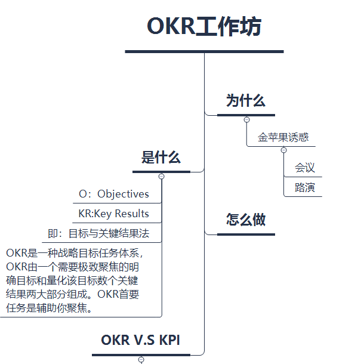
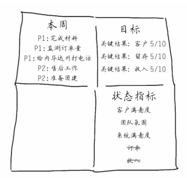
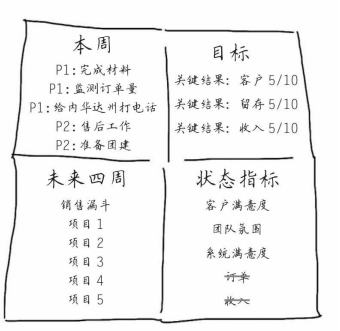
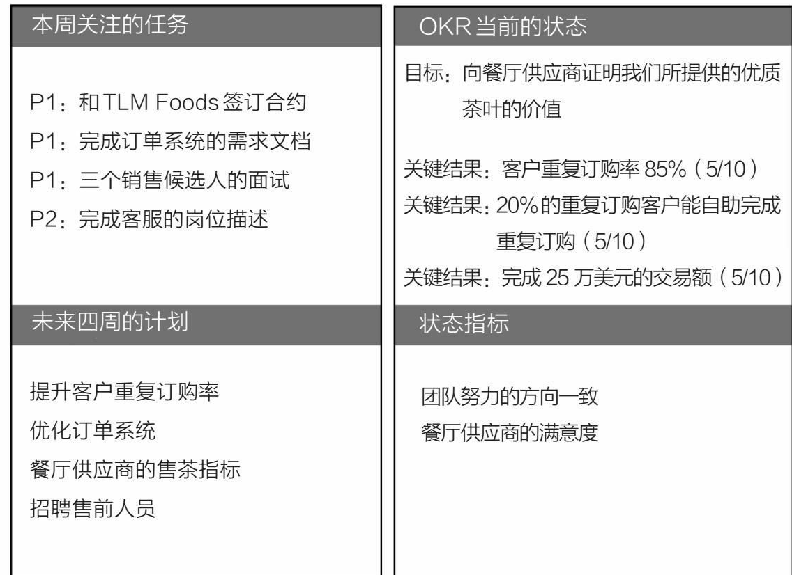
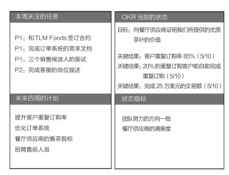
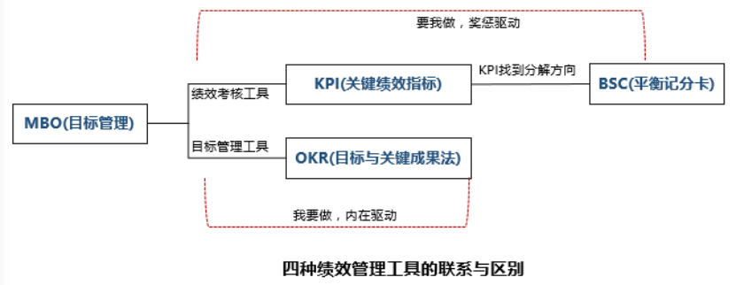
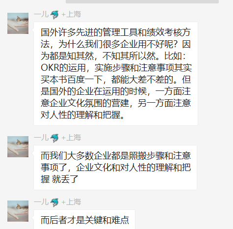

# OKR读书笔记
@(读书笔记组)[个人OKR, OKR]

 OKR的O是指目标，英文是objective；KR是指关键结果，英文是key results。很多公司用这一方法确保团队聚焦到重要的目标上。每个季度团队可以设置一个有挑战的、方向明确的目标，同时设置三四个明确且具体的结果指标，并且这些指标能确保目标的完成。

本书内容大部分来源于[《OKR工作法》](https://www.amazon.cn/dp/B07577T3XS/ref=sr_1_1?ie=UTF8&qid=1524121007&sr=8-1&keywords=okr%E5%B7%A5%E4%BD%9C%E6%B3%95)，英文名*Radical Focus: Achieving Your Most Important Goals with Objectives and Key Results (Christina Wodtke)*
 ---------------

 [TOC]

## 一. OKR设计步骤

### 1. 目标
右上角写上：季度目标 & 三个关键结果 & 信心指数。

#### 1.1 目标要聚焦
 >一次性说太多，等于什么都没说。
 > -- 詹姆斯·卡维尔（任克林顿的政治战略顾问 1992年美国总统竞选）

OKR也应该这样。
（何况你设定了那么多目标，每周的盘点会议都会无休无止）
>你们思考一下后面三个月团队的目标是什么？有哪些重要的事情看起来很棘手？三个月时间能否齐心协力把它们解决掉？

创业者很难忽视类似的金苹果，比如，今天有机会参加一个重要的会议，明天大客户叫你加一些定制需求，时间输不起，管理运营一个创业项目最怕的就是分心。 设置好目标，所有人承担起相应的责任，做好执行工作，一周结束时庆祝取得的成绩，这样的团队会令人惊叹并聚焦成长；这样的习惯，也能保证团队不会被金苹果诱惑。

#### 1.2 信心指数
每一个关键结果都会设定一个信心指数，一开始就是50%。

每周开会都要问问自己到底是进步了还是退步了。如果是从8/10降低了2/10，你得知道为什么，是什么发生了变化，这会有助于我们及时跟进和反思调整。

> 目标没有一般目标和挑战目标，他们都是可挑战的目标，一定要有挑战才行。有难度的目标才是振奋人心的。
> 有挑战的目标能激发团队的斗志，明确的关键结果又会让大家觉得这不是空谈。如果你发现一起床就有做事的激情，说明你设置了一个好的目标；如果你看到关键结果时有点担心，那这个关键结果的设置就是恰当的。

#### 1.3 关键结果
  关键结果要使用那些振奋人心的语言并且需要量化。

  你可以通过一个简单的问题来确立它们，即“如何确定目标是否达成”。

  通常有三个关键结果，它们基于可以量化的任何条件，包括：
- 用户增长
- 用户激活
- 收入增长
- 产品性能
- 产品质量

最后一个可能有点含糊，因为产品质量看起来有点难被衡量。其实可以使用类似NPS的工具做到。
>NPS＝净推荐值，是一个基于客户愿意向朋友和家人推荐给定产品的数值。请参阅2003年12月《哈佛商业评论》刊载的《唯一需要增长的数字》。

**如果明智地选择出关键结果，可以使增长与性能、收入与质量这样的结果得到平衡。**
> 目标：推出一个很棒的MVP。
>关键结果1：40%的用户在一周以内访问量增加两倍。
>关键结果2：净推荐值达到8分。
>关键结果3：15%的转化率。

##### 1.3.1 关键结果应该比较困难当并非不可能

这一点[^2]需要公司**`文化`**与**`氛围`**的支撑。**如果一家公司面对失败的方式是惩罚，那么员工很快就学会不去尝试。**

[^2]: 1968年，在英特尔公司创立的同一年，马里兰大学的一位心理学教授埃德温·洛克（Edwin Locke）提出了一个理论，对安迪·格鲁夫产生了很大的影响。埃德温·洛克指出：首先，“困难目标”往往比简单目标更能有效提升绩效；其次，具体的、困难的目标往往比含糊其词的目标“带来更高的产出”   在随后的半个世纪里，超过1000项研究证实了洛克的发现，并认为“这是整个管理理论中最经得住检证的观点之一”。 [7] 在该领域的实验中，90%的结果都表明：明确的、具有挑战性的目标确实能够提升生产效率。(“The Quantified Serf,”The Economist,March 7,2015.)

而却即便是设置了KPI，也会尽可能的隐藏实力；在跨人际和部门的沟通协调中，也会因为KPI产生阻碍。（你请求我来帮助你，那我的KPI谁来帮我？再见）

设置关键结果的时候，要给自己和团队找好定位，我们是想推动团队意识到公司正在一件有挑战的事情，而不是不可能完成的事情。所以一开始就设置为50%的失败就是最好的定位。

### 2.状态指标

>我们不会为了急于发展新客户而忽略掉我们现在现有的客户，因此客户满意度会出现在这里。我们把团队氛围、系统满意度、订单和收入都放列入其中。

OKR就是要聚焦，这里的列表也是。 我们每个星期选择一两个在整个公司范围内进行讨论，剩下的偶尔盘点一下就行。

OKR是用来推进事情的，我们先集中精力聚焦到一件事情上，才不至于浅尝辄止。**这些指标状态也很重要，我们持续关注就行，如果所有事情都一样重要，那就没意义了**。

### 3.本周

这里，写上这周要做的3~5件重要的事情，这些事情能有效推进实现OKR。

因为这些都要和Team分享，所以要认真考虑是否把时间花费在对OKR有用的事情上。
>**每天当然有很多事情要处理，但是一定不要忘记哪些是最重要的**  *醍醐灌顶、茅塞顿开的汉娜*
>这可不是比谁最忙碌，你不用把所有事情都列出来，你只需要列出为了达成目标而必须去做的那些事情。

### 4. 未来四周

我们称之为“推进计划”，这里罗列出后面4周计划推进的重要事情。这样，**当一些事情需要协调完成的时候，市场、研发、销售以及其他部门不会被弄得措手不及**。

这个每周都要来一次。 但是是否每一个点都要讨论，以及是否需要召集不想干的同事一起讨论则需公司内部情况而定。

## 二. OKR制定流程 

盘点与调整其实是整个OKR的核心所在。

### 1. 流程

1. 只确定一个公司层面的目标。无论成败与否，我们需要聚焦在这一件事上。（譬如提升我们和供应商之间的关系）。
2. 会根据**公司目标**给**每个部门**制定出关键结果。
3. 给每个关键结果附件一个信心指数。一开始是50%，毕竟这些目标都是有挑战性的。
4. 最重要的是，在每周例会上，都要盘点我们的OKR，看看为实现OKR做了哪些事情。

### 2. 盘点

不能指望目标设定好之后顺其自然地就能完成，团队要齐心协力地不断往前推进。这就需要盘点，就像我们在敏捷开发上做的每日例会和周计划一样。如果你们有一个框架来指导每周的会议，那么这个会议才能发挥实际意义。
>我们将在每周的例会上运用这个新方法，分享团队任务的优先级以及信心指数的变化。这不只是简单的汇报，更是帮助我们实现目标并且不脱离轨道的方式

### 3. 调整

从现在开始，我们将用这种新方法。每周用不到10分钟的时间来更新这个图表，当然，第一周花的时间会多一些，但是以后稍微调整一下就可以了。
>我们强烈建议将OKR在每周的团队会议和电子邮箱中分享，每周调整信心指数，讨论它们上升或者下降的原因。

管理者如果只按月或者按季度检查团队目标的完成情况，一定会发现有些人在做一些无关紧要的事情，有些人则为了一个难题停滞了很久，甚至还会发现有些人根本不知道自己在做什么。

**保持目标实时的追踪和持续的透明沟通，可以帮助团队聚焦在目标上，预测的结果也更靠谱，每个人都能自我驱动。**
	 

## 三 . OKR的基本原理

OKR发展到现在，已经成为一种标准的目标管理方法。

目标用来明确方向，关键结果用来量化目标，使团队和个人聚焦在一个有挑战性的目标上。(目标设定通常为一个季度)。

关键结果用来判定到期时目标是否达成。

### 原则1 目标要明确方向并且鼓舞人心

好的目标能让人大清早从床上兴奋地跳起来。

如果Team想用简单粗暴的语言，比如“拿下它”或者“干掉她”，目标也可以出现这样的字眼。
>用绩效指标来驱动目标的完成，这是许多MBA的失败之处。你爱数字，你爱钱，可谁不爱呢？
>
>OKR统一了跨专业的团队：敢于想象的设计师、理想主义工程师和贴心的客户服务人员。**目标本身是需要鼓舞人心的，它可以把人们从床上叫醒，准备迎接新的一天和新的挑战。**
>
>假如关键结果只聚焦在收入上，会导致员工把完成目标当成赌博，很可能为了短期利益而不惜损害用户留存等其他更重要的长远利益。

### 原则2 目标要有时间期限。

比如，一个月或者一个季度可以完成。要让Team明确地朝着目标冲刺，如果需要一年，那么你的目标很可能是一个战略或者使命了。

###原则3 由独立的团队来执行目标。

目标必须真正属于你，你不能有“这和市场没有做起来有关系”这样的借口。

以下是几个好的目标:
- 拿下南湾地区的咖啡直销零售市场！
- 推出一个很棒的最小化可行产品（MVP）。
- 改变帕洛阿尔托地区的优惠券使用习惯！
- 完成一轮融资。

下面则是几个不太好的目标：
- 销售额提升30%
- 用户增加一倍
- B系列产品收入增加到500万美元。

为什么这些是不太好的目标？因为他们实质上是**关键结果**。

## 四. 什么使OKR起作用

OKR是自上而下的关联。公司应该设定公司的OKR，然后每个部门都要思考如何设定自己的OKR，这样公司的OKR才会实现。

**OKR很大一部分的价值就是沟通，沟通哪些事情是重要的，沟通我们能做到什么程度，以及和已经偏离公司目标的执行团队沟通做哪些对的事情。**

>客服、设计师和工程师经常需要更努力地找到有意义的、能推动公司目标的OKR，但是这的确值得做。
> 
> 客服部门能否针对不满的客户制订一个计划来改善客户情绪？
> 设计师能否设计一套在线培训系统来提高客户留存率？
> 工程师能否用更好的推荐算法来提高用户满意度？
>  
> 每个部门都可以为公司的OKR出力。

此外，每个人都应该设定单独的OKR，以反映个人成长以及明确如何支持公司目标。

如果公司的OKR是围绕获取用户，那么产品经理可能会把自己的目标定义为 “*让销售变得厉害*”，然后他就会设定两个关键结果:
1. 完成销售培训并让销售人员都拿到培训高分；
2. 提高所负责产品的转化率。

你/你的Team是为自己的OKR负责，而不是老板的东西，别人的责任。这会让你每天早上起来都精力充沛，雄心勃勃。

OKR就是要通过实践、总结，不断发现、**挑战团队的潜力**，而不要把整个过程当做汇报、考核结果。

## 五. “承担责任--庆祝结果”的节奏。

### 5.1 周一确定每个人的职责 （PDCA戴明环）

每周一，团队一起开会盘点OKR的执行过程，明确本周具体负责完成哪些任务才会让团队的目标更近一步。

四象限OKR展示形式：

#### 5.1.1 本周关注的任务

列出本周**3~4**件最重要的事情，只有本周完成了这几件事情，团队的目标才能向前推进；明确这些事情的**优先级（P1，P2）**。

#### 5.1.2 未来四周的计划
有哪些事情需要其他团队成员做好准备或支持，都列在这个象限里。

#### 5.1.3 OKR当前的状态
如果你设定的信心指数是5/10，那么目前完成的概率是更高了还是更低了，团队一起讨论下原因。

##### 状态指标
挑出两个影响目标达成的其他因素，团队需要额外关注，比如客户关系，团队状态，系统状况等。

当这些地方发生意外时，马上讨论出对应方案，确保OKR不受影响。

这个文档会成为OKR执行过程中的会议工具，你应该学会这样讨论问题：
- 这个优先级列表能确保我们的OKR完成吗？
- 团队的能力可以完成OKR吗？谁能帮助我们完成？
- 我们准备好了新一轮的发力了吗？市场部知道产品马上要做什么吗？
- 我们的团队已经筋疲力尽了吗？我们的产品是否存在什么隐患？

会议越简短越好。Team坐下来meeting，讨论这四个象限就够了。如果只用它作为会议概要，可以用更具体的文档来补充说明每个象限的详细情况。

>做好会议的时间安排。建议周一会议时间的1/4用来讲述进展，其余时间一起讨论下一步计划。提前结束会议也很正常，因为没有必要为了凑时间而拖延会议。

### 5.2 周五属于胜利者 *
>汉娜伸了个懒腰，想到自己还没怎么开展工作，叹了口气，然后慢慢走到团队的后面。**以往每周五要下班的时候，创始人却仍旧在工作，员工们只能一个接一个难为情地下班离开公司。一周就这样悄无声息地结束了**，今天会有什么不同吗？
>.....
>团队把周五的例会固话成了日常工作的一部分。每个周一，他们一起商量计划。他们每天都在进行着复杂的沟通，任何一个Startup企业都是如此。每周五，他们就会一起庆祝。
> 
>**周五的“胜利会议”给了每个人继续尝试的希望，这是一种难以置信的激励。** 每个人都想要去的一个小胜利来和大家分享，于是他们会努力工作一周去追寻。整个团队开始觉得，他们也许会创造奇迹。

团队有远大目标是好事，但也容易因此产生挫败感，所以周五庆祝环节就很有必要。

周五的会议就是胜利的会议。每个团队都可以展示本周的成果：工程师展示他们做好的项目代码，设计师展示原型。

除此之外，每个团队还应该分享自己的成功，比如销售部分享一下最新签约的订单，客户部谈一下他们如何帮助客户解决了问题，业务部门分享一下他们谈的生意。

这样做有很多好处：

**首先，每个人会觉得自己是成功团队的一份子；**

**其次，如果Team渴望成功，所有人都会努力做一些值得分享的事情；**

**最后，公司开始欣赏每个部门的努力，理解他们每天在做什么事情。**

>**准备好啤酒、饮料和点心，凡是能犒劳团队的都可以提供，让他们觉得得到了关心**。如果团队确实很小，没有能力支付这些，也可以通过团队自助聚餐的方式进行。一旦团队规模变大，一定要报销这些开支，以表示支持。你要知道，**执行项目的这些同事才是公司最大的资产，不投资他们怎么能行？**

OKR用来设定目标非常棒，但是没有一个系统能替你完成它们。事情做失败太容易了，而且失败每天都在发生。每周对着OKR象限图，所有人为目标承担责任，明确相互如何支持，明确前进的方向，每周都要重复这些事情，你的OKR就一定会实现。

## 六. KPI vs OKR
- 让员工不得不优先关注他们自己和小团队的利益。
-  传统的方法只会“诱导”人们降低目标的下限，而OKR努力让团队挑战极限，并把所有精力都聚焦在突破目标上。要想通过OKR方法最大化地实现目标，切勿把它和绩效评估挂钩[^1]。

[^1]: 2009年，哈佛商学院发表了一篇名为《疯狂目标》（Goals Gone Wild）的论文。 [5] 文章用一系列例子解释了“过度追求目标的破坏性”：福特平托（Pinto）汽车油箱爆炸、西尔斯汽车维修中心的漫天要价、安然公司疯狂膨胀的销售目标，以及1996年造成8人死亡的珠穆朗玛峰灾难。作者提醒说：目标就像是“一种需要谨慎使用和严密监管的处方药”。作者甚至还提出这样的警告：“由于聚焦过度、出现不道德行为、冒险行为增多，以及合作意愿和工作积极性下降等原因，目标会在组织内部引发系统性问题。”目标设定的坏处可能会抵消其所带来的好处，这就是这篇论文的观点。

-   假如关键结果只聚焦在收入上，会导致员工把完成目标当成赌博，很可能为了短期利益而不惜损害用户留存等其他更重要的长远利益。
-  如果公司面对失败的方式是惩罚，员工很快就学会不去尝试；如果想做成一些有挑战的事情，就必须保证即使失败了也不会被惩罚。

有些驴拼命的往前走，不希望路后于别人，这时候OKR用于帮助驴少走曲线；有些驴本来就不想走，这时候需要KPI当鞭子。一家公司公司能不能用OKR，首先要看有没有正确的驴。

不能神话制度，也不能没有制度（与谢丹的讨论）。

## 七. 使用OKR的最后建议

- 只设置一个公司级别的OKR，除非公司有多条业务线。这就是聚焦。
-  给自己三个月的时间去挑战OKR，一周内可以完成的目标绝对称不上有挑战。
-  目标里不要有传统的绩效考核指标，目标需要能够鼓舞人心。
-  在每周盘点进度时，先从公司OKR开始，然后沟通部门级别的，不需要在会议上沟通个人OKR，个人OKR只要一对一交流就可以了。每周必须确认OKR的进度。
-  OKR是自上而下关联的。先设定公司的OKR，然后是部门的，最后是个人的。
-  OKR不是唯一一件你需要做的事，而是你必须要做的一件事。要相信大家可以保证事情顺利进行，不要把每个任务都塞进你的OKR里。
-  周一的OKR进度确认是一次谈话，而不是汇报或指示。务必要讨论信心指数、状态指标和优先级的变化。
-  鼓励员工对公司OKR提出意见和建议。OKR不只是自上而下的实施，也要有自下而上的成分，要让所有人都能参与其中。
-  把OKR公之于众，谷歌把它们放在了公司的内网上。
-  **周五的庆祝活动对于周一严酷的业务来说是一种调剂，可以让团队保持乐观积极的态度**。

## 八. References & Connections
1. [OKR读书笔记](https://www.evernote.com/l/ALqzadHVzrpF5rmDFbTL0GeEDQRwXA8Biyg/)
2. [这就是OKR：让谷歌、亚马逊实现爆炸性增长的工作法](https://www.evernote.com/l/ALrjZi1nETFHD51UlkR09bftUUzDx7gV2VE/)

## 九. 文档修订记录

| 版本号|     变化状态|   简要说明|  日期	|   变更人/参与者   |
| :-------- | :--------| :------ |:------ |:------ |
| V0.1|   New| 文档框架搭建与目标编写 |2018-12-2  | Lee|

*变化状态：New，Edited，Added，Deleted

