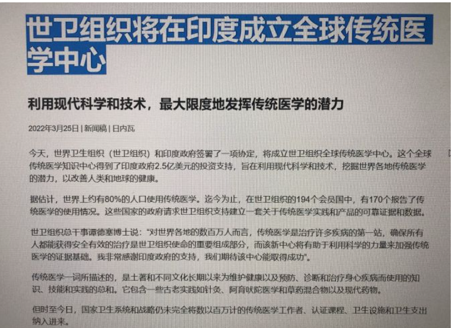
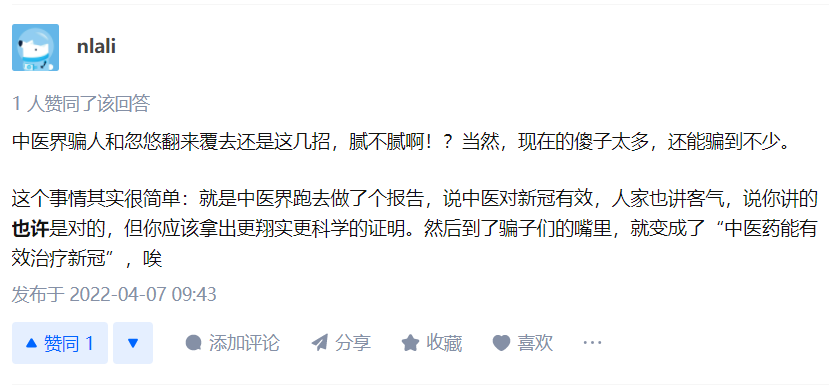

# 中医的一些研究笔记

[toc]

### Traditional Chinese Medicine (TCM)：

> Integrated Health Services,
>
> Traditional, Complementary and Integrative Medicine

 

## Reference

1. 怎么看待世卫组织会议报告中表示「中医药能有效治疗新冠」？ - 云来丨山更佳的回答 - 知乎 https://www.zhihu.com/question/526018516/answer/2425123451

2. 怎么看待世卫组织会议报告中表示「中医药能有效治疗新冠」？ - OTK能量含片的回答 - 知乎 https://www.zhihu.com/question/526018516/answer/2424701460

3. [WHO Expert Meeting on Evaluation of Traditional Chinese Medicine in the Treatment of COVID-19](https://www.who.int/publications/m/item/who-expert-meeting-on-evaluation-of-traditional-chinese-medicine-in-the-treatment-of-covid-19)

   > Integrated Health Services, Traditional, Complementary and Integrative Medicine

4. [原件与翻译稿参考](https://pan.baidu.com/link/zhihu/7NhjzYuRhRindj9lZVUIZ3hXLPVshTdQQDhz==#list/path=%2F)

5. 怎么看待世卫组织会议报告中表示「中医药能有效治疗新冠」？ - NobodybutCC的回答 - 知乎 https://www.zhihu.com/question/526018516/answer/2425526528

   - WHO report裡用的詞是beneficial而非effective
   - Beneficial 和 effective 兩詞意思不同
   - 睡眠對covid-19 也很beneficial 
   - 不知道是翻譯牛逼還是故意為之忽悠老百姓
   - 官媒逐漸灣化，很怕我們成為另一批井底之蛙
   - [**世卫组织：中医药能有效治疗新冠--澎湃社新闻**](https://m.thepaper.cn/newsDetail_forward_17470105)

6. 怎么看待世卫组织会议报告中表示「中医药能有效治疗新冠」？ - 尹航的回答 - 知乎 https://www.zhihu.com/question/526018516/answer/2426094138

7. 怎么看待世卫组织会议报告中表示「中医药能有效治疗新冠」？ - 天津老高的回答 - 知乎 https://www.zhihu.com/question/526018516/answer/2425194980

8.  

9. 怎么看待世卫组织会议报告中表示「中医药能有效治疗新冠」？ - 科学探求者的回答 - 知乎 https://www.zhihu.com/question/526018516/answer/2426875895

   > 去看了**会议记录，从头到尾都没看到WHO为所谓的中医药有效背书**，只看到了这个会议的“专家”给世卫组织推荐中医药（Recommendations to WHO），意思就是**中医药的有效性其实还没有得到世卫组织的认可**。当然，在墙内来说，世卫组织怎么看并不重要，因为开这个会的目的就是为了方便在墙内做宣传和给民众洗脑，**误导民众以为这个蹩脚的会议记录是代表了WHO的官方意见**。
   >
   > 
   >
   > 作者：科学探求者
   > 链接：https://www.zhihu.com/question/526018516/answer/2426875895
   > 来源：知乎
   > 著作权归作者所有。商业转载请联系作者获得授权，非商业转载请注明出处。

10.  