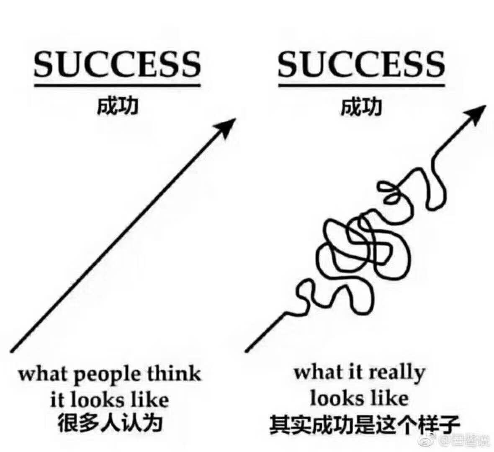

#欲罢不能：刷屏时代如何摆脱行为上瘾
@(读书笔记组)[欲罢不能, 游戏上瘾, 行为上瘾, 王者荣耀]

[toc]

## 0. 基本信息

 - **书名**： 欲罢不能--刷屏时代如何摆脱行为上瘾
 - **英文书名**： Irresistible--The Rise of Addictive Technology and the Business of Keeping Us Hooked.
 - **作者**：亚当.奥尔特 （Adam Alter)  2017年

 为什么要写这篇读书笔记，3个原因：
 1. 本人连续多年深受游戏的困扰，即便是卸载王者荣耀249天，无意中下载回来，竟然沉迷了一个多月，期间事业、学业、家庭都受到巨大冲击。这让我对游戏上瘾产生了巨大的学习兴趣；
 2. 非小说类的书籍，一般看完如果不写读书笔记，很快就会忘记，再也记不起来到底说了什么。这点感触也非常深刻，当我第二次读《非暴力沟通》的时候，已经完全忘记了里面内容，当时心里那个震惊...，读《给孩子讲量子力学》也有相同的感受。
 3. 输出是最好的学习、反思和总结的途径之一，只要有时间，就应该多动动笔头。（都记在本子上，写一遍在脑子里的印象就深了，一般不会忘记。张问以前读经书就是用的这个办法，读几遍，抄一遍，帮助记忆。[摘录：《大明乌沙》]）

 ### 核心收获

1. 这本书消除了我对游戏上瘾的最大误区--以为那些意志力薄弱的人才会上瘾，实际上只要环境得当，又遇到一些压力和挫折，任何人都可能上瘾。
2.  类似"王者荣耀"这样的游戏，是集合了非常优秀的一批心理学家精心设计出来的产品，目的就是让你上瘾的，无论你意志力多大，只要你下载下来，上瘾的概率就非常大。
3.  “请记住，一旦你的大脑黄瓜经过腌制，它就再也没办法恢复真正的黄瓜。”一旦下载打开了游戏，你的大脑就开始被被腌制了。唯一有效的做法就是不下载。一旦以为自己的网瘾不会复发，可以玩上一个小时，是最危险的时刻。

光是不停地给人提供毒品或某种行为还不够——当事人还必须学习到，**该体验是对自己心理痛苦的可行治疗途径**。如果我们不是因为自己的心理痛苦而变成了药物或行为的奴隶，它们是不会使人上瘾的。

---------------------
写这个读后感的时候，刚好看到了这样一则新闻：
>【游戏成瘾被世卫组织列入精神疾病，19日起正式生效】世界卫生组织(WHO)今年初决定将游戏成瘾列入精神疾病，相关规定将自19日起生效，WHO将通知世界各国政府，将游戏成瘾纳入医疗体系。
>http://tech.ifeng.com/a/20180618/45029482_0.shtml

--------------------------

## 1. 行为上瘾及其生物学机制

### 1.1 行为上瘾的误区
>对这部宪法中的一些条款，我并不完全赞同，但我不能肯定我会永远不赞同，因为许多过去我认为是正确的观点后来都发现是错误的。 
> --- Benjamin Franklin,   1781年9月17日，星期一，立宪会议的最后一天。

20世纪六七十年代，我们得到了一点新的认识：上瘾跟环境也有关系。就算是最顽强的人（比如离开越南时戒掉了毒瘾的年轻美国军人），处在错误的环境下也虚弱不堪。就算是痊愈期间**意志力最坚定的人，重新接触与毒品有关的人和地方，也会再度落进毒品的魔爪**。

### 1.2 行为上瘾与物质上瘾

“只要行为是奖励，跟过去的奖励结果相搭配，大脑对它的处理方式就跟毒品一样”，近年来的研究表明，上瘾行为生成的大脑反应与吸毒后的大脑反应是相同的。在这两种情况下，大脑深处的若干区域释放化学物质多巴胺，经贯穿整个大脑的多巴胺受体吸附，反过来产生强烈的快感。

上瘾的生物学基础比刺激神经元丛复杂得多......上瘾能治疗孤独、不满和沮丧，因此：**上瘾的动力不是药物或行为，而是长久以来学习到的观念：行为或药物保护瘾君子们不受心理困扰**。

哪怕你已经痛恨毒品毁了你的生活，你的大脑仍然渴望毒品。它记得毒品过去是用来宽抚心理需求的，故此这种渴望保留了下来。行为上瘾也是一样：就算讨厌Facebook或Instagram耗费了太多时间，可你仍然想频繁地上这些网站，就像从前它们还让你感到开心的时候一样。 

也许快感早就没有了，可他们打游戏的渴望、疯狂整理的渴望、给自己来上一剂药的渴望，却一点儿也没减少。行为以及它对整个大脑机制产生作用的过程，都是一回事。”游戏瘾君子一打开笔记本电脑，多巴胺水平就飙升。
> 最近的一项研究表明，欲擒故纵、若即若离的手法也有同样的效果：冷漠的恋人不怎么讨人喜欢，但人们就是更想要——这可以解释为什么一些人总觉得情感上不合拍的伴侣更诱人。

### 1.3 上瘾的根源是心理痛苦【精华】

小时候，我对毒品十分恐惧。我总是做噩梦，梦见自己在阴冷的治疗中心口吐白沫。随着时间的推移，我意识到，毒贩不会在一个神经质的7岁小孩身上浪费时间，但这噩梦里有一部分始终叫我恐慌：人有可能不情愿地上瘾；如果你不小心接触了上瘾物质，你就上了瘾。如果上瘾只是单纯的大脑功能障碍，那么7岁的我就想得没错：让大脑充斥着多巴胺，你就成了瘾君子。但上瘾不是这么运作的。面对任何愉悦事件，大脑的应对方式都基本相同，故此，上瘾必定还有另一个重要成分，要不然为什么我们每个人小时候都会吃冰激凌上瘾。（回想一下，蹒跚学步的小孩第一口尝到冰激凌味道时，多巴胺的冲击是多么强烈。）

这一缺失的成分是多巴胺增多时周围的**环境**。如果我们不是因为**自己的心理痛苦而变成了药物或行为的奴隶，它们是不会使人上瘾的**。比方说，如果你焦虑或抑郁，你或许会发现海洛因、食品或赌博能缓解痛苦。如果你很孤独，你可能会投入到一款鼓励你建立全新社交网络的沉浸式电子游戏里。

“人类有着专门的养育和关爱系统，这些系统推动我们不顾消极后果，继续坚持下去，”关注上瘾的作家马娅·萨拉维茨（Maia Szalavitz）解释说，“旨在开展这类行为的系统，就是上瘾的模板。一旦这一系统搭配错误，你就上瘾了。”萨拉维茨所指的系统，每一种都是本能生存行为的集合，比如照顾孩子、寻找爱侣的冲动。**这种让我们面对艰难险阻也坚持下去的本能，同样推动着狂热和破坏性的上瘾行为**。

在一篇文章中，萨拉维茨解释说，其他任何人都不可能把你变成瘾君子。 [^1] “疼痛患者不可能被医生‘弄上瘾’，”他说，“要上瘾，你必须反复服用药物缓解情绪，直到感觉没了它就活不了似的……只有当你开始因为想需要解决疼痛之外的问题而摄入药物，这种情形才会出现。除非大脑得知药物对你的情绪稳定至关重要，否则就不可能成瘾。”上瘾不仅仅是身体上的反应；它是你对相关身体体验的心理反应。为了强调这一点，萨拉维茨以最容易上瘾、最危险的海洛因为例。“说得大胆一些，如果我绑架了你，把你捆起来，给你连续注射两个月的海洛因，我会让你产生身体上的依赖性和戒断症状——可只有让你获得自由，出去以后自己继续注射海洛因，你才真正变成了瘾君子。”

[^1]:Maia Szalavitz，“Most of Us Still Don’t Get It：Addiction Is a Learning Disorder，”Pacific Standard，August 4，2014，www.psmag.com/health-and-behavior/us-still-dont-get-addiction-learning-disorder-87431；还可见Maia Szalavitz，“How the War on Drugs Is Hurting Chronic Pain Patients，”Vice，July 16，2015，www.vice.com/read/how-the-war-on-drugs-is-hurting-chronic-pain-patients-716；Maia Szalavitz，“Curbing Pain Prescriptions Won’t Reduce Overdoses.More Drug Treatment Will，”Guardian.March 26，2016，www.theguardian.com/commentisfree/2016/mar/29/prescription-drug-abuse-addiction-treatment-painkiller.

**人刚成年的时候上瘾风险最高。如果人在青春期不曾上瘾，在后面的人生里上瘾的概率是极小的**。导致这种状况的主要原因之一是，在人生的这一时期，年轻人遭遇了大量自己力有不及、无法应对的责任的碰撞。为了缓解长时间辛苦煎熬带来的难受刺痛，他们学会了求助于毒品或某些活动。**到25岁上下，很多人都掌握了青春期缺乏的应对技巧，建立起了相应的社会网络**。“如果你十来岁时没有吸毒，大概也在学习用其他方法来解决自己的烦恼。”萨拉维茨说。所以，等你熬过青春期的大战，也就发展出了一定程度的顺应能力。

最叫我惊讶的是，萨拉维茨告诉我，上瘾是一种受了误导的爱。这种爱是痴迷之爱，而非情感上的支持。这个想法听起来很空泛，却得到了科学的支持。

### 1.4 电子游戏是如何影响我的 

 Case1:  游戏虽然能让我排解我在困局中的压力，但是同样也会极大挫伤我的自信和积极性，譬如我几乎连续一个月取消了会议，以及不想跟俱乐部的成员进行沟通--即便这个沟通是Yunny建议我的。

 Case 2: 对于我长久养成的习惯的破坏--几乎就是一夜之间摧毁了我多年养成的晨跑和锻炼的习惯。（光是手机的存在（哪怕并不主动去使用），也极具破坏性。它们叫人分心，因为它们提醒我们，外面有个超越眼前对话的世界。按研究人员的说法，唯一的解决办法就是彻底拿掉手机。）

#### 1.4.1 睡眠
通常，大脑深处的松果体会在晚上产生名为褪黑素的激素。褪黑素会让你困倦，这就是为什么倒时差的人上床之前要服用褪黑素补剂。当蓝光进入你眼睛后面，松果体停止产生褪黑素，你的身体开始为白天做准备。

## 2. 上瘾体验是如何设计出来的
行为上瘾由6种要素构成：渴望而不可及的诱人目标；无法抵挡、无法预知的积极反馈；渐进式进步和改善的感觉；随着时间推移越来越困难的任务；需要解决却又暂停未解决的紧张感；强大的社会联系。尽管行为成瘾多种多样，但都至少体验了这6种要素里的一种。

###2.1 渴望而不可及的诱人目标

一如毒品的药效随着时间越变越强，行为反馈带来的快感也一样。产品设计师比从前更聪明了。他们知道怎样按下我们的按钮，怎样鼓励我们一次又一次地使用他们的产品。职场高悬的胡萝卜，似乎永远差那么一点点够不着。第二轮的推广迫在眉睫；下一轮的销售奖金就在一轮销售之外。

### 2.2 无法抵挡、无法预知的积极反馈

### 2.3 渐进式进步和改善的感觉

### 2.4 随着时间推移越来越困难的任务

### 2.5 需要解决却又暂停未解决的紧张感

王者荣耀好几次，输了之后很不甘心又点进去开搞了。通过微信的“王者荣耀小程序”，你会发现在群里有一些人，出现了10连输、14连输的惊人战绩。

### 2.6 强大的社会联系

你的三连杀、四连杀、五连杀都可以在朋友圈直接体验出来，农药内置了集中视频自动录制模式，把击杀对手的视频剪辑起来，供你局后欣赏或贴到朋友圈。

## 3. 如何跳出行为上瘾的坑

## 4. 巴胺陷阱回路
多巴胺陷阱：完整的心理学团队设计多巴胺陷阱回路。（非药物成瘾行为，原始的生物机制：多巴胺建立机制）

 可控的思考能力， 
 - 暗示自己：我们永远都有识别和控制自己行为的能力
 - 自我提问：是否要做，如果要做，自己能否控制这种行为？（即便选择了做，后面出现的失控，也是自己主动选择了，可以大幅降低后期的后悔等心里消耗）形成【可控的】思考习惯
- 增加快感反馈成本：比如每次玩游戏后就卸载，每次下载登录确认等繁琐会慢慢弱化多巴胺的激活回路状态。逐渐实现对成瘾物的脱敏。

反馈缩减又分为，即使反馈缩减 与 预期反馈缩减

游戏：视觉、听觉、交互反馈、情感反馈，这回收即时反馈缩减：关掉音效玩游戏，不开弹幕看B站从而减少对大脑的刺激，降低对多巴胺的依赖。

时刻减少触发环境，比如手机放到包里，不带入卧室，只放在客厅。

设置小的deadline，让自己忙起来，每天的Scheduel必须有明确的日期，利用番茄工作时间。

人类之所以是人类，正是因为兼具了神性与兽性。

网瘾战争中，受惩罚的应该是那些对人性弱点不加以克制与引导的滥用的团队与公司，而不是孩子。

## 6. References & Connections
1. 

## 7. 文档修订记录

| 版本号|     变化状态|   简要说明|  日期	|   变更人/参与者   |
| :-------- | :--------| :------ |:------ |:------ |
| V1.0|   建立| 新建文档 |2018-8-11  | Lee|
| V1.1|   增加|根据虎嗅的文章 新增 `多巴胺陷阱回路`|2020-9-21  | Lee|

*变化状态：建立，修改，增加，删除
