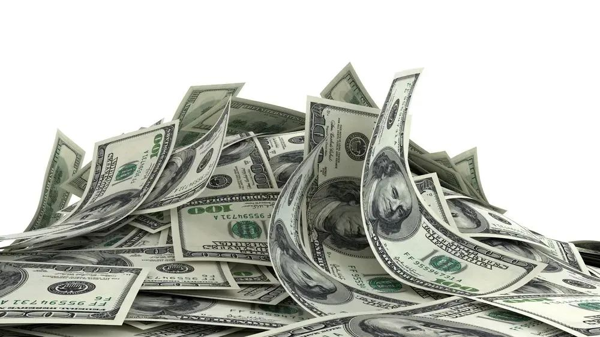
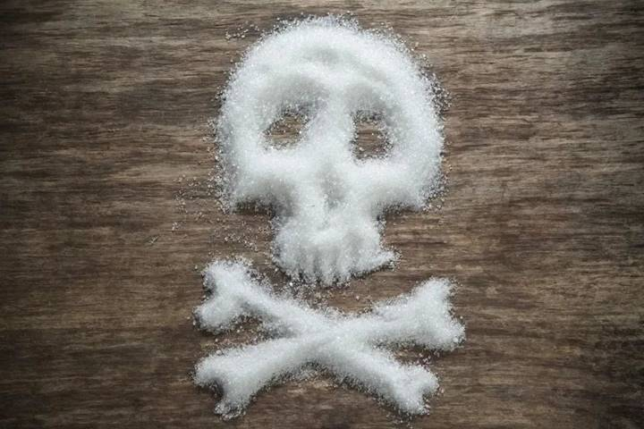
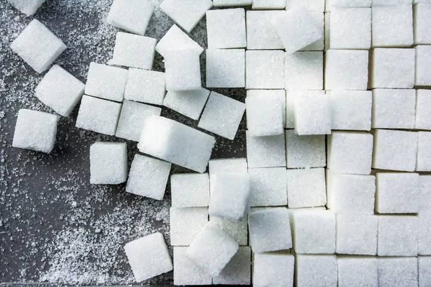
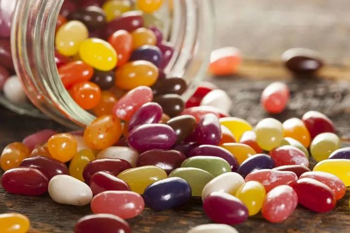
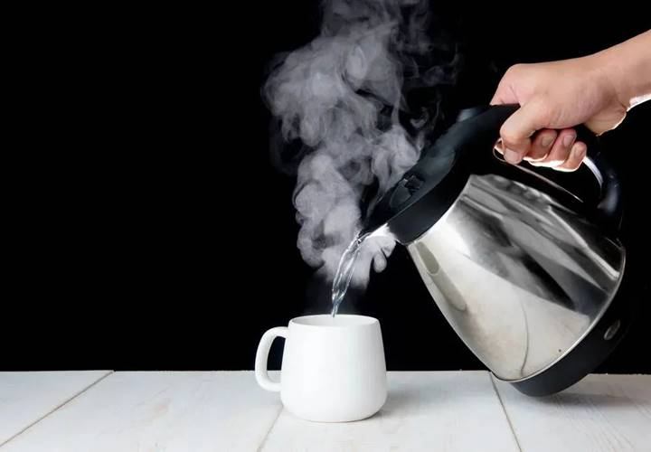

# 糖吃多了有多大危害？

[toc]

 今天的文章，从一段尘封了 50 年的秘密对话开始：

> - We are well aware of your particular interest, and will cover this as well as we can.
> - Let me assure you this is quite what we had in mind, and we look forward to its appearance in print.

第一句话来自于当时哈佛大学著名的营养学教授 Dr. Hegsted，而第二句话来自于制糖公司的高管 John Hickson。**显然，这个哈佛教授写了一篇制糖业高管想要的「软文」。**

而这篇软文刊登在顶级医学杂志 NEJM（新英格兰医学杂志）上，**以至于把心血管疾病防治的膳食建议「带偏了」几十年。**相关丑闻直至 2016 年才被美国医学会内科杂志披露，但造成的潜在健康伤害，已经无法估量。

这一切是怎么发生的？糖对健康到底有什么危害？

## 用金钱洗白"糖的危机"

  

让我们回到 50 年前，文章开头那个年代的美国。

可以说，美国是所有发达国家中「饮食最不健康」的，**高糖、高脂、高热量是美国人的饮食特色，这也导致美国肥胖、冠心病、糖尿病高发。** 

为了维持庞大的糖工业帝国的市场销售，从上个世纪 60 年代开始，各大糖巨头组织的糖业协会就利用自己的「金钱」影响力，不断对营养学专家进行渗透。

最直接有效的方法，**就是让顶级营养学专家在顶级杂志上刊登「糖无害」的观点。**于是他们找到了哈佛医学院的几名教授，和医学领域最牛的新英格兰医学杂志。

**当时每名教授收到了相当于现在** **5** **万美元的商业贿赂，**于是他们在之后的几十年都为糖工业摇旗呐喊。

其中一位科学家正是开头提到的 Dr. Mark Hegsted，后来他当上美国农业部营养部门负责人，并于 1977 年帮助起草联邦政府的第一版膳食指南；另外一位是哈佛大学营养学院院长 Fredrick J.Stare。

在之后的几十年间，不管是学术文章还是官方膳食指南，都没有指出糖的危害。直到 2007 年美国食品药品监督管理局的听证会上，都没有任何糖与心脏病、糖尿病有关的警示。

50 年间，不知道有多少人因为糖遭受病痛。仅在 2012 年度，美国就有 702 308 例心血管及代谢疾病相关的死亡，其中已被证明有 10.8% 的冠心病死亡及 14.8% 的糖尿病死亡与含糖饮料相关。

前文提到的几位教授已经过世，但真相在 2010 年才被发现，并在去年被发布出来，他们也被永远钉在了学术的耻辱柱上。

## 糖到底有哪些危害？

 

根据最新的研究显示，**除了是冠心病的危险因素以外，糖还与肥胖、糖尿病、高血压、痛风等疾病密切相关。**

有临床研究发现，如果把饮食中的饱和脂肪酸代替以相同能量的糖（蔗糖或果葡糖浆，含糖饮料常用添加物），会发现低密度脂蛋白、甘油三脂升高，而高密度脂蛋白降低，这些变化都与冠心病风险增加相关。

**换句话说，比起饱和脂肪酸，吃下同等能量的糖，对血脂的影响更大。**

一项纳入 17 万多人的研究探讨了含糖饮料与冠心病的关系，研究者发现，每天多喝 1 份含糖饮料（1 份＝330 毫升，大约一听饮料），冠心病的风险就增加 16%，喝得越多，风险越高。

看来，糖吃多了真的会「伤心」。

 

## 吃下多少糖就有危害

 

**答案是，即使喝一瓶** **600** **毫升的含糖饮料，也会造成损伤。**

常喝含糖饮料可能导致冠心病，这个是之前的研究中已经证实的。但想不到的是，一瓶 600 毫升的含糖饮料也能搞出不少事情。

这个结论来自于一项发表于心血管领域权威期刊 ATVB 的研究，研究纳入健康的志愿者，平均年龄为 31 岁，每人发一瓶 600 毫升含糖饮料（含 72 克糖，能量为 1 200 千焦），然后以喝纯净水为对照。

结果发现，喝完 600 毫升含糖饮料后，志愿者的微血管功能及大血管内皮功能明显受损，可能与血糖增高引起的反应相关。

## 要限制的是「坏糖」

 

虽然一小瓶含糖饮料就具有「杀伤力」，但我们没必要把所有糖都拒于门外。

因为糖类是人体必须的三大营养物质之一，应该均衡地摄入。**真正需要限制摄入的是「添加糖」，即非食物本身含有的糖。** 

世界卫生组织在 2014 年营养指南中建议：**成人每天添加糖摄入量应控制在总能量的** **5%** **以下，即约** **20~30** **克每天。**

说到糖的种类，额外添加的「坏糖」主要是蔗糖或果葡糖浆，而不是淀粉、纤维素等「多糖」。

如果大家留意过饮料包装就会发现，大部分含糖饮料添加的就是白砂糖，而白砂糖 95% 以上的成分为蔗糖，少部分添加的是果葡糖浆。

已有大量的研究发现，相对于淀粉等「多糖」，蔗糖及果糖可诱导血脂升高、胰岛素抵抗、血小板功能障碍，最终导致肥胖、冠心病、糖尿病的发生。

**如果能限制蔗糖及果糖的摄入，以上异常可得到明显的逆转。**

## 多喝白开水，少喝含糖饮料 

 

在含糖饮料中，除了常见的可乐之外，还有很多成员，比如果汁饮料、运动饮料、功能饮料、冰茶、酸奶、凉茶、酸梅汤等。

以世界卫生组织「每天摄入添加糖不超过 25 克」为准，随便喝 1 瓶饮料就可能超标。

转了一大圈我们才发现，**对于国人来说，最健康的饮料还是——白开水。**

 

## Reference:

1. [糖吃多了有多大危害？--丁香医生](https://mp.weixin.qq.com/s/jHuP7X14-VR3VmrEPcXaUg)
2. [【减小腰围!】如何3步减掉内脏脂肪(含详细攻略) - 帅soserious的视频 - 知乎]( https://www.zhihu.com/zvideo/1442104008278614016)
3. [**如何保持精力旺盛**-- Evernote](https://www.evernote.com/l/ALqObkqiH9BBSpUHgZ_dDB_AKYD2wrv7daU/)
4. 